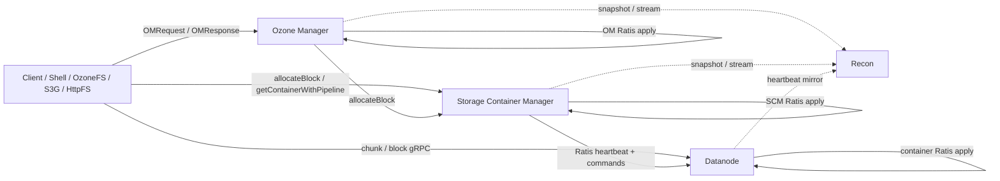

# Atlas Index

Full hierarchical TOC. Every leaf link points to a per-feature file with class table, mermaid diagram, JIRAs, sharp edges, and self-quiz.

## Component relationship diagram

## Components (reading-order)

| # | Component | Feature | Sub-feature | Classes | reading_order range |
|--:|---|---|---|--:|---|
| 1 | Client | [ozone-client](components/client/ozone-client.md) | `client-facade` | 6 | 1–6 |
| 2 | Client | [ozone-client](components/client/ozone-client.md) | `user-api-types` | 15 | 7–21 |
| 3 | Client | [ozone-client](components/client/ozone-client.md) | `io-streams` | 11 | 22–32 |
| 4 | Client | [ozone-client](components/client/ozone-client.md) | `client.io` | 4 | 33–36 |
| 5 | Client | [ozone-client](components/client/ozone-client.md) | `client.rpc` | 1 | 37–37 |
| 6 | Client | [ozone-client](components/client/ozone-client.md) | `ec-client` | 5 | 38–42 |
| 7 | Client | [ozone-client](components/client/ozone-client.md) | `checksum` | 5 | 43–47 |
| 8 | OzoneCommon | [client-common](components/ozonecommon/client-common.md) | `client.checksum` | 3 | 48–50 |
| 9 | OzoneCommon | [client-common](components/ozonecommon/client-common.md) | `client.io` | 3 | 51–53 |
| 10 | OM | [om-protocol](components/om/om-protocol.md) | `ozone.protocolPB` | 5 | 54–58 |
| 11 | OM | [om-request](components/om/om-request.md) | `om.request` | 4 | 59–62 |
| 12 | OM | [om-request](components/om/om-request.md) | `request.lifecycle` | 4 | 63–66 |
| 13 | OM | [om-request](components/om/om-request.md) | `request.security` | 3 | 67–69 |
| 14 | OM | [om-request](components/om/om-request.md) | `request.util` | 6 | 70–75 |
| 15 | OM | [om-request](components/om/om-request.md) | `request.validation` | 8 | 76–83 |
| 16 | Client | [hdds-client](components/client/hdds-client.md) | `xceiver-clients` | 10 | 84–93 |
| 17 | Client | [hdds-client](components/client/hdds-client.md) | `write-streams` | 9 | 94–102 |
| 18 | Client | [hdds-client](components/client/hdds-client.md) | `scm.storage` | 2 | 103–104 |
| 19 | Client | [hdds-client](components/client/hdds-client.md) | `read-streams` | 12 | 105–116 |
| 20 | Client | [hdds-client](components/client/hdds-client.md) | `ec-transport-read` | 8 | 117–124 |
| 21 | Client | [hdds-client](components/client/hdds-client.md) | `client-utils` | 9 | 125–133 |
| 22 | SCM | [block-manager](components/scm/block-manager.md) | `scm.block` | 11 | 134–144 |
| 23 | SCM | [pipeline-manager](components/scm/pipeline-manager.md) | `choose.algorithms` | 4 | 145–148 |
| 24 | SCM | [pipeline-manager](components/scm/pipeline-manager.md) | `scm.pipeline` | 24 | 149–172 |
| 25 | DN | [kv-container](components/dn/kv-container.md) | `container.keyvalue` | 7 | 173–179 |
| 26 | DN | [kv-container](components/dn/kv-container.md) | `keyvalue.helpers` | 4 | 180–183 |
| 27 | DN | [kv-container](components/dn/kv-container.md) | `keyvalue.interfaces` | 2 | 184–185 |
| 28 | DN | [kv-container-impl](components/dn/kv-container-impl.md) | `keyvalue.impl` | 10 | 186–195 |
| 29 | DN | [container-interfaces](components/dn/container-interfaces.md) | `common.interfaces` | 14 | 196–209 |
| 30 | DN | [erasure-coding](components/dn/erasure-coding.md) | `reconstruction` | 4 | 210–213 |
| 31 | DN | [erasure-coding](components/dn/erasure-coding.md) | `coder` | 22 | 214–235 |
| 32 | DN | [erasure-coding](components/dn/erasure-coding.md) | `ec-chunk` | 1 | 236–236 |
| 33 | DN | [erasure-coding](components/dn/erasure-coding.md) | `ec.reconstruction` | 1 | 237–237 |
| 34 | DN | [erasure-coding](components/dn/erasure-coding.md) | `erasurecode.rawcoder` | 8 | 238–245 |
| 35 | DN | [erasure-coding](components/dn/erasure-coding.md) | `ozone.erasurecode` | 1 | 246–246 |
| 36 | DN | [erasure-coding](components/dn/erasure-coding.md) | `rawcoder.util` | 4 | 247–250 |
| 37 | OM | [om-request-key](components/om/om-request-key.md) | `create-commit` | 6 | 251–256 |
| 38 | OM | [om-request-key](components/om/om-request-key.md) | `delete` | 7 | 257–263 |
| 39 | OM | [om-request-key](components/om/om-request-key.md) | `rename` | 3 | 264–266 |
| 40 | OM | [om-request-key](components/om/om-request-key.md) | `key-acl` | 12 | 267–278 |
| 41 | OM | [om-request-key](components/om/om-request-key.md) | `request.key` | 3 | 279–281 |
| 42 | Ratis-integration | [ratis-integration](components/ratis-integration/ratis-integration.md) | `metrics.dropwizard3` | 1 | 282–282 |
| 43 | Ratis-integration | [ratis-integration](components/ratis-integration/ratis-integration.md) | `scm.ha` | 3 | 283–285 |
| 44 | HddsCommon | [ratis-integration](components/hddscommon/ratis-integration.md) | `hdds.ratis` | 3 | 286–288 |
| 45 | HddsCommon | [ratis-integration](components/hddscommon/ratis-integration.md) | `ratis.conf` | 1 | 289–289 |
| 46 | HddsCommon | [ratis-integration](components/hddscommon/ratis-integration.md) | `ratis.retrypolicy` | 3 | 290–292 |
| 47 | HddsCommon | [ratis-integration](components/hddscommon/ratis-integration.md) | `scm.ha` | 4 | 293–296 |
| 48 | OM | [om-ratis](components/om/om-ratis.md) | `om.ratis` | 5 | 297–301 |
| 49 | OM | [om-ratis](components/om/om-ratis.md) | `om.ratis_snapshot` | 1 | 302–302 |
| 50 | OM | [om-ratis](components/om/om-ratis.md) | `ratis.utils` | 1 | 303–303 |
| 51 | OM | [om-response](components/om/om-response.md) | `acl.prefix` | 1 | 304–304 |
| 52 | OM | [om-response](components/om/om-response.md) | `bucket.acl` | 1 | 305–305 |
| 53 | OM | [om-response](components/om/om-response.md) | `key.acl` | 2 | 306–307 |
| 54 | OM | [om-response](components/om/om-response.md) | `om.response` | 3 | 308–310 |
| 55 | OM | [om-response](components/om/om-response.md) | `response.bucket` | 4 | 311–314 |
| 56 | OM | [om-response](components/om/om-response.md) | `response.file` | 5 | 315–319 |
| 57 | OM | [om-response](components/om/om-response.md) | `response.key` | 20 | 320–339 |
| 58 | OM | [om-response](components/om/om-response.md) | `response.lifecycle` | 4 | 340–343 |
| 59 | OM | [om-response](components/om/om-response.md) | `response.security` | 3 | 344–346 |
| 60 | OM | [om-response](components/om/om-response.md) | `response.snapshot` | 7 | 347–353 |
| 61 | OM | [om-response](components/om/om-response.md) | `response.upgrade` | 3 | 354–356 |
| 62 | OM | [om-response](components/om/om-response.md) | `response.util` | 1 | 357–357 |
| 63 | OM | [om-response](components/om/om-response.md) | `response.volume` | 6 | 358–363 |
| 64 | OM | [om-response](components/om/om-response.md) | `s3.multipart` | 10 | 364–373 |
| 65 | OM | [om-response](components/om/om-response.md) | `s3.security` | 3 | 374–376 |
| 66 | OM | [om-response](components/om/om-response.md) | `s3.tagging` | 4 | 377–380 |
| 67 | OM | [om-response](components/om/om-response.md) | `s3.tenant` | 7 | 381–387 |
| 68 | OM | [om-execution](components/om/om-execution.md) | `execution.flowcontrol` | 1 | 388–388 |
| 69 | OM | [om-execution](components/om/om-execution.md) | `om.execution` | 1 | 389–389 |
| 70 | DN | [ratis-statemachine-dn](components/dn/ratis-statemachine-dn.md) | `server.ratis` | 6 | 390–395 |
| 71 | DN | [ratis-statemachine-dn](components/dn/ratis-statemachine-dn.md) | `statemachine.background` | 2 | 396–397 |
| 72 | OM | [om-server](components/om/om-server.md) | `om.ha` | 6 | 398–403 |
| 73 | OM | [om-server](components/om/om-server.md) | `om.s3` | 4 | 404–407 |
| 74 | OM | [om-server](components/om/om-server.md) | `ozone.om` | 60 | 408–467 |
| 75 | OM | [om-key-manager](components/om/om-key-manager.md) | `ozone.om` | 2 | 468–469 |
| 76 | OM | [interface-storage](components/om/interface-storage.md) | `om.helpers` | 3 | 470–472 |
| 77 | OM | [interface-storage](components/om/interface-storage.md) | `om.lock` | 6 | 473–478 |
| 78 | OM | [interface-storage](components/om/interface-storage.md) | `ozone.om` | 2 | 479–480 |
| 79 | OM | [om-bucket-manager](components/om/om-bucket-manager.md) | `ozone.om` | 2 | 481–482 |
| 80 | OM | [om-volume-manager](components/om/om-volume-manager.md) | `ozone.om` | 2 | 483–484 |
| 81 | OM | [om-request-bucket](components/om/om-request-bucket.md) | `bucket.acl` | 4 | 485–488 |
| 82 | OM | [om-request-bucket](components/om/om-request-bucket.md) | `request.bucket` | 4 | 489–492 |
| 83 | OM | [om-request-volume](components/om/om-request-volume.md) | `request.volume` | 6 | 493–498 |
| 84 | OM | [om-request-volume](components/om/om-request-volume.md) | `volume.acl` | 4 | 499–502 |
| 85 | OM | [om-locking](components/om/om-locking.md) | `om.lock` | 11 | 503–513 |
| 86 | OM | [om-codecs](components/om/om-codecs.md) | `om.codec` | 2 | 514–515 |
| 87 | SCM | [container-manager](components/scm/container-manager.md) | `container.metrics` | 1 | 516–516 |
| 88 | SCM | [container-manager](components/scm/container-manager.md) | `container.report` | 1 | 517–517 |
| 89 | SCM | [container-manager](components/scm/container-manager.md) | `container.states` | 4 | 518–521 |
| 90 | SCM | [container-manager](components/scm/container-manager.md) | `placement.algorithms` | 7 | 522–528 |
| 91 | SCM | [container-manager](components/scm/container-manager.md) | `placement.metrics` | 8 | 529–536 |
| 92 | SCM | [container-manager](components/scm/container-manager.md) | `scm.container` | 10 | 537–546 |
| 93 | HddsCommon | [container-common](components/hddscommon/container-common.md) | `common.helpers` | 10 | 547–556 |
| 94 | HddsCommon | [container-common](components/hddscommon/container-common.md) | `container.balancer` | 1 | 557–557 |
| 95 | HddsCommon | [container-common](components/hddscommon/container-common.md) | `scm.container` | 10 | 558–567 |
| 96 | SCM | [pipeline-choose-policy](components/scm/pipeline-choose-policy.md) | `choose.algorithms` | 5 | 568–572 |
| 97 | HddsCommon | [pipeline-common](components/hddscommon/pipeline-common.md) | `scm.pipeline` | 5 | 573–577 |
| 98 | SCM | [container-replication](components/scm/container-replication.md) | `under-replication` | 3 | 578–580 |
| 99 | SCM | [container-replication](components/scm/container-replication.md) | `over-replication` | 5 | 581–585 |
| 100 | SCM | [container-replication](components/scm/container-replication.md) | `mis-replication` | 2 | 586–587 |
| 101 | SCM | [container-replication](components/scm/container-replication.md) | `lifecycle-transitions` | 3 | 588–590 |
| 102 | SCM | [container-replication](components/scm/container-replication.md) | `ec-replication` | 4 | 591–594 |
| 103 | SCM | [container-replication](components/scm/container-replication.md) | `health-checks` | 15 | 595–609 |
| 104 | SCM | [container-replication](components/scm/container-replication.md) | `container.replication` | 16 | 610–625 |
| 105 | SCM | [scm-ha](components/scm/scm-ha.md) | `ha.invoker` | 10 | 626–635 |
| 106 | SCM | [scm-ha](components/scm/scm-ha.md) | `ha.io` | 14 | 636–649 |
| 107 | SCM | [scm-ha](components/scm/scm-ha.md) | `scm.ha` | 35 | 650–684 |
| 108 | SCM | [safemode](components/scm/safemode.md) | `scm.safemode` | 13 | 685–697 |
| 109 | SCM | [node-manager](components/scm/node-manager.md) | `node.states` | 7 | 698–704 |
| 110 | SCM | [node-manager](components/scm/node-manager.md) | `scm.node` | 27 | 705–731 |
| 111 | DN | [hdds-volume](components/dn/hdds-volume.md) | `common.volume` | 24 | 732–755 |
| 112 | DN | [dn-rocksdb](components/dn/dn-rocksdb.md) | `container.metadata` | 21 | 756–776 |
| 113 | RocksDB | [managed-rocksdb](components/rocksdb/managed-rocksdb.md) | `db.managed` | 29 | 777–805 |
| 114 | RocksDB | [managed-rocksdb](components/rocksdb/managed-rocksdb.md) | `utils.db` | 1 | 806–806 |
| 115 | DN | [dn-statemachine](components/dn/dn-statemachine.md) | `common.statemachine` | 8 | 807–814 |
| 116 | DN | [dn-statemachine](components/dn/dn-statemachine.md) | `statemachine.commandhandler` | 13 | 815–827 |
| 117 | DN | [dn-reports](components/dn/dn-reports.md) | `common.report` | 8 | 828–835 |
| 118 | DN | [dn-scm-commands](components/dn/dn-scm-commands.md) | `protocol.commands` | 17 | 836–852 |
| 119 | OM | [om-snapshot](components/om/om-snapshot.md) | `diff.delta` | 5 | 853–857 |
| 120 | OM | [om-snapshot](components/om/om-snapshot.md) | `diff.helper` | 1 | 858–858 |
| 121 | OM | [om-snapshot](components/om/om-snapshot.md) | `om.snapshot` | 22 | 859–880 |
| 122 | OM | [om-snapshot](components/om/om-snapshot.md) | `snapshot.db` | 3 | 881–883 |
| 123 | OM | [om-snapshot](components/om/om-snapshot.md) | `snapshot.defrag` | 1 | 884–884 |
| 124 | OM | [om-snapshot](components/om/om-snapshot.md) | `snapshot.filter` | 4 | 885–888 |
| 125 | OM | [om-snapshot](components/om/om-snapshot.md) | `snapshot.util` | 1 | 889–889 |
| 126 | OM | [om-request-snapshot](components/om/om-request-snapshot.md) | `request.snapshot` | 8 | 890–897 |
| 127 | OzoneCommon | [snapshot-common](components/ozonecommon/snapshot-common.md) | `ozone.snapshot` | 6 | 898–903 |
| 128 | RocksDB | [checkpoint-differ](components/rocksdb/checkpoint-differ.md) | `compaction.log` | 2 | 904–905 |
| 129 | RocksDB | [checkpoint-differ](components/rocksdb/checkpoint-differ.md) | `ozone.rocksdiff` | 6 | 906–911 |
| 130 | RocksDB | [checkpoint-differ](components/rocksdb/checkpoint-differ.md) | `rocksdb.util` | 2 | 912–913 |
| 131 | RocksDB | [checkpoint-differ](components/rocksdb/checkpoint-differ.md) | `utils.db` | 5 | 914–918 |
| 132 | RocksDB | [rocks-native](components/rocksdb/rocks-native.md) | `hdds.utils` | 3 | 919–921 |
| 133 | RocksDB | [rocks-native](components/rocksdb/rocks-native.md) | `utils.db` | 3 | 922–924 |
| 134 | DN | [container-replication-dn](components/dn/container-replication-dn.md) | `container.replication` | 20 | 925–944 |
| 135 | SCM | [container-balancer](components/scm/container-balancer.md) | `container.balancer` | 20 | 945–964 |
| 136 | DN | [disk-balancer](components/dn/disk-balancer.md) | `container.diskbalancer` | 9 | 965–973 |
| 137 | DN | [disk-balancer](components/dn/disk-balancer.md) | `diskbalancer.policy` | 3 | 974–976 |
| 138 | OM | [om-background-services](components/om/om-background-services.md) | `om.service` | 13 | 977–989 |
| 139 | OM | [om-upgrade](components/om/om-upgrade.md) | `om.upgrade` | 9 | 990–998 |
| 140 | Security | [security-x509](components/security/security-x509.md) | `authority.profile` | 3 | 999–1001 |
| 141 | Security | [security-x509](components/security/security-x509.md) | `certificate.authority` | 5 | 1002–1006 |
| 142 | Security | [security-x509](components/security/security-x509.md) | `certificate.client` | 6 | 1007–1012 |
| 143 | Security | [security-x509](components/security/security-x509.md) | `certificate.utils` | 2 | 1013–1014 |
| 144 | Security | [security-x509](components/security/security-x509.md) | `x509.certificate` | 1 | 1015–1015 |
| 145 | Security | [security-tokens](components/security/security-tokens.md) | `security.token` | 12 | 1016–1027 |
| 146 | OM | [om-security](components/om/om-security.md) | `ozone.common` | 1 | 1028–1028 |
| 147 | OM | [om-security](components/om/om-security.md) | `ozone.security` | 5 | 1029–1033 |
| 148 | OM | [om-security](components/om/om-security.md) | `security.acl` | 4 | 1034–1037 |
| 149 | SCM | [scm-security](components/scm/scm-security.md) | `scm.security` | 6 | 1038–1043 |
| 150 | Interfaces | [s3gateway](components/interfaces/s3gateway.md) | `s3-endpoints` | 46 | 1044–1089 |
| 151 | Interfaces | [s3gateway](components/interfaces/s3gateway.md) | `s3-signature` | 12 | 1090–1101 |
| 152 | Interfaces | [s3gateway](components/interfaces/s3gateway.md) | `s3-secret-mgmt` | 9 | 1102–1110 |
| 153 | Interfaces | [s3gateway](components/interfaces/s3gateway.md) | `s3-common-types` | 8 | 1111–1118 |
| 154 | Interfaces | [s3gateway](components/interfaces/s3gateway.md) | `s3-errors` | 4 | 1119–1122 |
| 155 | Interfaces | [s3gateway](components/interfaces/s3gateway.md) | `s3-utils` | 8 | 1123–1130 |
| 156 | Interfaces | [s3gateway](components/interfaces/s3gateway.md) | `s3-metrics` | 1 | 1131–1131 |
| 157 | Interfaces | [s3gateway](components/interfaces/s3gateway.md) | `s3-audit` | 1 | 1132–1132 |
| 158 | Interfaces | [s3gateway](components/interfaces/s3gateway.md) | `ozone.s3` | 19 | 1133–1151 |
| 159 | Interfaces | [ozonefs-common](components/interfaces/ozonefs-common.md) | `client-adapter` | 4 | 1152–1155 |
| 160 | Interfaces | [ozonefs-common](components/interfaces/ozonefs-common.md) | `ofs-rooted` | 3 | 1156–1158 |
| 161 | Interfaces | [ozonefs-common](components/interfaces/ozonefs-common.md) | `o3fs-bucket` | 1 | 1159–1159 |
| 162 | Interfaces | [ozonefs-common](components/interfaces/ozonefs-common.md) | `io-streams` | 6 | 1160–1165 |
| 163 | Interfaces | [ozonefs-common](components/interfaces/ozonefs-common.md) | `fs-types` | 1 | 1166–1166 |
| 164 | Interfaces | [ozonefs-common](components/interfaces/ozonefs-common.md) | `metrics` | 1 | 1167–1167 |
| 165 | Interfaces | [ozonefs-common](components/interfaces/ozonefs-common.md) | `fs.ozone` | 7 | 1168–1174 |
| 166 | Recon | [recon-server](components/recon/recon-server.md) | `chatbot.agent` | 3 | 1175–1177 |
| 167 | Recon | [recon-server](components/recon/recon-server.md) | `chatbot.llm` | 4 | 1178–1181 |
| 168 | Recon | [recon-server](components/recon/recon-server.md) | `chatbot.recon` | 5 | 1182–1186 |
| 169 | Recon | [recon-server](components/recon/recon-server.md) | `ozone.recon` | 16 | 1187–1202 |
| 170 | Recon | [recon-server](components/recon/recon-server.md) | `recon.chatbot` | 3 | 1203–1205 |
| 171 | Recon | [recon-server](components/recon/recon-server.md) | `recon.codec` | 1 | 1206–1206 |
| 172 | Admin CLIs | [admin](components/admin-clis/admin.md) | `admin.nssummary` | 6 | 1207–1212 |
| 173 | Admin CLIs | [admin](components/admin-clis/admin.md) | `admin.om` | 16 | 1213–1228 |
| 174 | Admin CLIs | [admin](components/admin-clis/admin.md) | `admin.reconfig` | 6 | 1229–1234 |
| 175 | Admin CLIs | [admin](components/admin-clis/admin.md) | `admin.scm` | 9 | 1235–1243 |
| 176 | Admin CLIs | [admin](components/admin-clis/admin.md) | `cli.cert` | 5 | 1244–1248 |
| 177 | Admin CLIs | [admin](components/admin-clis/admin.md) | `cli.container` | 9 | 1249–1257 |
| 178 | Admin CLIs | [admin](components/admin-clis/admin.md) | `cli.datanode` | 21 | 1258–1278 |
| 179 | Admin CLIs | [admin](components/admin-clis/admin.md) | `cli.pipeline` | 7 | 1279–1285 |
| 180 | Admin CLIs | [admin](components/admin-clis/admin.md) | `hdds.util` | 1 | 1286–1286 |
| 181 | Admin CLIs | [admin](components/admin-clis/admin.md) | `om.lease` | 2 | 1287–1288 |
| 182 | Admin CLIs | [admin](components/admin-clis/admin.md) | `om.snapshot` | 2 | 1289–1290 |
| 183 | Admin CLIs | [admin](components/admin-clis/admin.md) | `ozone.admin` | 1 | 1291–1291 |
| 184 | Admin CLIs | [admin](components/admin-clis/admin.md) | `scm.cli` | 16 | 1292–1307 |
| 185 | Debug & Repair | [debug](components/debug-repair/debug.md) | `audit.parser` | 1 | 1308–1308 |
| 186 | Debug & Repair | [debug](components/debug-repair/debug.md) | `container.analyze` | 5 | 1309–1313 |
| 187 | Debug & Repair | [debug](components/debug-repair/debug.md) | `container.utils` | 4 | 1314–1317 |
| 188 | Debug & Repair | [debug](components/debug-repair/debug.md) | `datanode.container` | 5 | 1318–1322 |
| 189 | Debug & Repair | [debug](components/debug-repair/debug.md) | `debug.datanode` | 1 | 1323–1323 |
| 190 | Debug & Repair | [debug](components/debug-repair/debug.md) | `debug.kerberos` | 17 | 1324–1340 |
| 191 | Debug & Repair | [debug](components/debug-repair/debug.md) | `debug.ldb` | 5 | 1341–1345 |
| 192 | Debug & Repair | [debug](components/debug-repair/debug.md) | `debug.logs` | 1 | 1346–1346 |
| 193 | Debug & Repair | [debug](components/debug-repair/debug.md) | `debug.om` | 4 | 1347–1350 |
| 194 | Debug & Repair | [debug](components/debug-repair/debug.md) | `debug.ratis` | 1 | 1351–1351 |
| 195 | Debug & Repair | [debug](components/debug-repair/debug.md) | `debug.replicas` | 7 | 1352–1358 |
| 196 | Debug & Repair | [debug](components/debug-repair/debug.md) | `logs.container` | 5 | 1359–1363 |
| 197 | Debug & Repair | [debug](components/debug-repair/debug.md) | `ozone.debug` | 5 | 1364–1368 |
| 198 | Debug & Repair | [debug](components/debug-repair/debug.md) | `ozone.fsck` | 2 | 1369–1370 |
| 199 | Debug & Repair | [debug](components/debug-repair/debug.md) | `ozone.graph` | 2 | 1371–1372 |
| 200 | Debug & Repair | [debug](components/debug-repair/debug.md) | `ozone.utils` | 1 | 1373–1373 |
| 201 | Debug & Repair | [debug](components/debug-repair/debug.md) | `parser.common` | 2 | 1374–1375 |
| 202 | Debug & Repair | [debug](components/debug-repair/debug.md) | `parser.handler` | 3 | 1376–1378 |
| 203 | Debug & Repair | [debug](components/debug-repair/debug.md) | `parser.model` | 1 | 1379–1379 |
| 204 | Debug & Repair | [debug](components/debug-repair/debug.md) | `ratis.parse` | 2 | 1380–1381 |
| 205 | Debug & Repair | [debug](components/debug-repair/debug.md) | `replicas.chunk` | 2 | 1382–1383 |
| 206 | Bench & Insight | [freon](components/bench-insight/freon.md) | `ozone.freon` | 42 | 1384–1425 |
| 207 | OM | [om-audit](components/om/om-audit.md) | `ozone.audit` | 2 | 1426–1427 |
| 208 | OM | [om-fs](components/om/om-fs.md) | `om.fs` | 1 | 1428–1428 |
| 209 | OM | [om-helpers](components/om/om-helpers.md) | `om.helpers` | 2 | 1429–1430 |
| 210 | OM | [om-multitenant](components/om/om-multitenant.md) | `om.multitenant` | 5 | 1431–1435 |
| 211 | OM | [om-request-file](components/om/om-request-file.md) | `request.file` | 6 | 1436–1441 |
| 212 | OM | [om-request-s3](components/om/om-request-s3.md) | `s3.multipart` | 9 | 1442–1450 |
| 213 | OM | [om-request-s3](components/om/om-request-s3.md) | `s3.security` | 4 | 1451–1454 |
| 214 | OM | [om-request-s3](components/om/om-request-s3.md) | `s3.tagging` | 7 | 1455–1461 |
| 215 | OM | [om-request-s3](components/om/om-request-s3.md) | `s3.tenant` | 7 | 1462–1468 |
| 216 | OM | [om-request-upgrade](components/om/om-request-upgrade.md) | `request.upgrade` | 3 | 1469–1471 |
| 217 | SCM | [container-reconciliation](components/scm/container-reconciliation.md) | `container.reconciliation` | 2 | 1472–1473 |
| 218 | SCM | [scm-audit](components/scm/scm-audit.md) | `ozone.audit` | 1 | 1474–1474 |
| 219 | SCM | [scm-commands](components/scm/scm-commands.md) | `scm.command` | 1 | 1475–1475 |
| 220 | SCM | [scm-events](components/scm/scm-events.md) | `scm.events` | 1 | 1476–1476 |
| 221 | SCM | [scm-metadata](components/scm/scm-metadata.md) | `scm.metadata` | 4 | 1477–1480 |
| 222 | SCM | [scm-protocol](components/scm/scm-protocol.md) | `protocol.commands` | 1 | 1481–1481 |
| 223 | SCM | [scm-protocol](components/scm/scm-protocol.md) | `scm.protocol` | 4 | 1482–1485 |
| 224 | SCM | [scm-server](components/scm/scm-server.md) | `hdds.scm` | 6 | 1486–1491 |
| 225 | SCM | [scm-server](components/scm/scm-server.md) | `scm.server` | 19 | 1492–1510 |
| 226 | SCM | [upgrade](components/scm/upgrade.md) | `server.upgrade` | 8 | 1511–1518 |
| 227 | DN | [container-checksum](components/dn/container-checksum.md) | `container.checksum` | 6 | 1519–1524 |
| 228 | DN | [dn-audit](components/dn/dn-audit.md) | `ozone.audit` | 1 | 1525–1525 |
| 229 | DN | [dn-freon](components/dn/dn-freon.md) | `hdds.freon` | 1 | 1526–1526 |
| 230 | DN | [dn-helpers](components/dn/dn-helpers.md) | `common.helpers` | 8 | 1527–1534 |
| 231 | DN | [dn-protocol](components/dn/dn-protocol.md) | `ozone.protocol` | 4 | 1535–1538 |
| 232 | DN | [dn-protocol](components/dn/dn-protocol.md) | `ozone.protocolPB` | 4 | 1539–1542 |
| 233 | DN | [dn-scm-client](components/dn/dn-scm-client.md) | `hdds.scm` | 1 | 1543–1543 |
| 234 | DN | [dn-service](components/dn/dn-service.md) | `common.impl` | 10 | 1544–1553 |
| 235 | DN | [dn-service](components/dn/dn-service.md) | `common.states` | 1 | 1554–1554 |
| 236 | DN | [dn-service](components/dn/dn-service.md) | `container.common` | 2 | 1555–1556 |
| 237 | DN | [dn-service](components/dn/dn-service.md) | `container.ozoneimpl` | 17 | 1557–1573 |
| 238 | DN | [dn-service](components/dn/dn-service.md) | `ozone` | 7 | 1574–1580 |
| 239 | DN | [dn-service](components/dn/dn-service.md) | `states.datanode` | 2 | 1581–1582 |
| 240 | DN | [dn-service](components/dn/dn-service.md) | `states.endpoint` | 3 | 1583–1585 |
| 241 | DN | [dn-streaming](components/dn/dn-streaming.md) | `container.stream` | 9 | 1586–1594 |
| 242 | DN | [dn-upgrade](components/dn/dn-upgrade.md) | `container.upgrade` | 7 | 1595–1601 |
| 243 | DN | [dn-utils](components/dn/dn-utils.md) | `common.utils` | 10 | 1602–1611 |
| 244 | DN | [dn-utils](components/dn/dn-utils.md) | `utils.db` | 1 | 1612–1612 |
| 245 | DN | [grpc-server-dn](components/dn/grpc-server-dn.md) | `transport.server` | 5 | 1613–1617 |
| 246 | Security | [security-framework](components/security/security-framework.md) | `hdds.security` | 2 | 1618–1619 |
| 247 | Security | [security-ssl](components/security/security-ssl.md) | `security.ssl` | 3 | 1620–1622 |
| 248 | Security | [security-symmetric](components/security/security-symmetric.md) | `security.symmetric` | 13 | 1623–1635 |
| 249 | HddsCommon | [annotations](components/hddscommon/annotations.md) | `ozone.annotations` | 4 | 1636–1639 |
| 250 | HddsCommon | [audit](components/hddscommon/audit.md) | `ozone.audit` | 7 | 1640–1646 |
| 251 | HddsCommon | [audit-common](components/hddscommon/audit-common.md) | `ozone.audit` | 1 | 1647–1647 |
| 252 | HddsCommon | [config-annotations](components/hddscommon/config-annotations.md) | `hdds.conf` | 16 | 1648–1663 |
| 253 | HddsCommon | [config-common](components/hddscommon/config-common.md) | `hdds.conf` | 4 | 1664–1667 |
| 254 | HddsCommon | [config-common](components/hddscommon/config-common.md) | `ozone.conf` | 1 | 1668–1668 |
| 255 | HddsCommon | [config-runtime](components/hddscommon/config-runtime.md) | `hdds.conf` | 7 | 1669–1675 |
| 256 | HddsCommon | [framework-freon](components/hddscommon/framework-freon.md) | `hdds.freon` | 3 | 1676–1678 |
| 257 | HddsCommon | [framework-protocol](components/hddscommon/framework-protocol.md) | `hdds.protocol` | 7 | 1679–1685 |
| 258 | HddsCommon | [framework-protocol](components/hddscommon/framework-protocol.md) | `hdds.protocolPB` | 14 | 1686–1699 |
| 259 | HddsCommon | [framework-protocol](components/hddscommon/framework-protocol.md) | `scm.protocol` | 2 | 1700–1701 |
| 260 | HddsCommon | [framework-protocol](components/hddscommon/framework-protocol.md) | `scm.protocolPB` | 4 | 1702–1705 |
| 261 | HddsCommon | [framework-server](components/hddscommon/framework-server.md) | `hdds.server` | 7 | 1706–1712 |
| 262 | HddsCommon | [framework-server](components/hddscommon/framework-server.md) | `server.events` | 13 | 1713–1725 |
| 263 | HddsCommon | [framework-utils](components/hddscommon/framework-utils.md) | `hdds.utils` | 28 | 1726–1753 |
| 264 | HddsCommon | [framework-utils](components/hddscommon/framework-utils.md) | `ozone.util` | 3 | 1754–1756 |
| 265 | HddsCommon | [fs-utils](components/hddscommon/fs-utils.md) | `hdds.fs` | 12 | 1757–1768 |
| 266 | HddsCommon | [hadoop-shaded](components/hddscommon/hadoop-shaded.md) | `io_.retry` | 4 | 1769–1772 |
| 267 | HddsCommon | [hadoop-shaded](components/hddscommon/hadoop-shaded.md) | `ipc_` | 44 | 1773–1816 |
| 268 | HddsCommon | [hadoop-shaded](components/hddscommon/hadoop-shaded.md) | `ipc_.metrics` | 2 | 1817–1818 |
| 269 | HddsCommon | [hadoop-shaded](components/hddscommon/hadoop-shaded.md) | `security_` | 4 | 1819–1822 |
| 270 | HddsCommon | [hdds-db-utils](components/hddscommon/hdds-db-utils.md) | `db.cache` | 9 | 1823–1831 |
| 271 | HddsCommon | [hdds-db-utils](components/hddscommon/hdds-db-utils.md) | `scm.metadata` | 4 | 1832–1835 |
| 272 | HddsCommon | [hdds-db-utils](components/hddscommon/hdds-db-utils.md) | `utils.db` | 35 | 1836–1870 |
| 273 | HddsCommon | [hdds-primitives](components/hddscommon/hdds-primitives.md) | `hdds` | 9 | 1871–1879 |
| 274 | HddsCommon | [hdds-primitives](components/hddscommon/hdds-primitives.md) | `hdds.annotation` | 2 | 1880–1881 |
| 275 | HddsCommon | [hdds-primitives](components/hddscommon/hdds-primitives.md) | `hdds.client` | 13 | 1882–1894 |
| 276 | HddsCommon | [hdds-primitives](components/hddscommon/hdds-primitives.md) | `hdds.fs` | 1 | 1895–1895 |
| 277 | HddsCommon | [hdds-primitives](components/hddscommon/hdds-primitives.md) | `hdds.recon` | 2 | 1896–1897 |
| 278 | HddsCommon | [hdds-primitives](components/hddscommon/hdds-primitives.md) | `hdds.server` | 1 | 1898–1898 |
| 279 | HddsCommon | [hdds-utils](components/hddscommon/hdds-utils.md) | `common.utils` | 1 | 1899–1899 |
| 280 | HddsCommon | [hdds-utils](components/hddscommon/hdds-utils.md) | `hdds.utils` | 17 | 1900–1916 |
| 281 | HddsCommon | [hdds-utils](components/hddscommon/hdds-utils.md) | `ozone.utils` | 1 | 1917–1917 |
| 282 | HddsCommon | [hdds-utils](components/hddscommon/hdds-utils.md) | `utils.db` | 17 | 1918–1934 |
| 283 | HddsCommon | [hdds-utils](components/hddscommon/hdds-utils.md) | `utils.io` | 3 | 1935–1937 |
| 284 | HddsCommon | [http-server](components/hddscommon/http-server.md) | `server.http` | 14 | 1938–1951 |
| 285 | HddsCommon | [lease-manager](components/hddscommon/lease-manager.md) | `ozone.lease` | 8 | 1952–1959 |
| 286 | HddsCommon | [metrics-utils](components/hddscommon/metrics-utils.md) | `grpc.metrics` | 4 | 1960–1963 |
| 287 | HddsCommon | [network-topology](components/hddscommon/network-topology.md) | `scm.net` | 12 | 1964–1975 |
| 288 | HddsCommon | [ozone-common-primitives](components/hddscommon/ozone-common-primitives.md) | `common.helpers` | 3 | 1976–1978 |
| 289 | HddsCommon | [ozone-common-primitives](components/hddscommon/ozone-common-primitives.md) | `common.statemachine` | 2 | 1979–1980 |
| 290 | HddsCommon | [ozone-common-primitives](components/hddscommon/ozone-common-primitives.md) | `ozone` | 6 | 1981–1986 |
| 291 | HddsCommon | [ozone-common-primitives](components/hddscommon/ozone-common-primitives.md) | `ozone.common` | 21 | 1987–2007 |
| 292 | HddsCommon | [ozone-common-primitives](components/hddscommon/ozone-common-primitives.md) | `ozone.ha` | 1 | 2008–2008 |
| 293 | HddsCommon | [ozone-common-primitives](components/hddscommon/ozone-common-primitives.md) | `ozone.lock` | 2 | 2009–2010 |
| 294 | HddsCommon | [ozone-common-primitives](components/hddscommon/ozone-common-primitives.md) | `ozone.util` | 13 | 2011–2023 |
| 295 | HddsCommon | [protocol-common](components/hddscommon/protocol-common.md) | `hdds.protocol` | 2 | 2024–2025 |
| 296 | HddsCommon | [protocol-common](components/hddscommon/protocol-common.md) | `scm.protocolPB` | 2 | 2026–2027 |
| 297 | HddsCommon | [scm-client-proxy](components/hddscommon/scm-client-proxy.md) | `scm.client` | 2 | 2028–2029 |
| 298 | HddsCommon | [scm-client-proxy](components/hddscommon/scm-client-proxy.md) | `scm.proxy` | 8 | 2030–2037 |
| 299 | HddsCommon | [scm-common](components/hddscommon/scm-common.md) | `hdds.scm` | 14 | 2038–2051 |
| 300 | HddsCommon | [scm-common](components/hddscommon/scm-common.md) | `scm.client` | 1 | 2052–2052 |
| 301 | HddsCommon | [scm-common](components/hddscommon/scm-common.md) | `scm.exceptions` | 1 | 2053–2053 |
| 302 | HddsCommon | [scm-common](components/hddscommon/scm-common.md) | `scm.utils` | 1 | 2054–2054 |
| 303 | HddsCommon | [security-common](components/hddscommon/security-common.md) | `certificate.authority` | 1 | 2055–2055 |
| 304 | HddsCommon | [security-common](components/hddscommon/security-common.md) | `certificate.client` | 1 | 2056–2056 |
| 305 | HddsCommon | [security-common](components/hddscommon/security-common.md) | `certificate.utils` | 1 | 2057–2057 |
| 306 | HddsCommon | [security-common](components/hddscommon/security-common.md) | `hdds.security` | 2 | 2058–2059 |
| 307 | HddsCommon | [security-common](components/hddscommon/security-common.md) | `security.exception` | 3 | 2060–2062 |
| 308 | HddsCommon | [security-common](components/hddscommon/security-common.md) | `x509.exception` | 1 | 2063–2063 |
| 309 | HddsCommon | [security-common](components/hddscommon/security-common.md) | `x509.keys` | 3 | 2064–2066 |
| 310 | HddsCommon | [security-tokens](components/hddscommon/security-tokens.md) | `security.token` | 3 | 2067–2069 |
| 311 | HddsCommon | [storage-common](components/hddscommon/storage-common.md) | `scm.storage` | 2 | 2070–2071 |
| 312 | HddsCommon | [tracing-common](components/hddscommon/tracing-common.md) | `hdds.tracing` | 8 | 2072–2079 |
| 313 | HddsCommon | [upgrade-common](components/hddscommon/upgrade-common.md) | `hdds.upgrade` | 3 | 2080–2082 |
| 314 | HddsCommon | [upgrade-common](components/hddscommon/upgrade-common.md) | `ozone.upgrade` | 3 | 2083–2085 |
| 315 | HddsCommon | [upgrade-framework](components/hddscommon/upgrade-framework.md) | `hdds.upgrade` | 1 | 2086–2086 |
| 316 | HddsCommon | [upgrade-framework](components/hddscommon/upgrade-framework.md) | `ozone.upgrade` | 8 | 2087–2094 |
| 317 | OzoneCommon | [om-common](components/ozonecommon/om-common.md) | `multitenant.impl` | 2 | 2095–2096 |
| 318 | OzoneCommon | [om-common](components/ozonecommon/om-common.md) | `om.exceptions` | 3 | 2097–2099 |
| 319 | OzoneCommon | [om-common](components/ozonecommon/om-common.md) | `om.ha` | 5 | 2100–2104 |
| 320 | OzoneCommon | [om-common](components/ozonecommon/om-common.md) | `om.multitenant` | 6 | 2105–2110 |
| 321 | OzoneCommon | [om-common](components/ozonecommon/om-common.md) | `ozone.om` | 3 | 2111–2113 |
| 322 | OzoneCommon | [om-helpers-common](components/ozonecommon/om-helpers-common.md) | `om.helpers` | 76 | 2114–2189 |
| 323 | OzoneCommon | [ozone-common-primitives](components/ozonecommon/ozone-common-primitives.md) | `ozone` | 5 | 2190–2194 |
| 324 | OzoneCommon | [ozone-common-primitives](components/ozonecommon/ozone-common-primitives.md) | `ozone.conf` | 1 | 2195–2195 |
| 325 | OzoneCommon | [ozone-common-primitives](components/ozonecommon/ozone-common-primitives.md) | `request.validation` | 2 | 2196–2197 |
| 326 | OzoneCommon | [ozone-common-primitives](components/ozonecommon/ozone-common-primitives.md) | `web.utils` | 1 | 2198–2198 |
| 327 | OzoneCommon | [ozone-fs-common](components/ozonecommon/ozone-fs-common.md) | `fs.ozone` | 1 | 2199–2199 |
| 328 | OzoneCommon | [ozone-utils](components/ozonecommon/ozone-utils.md) | `ozone.util` | 4 | 2200–2203 |
| 329 | OzoneCommon | [protocol-common](components/ozonecommon/protocol-common.md) | `hdds.protocol` | 1 | 2204–2204 |
| 330 | OzoneCommon | [protocol-common](components/ozonecommon/protocol-common.md) | `om.protocol` | 6 | 2205–2210 |
| 331 | OzoneCommon | [protocol-common](components/ozonecommon/protocol-common.md) | `om.protocolPB` | 13 | 2211–2223 |
| 332 | OzoneCommon | [protocol-common](components/ozonecommon/protocol-common.md) | `ozone.protocolPB` | 1 | 2224–2224 |
| 333 | OzoneCommon | [protocol-common](components/ozonecommon/protocol-common.md) | `protocolPB.grpc` | 3 | 2225–2227 |
| 334 | OzoneCommon | [security-common](components/ozonecommon/security-common.md) | `ozone.security` | 3 | 2228–2230 |
| 335 | OzoneCommon | [security-common](components/ozonecommon/security-common.md) | `security.acl` | 8 | 2231–2238 |
| 336 | Recon | [recon-api](components/recon/recon-api.md) | `api.filters` | 2 | 2239–2240 |
| 337 | Recon | [recon-api](components/recon/recon-api.md) | `api.handlers` | 11 | 2241–2251 |
| 338 | Recon | [recon-api](components/recon/recon-api.md) | `api.types` | 66 | 2252–2317 |
| 339 | Recon | [recon-api](components/recon/recon-api.md) | `chatbot.api` | 1 | 2318–2318 |
| 340 | Recon | [recon-api](components/recon/recon-api.md) | `recon.api` | 22 | 2319–2340 |
| 341 | Recon | [recon-codegen](components/recon/recon-codegen.md) | `recon.codegen` | 2 | 2341–2342 |
| 342 | Recon | [recon-codegen](components/recon/recon-codegen.md) | `recon.schema` | 8 | 2343–2350 |
| 343 | Recon | [recon-fsck](components/recon/recon-fsck.md) | `recon.fsck` | 7 | 2351–2357 |
| 344 | Recon | [recon-heatmap](components/recon/recon-heatmap.md) | `recon.heatmap` | 4 | 2358–2361 |
| 345 | Recon | [recon-metrics](components/recon/recon-metrics.md) | `recon.metrics` | 8 | 2362–2369 |
| 346 | Recon | [recon-persistence](components/recon/recon-persistence.md) | `recon.persistence` | 8 | 2370–2377 |
| 347 | Recon | [recon-recovery](components/recon/recon-recovery.md) | `recon.recovery` | 2 | 2378–2379 |
| 348 | Recon | [recon-scm](components/recon/recon-scm.md) | `recon.scm` | 22 | 2380–2401 |
| 349 | Recon | [recon-security](components/recon/recon-security.md) | `chatbot.security` | 1 | 2402–2402 |
| 350 | Recon | [recon-security](components/recon/recon-security.md) | `recon.security` | 1 | 2403–2403 |
| 351 | Recon | [recon-spi](components/recon/recon-spi.md) | `recon.spi` | 8 | 2404–2411 |
| 352 | Recon | [recon-spi](components/recon/recon-spi.md) | `spi.impl` | 13 | 2412–2424 |
| 353 | Recon | [recon-tasks](components/recon/recon-tasks.md) | `recon.tasks` | 32 | 2425–2456 |
| 354 | Recon | [recon-tasks](components/recon/recon-tasks.md) | `tasks.types` | 2 | 2457–2458 |
| 355 | Recon | [recon-tasks](components/recon/recon-tasks.md) | `tasks.updater` | 2 | 2459–2460 |
| 356 | Recon | [recon-tasks](components/recon/recon-tasks.md) | `tasks.util` | 1 | 2461–2461 |
| 357 | Recon | [recon-upgrade](components/recon/recon-upgrade.md) | `recon.upgrade` | 10 | 2462–2471 |
| 358 | Interfaces | [httpfs](components/interfaces/httpfs.md) | `fs.http` | 1 | 2472–2472 |
| 359 | Interfaces | [httpfs](components/interfaces/httpfs.md) | `hdfs.web` | 1 | 2473–2473 |
| 360 | Interfaces | [httpfs](components/interfaces/httpfs.md) | `http.server` | 10 | 2474–2483 |
| 361 | Interfaces | [httpfs](components/interfaces/httpfs.md) | `lib.lang` | 2 | 2484–2485 |
| 362 | Interfaces | [httpfs](components/interfaces/httpfs.md) | `lib.server` | 5 | 2486–2490 |
| 363 | Interfaces | [httpfs](components/interfaces/httpfs.md) | `lib.service` | 5 | 2491–2495 |
| 364 | Interfaces | [httpfs](components/interfaces/httpfs.md) | `lib.servlet` | 4 | 2496–2499 |
| 365 | Interfaces | [httpfs](components/interfaces/httpfs.md) | `lib.util` | 2 | 2500–2501 |
| 366 | Interfaces | [httpfs](components/interfaces/httpfs.md) | `lib.wsrs` | 13 | 2502–2514 |
| 367 | Interfaces | [httpfs](components/interfaces/httpfs.md) | `server.metrics` | 1 | 2515–2515 |
| 368 | Interfaces | [httpfs](components/interfaces/httpfs.md) | `service.hadoop` | 1 | 2516–2516 |
| 369 | Interfaces | [httpfs](components/interfaces/httpfs.md) | `service.instrumentation` | 1 | 2517–2517 |
| 370 | Interfaces | [httpfs](components/interfaces/httpfs.md) | `service.scheduler` | 1 | 2518–2518 |
| 371 | Interfaces | [httpfs](components/interfaces/httpfs.md) | `service.security` | 1 | 2519–2519 |
| 372 | Interfaces | [iceberg](components/interfaces/iceberg.md) | `ozone.iceberg` | 4 | 2520–2523 |
| 373 | Interfaces | [multitenancy-ranger](components/interfaces/multitenancy-ranger.md) | `om.multitenant` | 1 | 2524–2524 |
| 374 | Interfaces | [ozonefs-hadoop-current](components/interfaces/ozonefs-hadoop-current.md) | `fs.ozone` | 2 | 2525–2526 |
| 375 | Interfaces | [ozonefs-hadoop2](components/interfaces/ozonefs-hadoop2.md) | `fs.ozone` | 2 | 2527–2528 |
| 376 | Interfaces | [ozonefs-hadoop3](components/interfaces/ozonefs-hadoop3.md) | `fs.ozone` | 12 | 2529–2540 |
| 377 | Interfaces | [s3-secret-store](components/interfaces/s3-secret-store.md) | `remote.vault` | 3 | 2541–2543 |
| 378 | Interfaces | [s3-secret-store](components/interfaces/s3-secret-store.md) | `s3.remote` | 1 | 2544–2544 |
| 379 | Interfaces | [s3-secret-store](components/interfaces/s3-secret-store.md) | `vault.auth` | 4 | 2545–2548 |
| 380 | Admin CLIs | [cli-common](components/admin-clis/cli-common.md) | `hdds.cli` | 11 | 2549–2559 |
| 381 | Admin CLIs | [interactive-shell](components/admin-clis/interactive-shell.md) | `ozone.shell` | 1 | 2560–2560 |
| 382 | Admin CLIs | [shell](components/admin-clis/shell.md) | `ozone.shell` | 15 | 2561–2575 |
| 383 | Admin CLIs | [shell](components/admin-clis/shell.md) | `shell.acl` | 3 | 2576–2578 |
| 384 | Admin CLIs | [shell](components/admin-clis/shell.md) | `shell.bucket` | 17 | 2579–2595 |
| 385 | Admin CLIs | [shell](components/admin-clis/shell.md) | `shell.common` | 2 | 2596–2597 |
| 386 | Admin CLIs | [shell](components/admin-clis/shell.md) | `shell.keys` | 17 | 2598–2614 |
| 387 | Admin CLIs | [shell](components/admin-clis/shell.md) | `shell.prefix` | 6 | 2615–2620 |
| 388 | Admin CLIs | [shell](components/admin-clis/shell.md) | `shell.s3` | 5 | 2621–2625 |
| 389 | Admin CLIs | [shell](components/admin-clis/shell.md) | `shell.snapshot` | 10 | 2626–2635 |
| 390 | Admin CLIs | [shell](components/admin-clis/shell.md) | `shell.tenant` | 15 | 2636–2650 |
| 391 | Admin CLIs | [shell](components/admin-clis/shell.md) | `shell.token` | 8 | 2651–2658 |
| 392 | Admin CLIs | [shell](components/admin-clis/shell.md) | `shell.volume` | 14 | 2659–2672 |
| 393 | Debug & Repair | [repair](components/debug-repair/repair.md) | `datanode.schemaupgrade` | 4 | 2673–2676 |
| 394 | Debug & Repair | [repair](components/debug-repair/repair.md) | `om.quota` | 3 | 2677–2679 |
| 395 | Debug & Repair | [repair](components/debug-repair/repair.md) | `ozone.repair` | 4 | 2680–2683 |
| 396 | Debug & Repair | [repair](components/debug-repair/repair.md) | `repair.datanode` | 1 | 2684–2684 |
| 397 | Debug & Repair | [repair](components/debug-repair/repair.md) | `repair.ldb` | 2 | 2685–2686 |
| 398 | Debug & Repair | [repair](components/debug-repair/repair.md) | `repair.om` | 6 | 2687–2692 |
| 399 | Debug & Repair | [repair](components/debug-repair/repair.md) | `repair.scm` | 1 | 2693–2693 |
| 400 | Debug & Repair | [repair](components/debug-repair/repair.md) | `scm.cert` | 2 | 2694–2695 |
| 401 | Bench & Insight | [insight](components/bench-insight/insight.md) | `insight.datanode` | 3 | 2696–2698 |
| 402 | Bench & Insight | [insight](components/bench-insight/insight.md) | `insight.om` | 2 | 2699–2700 |
| 403 | Bench & Insight | [insight](components/bench-insight/insight.md) | `insight.scm` | 7 | 2701–2707 |
| 404 | Bench & Insight | [insight](components/bench-insight/insight.md) | `ozone.insight` | 13 | 2708–2720 |
| 405 | Bench & Insight | [ozone-tools](components/bench-insight/ozone-tools.md) | `fs.ozone` | 2 | 2721–2722 |
| 406 | Bench & Insight | [ozone-tools](components/bench-insight/ozone-tools.md) | `ozone.conf` | 4 | 2723–2726 |
| 407 | Bench & Insight | [ozone-tools](components/bench-insight/ozone-tools.md) | `ozone.genconf` | 1 | 2727–2727 |
| 408 | Bench & Insight | [ozone-tools](components/bench-insight/ozone-tools.md) | `ozone.local` | 4 | 2728–2731 |
| 409 | Bench & Insight | [ozone-tools](components/bench-insight/ozone-tools.md) | `ozone.shell` | 1 | 2732–2732 |
| 410 | Bench & Insight | [ozone-tools](components/bench-insight/ozone-tools.md) | `ozone.utils` | 2 | 2733–2734 |
| 411 | Bench & Insight | [vapor](components/bench-insight/vapor.md) | `freon.containergenerator` | 4 | 2735–2738 |
| 412 | Bench & Insight | [vapor](components/bench-insight/vapor.md) | `ozone.freon` | 10 | 2739–2748 |

## Meta files

- [README](README.md)
- [GLOSSARY](GLOSSARY.md)
- [PREREQUISITES](PREREQUISITES.md)
- [REPO_MAP](REPO_MAP.md)
- [ENTRYPOINTS](ENTRYPOINTS.md)
- [PROTOBUF_MAP](PROTOBUF_MAP.md)
- [CONFIG_KEYS](CONFIG_KEYS.md)
- [METRICS](METRICS.md)
- [DESIGN_DOCS](DESIGN_DOCS.md)
- [UPGRADES](UPGRADES.md)
- [SCHEDULE](SCHEDULE.md)
- [PROGRESS](PROGRESS.md)
- [GAPS](GAPS.md)
