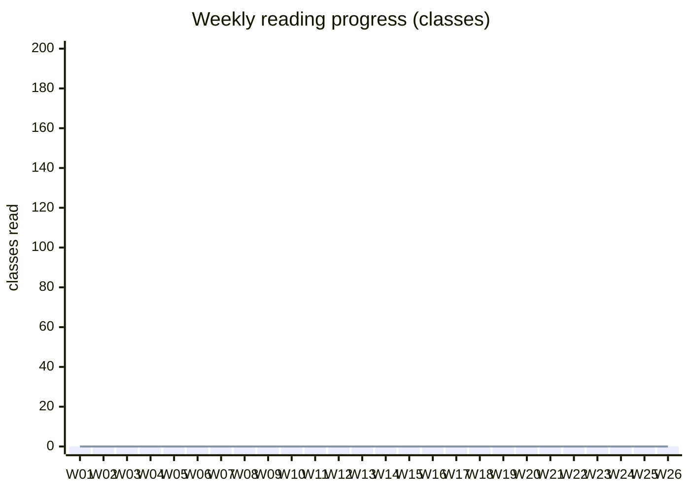

# Progress Log

One line per class read; one line per weekly recap; one line per milestone.

## Summary (fill in as you go)

- Classes read: __ / 2748 total (only anchor rows expected on the 26-week schedule).
- Weeks complete: __ / 26
- Current streak: __ days
- Hours logged: __

## Cumulative-progress chart (regenerate weekly)

_Replace the two zero-lists as you progress; the `bar` array is weekly counts and `line` array is cumulative._

## Daily log

Format: `- [ ] Wnn Dn  <fqcn>  (<minutes>)  notes:`

### Week 01 — W01 Onboarding

- [ ] W01 D1  `org.apache.hadoop.ozone.client.io.BlockDataStreamOutputEntryPool`  (45)  notes:
- [ ] W01 D1  `org.apache.hadoop.ozone.client.io.WrappedOutputStream`  (30)  notes:
- [ ] W01 D2  `org.apache.hadoop.ozone.client.io.BlockDataStreamOutputEntry`  (45)  notes:
- [ ] W01 D2  `org.apache.hadoop.ozone.client.io.LengthInputStream`  (30)  notes:
- [ ] W01 D3  `org.apache.hadoop.ozone.client.protocol.ClientProtocol`  (20)  notes:
- [ ] W01 D3  `org.apache.hadoop.ozone.client.OzoneVolume`  (20)  notes:
- [ ] W01 D5  **Weekly recap: sequence diagram + test-exemplar run**  (90)  notes:

### Week 02 — W02 Client write path (RPC)

- [ ] W02 D1  `org.apache.hadoop.ozone.client.OzoneLifecycleConfiguration`  (45)  notes:
- [ ] W02 D1  `org.apache.hadoop.ozone.protocolPB.OzoneManagerProtocolServerSideTranslatorPB`  (20)  notes:
- [ ] W02 D1  `org.apache.hadoop.ozone.protocolPB.RequestHandler`  (20)  notes:
- [ ] W02 D2  `org.apache.hadoop.ozone.om.request.OMClientRequestUtils`  (30)  notes:
- [ ] W02 D2  `org.apache.hadoop.ozone.client.BucketArgs`  (45)  notes:
- [ ] W02 D3  `org.apache.hadoop.ozone.om.request.validation.RequestValidations`  (30)  notes:
- [ ] W02 D3  `org.apache.hadoop.ozone.client.OzoneClientUtils`  (45)  notes:
- [ ] W02 D4  `org.apache.hadoop.ozone.om.request.util.OmResponseUtil`  (30)  notes:
- [ ] W02 D4  `org.apache.hadoop.ozone.client.io.KeyInputStream`  (30)  notes:
- [ ] W02 D4  `org.apache.hadoop.ozone.om.request.util.ObjectParser`  (30)  notes:
- [ ] W02 D5  **Weekly recap: sequence diagram + test-exemplar run**  (90)  notes:

### Week 03 — W03 Client write path (blocks)

- [ ] W03 D1  `org.apache.hadoop.hdds.scm.storage.ChunkInputStream`  (60)  notes:
- [ ] W03 D1  `org.apache.hadoop.hdds.scm.block.DatanodeDeletedBlockTransactions`  (30)  notes:
- [ ] W03 D2  `org.apache.hadoop.hdds.scm.block.DeletedBlockLogStateManagerImpl`  (45)  notes:
- [ ] W03 D2  `org.apache.hadoop.hdds.scm.pipeline.WritableECContainerProvider`  (45)  notes:
- [ ] W03 D3  `org.apache.hadoop.hdds.scm.storage.BlockInputStream`  (60)  notes:
- [ ] W03 D3  `org.apache.hadoop.hdds.scm.block.BlockmanagerMXBean`  (20)  notes:
- [ ] W03 D4  `org.apache.hadoop.hdds.scm.block.BlockManagerImpl`  (45)  notes:
- [ ] W03 D4  `org.apache.hadoop.hdds.scm.pipeline.BackgroundPipelineCreator`  (45)  notes:
- [ ] W03 D5  **Weekly recap: sequence diagram + test-exemplar run**  (90)  notes:

### Week 04 — W04 Client write path (chunks)

- [ ] W04 D1  `org.apache.hadoop.ozone.client.io.ECBlockInputStream`  (45)  notes:
- [ ] W04 D1  `org.apache.hadoop.ozone.container.keyvalue.helpers.ChunkUtils`  (45)  notes:
- [ ] W04 D2  `org.apache.hadoop.ozone.container.keyvalue.impl.FilePerChunkStrategy`  (45)  notes:
- [ ] W04 D2  `org.apache.hadoop.hdds.scm.XceiverClientRatis`  (45)  notes:
- [ ] W04 D3  `org.apache.hadoop.ozone.container.keyvalue.KeyValueContainerData`  (45)  notes:
- [ ] W04 D3  `org.apache.hadoop.ozone.container.keyvalue.impl.KeyValueStreamDataChannel`  (45)  notes:
- [ ] W04 D4  `org.apache.hadoop.hdds.scm.storage.ECBlockOutputStream`  (45)  notes:
- [ ] W04 D4  `org.apache.hadoop.ozone.container.keyvalue.helpers.BlockUtils`  (45)  notes:
- [ ] W04 D5  **Weekly recap: sequence diagram + test-exemplar run**  (90)  notes:
- [ ] **Milestone M1** — Explain end-to-end write path on a whiteboard from `OzoneClient` down to DN chunk file, naming every class on the path.

### Week 05 — W05 Client read path

- [ ] W05 D1  `org.apache.hadoop.ozone.client.io.OzoneDataStreamOutput`  (30)  notes:
- [ ] W05 D1  `org.apache.hadoop.hdds.scm.XceiverClientManager`  (45)  notes:
- [ ] W05 D2  `org.apache.hadoop.ozone.container.common.interfaces.Container`  (20)  notes:
- [ ] W05 D2  `org.apache.hadoop.ozone.client.OzoneSnapshot`  (30)  notes:
- [ ] W05 D2  `org.apache.hadoop.ozone.container.common.interfaces.ContainerInspector`  (20)  notes:
- [ ] W05 D2  `org.apache.hadoop.hdds.scm.ContainerClientMetrics`  (20)  notes:
- [ ] W05 D3  `org.apache.hadoop.hdds.scm.storage.MultipartInputStream`  (45)  notes:
- [ ] W05 D3  `org.apache.hadoop.ozone.client.rpc.OzoneKMSUtil`  (30)  notes:
- [ ] W05 D4  `org.apache.hadoop.ozone.container.common.interfaces.BlockIterator`  (20)  notes:
- [ ] W05 D4  `org.apache.hadoop.ozone.client.io.OzoneOutputStream`  (30)  notes:
- [ ] W05 D4  `org.apache.hadoop.hdds.scm.storage.DomainSocketFactory`  (20)  notes:
- [ ] W05 D4  `org.apache.hadoop.ozone.container.common.interfaces.StorageLocationReportMXBean`  (20)  notes:
- [ ] W05 D5  **Weekly recap: sequence diagram + test-exemplar run**  (90)  notes:

### Week 06 — W06 Client read path (EC)

- [ ] W06 D1  `org.apache.hadoop.ozone.container.ec.reconstruction.ECContainerOperationClient`  (30)  notes:
- [ ] W06 D1  `org.apache.hadoop.ozone.om.request.key.OMKeyCreateRequestWithFSO`  (45)  notes:
- [ ] W06 D2  `org.apache.ozone.erasurecode.rawcoder.RSRawDecoder`  (30)  notes:
- [ ] W06 D2  `org.apache.hadoop.ozone.om.request.key.acl.OMKeyAclRequest`  (30)  notes:
- [ ] W06 D2  `org.apache.ozone.erasurecode.rawcoder.ByteBufferDecodingState`  (30)  notes:
- [ ] W06 D3  `org.apache.hadoop.ozone.om.request.key.OMKeySetTimesRequestWithFSO`  (30)  notes:
- [ ] W06 D3  `org.apache.ozone.erasurecode.CodecRegistry`  (30)  notes:
- [ ] W06 D3  `org.apache.hadoop.ozone.om.request.key.acl.OMKeySetAclRequestWithFSO`  (30)  notes:
- [ ] W06 D5  **Weekly recap: sequence diagram + test-exemplar run**  (90)  notes:

### Week 07 — W07 Consensus: Ratis integration

- [ ] W07 D1  `org.apache.hadoop.hdds.ratis.conf.RatisClientConfig`  (20)  notes:
- [ ] W07 D1  `org.apache.hadoop.hdds.ratis.retrypolicy.RetryPolicyCreator`  (20)  notes:
- [ ] W07 D1  `org.apache.hadoop.hdds.scm.ha.SCMNodeInfo`  (10)  notes:
- [ ] W07 D1  `org.apache.hadoop.hdds.ratis.ServerNotLeaderException`  (10)  notes:
- [ ] W07 D5  **Weekly recap: sequence diagram + test-exemplar run**  (90)  notes:

### Week 08 — W08 Consensus: OM apply

- [ ] W08 D1  `org.apache.hadoop.ozone.om.ratis.utils.OzoneManagerRatisUtils`  (45)  notes:
- [ ] W08 D1  `org.apache.hadoop.ozone.om.request.key.acl.prefix.OMPrefixAclRequest`  (30)  notes:
- [ ] W08 D2  `org.apache.hadoop.ozone.om.ratis_snapshot.OmRatisSnapshotProvider`  (45)  notes:
- [ ] W08 D2  `org.apache.hadoop.ozone.om.request.key.acl.OMKeyAclRequestWithFSO`  (30)  notes:
- [ ] W08 D3  `org.apache.hadoop.ozone.om.ratis.OzoneManagerDoubleBufferMetrics`  (20)  notes:
- [ ] W08 D3  `org.apache.hadoop.ozone.om.request.key.acl.OMKeyAddAclRequestWithFSO`  (30)  notes:
- [ ] W08 D3  `org.apache.hadoop.ozone.om.ratis.OzoneManagerRatisServerConfig`  (20)  notes:
- [ ] W08 D4  `org.apache.hadoop.ozone.om.request.key.acl.OMKeyRemoveAclRequestWithFSO`  (30)  notes:
- [ ] W08 D5  **Weekly recap: sequence diagram + test-exemplar run**  (90)  notes:
- [ ] **Milestone M2** — Explain end-to-end read path, including pipeline selection and EC read.

### Week 09 — W09 Consensus: OM response + double buffer

- [ ] W09 D1  `org.apache.hadoop.ozone.om.response.key.OMKeysDeleteResponseWithFSO`  (30)  notes:
- [ ] W09 D1  `org.apache.hadoop.ozone.om.response.key.OMKeyRenameResponseWithFSO`  (30)  notes:
- [ ] W09 D1  `org.apache.hadoop.ozone.om.response.key.OMKeyDeleteResponseWithFSO`  (30)  notes:
- [ ] W09 D2  `org.apache.hadoop.ozone.om.response.s3.multipart.S3InitiateMultipartUploadResponseWithFSO`  (30)  notes:
- [ ] W09 D5  **Weekly recap: sequence diagram + test-exemplar run**  (90)  notes:

### Week 10 — W10 Consensus: DN state machine

- [ ] W10 D1  `org.apache.hadoop.ozone.container.keyvalue.statemachine.background.BlockDeletingTask`  (60)  notes:
- [ ] W10 D1  `org.apache.hadoop.ozone.container.keyvalue.helpers.KeyValueContainerLocationUtil`  (30)  notes:
- [ ] W10 D2  `org.apache.hadoop.ozone.container.keyvalue.TarContainerPacker`  (45)  notes:
- [ ] W10 D2  `org.apache.hadoop.ozone.container.keyvalue.statemachine.background.StaleRecoveringContainerScrubbingService`  (30)  notes:
- [ ] W10 D3  `org.apache.hadoop.ozone.container.common.transport.server.ratis.LocalStream`  (90)  notes:
- [ ] W10 D4  `org.apache.hadoop.ozone.container.keyvalue.PendingDelete`  (30)  notes:
- [ ] W10 D4  `org.apache.hadoop.ozone.container.common.transport.server.ratis.RatisServerConfiguration`  (30)  notes:
- [ ] W10 D4  `org.apache.hadoop.ozone.container.keyvalue.interfaces.ChunkManager`  (20)  notes:
- [ ] W10 D5  **Weekly recap: sequence diagram + test-exemplar run**  (90)  notes:

### Week 11 — W11 OM key manager & metadata

- [ ] W11 D1  `org.apache.hadoop.ozone.om.OMMultiTenantManagerImpl`  (60)  notes:
- [ ] W11 D1  `org.apache.hadoop.ozone.om.lock.HierarchicalResourceLockManager`  (20)  notes:
- [ ] W11 D1  `org.apache.hadoop.ozone.om.helpers.OmPrefixInfo`  (10)  notes:
- [ ] W11 D2  `org.apache.hadoop.ozone.om.OmMetadataReader`  (60)  notes:
- [ ] W11 D2  `org.apache.hadoop.ozone.om.lock.DAGLeveledResource`  (10)  notes:
- [ ] W11 D2  `org.apache.hadoop.ozone.om.lock.LockUsageInfo`  (10)  notes:
- [ ] W11 D3  `org.apache.hadoop.ozone.om.OMDBCheckpointServlet`  (60)  notes:
- [ ] W11 D4  `org.apache.hadoop.ozone.om.TrashOzoneFileSystem`  (60)  notes:
- [ ] W11 D5  **Weekly recap: sequence diagram + test-exemplar run**  (90)  notes:

### Week 12 — W12 OM bucket/volume manager

- [ ] W12 D1  `org.apache.hadoop.ozone.om.request.bucket.OMBucketSetOwnerRequest`  (10)  notes:
- [ ] W12 D1  `org.apache.hadoop.ozone.om.request.volume.OMVolumeCreateRequest`  (10)  notes:
- [ ] W12 D1  `org.apache.hadoop.ozone.om.request.bucket.acl.OMBucketAddAclRequest`  (10)  notes:
- [ ] W12 D1  `org.apache.hadoop.ozone.om.request.volume.OMQuotaRepairRequest`  (10)  notes:
- [ ] W12 D1  `org.apache.hadoop.ozone.om.request.bucket.acl.OMBucketSetAclRequest`  (10)  notes:
- [ ] W12 D1  `org.apache.hadoop.ozone.om.request.volume.OMVolumeDeleteRequest`  (10)  notes:
- [ ] W12 D1  `org.apache.hadoop.ozone.om.request.bucket.acl.OMBucketRemoveAclRequest`  (10)  notes:
- [ ] W12 D1  `org.apache.hadoop.ozone.om.request.volume.acl.OMVolumeAddAclRequest`  (10)  notes:
- [ ] W12 D5  **Weekly recap: sequence diagram + test-exemplar run**  (90)  notes:
- [ ] **Milestone M3** — Explain OM Ratis apply loop and one non-trivial `OMClientRequest` lifecycle (double-buffer, cache, response).

### Week 13 — W13 OM locking + codecs

- [ ] W13 D1  `org.apache.hadoop.ozone.om.lock.OBSKeyPathLockStrategy`  (30)  notes:
- [ ] W13 D1  `org.apache.hadoop.ozone.om.lock.ReadOnlyHierarchicalResourceLockManager`  (30)  notes:
- [ ] W13 D1  `org.apache.hadoop.ozone.om.lock.LeveledResourceLockTracker`  (30)  notes:
- [ ] W13 D2  `org.apache.hadoop.ozone.om.lock.ResourceLockTracker`  (30)  notes:
- [ ] W13 D5  **Weekly recap: sequence diagram + test-exemplar run**  (90)  notes:

### Week 14 — W14 SCM containers

- [ ] W14 D1  `org.apache.hadoop.hdds.scm.container.placement.algorithms.SCMContainerPlacementRackAware`  (20)  notes:
- [ ] W14 D1  `org.apache.hadoop.hdds.scm.container.ContainerID`  (30)  notes:
- [ ] W14 D1  `org.apache.hadoop.hdds.scm.container.ContainerChecksums`  (30)  notes:
- [ ] W14 D2  `org.apache.hadoop.hdds.scm.container.ContainerReplica`  (45)  notes:
- [ ] W14 D2  `org.apache.hadoop.hdds.scm.container.states.ContainerStateMap`  (45)  notes:
- [ ] W14 D3  `org.apache.hadoop.hdds.scm.container.common.helpers.ContainerWithPipeline`  (30)  notes:
- [ ] W14 D3  `org.apache.hadoop.hdds.scm.container.ContainerReportHandler`  (30)  notes:
- [ ] W14 D3  `org.apache.hadoop.hdds.scm.container.common.helpers.DeleteBlockResult`  (30)  notes:
- [ ] W14 D5  **Weekly recap: sequence diagram + test-exemplar run**  (90)  notes:

### Week 15 — W15 SCM pipelines

- [ ] W15 D1  `org.apache.hadoop.hdds.scm.pipeline.RatisPipelineProvider`  (45)  notes:
- [ ] W15 D1  `org.apache.hadoop.hdds.scm.pipeline.choose.algorithms.RandomPipelineChoosePolicy`  (30)  notes:
- [ ] W15 D1  `org.apache.hadoop.hdds.scm.pipeline.InvalidPipelineStateException`  (10)  notes:
- [ ] W15 D2  `org.apache.hadoop.hdds.scm.pipeline.SortedList`  (45)  notes:
- [ ] W15 D2  `org.apache.hadoop.hdds.scm.pipeline.choose.algorithms.PipelineChoosePolicyFactory`  (20)  notes:
- [ ] W15 D3  `org.apache.hadoop.hdds.scm.pipeline.WritableRatisContainerProvider`  (30)  notes:
- [ ] W15 D3  `org.apache.hadoop.hdds.scm.pipeline.PipelineProvider`  (30)  notes:
- [ ] W15 D5  **Weekly recap: sequence diagram + test-exemplar run**  (90)  notes:

### Week 16 — W16 SCM replication manager

- [ ] W16 D1  `org.apache.hadoop.hdds.scm.container.replication.ECContainerReplicaCount`  (45)  notes:
- [ ] W16 D1  `org.apache.hadoop.hdds.scm.container.replication.RatisUnderReplicationHandler`  (45)  notes:
- [ ] W16 D2  `org.apache.hadoop.hdds.scm.container.replication.ReplicationManagerUtil`  (45)  notes:
- [ ] W16 D2  `org.apache.hadoop.hdds.scm.container.replication.ContainerHealthResult`  (45)  notes:
- [ ] W16 D5  **Weekly recap: sequence diagram + test-exemplar run**  (90)  notes:
- [ ] **Milestone M4** — Explain SCM container lifecycle + replication manager decisions.

### Week 17 — W17 SCM HA + safemode + node

- [ ] W17 D1  `org.apache.hadoop.hdds.scm.ha.SCMRatisServerImpl`  (45)  notes:
- [ ] W17 D1  `org.apache.hadoop.hdds.scm.safemode.AbstractContainerSafeModeRule`  (45)  notes:
- [ ] W17 D2  `org.apache.hadoop.hdds.scm.node.NodeStateManager`  (60)  notes:
- [ ] W17 D2  `org.apache.hadoop.hdds.scm.safemode.ECMinDataNodeSafeModeRule`  (30)  notes:
- [ ] W17 D3  `org.apache.hadoop.hdds.scm.ha.invoker.ContainerStateManagerInvoker`  (45)  notes:
- [ ] W17 D3  `org.apache.hadoop.hdds.scm.safemode.OneReplicaPipelineSafeModeRule`  (45)  notes:
- [ ] W17 D4  `org.apache.hadoop.hdds.scm.node.DatanodeAdminMonitorImpl`  (45)  notes:
- [ ] W17 D4  `org.apache.hadoop.hdds.scm.ha.SCMHANodeDetails`  (45)  notes:
- [ ] W17 D5  **Weekly recap: sequence diagram + test-exemplar run**  (90)  notes:

### Week 18 — W18 DN volumes + rocksdb

- [ ] W18 D1  `org.apache.hadoop.ozone.container.common.volume.ThrottledAsyncChecker`  (30)  notes:
- [ ] W18 D1  `org.apache.hadoop.ozone.container.metadata.DatanodeSchemaThreeDBDefinition`  (30)  notes:
- [ ] W18 D1  `org.apache.hadoop.hdds.utils.db.managed.ManagedSstFileReaderIterator`  (30)  notes:
- [ ] W18 D2  `org.apache.hadoop.ozone.container.common.volume.VolumeUsage`  (30)  notes:
- [ ] W18 D2  `org.apache.hadoop.ozone.container.metadata.AbstractRDBStore`  (30)  notes:
- [ ] W18 D2  `org.apache.hadoop.hdds.utils.db.managed.ManagedCompactRangeOptions`  (30)  notes:
- [ ] W18 D3  `org.apache.hadoop.ozone.container.common.volume.VolumeIOStats`  (30)  notes:
- [ ] W18 D3  `org.apache.hadoop.ozone.container.metadata.DatanodeSchemaTwoDBDefinition`  (30)  notes:
- [ ] W18 D3  `org.apache.hadoop.hdds.utils.db.managed.ManagedReadOptions`  (30)  notes:
- [ ] W18 D4  `org.apache.hadoop.ozone.container.common.volume.DbVolume`  (30)  notes:
- [ ] W18 D4  `org.apache.hadoop.ozone.container.metadata.WitnessedContainerMetadataStoreImpl`  (30)  notes:
- [ ] W18 D4  `org.apache.hadoop.hdds.utils.db.managed.ManagedDBOptions`  (30)  notes:
- [ ] W18 D5  **Weekly recap: sequence diagram + test-exemplar run**  (90)  notes:

### Week 19 — W19 DN state machine + reports

- [ ] W19 D1  `org.apache.hadoop.ozone.container.common.statemachine.DatanodeStateMachine`  (60)  notes:
- [ ] W19 D1  `org.apache.hadoop.ozone.container.common.report.ContainerReportPublisher`  (30)  notes:
- [ ] W19 D2  `org.apache.hadoop.ozone.protocol.commands.ReconstructECContainersCommand`  (20)  notes:
- [ ] W19 D2  `org.apache.hadoop.ozone.container.common.statemachine.SCMConnectionManager`  (45)  notes:
- [ ] W19 D2  `org.apache.hadoop.ozone.protocol.commands.CreatePipelineCommand`  (20)  notes:
- [ ] W19 D3  `org.apache.hadoop.ozone.container.common.report.NodeReportPublisher`  (30)  notes:
- [ ] W19 D3  `org.apache.hadoop.ozone.container.common.statemachine.commandhandler.DeleteContainerCommandHandler`  (30)  notes:
- [ ] W19 D3  `org.apache.hadoop.ozone.container.common.report.CommandStatusReportPublisher`  (30)  notes:
- [ ] W19 D4  `org.apache.hadoop.ozone.protocol.commands.ReplicateContainerCommand`  (20)  notes:
- [ ] W19 D4  `org.apache.hadoop.ozone.container.common.statemachine.commandhandler.CloseContainerCommandHandler`  (30)  notes:
- [ ] W19 D4  `org.apache.hadoop.ozone.container.common.report.ReportPublisherFactory`  (20)  notes:
- [ ] W19 D4  `org.apache.hadoop.ozone.protocol.commands.CloseContainerCommand`  (20)  notes:
- [ ] W19 D5  **Weekly recap: sequence diagram + test-exemplar run**  (90)  notes:

### Week 20 — W20 OM snapshot

- [ ] W20 D1  `org.apache.hadoop.ozone.om.snapshot.SnapshotUtils`  (45)  notes:
- [ ] W20 D1  `org.apache.hadoop.ozone.om.request.snapshot.OMSnapshotRenameRequest`  (10)  notes:
- [ ] W20 D1  `org.apache.hadoop.ozone.snapshot.CancelSnapshotDiffResponse`  (10)  notes:
- [ ] W20 D1  `org.apache.hadoop.ozone.om.snapshot.OMSnapshotDirectoryMetrics`  (20)  notes:
- [ ] W20 D2  `org.apache.hadoop.ozone.om.request.snapshot.OMSnapshotDeleteRequest`  (10)  notes:
- [ ] W20 D2  `org.apache.hadoop.ozone.snapshot.SubmitSnapshotDiffResponse`  (10)  notes:
- [ ] W20 D2  `org.apache.hadoop.ozone.om.snapshot.filter.ReclaimableFilter`  (45)  notes:
- [ ] W20 D2  `org.apache.hadoop.ozone.om.request.snapshot.OMSnapshotSetPropertyRequest`  (10)  notes:
- [ ] W20 D2  `org.apache.hadoop.ozone.om.request.snapshot.OMSnapshotMoveDeletedKeysRequest`  (10)  notes:
- [ ] W20 D3  `org.apache.hadoop.ozone.om.snapshot.RocksDbPersistentMap`  (30)  notes:
- [ ] W20 D5  **Weekly recap: sequence diagram + test-exemplar run**  (90)  notes:
- [ ] **Milestone M5** — Explain snapshot create + snapshot diff + deep-clean.

### Week 21 — W21 RocksDB checkpoint differ

- [ ] W21 D1  `org.apache.hadoop.hdds.utils.db.RDBSstFileWriter`  (30)  notes:
- [ ] W21 D1  `org.apache.hadoop.hdds.utils.NativeConstants`  (30)  notes:
- [ ] W21 D1  `org.apache.ozone.rocksdiff.CompactionDag`  (30)  notes:
- [ ] W21 D2  `org.apache.hadoop.hdds.utils.NativeLibraryNotLoadedException`  (10)  notes:
- [ ] W21 D2  `org.apache.ozone.rocksdiff.CompactionNode`  (30)  notes:
- [ ] W21 D2  `org.apache.ozone.rocksdiff.RocksDiffUtils`  (30)  notes:
- [ ] W21 D5  **Weekly recap: sequence diagram + test-exemplar run**  (90)  notes:

### Week 22 — W22 DN background: scanner + reconciliation + balancer

- [ ] W22 D1  `org.apache.hadoop.ozone.container.replication.GrpcContainerUploader`  (45)  notes:
- [ ] W22 D1  `org.apache.hadoop.ozone.container.diskbalancer.policy.DefaultContainerChoosingPolicy`  (45)  notes:
- [ ] W22 D2  `org.apache.hadoop.hdds.scm.container.balancer.ContainerBalancer`  (60)  notes:
- [ ] W22 D2  `org.apache.hadoop.ozone.container.replication.VolumeReplicationThreadPools`  (30)  notes:
- [ ] W22 D3  `org.apache.hadoop.hdds.scm.container.balancer.MoveManager`  (45)  notes:
- [ ] W22 D3  `org.apache.hadoop.ozone.container.diskbalancer.DiskBalancerYaml`  (45)  notes:
- [ ] W22 D4  `org.apache.hadoop.ozone.container.replication.ContainerImporter`  (30)  notes:
- [ ] W22 D4  `org.apache.hadoop.hdds.scm.container.balancer.ContainerBalancerSelectionCriteria`  (45)  notes:
- [ ] W22 D5  **Weekly recap: sequence diagram + test-exemplar run**  (90)  notes:

### Week 23 — W23 OM background services

- [ ] W23 D1  `org.apache.hadoop.ozone.om.service.KeyDeletingService`  (60)  notes:
- [ ] W23 D1  `org.apache.hadoop.ozone.om.upgrade.BelongsToLayoutVersion`  (20)  notes:
- [ ] W23 D2  `org.apache.hadoop.ozone.om.service.SnapshotDeletingService`  (45)  notes:
- [ ] W23 D2  `org.apache.hadoop.ozone.om.upgrade.OmUpgradeAction`  (20)  notes:
- [ ] W23 D2  `org.apache.hadoop.ozone.om.upgrade.UpgradeActionOm`  (20)  notes:
- [ ] W23 D3  `org.apache.hadoop.ozone.om.service.OpenKeyCleanupService`  (45)  notes:
- [ ] W23 D3  `org.apache.hadoop.ozone.om.service.SnapshotDiffCleanupService`  (45)  notes:
- [ ] W23 D4  `org.apache.hadoop.ozone.om.upgrade.DisallowedUntilLayoutVersion`  (20)  notes:
- [ ] W23 D5  **Weekly recap: sequence diagram + test-exemplar run**  (90)  notes:
- [ ] **Milestone M6** — Explain one full background service of choice, top to bottom.

### Week 24 — W24 Security: certs + tokens

- [ ] W24 D1  `org.apache.hadoop.hdds.security.x509.certificate.client.SCMCertificateClient`  (45)  notes:
- [ ] W24 D1  `org.apache.hadoop.hdds.security.token.NoopTokenVerifier`  (30)  notes:
- [ ] W24 D2  `org.apache.hadoop.ozone.security.OMCertificateClient`  (30)  notes:
- [ ] W24 D2  `org.apache.hadoop.hdds.scm.security.RootCARotationHandlerImpl`  (45)  notes:
- [ ] W24 D3  `org.apache.hadoop.hdds.security.x509.certificate.utils.SelfSignedCertificate`  (45)  notes:
- [ ] W24 D3  `org.apache.hadoop.hdds.security.token.ContainerTokenSecretManager`  (30)  notes:
- [ ] W24 D4  `org.apache.hadoop.ozone.security.OzoneSecretStore`  (30)  notes:
- [ ] W24 D4  `org.apache.hadoop.hdds.scm.security.SecretKeyManagerService`  (30)  notes:
- [ ] W24 D4  `org.apache.hadoop.hdds.security.token.CompositeTokenVerifier`  (30)  notes:
- [ ] W24 D5  **Weekly recap: sequence diagram + test-exemplar run**  (90)  notes:

### Week 25 — W25 Interfaces: S3 + OzoneFS + Recon glance

- [ ] W25 D1  `org.apache.hadoop.ozone.s3.endpoint.S3LifecycleConfiguration`  (45)  notes:
- [ ] W25 D1  `org.apache.hadoop.ozone.recon.chatbot.agent.ChatbotAgent`  (45)  notes:
- [ ] W25 D2  `org.apache.hadoop.fs.ozone.BasicRootedOzoneClientAdapterImpl`  (60)  notes:
- [ ] W25 D2  `org.apache.hadoop.fs.ozone.FileStatusAdapter`  (30)  notes:
- [ ] W25 D3  `org.apache.hadoop.ozone.s3.endpoint.BucketEndpoint`  (45)  notes:
- [ ] W25 D3  `org.apache.hadoop.ozone.recon.chatbot.llm.LangChain4jDispatcher`  (45)  notes:
- [ ] W25 D4  `org.apache.hadoop.fs.ozone.BasicOzoneFileSystem`  (60)  notes:
- [ ] W25 D5  **Weekly recap: sequence diagram + test-exemplar run**  (90)  notes:

### Week 26 — W26 Tools + wrap-up + M7 PR

- [ ] W26 D1  `org.apache.hadoop.hdds.scm.cli.TopologySubcommand`  (20)  notes:
- [ ] W26 D1  `org.apache.hadoop.ozone.debug.om.ContainerToKeyMapping`  (60)  notes:
- [ ] W26 D2  `org.apache.hadoop.ozone.freon.OmMetadataGenerator`  (60)  notes:
- [ ] W26 D2  `org.apache.hadoop.hdds.scm.cli.ContainerBalancerStatusSubcommand`  (20)  notes:
- [ ] W26 D3  `org.apache.hadoop.ozone.debug.replicas.ReplicasVerify`  (45)  notes:
- [ ] W26 D3  `org.apache.hadoop.hdds.scm.cli.datanode.DiskBalancerSubCommandUtil`  (30)  notes:
- [ ] W26 D4  `org.apache.hadoop.ozone.freon.BaseFreonGenerator`  (60)  notes:
- [ ] W26 D4  `org.apache.hadoop.ozone.debug.datanode.container.analyze.AnalyzeSubcommand`  (20)  notes:
- [ ] W26 D5  **Weekly recap: sequence diagram + test-exemplar run**  (90)  notes:
- [ ] **Milestone M7** — Contribute a docs PR or a bug-fix PR touching >=2 components.
