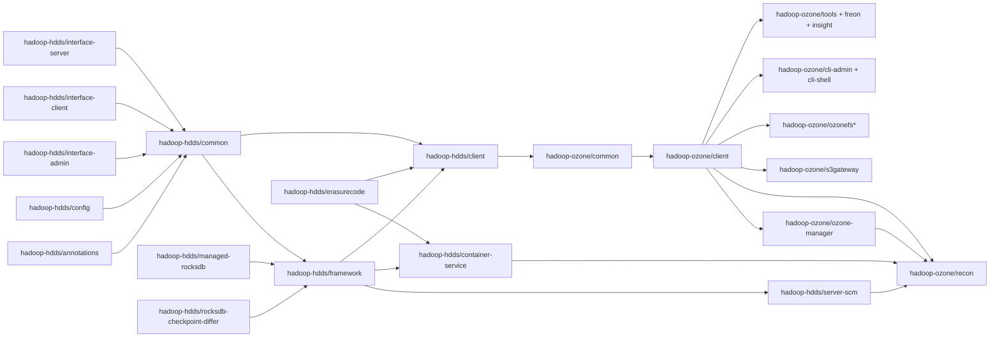

# Repository Map

## Two aggregators

- `hadoop-hdds/` — storage layer and shared infrastructure. Modules cannot depend on `hadoop-ozone/`.
- `hadoop-ozone/` — Ozone services and clients. Modules here depend on `hadoop-hdds/*`.

## Module dependency direction

## Components in this atlas

Priority tiers align with the top-level prioritization in the atlas prompt (P0 = read first). Count is number of production classes in the component (test / generated / package-info excluded).

| Component | Tier | Classes | Scope |
|---|---|---|---|
| Client | P0 | 97 | client write/read paths (RPC, IO, EC, replication) |
| OM | P0 / P1 | 395 | namespace, keys/buckets/volumes, snapshots, Ratis apply |
| SCM | P0 / P1 | 302 | containers, pipelines, replication mgr, HA, safemode |
| DN | P0 / P1 | 308 | container v3, chunk manager, RocksDB, Ratis state machine, scanner, disk balancer |
| Ratis-integration | P0 | 4 | Ratis client/server helpers shared by OM and SCM |
| Security | P2 | 47 | certificates (x509), tokens, symmetric secrets, SSL helpers |
| RocksDB | P1 | 51 | managed-rocksdb wrappers, checkpoint differ, native RocksDB |
| HddsCommon | P1 | 496 | framework, protobuf-common, config, tracing, HTTP, DB utils |
| OzoneCommon | P1 | 156 | shared om-helpers, s3, snapshot, ozone-fs common types |
| Recon | P2 | 265 | observability, derived views, background tasks |
| Interfaces | P3 | 208 | S3 gateway, HttpFS, OzoneFS, Iceberg, multi-tenancy |
| Admin CLIs | P3 | 225 | ozone admin + ozone sh + shell scaffolding |
| Debug & Repair | P3 | 99 | ozone debug (ldb, container, replicas) and ozone repair |
| Bench & Insight | P3 | 95 | freon, insight, vapor, tools |

Total production classes: **2748**.

## Notable module facts

- `hadoop-hdds/framework` is not a "domain" component; it is a grab-bag of shared server-side plumbing that this atlas re-slices by feature (`ratis-integration` → Ratis-integration component; `security/*` → Security component; the rest → HddsCommon).
- `hadoop-hdds/common` contains **Hadoop-shaded** copies of `org.apache.hadoop.io.retry`, `org.apache.hadoop.ipc`, and `org.apache.hadoop.security` under packages `io_`, `ipc_`, `security_`. These are surfaced as feature `HddsCommon / hadoop-shaded` and are lower priority for study — they are effectively imported code.
- `hadoop-ozone/mini-cluster` and `hadoop-hdds/test-utils` are production `main/` source trees but exist only to support tests; they are **excluded** from this atlas per user decision.
- `hadoop-ozone/csi`, `hadoop-ozone/native-client`, `hadoop-ozone/om-tools`, `hadoop-hdds/tools`, `hadoop-hdds/crypto-*` currently contain **no `.java` sources** on this branch (only assembly / native shells).
