# 26-Week Study Schedule

5 days/week, ~90 minutes/day. Monday–Thursday are new reads (D1..D4). Friday (D5) is a **connect-the-dots** day: no new classes; do the weekly recap (one sequence diagram + prose) and run the most illuminating `test_exemplar` you found this week.

## Gantt

```mermaid
gantt
  title Ozone 26-week class-study atlas
  dateFormat  X
  axisFormat  W%w

  section Phases
  P0 Client write path :client-write, 1, 4d
  P0 Client read path :client-read, 5, 2d
  P0 Consensus Ratis+OM+DN :consensus, 7, 4d
  P1 Metadata management OM SCM DN :metadata, 11, 9d
  P2 Background + snapshot + security :bg, 20, 5d
  P3 Interfaces + tooling + contribution :p3, 25, 2d
```

## Weekly plan

### W01 Onboarding  (Week 01)

**Feature focus:** `Client/ozone-client`, `OzoneCommon/client-common`

| Day | Class | study (min) | feature |
|---|---|--:|---|
| D1 | `org.apache.hadoop.ozone.client.rpc.RpcClient` | 60 | Client/ozone-client |
| D1 | `org.apache.hadoop.ozone.client.io.SelectorOutputStream` | 30 | OzoneCommon/client-common |
| D2 | `org.apache.hadoop.ozone.client.OzoneBucket` | 60 | Client/ozone-client |
| D2 | `org.apache.hadoop.ozone.client.checksum.CrcUtil` | 30 | OzoneCommon/client-common |
| D3 | `org.apache.hadoop.ozone.client.io.KeyOutputStream` | 60 | Client/ozone-client |
| D3 | `org.apache.hadoop.ozone.client.checksum.CrcComposer` | 30 | OzoneCommon/client-common |
| D4 | `org.apache.hadoop.ozone.client.io.ECKeyOutputStream` | 60 | Client/ozone-client |
| D4 | `org.apache.hadoop.ozone.client.checksum.CompositeCrcFileChecksum` | 30 | OzoneCommon/client-common |
| D5 | **Weekly recap** — write a sequence diagram (see `INDEX.md` legend) for one flow you learned. Run the test exemplar you found most illuminating. | 90 |  |

### W02 Client write path (RPC)  (Week 02)

**Feature focus:** `Client/ozone-client`, `OM/om-protocol`, `OM/om-request`

| Day | Class | study (min) | feature |
|---|---|--:|---|
| D1 | `org.apache.hadoop.ozone.client.io.KeyDataStreamOutput` | 45 | Client/ozone-client |
| D1 | `org.apache.hadoop.ozone.om.request.util.OMMultipartUploadUtils` | 30 | OM/om-request |
| D2 | `org.apache.hadoop.ozone.protocolPB.OzoneManagerRequestHandler` | 60 | OM/om-protocol |
| D2 | `org.apache.hadoop.ozone.protocolPB.OMAdminProtocolServerSideImpl` | 30 | OM/om-protocol |
| D3 | `org.apache.hadoop.ozone.client.ObjectStore` | 45 | Client/ozone-client |
| D3 | `org.apache.hadoop.ozone.om.request.validation.ValidatorRegistry` | 30 | OM/om-request |
| D4 | `org.apache.hadoop.ozone.client.io.ECBlockOutputStreamEntry` | 45 | Client/ozone-client |
| D4 | `org.apache.hadoop.ozone.protocolPB.OMInterServiceProtocolServerSideImpl` | 30 | OM/om-protocol |
| D5 | **Weekly recap** — write a sequence diagram (see `INDEX.md` legend) for one flow you learned. Run the test exemplar you found most illuminating. | 90 |  |

### W03 Client write path (blocks)  (Week 03)

**Feature focus:** `Client/hdds-client`, `SCM/block-manager`, `SCM/pipeline-manager`

| Day | Class | study (min) | feature |
|---|---|--:|---|
| D1 | `org.apache.hadoop.hdds.scm.storage.BlockOutputStream` | 60 | Client/hdds-client |
| D1 | `org.apache.hadoop.hdds.scm.block.ScmBlockDeletingServiceMetrics` | 20 | SCM/block-manager |
| D2 | `org.apache.hadoop.hdds.scm.block.DeletedBlockLogImpl` | 45 | SCM/block-manager |
| D2 | `org.apache.hadoop.hdds.scm.block.SCMBlockDeletingService` | 45 | SCM/block-manager |
| D3 | `org.apache.hadoop.hdds.scm.pipeline.PipelineManagerImpl` | 60 | SCM/pipeline-manager |
| D4 | `org.apache.hadoop.hdds.scm.XceiverClientGrpc` | 60 | Client/hdds-client |
| D5 | **Weekly recap** — write a sequence diagram (see `INDEX.md` legend) for one flow you learned. Run the test exemplar you found most illuminating. | 90 |  |

### W04 Client write path (chunks)  (Week 04)

**Feature focus:** `Client/hdds-client`, `DN/kv-container`, `DN/kv-container-impl`

| Day | Class | study (min) | feature |
|---|---|--:|---|
| D1 | `org.apache.hadoop.hdds.scm.storage.BlockDataStreamOutput` | 60 | Client/hdds-client |
| D2 | `org.apache.hadoop.ozone.container.keyvalue.KeyValueHandler` | 60 | DN/kv-container |
| D3 | `org.apache.hadoop.ozone.container.keyvalue.impl.FilePerBlockStrategy` | 45 | DN/kv-container-impl |
| D3 | `org.apache.hadoop.ozone.container.keyvalue.impl.BlockManagerImpl` | 45 | DN/kv-container-impl |
| D4 | `org.apache.hadoop.ozone.client.io.ECBlockReconstructedStripeInputStream` | 60 | Client/hdds-client |
| D5 | **Weekly recap** — write a sequence diagram (see `INDEX.md` legend) for one flow you learned. Run the test exemplar you found most illuminating. | 90 |  |

**Milestone M1 at end of Week 4:** Explain end-to-end write path on a whiteboard from `OzoneClient` down to DN chunk file, naming every class on the path.

### W05 Client read path  (Week 05)

**Feature focus:** `Client/ozone-client`, `Client/hdds-client`, `DN/container-interfaces`

| Day | Class | study (min) | feature |
|---|---|--:|---|
| D1 | `org.apache.hadoop.ozone.client.io.BlockOutputStreamEntry` | 45 | Client/ozone-client |
| D1 | `org.apache.hadoop.ozone.container.common.interfaces.Handler` | 30 | DN/container-interfaces |
| D2 | `org.apache.hadoop.hdds.scm.XceiverClientShortCircuit` | 60 | Client/hdds-client |
| D2 | `org.apache.hadoop.ozone.container.common.interfaces.ContainerDeletionChoosingPolicyTemplate` | 30 | DN/container-interfaces |
| D3 | `org.apache.hadoop.ozone.client.io.BlockOutputStreamEntryPool` | 45 | Client/ozone-client |
| D3 | `org.apache.hadoop.ozone.client.checksum.BaseFileChecksumHelper` | 45 | Client/ozone-client |
| D4 | `org.apache.hadoop.hdds.scm.storage.StreamBlockInputStream` | 60 | Client/hdds-client |
| D4 | `org.apache.hadoop.ozone.container.common.interfaces.DBHandle` | 30 | DN/container-interfaces |
| D5 | **Weekly recap** — write a sequence diagram (see `INDEX.md` legend) for one flow you learned. Run the test exemplar you found most illuminating. | 90 |  |

### W06 Client read path (EC)  (Week 06)

**Feature focus:** `DN/erasure-coding`, `OM/om-request-key`

| Day | Class | study (min) | feature |
|---|---|--:|---|
| D1 | `org.apache.hadoop.ozone.container.ec.reconstruction.ECReconstructionCoordinator` | 60 | DN/erasure-coding |
| D1 | `org.apache.ozone.erasurecode.rawcoder.util.RSUtil` | 30 | DN/erasure-coding |
| D2 | `org.apache.hadoop.ozone.om.request.key.OMKeyRequest` | 60 | OM/om-request-key |
| D3 | `org.apache.ozone.erasurecode.rawcoder.util.GaloisField` | 45 | DN/erasure-coding |
| D3 | `org.apache.hadoop.ozone.om.request.key.OMKeyRenameRequestWithFSO` | 45 | OM/om-request-key |
| D4 | `org.apache.ozone.erasurecode.rawcoder.util.GF256` | 45 | DN/erasure-coding |
| D4 | `org.apache.hadoop.ozone.om.request.key.OMKeyCommitRequestWithFSO` | 45 | OM/om-request-key |
| D5 | **Weekly recap** — write a sequence diagram (see `INDEX.md` legend) for one flow you learned. Run the test exemplar you found most illuminating. | 90 |  |

### W07 Consensus: Ratis integration  (Week 07)

**Feature focus:** `Ratis-integration/ratis-integration`, `HddsCommon/ratis-integration`

| Day | Class | study (min) | feature |
|---|---|--:|---|
| D1 | `org.apache.hadoop.hdds.scm.ha.SCMHAUtils` | 45 | Ratis-integration/ratis-integration |
| D1 | `org.apache.ratis.metrics.dropwizard3.RatisMetricsUtils` | 20 | Ratis-integration/ratis-integration |
| D1 | `org.apache.hadoop.hdds.scm.ha.SCMHandler` | 20 | Ratis-integration/ratis-integration |
| D2 | `org.apache.hadoop.hdds.ratis.RatisHelper` | 60 | HddsCommon/ratis-integration |
| D2 | `org.apache.hadoop.hdds.ratis.ContainerCommandRequestMessage` | 30 | HddsCommon/ratis-integration |
| D3 | `org.apache.hadoop.hdds.ratis.retrypolicy.RequestTypeDependentRetryPolicyCreator` | 30 | HddsCommon/ratis-integration |
| D3 | `org.apache.hadoop.hdds.scm.ha.SequenceIdType` | 10 | Ratis-integration/ratis-integration |
| D3 | `org.apache.hadoop.hdds.ratis.retrypolicy.RetryLimitedPolicyCreator` | 30 | HddsCommon/ratis-integration |
| D4 | _(pool exhausted for this week; catch up on prior reads or extend a feature file)_ | | |
| D5 | **Weekly recap** — write a sequence diagram (see `INDEX.md` legend) for one flow you learned. Run the test exemplar you found most illuminating. | 90 |  |

### W08 Consensus: OM apply  (Week 08)

**Feature focus:** `OM/om-ratis`, `OM/om-request-key`

| Day | Class | study (min) | feature |
|---|---|--:|---|
| D1 | `org.apache.hadoop.ozone.om.ratis.OzoneManagerRatisServer` | 60 | OM/om-ratis |
| D1 | `org.apache.hadoop.ozone.om.request.key.OmKeysDeleteRequestWithFSO` | 30 | OM/om-request-key |
| D2 | `org.apache.hadoop.ozone.om.request.key.OMDirectoriesPurgeRequestWithFSO` | 45 | OM/om-request-key |
| D2 | `org.apache.hadoop.ozone.om.request.key.OMKeyDeleteRequestWithFSO` | 45 | OM/om-request-key |
| D3 | `org.apache.hadoop.ozone.om.ratis.OzoneManagerStateMachine` | 60 | OM/om-ratis |
| D4 | `org.apache.hadoop.ozone.om.ratis.OzoneManagerDoubleBuffer` | 60 | OM/om-ratis |
| D5 | **Weekly recap** — write a sequence diagram (see `INDEX.md` legend) for one flow you learned. Run the test exemplar you found most illuminating. | 90 |  |

**Milestone M2 at end of Week 8:** Explain end-to-end read path, including pipeline selection and EC read.

### W09 Consensus: OM response + double buffer  (Week 09)

**Feature focus:** `OM/om-response`, `OM/om-execution`

| Day | Class | study (min) | feature |
|---|---|--:|---|
| D1 | `org.apache.hadoop.ozone.om.response.key.OMDirectoriesPurgeResponseWithFSO` | 30 | OM/om-response |
| D1 | `org.apache.hadoop.ozone.om.execution.flowcontrol.ExecutionContext` | 30 | OM/om-execution |
| D1 | `org.apache.hadoop.ozone.om.response.s3.multipart.S3MultipartUploadCompleteResponseWithFSO` | 30 | OM/om-response |
| D2 | `org.apache.hadoop.ozone.om.execution.OMExecutionFlow` | 30 | OM/om-execution |
| D2 | `org.apache.hadoop.ozone.om.response.s3.multipart.AbstractS3MultipartAbortResponse` | 30 | OM/om-response |
| D2 | `org.apache.hadoop.ozone.om.response.file.OMDirectoryCreateResponseWithFSO` | 30 | OM/om-response |
| D3 | _(pool exhausted for this week; catch up on prior reads or extend a feature file)_ | | |
| D4 | _(pool exhausted for this week; catch up on prior reads or extend a feature file)_ | | |
| D5 | **Weekly recap** — write a sequence diagram (see `INDEX.md` legend) for one flow you learned. Run the test exemplar you found most illuminating. | 90 |  |

### W10 Consensus: DN state machine  (Week 10)

**Feature focus:** `DN/ratis-statemachine-dn`, `DN/kv-container`

| Day | Class | study (min) | feature |
|---|---|--:|---|
| D1 | `org.apache.hadoop.ozone.container.common.transport.server.ratis.ContainerStateMachine` | 60 | DN/ratis-statemachine-dn |
| D2 | `org.apache.hadoop.ozone.container.keyvalue.KeyValueContainer` | 60 | DN/kv-container |
| D3 | `org.apache.hadoop.ozone.container.common.transport.server.ratis.XceiverServerRatis` | 60 | DN/ratis-statemachine-dn |
| D4 | `org.apache.hadoop.ozone.container.keyvalue.KeyValueContainerCheck` | 45 | DN/kv-container |
| D4 | `org.apache.hadoop.ozone.container.keyvalue.helpers.KeyValueContainerUtil` | 45 | DN/kv-container |
| D5 | **Weekly recap** — write a sequence diagram (see `INDEX.md` legend) for one flow you learned. Run the test exemplar you found most illuminating. | 90 |  |

### W11 OM key manager & metadata  (Week 11)

**Feature focus:** `OM/om-server`, `OM/om-key-manager`, `OM/interface-storage`

| Day | Class | study (min) | feature |
|---|---|--:|---|
| D1 | `org.apache.hadoop.ozone.om.OzoneManager` | 60 | OM/om-server |
| D1 | `org.apache.hadoop.ozone.om.lock.OMLockDetails` | 30 | OM/interface-storage |
| D2 | `org.apache.hadoop.ozone.om.KeyManagerImpl` | 60 | OM/om-key-manager |
| D2 | `org.apache.hadoop.ozone.om.KeyManager` | 20 | OM/om-key-manager |
| D3 | `org.apache.hadoop.ozone.om.OmMetadataManagerImpl` | 60 | OM/om-server |
| D3 | `org.apache.hadoop.ozone.om.ExpiredOpenKeys` | 30 | OM/interface-storage |
| D4 | `org.apache.hadoop.ozone.om.OmSnapshotManager` | 60 | OM/om-server |
| D4 | `org.apache.hadoop.ozone.om.helpers.OzoneAclStorageUtil` | 30 | OM/interface-storage |
| D5 | **Weekly recap** — write a sequence diagram (see `INDEX.md` legend) for one flow you learned. Run the test exemplar you found most illuminating. | 90 |  |

### W12 OM bucket/volume manager  (Week 12)

**Feature focus:** `OM/om-bucket-manager`, `OM/om-volume-manager`, `OM/om-request-bucket`, `OM/om-request-volume`

| Day | Class | study (min) | feature |
|---|---|--:|---|
| D1 | `org.apache.hadoop.ozone.om.BucketManagerImpl` | 30 | OM/om-bucket-manager |
| D1 | `org.apache.hadoop.ozone.om.VolumeManagerImpl` | 30 | OM/om-volume-manager |
| D1 | `org.apache.hadoop.ozone.om.request.bucket.acl.OMBucketAclRequest` | 30 | OM/om-request-bucket |
| D2 | `org.apache.hadoop.ozone.om.request.volume.acl.OMVolumeAclRequest` | 30 | OM/om-request-volume |
| D2 | `org.apache.hadoop.ozone.om.BucketManager` | 20 | OM/om-bucket-manager |
| D2 | `org.apache.hadoop.ozone.om.VolumeManager` | 20 | OM/om-volume-manager |
| D2 | `org.apache.hadoop.ozone.om.request.bucket.OMBucketCreateRequest` | 10 | OM/om-request-bucket |
| D2 | `org.apache.hadoop.ozone.om.request.volume.OMVolumeSetQuotaRequest` | 10 | OM/om-request-volume |
| D3 | `org.apache.hadoop.ozone.om.request.volume.OMVolumeRequest` | 30 | OM/om-request-volume |
| D3 | `org.apache.hadoop.ozone.om.request.volume.OMVolumeSetOwnerRequest` | 10 | OM/om-request-volume |
| D3 | `org.apache.hadoop.ozone.om.request.bucket.OMBucketSetPropertyRequest` | 10 | OM/om-request-bucket |
| D3 | `org.apache.hadoop.ozone.om.request.bucket.OMBucketDeleteRequest` | 10 | OM/om-request-bucket |
| D4 | _(pool exhausted for this week; catch up on prior reads or extend a feature file)_ | | |
| D5 | **Weekly recap** — write a sequence diagram (see `INDEX.md` legend) for one flow you learned. Run the test exemplar you found most illuminating. | 90 |  |

**Milestone M3 at end of Week 12:** Explain OM Ratis apply loop and one non-trivial `OMClientRequest` lifecycle (double-buffer, cache, response).

### W13 OM locking + codecs  (Week 13)

**Feature focus:** `OM/om-locking`, `OM/om-codecs`, `OM/interface-storage`

| Day | Class | study (min) | feature |
|---|---|--:|---|
| D1 | `org.apache.hadoop.ozone.om.lock.OzoneManagerLock` | 45 | OM/om-locking |
| D1 | `org.apache.hadoop.ozone.om.codec.OMDBDefinition` | 45 | OM/om-codecs |
| D2 | `org.apache.hadoop.ozone.om.helpers.OzoneAclStorage` | 30 | OM/interface-storage |
| D2 | `org.apache.hadoop.ozone.om.lock.PoolBasedHierarchicalResourceLockManager` | 45 | OM/om-locking |
| D3 | `org.apache.hadoop.ozone.om.codec.TokenIdentifierCodec` | 20 | OM/om-codecs |
| D3 | `org.apache.hadoop.ozone.om.OMMetadataManager` | 20 | OM/interface-storage |
| D3 | `org.apache.hadoop.ozone.om.lock.DAGResourceLockTracker` | 30 | OM/om-locking |
| D3 | `org.apache.hadoop.ozone.om.lock.IOzoneManagerLock` | 20 | OM/interface-storage |
| D4 | `org.apache.hadoop.ozone.om.lock.OmReadOnlyLock` | 30 | OM/om-locking |
| D4 | `org.apache.hadoop.ozone.om.lock.OMLockMetrics` | 20 | OM/interface-storage |
| D5 | **Weekly recap** — write a sequence diagram (see `INDEX.md` legend) for one flow you learned. Run the test exemplar you found most illuminating. | 90 |  |

### W14 SCM containers  (Week 14)

**Feature focus:** `SCM/container-manager`, `HddsCommon/container-common`

| Day | Class | study (min) | feature |
|---|---|--:|---|
| D1 | `org.apache.hadoop.hdds.scm.container.ContainerStateManagerImpl` | 60 | SCM/container-manager |
| D1 | `org.apache.hadoop.hdds.scm.container.common.helpers.ExcludeList` | 30 | HddsCommon/container-common |
| D2 | `org.apache.hadoop.hdds.scm.container.balancer.ContainerBalancerConfiguration` | 45 | HddsCommon/container-common |
| D2 | `org.apache.hadoop.hdds.scm.container.ReplicationManagerReport` | 45 | HddsCommon/container-common |
| D3 | `org.apache.hadoop.hdds.scm.container.placement.algorithms.SCMContainerPlacementRackScatter` | 60 | SCM/container-manager |
| D3 | `org.apache.hadoop.hdds.scm.container.common.helpers.DeletedBlocksTransactionInfoWrapper` | 30 | HddsCommon/container-common |
| D4 | `org.apache.hadoop.hdds.scm.container.ContainerManagerImpl` | 45 | SCM/container-manager |
| D4 | `org.apache.hadoop.hdds.scm.container.AbstractContainerReportHandler` | 45 | SCM/container-manager |
| D5 | **Weekly recap** — write a sequence diagram (see `INDEX.md` legend) for one flow you learned. Run the test exemplar you found most illuminating. | 90 |  |

### W15 SCM pipelines  (Week 15)

**Feature focus:** `SCM/pipeline-manager`, `SCM/pipeline-choose-policy`, `HddsCommon/pipeline-common`

| Day | Class | study (min) | feature |
|---|---|--:|---|
| D1 | `org.apache.hadoop.hdds.scm.pipeline.PipelinePlacementPolicy` | 45 | SCM/pipeline-manager |
| D1 | `org.apache.hadoop.hdds.scm.pipeline.choose.algorithms.CapacityPipelineChoosePolicy` | 30 | SCM/pipeline-choose-policy |
| D1 | `org.apache.hadoop.hdds.scm.pipeline.PipelineNotFoundException` | 10 | HddsCommon/pipeline-common |
| D2 | `org.apache.hadoop.hdds.scm.pipeline.Pipeline` | 60 | HddsCommon/pipeline-common |
| D2 | `org.apache.hadoop.hdds.scm.pipeline.choose.algorithms.HealthyPipelineChoosePolicy` | 30 | SCM/pipeline-choose-policy |
| D3 | `org.apache.hadoop.hdds.scm.pipeline.PipelineStateManagerImpl` | 45 | SCM/pipeline-manager |
| D3 | `org.apache.hadoop.hdds.scm.pipeline.PipelineID` | 30 | HddsCommon/pipeline-common |
| D3 | `org.apache.hadoop.hdds.scm.pipeline.DuplicatedPipelineIdException` | 10 | HddsCommon/pipeline-common |
| D4 | `org.apache.hadoop.hdds.scm.pipeline.PipelineStateMap` | 45 | SCM/pipeline-manager |
| D4 | `org.apache.hadoop.hdds.scm.pipeline.choose.algorithms.RoundRobinPipelineChoosePolicy` | 30 | SCM/pipeline-choose-policy |
| D5 | **Weekly recap** — write a sequence diagram (see `INDEX.md` legend) for one flow you learned. Run the test exemplar you found most illuminating. | 90 |  |

### W16 SCM replication manager  (Week 16)

**Feature focus:** `SCM/container-replication`

| Day | Class | study (min) | feature |
|---|---|--:|---|
| D1 | `org.apache.hadoop.hdds.scm.container.replication.ReplicationManager` | 60 | SCM/container-replication |
| D2 | `org.apache.hadoop.hdds.scm.container.replication.ECUnderReplicationHandler` | 60 | SCM/container-replication |
| D3 | `org.apache.hadoop.hdds.scm.container.replication.RatisContainerReplicaCount` | 45 | SCM/container-replication |
| D3 | `org.apache.hadoop.hdds.scm.container.replication.ContainerReplicaPendingOps` | 45 | SCM/container-replication |
| D4 | _(pool exhausted for this week; catch up on prior reads or extend a feature file)_ | | |
| D5 | **Weekly recap** — write a sequence diagram (see `INDEX.md` legend) for one flow you learned. Run the test exemplar you found most illuminating. | 90 |  |

**Milestone M4 at end of Week 16:** Explain SCM container lifecycle + replication manager decisions.

### W17 SCM HA + safemode + node  (Week 17)

**Feature focus:** `SCM/scm-ha`, `SCM/safemode`, `SCM/node-manager`

| Day | Class | study (min) | feature |
|---|---|--:|---|
| D1 | `org.apache.hadoop.hdds.scm.ha.SCMStateMachine` | 45 | SCM/scm-ha |
| D1 | `org.apache.hadoop.hdds.scm.safemode.SCMSafeModeManager` | 45 | SCM/safemode |
| D2 | `org.apache.hadoop.hdds.scm.node.SCMNodeManager` | 60 | SCM/node-manager |
| D3 | `org.apache.hadoop.hdds.scm.ha.SCMHAManagerImpl` | 45 | SCM/scm-ha |
| D3 | `org.apache.hadoop.hdds.scm.safemode.HealthyPipelineSafeModeRule` | 45 | SCM/safemode |
| D4 | `org.apache.hadoop.hdds.scm.node.NodeDecommissionManager` | 60 | SCM/node-manager |
| D5 | **Weekly recap** — write a sequence diagram (see `INDEX.md` legend) for one flow you learned. Run the test exemplar you found most illuminating. | 90 |  |

### W18 DN volumes + rocksdb  (Week 18)

**Feature focus:** `DN/hdds-volume`, `DN/dn-rocksdb`, `RocksDB/managed-rocksdb`

| Day | Class | study (min) | feature |
|---|---|--:|---|
| D1 | `org.apache.hadoop.ozone.container.common.volume.HddsVolume` | 60 | DN/hdds-volume |
| D1 | `org.apache.hadoop.hdds.utils.db.managed.ManagedRocksDB` | 30 | RocksDB/managed-rocksdb |
| D2 | `org.apache.hadoop.ozone.container.metadata.DatanodeStoreSchemaThreeImpl` | 45 | DN/dn-rocksdb |
| D2 | `org.apache.hadoop.ozone.container.common.volume.StorageVolumeChecker` | 45 | DN/hdds-volume |
| D3 | `org.apache.hadoop.ozone.container.metadata.AbstractDatanodeStore` | 20 | DN/dn-rocksdb |
| D3 | `org.apache.hadoop.hdds.utils.db.managed.ManagedRocksObjectUtils` | 30 | RocksDB/managed-rocksdb |
| D3 | `org.apache.hadoop.hdds.utils.db.managed.ManagedColumnFamilyOptions` | 30 | RocksDB/managed-rocksdb |
| D4 | `org.apache.hadoop.ozone.container.common.volume.MutableVolumeSet` | 45 | DN/hdds-volume |
| D4 | `org.apache.hadoop.ozone.container.metadata.DatanodeStoreWithIncrementalChunkList` | 45 | DN/dn-rocksdb |
| D5 | **Weekly recap** — write a sequence diagram (see `INDEX.md` legend) for one flow you learned. Run the test exemplar you found most illuminating. | 90 |  |

### W19 DN state machine + reports  (Week 19)

**Feature focus:** `DN/dn-statemachine`, `DN/dn-reports`, `DN/dn-scm-commands`

| Day | Class | study (min) | feature |
|---|---|--:|---|
| D1 | `org.apache.hadoop.ozone.container.common.statemachine.DatanodeConfiguration` | 60 | DN/dn-statemachine |
| D1 | `org.apache.hadoop.ozone.container.common.report.ReportManager` | 30 | DN/dn-reports |
| D2 | `org.apache.hadoop.ozone.protocol.commands.CommandStatus` | 30 | DN/dn-scm-commands |
| D2 | `org.apache.hadoop.ozone.container.common.statemachine.StateContext` | 60 | DN/dn-statemachine |
| D3 | `org.apache.hadoop.ozone.container.common.report.ReportPublisher` | 30 | DN/dn-reports |
| D3 | `org.apache.hadoop.ozone.protocol.commands.DeleteBlockCommandStatus` | 30 | DN/dn-scm-commands |
| D3 | `org.apache.hadoop.ozone.container.common.report.PipelineReportPublisher` | 30 | DN/dn-reports |
| D4 | `org.apache.hadoop.ozone.container.common.statemachine.commandhandler.DeleteBlocksCommandHandler` | 60 | DN/dn-statemachine |
| D4 | `org.apache.hadoop.ozone.protocol.commands.CommandForDatanode` | 30 | DN/dn-scm-commands |
| D5 | **Weekly recap** — write a sequence diagram (see `INDEX.md` legend) for one flow you learned. Run the test exemplar you found most illuminating. | 90 |  |

### W20 OM snapshot  (Week 20)

**Feature focus:** `OM/om-snapshot`, `OM/om-request-snapshot`, `OzoneCommon/snapshot-common`

| Day | Class | study (min) | feature |
|---|---|--:|---|
| D1 | `org.apache.hadoop.ozone.om.snapshot.SnapshotDiffManager` | 60 | OM/om-snapshot |
| D1 | `org.apache.hadoop.ozone.om.request.snapshot.OMSnapshotMoveUtils` | 30 | OM/om-request-snapshot |
| D2 | `org.apache.hadoop.ozone.snapshot.SnapshotDiffReportOzone` | 30 | OzoneCommon/snapshot-common |
| D2 | `org.apache.hadoop.ozone.om.snapshot.OmSnapshotLocalDataManager` | 60 | OM/om-snapshot |
| D3 | `org.apache.hadoop.ozone.om.request.snapshot.OMSnapshotCreateRequest` | 10 | OM/om-request-snapshot |
| D3 | `org.apache.hadoop.ozone.snapshot.SnapshotDiffResponse` | 10 | OzoneCommon/snapshot-common |
| D3 | `org.apache.hadoop.ozone.om.snapshot.defrag.SnapshotDefragService` | 60 | OM/om-snapshot |
| D3 | `org.apache.hadoop.ozone.om.request.snapshot.OMSnapshotMoveTableKeysRequest` | 10 | OM/om-request-snapshot |
| D4 | `org.apache.hadoop.ozone.snapshot.ListSnapshotDiffJobResponse` | 10 | OzoneCommon/snapshot-common |
| D4 | `org.apache.hadoop.ozone.om.snapshot.SnapshotDiffValueParser` | 45 | OM/om-snapshot |
| D4 | `org.apache.hadoop.ozone.om.request.snapshot.OMSnapshotPurgeRequest` | 10 | OM/om-request-snapshot |
| D4 | `org.apache.hadoop.ozone.snapshot.ListSnapshotResponse` | 10 | OzoneCommon/snapshot-common |
| D5 | **Weekly recap** — write a sequence diagram (see `INDEX.md` legend) for one flow you learned. Run the test exemplar you found most illuminating. | 90 |  |

**Milestone M5 at end of Week 20:** Explain snapshot create + snapshot diff + deep-clean.

### W21 RocksDB checkpoint differ  (Week 21)

**Feature focus:** `RocksDB/checkpoint-differ`, `RocksDB/rocks-native`

| Day | Class | study (min) | feature |
|---|---|--:|---|
| D1 | `org.apache.ozone.rocksdiff.RocksDBCheckpointDiffer` | 60 | RocksDB/checkpoint-differ |
| D1 | `org.apache.hadoop.hdds.utils.db.ManagedRawSSTFileIterator` | 30 | RocksDB/rocks-native |
| D2 | `org.apache.hadoop.hdds.utils.db.LatestVersionedKWayMergeIterator` | 45 | RocksDB/rocks-native |
| D2 | `org.apache.ozone.compaction.log.CompactionLogEntry` | 45 | RocksDB/checkpoint-differ |
| D3 | `org.apache.hadoop.hdds.utils.NativeLibraryLoader` | 45 | RocksDB/rocks-native |
| D3 | `org.apache.hadoop.hdds.utils.db.SstFileSetReader` | 45 | RocksDB/checkpoint-differ |
| D4 | `org.apache.hadoop.hdds.utils.db.MinHeapMergeIterator` | 30 | RocksDB/checkpoint-differ |
| D4 | `org.apache.hadoop.hdds.utils.db.ManagedRawSSTFileReader` | 30 | RocksDB/rocks-native |
| D5 | **Weekly recap** — write a sequence diagram (see `INDEX.md` legend) for one flow you learned. Run the test exemplar you found most illuminating. | 90 |  |

### W22 DN background: scanner + reconciliation + balancer  (Week 22)

**Feature focus:** `DN/container-replication-dn`, `SCM/container-balancer`, `DN/disk-balancer`

| Day | Class | study (min) | feature |
|---|---|--:|---|
| D1 | `org.apache.hadoop.ozone.container.replication.ReplicationSupervisor` | 60 | DN/container-replication-dn |
| D1 | `org.apache.hadoop.ozone.container.replication.GrpcOutputStream` | 30 | DN/container-replication-dn |
| D2 | `org.apache.hadoop.hdds.scm.container.balancer.ContainerBalancerTask` | 60 | SCM/container-balancer |
| D3 | `org.apache.hadoop.ozone.container.diskbalancer.DiskBalancerService` | 60 | DN/disk-balancer |
| D4 | `org.apache.hadoop.ozone.container.replication.ReplicationServer` | 45 | DN/container-replication-dn |
| D4 | `org.apache.hadoop.ozone.container.diskbalancer.DiskBalancerConfiguration` | 45 | DN/disk-balancer |
| D5 | **Weekly recap** — write a sequence diagram (see `INDEX.md` legend) for one flow you learned. Run the test exemplar you found most illuminating. | 90 |  |

### W23 OM background services  (Week 23)

**Feature focus:** `OM/om-background-services`, `OM/om-upgrade`

| Day | Class | study (min) | feature |
|---|---|--:|---|
| D1 | `org.apache.hadoop.ozone.om.service.KeyLifecycleService` | 60 | OM/om-background-services |
| D1 | `org.apache.hadoop.ozone.om.upgrade.OMLayoutVersionManager` | 30 | OM/om-upgrade |
| D2 | `org.apache.hadoop.ozone.om.service.QuotaRepairTask` | 60 | OM/om-background-services |
| D2 | `org.apache.hadoop.ozone.om.upgrade.OMLayoutFeatureAspect` | 30 | OM/om-upgrade |
| D3 | `org.apache.hadoop.ozone.om.service.DirectoryDeletingService` | 60 | OM/om-background-services |
| D3 | `org.apache.hadoop.ozone.om.upgrade.QuotaRepairUpgradeAction` | 30 | OM/om-upgrade |
| D4 | `org.apache.hadoop.ozone.om.service.OMRangerBGSyncService` | 60 | OM/om-background-services |
| D4 | `org.apache.hadoop.ozone.om.upgrade.OMUpgradeFinalizer` | 30 | OM/om-upgrade |
| D5 | **Weekly recap** — write a sequence diagram (see `INDEX.md` legend) for one flow you learned. Run the test exemplar you found most illuminating. | 90 |  |

**Milestone M6 at end of Week 23:** Explain one full background service of choice, top to bottom.

### W24 Security: certs + tokens  (Week 24)

**Feature focus:** `Security/security-x509`, `Security/security-tokens`, `OM/om-security`, `SCM/scm-security`

| Day | Class | study (min) | feature |
|---|---|--:|---|
| D1 | `org.apache.hadoop.hdds.security.x509.certificate.client.DefaultCertificateClient` | 60 | Security/security-x509 |
| D1 | `org.apache.hadoop.hdds.security.token.ContainerTokenIdentifier` | 30 | Security/security-tokens |
| D2 | `org.apache.hadoop.ozone.security.OzoneDelegationTokenSecretManager` | 60 | OM/om-security |
| D2 | `org.apache.hadoop.hdds.security.token.ShortLivedTokenVerifier` | 30 | Security/security-tokens |
| D3 | `org.apache.hadoop.hdds.scm.security.RootCARotationManager` | 60 | SCM/scm-security |
| D3 | `org.apache.hadoop.hdds.security.token.BlockTokenVerifier` | 30 | Security/security-tokens |
| D4 | `org.apache.hadoop.hdds.security.x509.certificate.authority.DefaultCAServer` | 45 | Security/security-x509 |
| D4 | `org.apache.hadoop.ozone.security.acl.OzoneNativeAuthorizer` | 45 | OM/om-security |
| D5 | **Weekly recap** — write a sequence diagram (see `INDEX.md` legend) for one flow you learned. Run the test exemplar you found most illuminating. | 90 |  |

### W25 Interfaces: S3 + OzoneFS + Recon glance  (Week 25)

**Feature focus:** `Interfaces/s3gateway`, `Interfaces/ozonefs-common`, `Recon/recon-server`

| Day | Class | study (min) | feature |
|---|---|--:|---|
| D1 | `org.apache.hadoop.ozone.s3.endpoint.ObjectEndpoint` | 60 | Interfaces/s3gateway |
| D2 | `org.apache.hadoop.fs.ozone.BasicRootedOzoneFileSystem` | 60 | Interfaces/ozonefs-common |
| D3 | `org.apache.hadoop.ozone.recon.ReconUtils` | 60 | Recon/recon-server |
| D4 | `org.apache.hadoop.ozone.s3.endpoint.EndpointBase` | 60 | Interfaces/s3gateway |
| D5 | **Weekly recap** — write a sequence diagram (see `INDEX.md` legend) for one flow you learned. Run the test exemplar you found most illuminating. | 90 |  |

### W26 Tools + wrap-up + M7 PR  (Week 26)

**Feature focus:** `Admin CLIs/admin`, `Debug & Repair/debug`, `Bench & Insight/freon`

| Day | Class | study (min) | feature |
|---|---|--:|---|
| D1 | `org.apache.hadoop.hdds.scm.cli.ContainerOperationClient` | 60 | Admin CLIs/admin |
| D1 | `org.apache.hadoop.hdds.scm.cli.datanode.UsageInfoSubcommand` | 20 | Admin CLIs/admin |
| D2 | `org.apache.hadoop.ozone.debug.ldb.DBScanner` | 60 | Debug & Repair/debug |
| D2 | `org.apache.hadoop.hdds.scm.cli.datanode.AbstractDiskBalancerSubCommand` | 20 | Admin CLIs/admin |
| D3 | `org.apache.hadoop.ozone.freon.RandomKeyGenerator` | 60 | Bench & Insight/freon |
| D3 | `org.apache.hadoop.hdds.scm.cli.container.InfoSubcommand` | 20 | Admin CLIs/admin |
| D4 | `org.apache.hadoop.ozone.debug.logs.container.utils.ContainerDatanodeDatabase` | 60 | Debug & Repair/debug |
| D5 | **Weekly recap** — write a sequence diagram (see `INDEX.md` legend) for one flow you learned. Run the test exemplar you found most illuminating. | 90 |  |

**Milestone M7 at end of Week 26:** Contribute a docs PR or a bug-fix PR touching >=2 components.

## Scope note

The atlas indexes **2,748** classes; the naive read-time budget for all of them at 30 min/class is well over 1,000 hours. This 26-week schedule curates approximately 15% of the classes — the anchor rows across the P0/P1/P2 features — so the daily budget fits ~90 minutes. Every class not in the schedule is still catalogued in `components/` and `atlas.json`; the schedule is a reading order, not a coverage guarantee. When you have finished the 26 weeks, use `atlas.json` to pick further reading by feature or by `logic_weight=logic-heavy` filter.
