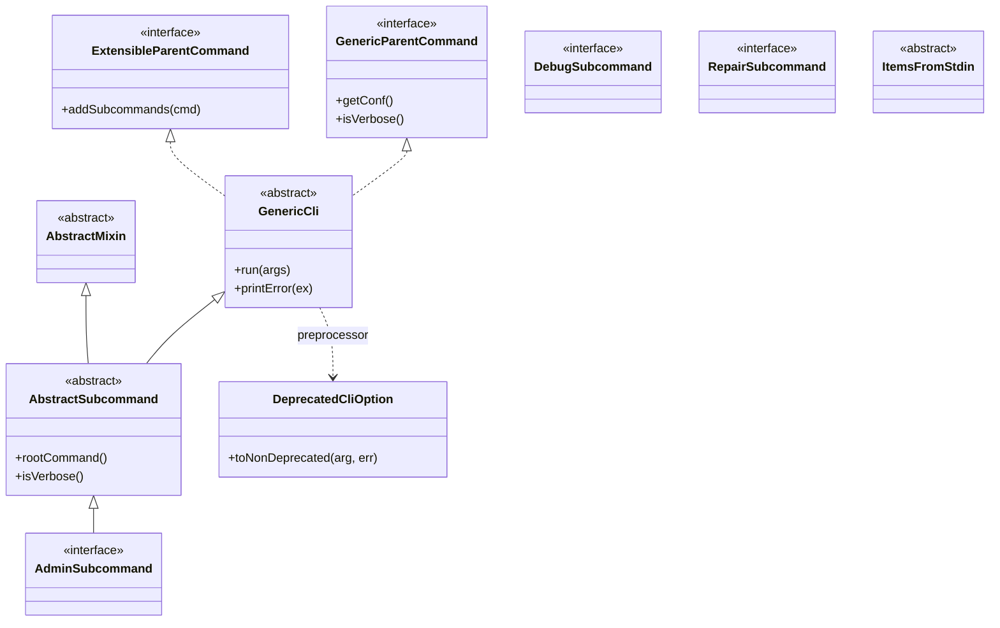

# Admin CLIs / cli-common

**Classes:** 11    **Kinds:** cli:6, abstract:3, service:2

## Overview

The `cli-common` feature group holds the shared scaffolding that every Ozone CLI tool and subcommand builds on. `GenericCli` is the abstract root for top-level commands (`OzoneAdmin`, `OzoneShell`, etc.): it wires up a `CommandLine` instance, installs the deprecated-option preprocessor, loads `OzoneConfiguration`, and handles uniform error printing with optional stack traces under `--verbose`. `ExtensibleParentCommand` and the `AdminSubcommand` / `DebugSubcommand` / `RepairSubcommand` marker interfaces let subcommands self-register via `ServiceLoader` without static imports. `DeprecatedCliOption` intercepts argument lists before parsing to rewrite old camelCase and underscore-style long options to their current names, emitting warnings without failing. `AbstractSubcommand` and `AbstractMixin` provide helpers (`isVerbose`, `rootCommand`, `printError`) that are reused across all concrete subcommands. None of these classes perform RPC or persist state.

## Diagram

## Class table

### Sub-feature: `hdds.cli`

| reading_order | fqcn | kind | logic | loc | study (min) | role |
|--:|---|---|---|--:|--:|---|
| 2549 | `org.apache.hadoop.hdds.cli.GenericCli` | abstract | mixed | 100~ | 30 | This is a generic parent class for all the ozone related cli tools. |
| 2550 | `org.apache.hadoop.hdds.cli.ItemsFromStdin` | abstract | mixed | 25~ | 30 | Parameter for specifying list of items, reading from stdin if "-" is given as first item. |
| 2551 | `org.apache.hadoop.hdds.cli.AbstractMixin` | abstract | mixed | 25~ | 30 | Base functionality for all Ozone CLI mixins. |
| 2552 | `org.apache.hadoop.hdds.cli.DeprecatedCliOption` | service | mixed | 75~ | 30 | Emits warnings when deprecated CLI option aliases are used and return the recommended replacement option. |
| 2553 | `org.apache.hadoop.hdds.cli.HddsVersionProvider` | service | mixed | 25~ | 30 | Version provider for the CLI interface. |
| 2554 | `org.apache.hadoop.hdds.cli.AbstractSubcommand` | cli | mixed | 50~ | 20 | Base functionality for all Ozone subcommands. |
| 2555 | `org.apache.hadoop.hdds.cli.DebugSubcommand` | cli | mixed | 25~ | 20 | Marker interface for subcommands to be added to OzoneDebug. |
| 2556 | `org.apache.hadoop.hdds.cli.AdminSubcommand` | cli | mixed | 25~ | 20 | Marker interface for subcommands to be added to OzoneAdmin. |
| 2557 | `org.apache.hadoop.hdds.cli.GenericParentCommand` | cli | mixed | 25~ | 20 | Interface to access the higher level parameters. |
| 2558 | `org.apache.hadoop.hdds.cli.RepairSubcommand` | cli | mixed | 25~ | 20 | Marker interface for subcommands to be added to OzoneRepair. |
| 2559 | `org.apache.hadoop.hdds.cli.ExtensibleParentCommand` | cli | mixed | 25~ | 20 | Interface for parent commands that accept subcommands to be dynamically registered. |

## Anchor details

_No logic-heavy anchors in this feature; the classes are primarily shared infrastructure / abstractions._

## Design docs

- `hadoop-hdds/docs/content/interface/Cli.md` — top-level CLI interface documentation covering the `ozone` command structure that these base classes implement.
- no dedicated design doc for the cli-common scaffolding itself under `hadoop-hdds/docs/content/` on this branch.

## Seminal JIRAs / PRs

- HDDS-14607. Create submodule hdds-cli-common
- HDDS-7956. Deprecate camelCase and under_score style long options
- HDDS-7957. Deprecate multi-char short options
- HDDS-15558. Prevent addition of deprecated style CLI options
- HDDS-15596. Hide deprecated CLI options
- HDDS-14578. Ozone admin command gives inconsistent error messages on expired keytab

## Sharp edges

- `DeprecatedCliOption.toNonDeprecated` rewrites arguments in the preprocessor hook, before picocli parses them. This means the rewritten argument appears in the effective command line but not in any usage/help output — operators using deprecated aliases will see warnings but no indication of what the correct form is unless they re-read the help.
- `GenericCli` installs `ExtensibleParentCommand.addSubcommands` in its constructor, which uses `ServiceLoader` to discover subcommands from the classpath. Subcommands missing from the fat-jar's `META-INF/services` file are silently absent with no error.

## Related features

- `components/admin-clis/admin.md` — `ozone admin` subcommands that extend `ScmSubcommand` and `AdminSubcommand` from this feature.
- `components/admin-clis/shell.md` — `ozone sh` handlers that extend `Handler` (itself built on `GenericCli` scaffolding).
- `components/admin-clis/interactive-shell.md` — wraps multiple top-level commands in a single interactive session.

## Self-quiz

1. `GenericCli` installs a preprocessor on the `CommandLine` instance. What does it do to incoming arguments, and which class implements that transformation?
2. The three marker interfaces (`AdminSubcommand`, `DebugSubcommand`, `RepairSubcommand`) carry no methods. How do concrete subcommands get discovered and registered at runtime?
3. `DeprecatedCliOption` rewrites arguments silently rather than failing. What is the user-visible side effect, and where in `GenericCli` is the rewriting triggered?
4. `AbstractSubcommand.rootCommand()` returns an instance of `GenericParentCommand`. Why is this useful for subcommands that need to print errors?
5. `ItemsFromStdin` allows `-` as the first item to signal stdin input. Which concrete subcommand in the `admin` feature uses this abstraction for multi-container or multi-datanode input?

Answers

Answer 1: The preprocessor calls `DeprecatedCliOption.toNonDeprecated` on each argument, replacing old camelCase or underscore-style long options with their canonical equivalents and printing a deprecation warning to stderr.

Answer 2: Via `ServiceLoader`. Implementations annotated or registered in `META-INF/services/org.apache.hadoop.hdds.cli.AdminSubcommand` (etc.) are discovered at runtime inside `ExtensibleParentCommand.addSubcommands`, which is called from `GenericCli`'s constructor.

Answer 3: The user sees a deprecation warning on stderr but the command still runs. The rewriting is triggered by the `cmd.getCommandSpec().preprocessor(...)` lambda installed in `GenericCli`'s constructor.

Answer 4: `rootCommand()` gives access to the top-level `GenericParentCommand`, which exposes `printError(Throwable)` and `isVerbose()` — letting subcommands route errors through a single consistent handler rather than printing directly.

Answer 5: `ContainerIDParameters` (used by `InfoSubcommand` and `ReconcileSubcommand`) and `DatanodeParameters` / `HostNameParameters` (used by decommission/maintenance subcommands) extend `ItemsFromStdin` to accept lists from stdin.

