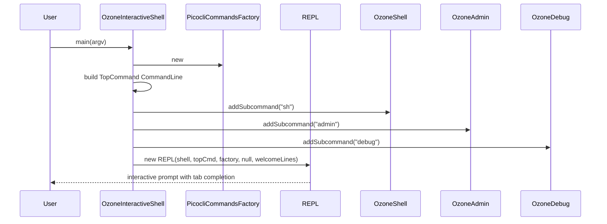

# Admin CLIs / interactive-shell

**Classes:** 1    **Kinds:** service:1

## Overview

The `interactive-shell` feature group contains a single entry-point class, `OzoneInteractiveShell`, that assembles all Ozone CLI trees into a JLine3 REPL. Its `main` method constructs a top-level `CommandLine` using `PicocliCommandsFactory`, then attaches `OzoneShell` (`sh`), `TenantShell` (`tenant`), `S3Shell` (`s3`), `OzoneAdmin` (`admin`), and `OzoneDebug` (`debug`) as subcommands. It then hands the assembled command tree to `REPL` (from the `shell` feature), which provides tab-completion, history, and the startup banner from `OzoneInteractiveWelcome`. The interactive shell is started via `ozone interactive` and reuses all the same subcommand implementations as the standalone CLI tools — no command logic is duplicated.

## Diagram

## Class table

### Sub-feature: `ozone.shell`

| reading_order | fqcn | kind | logic | loc | study (min) | role |
|--:|---|---|---|--:|--:|---|
| 2560 | `org.apache.hadoop.ozone.shell.OzoneInteractiveShell` | cli | mixed | 25~ | 30 | Interactive Shell for all Ozone commands. |

## Anchor details

_No logic-heavy anchors in this feature; `OzoneInteractiveShell` is a thin assembly class with no independent logic._

## Design docs

- no dedicated design doc under `hadoop-hdds/docs/content/` on this branch.
- `hadoop-hdds/docs/content/interface/Cli.md` — general CLI interface documentation that covers the commands surfaced by the interactive shell.

## Seminal JIRAs / PRs

- HDDS-11838. Top-level interactive shell to allow access to admin/debug/sh commands
- HDDS-15185. Create submodule ozone-cli-interactive
- HDDS-15354. Fix nested tab completion in ozone interactive
- HDDS-15368. Remove static horizontal divider from ozone interactive shell

## Sharp edges

- `OzoneInteractiveShell` builds the `CommandLine` tree with `PicocliCommandsFactory` — subcommands added after the REPL starts are not visible in tab completion because JLine3 builds the completer once at `REPL` construction time.

## Related features

- `components/admin-clis/shell.md` — the `OzoneShell` (`sh`) command tree that the interactive shell includes.
- `components/admin-clis/admin.md` — the `OzoneAdmin` (`admin`) command tree included in the interactive shell.
- `components/admin-clis/cli-common.md` — `REPL`, `OzoneInteractiveWelcome`, and `Shell` base classes used by this feature.

## Self-quiz

1. `OzoneInteractiveShell.main` attaches five top-level subcommand trees. Name each one and the short name it is registered under.
2. What class provides the tab-completion and history functionality in the interactive shell, and where is it constructed?
3. `OzoneInteractiveShell` creates a `Shell` anonymous subclass. What two methods does it override, and what does each return?
4. The interactive shell reuses the same subcommand classes as the standalone tools. What does this mean for state held in a subcommand instance between invocations in the same REPL session?
5. Which JIRA introduced the interactive shell feature, and which introduced it into its own submodule?

Answers

Answer 1: `OzoneShell` as `sh`, `TenantShell` as `tenant`, `S3Shell` as `s3`, `OzoneAdmin` as `admin`, `OzoneDebug` as `debug`.

Answer 2: `REPL` (from the `shell` feature). It is constructed as the last statement of `OzoneInteractiveShell.main`, receiving the assembled `topCmd` and the welcome lines.

Answer 3: `name()` returns `"ozone"` (used as the shell name / prompt prefix) and `interactiveWelcomeLines()` returns `OzoneInteractiveWelcome.lines()`.

Answer 4: Picocli reuses the same command instances across invocations within the REPL session, so any instance fields set during one invocation persist into the next unless the command explicitly resets them.

Answer 5: HDDS-11838 introduced the top-level interactive shell. HDDS-15185 moved it into its own submodule `ozone-cli-interactive`.

