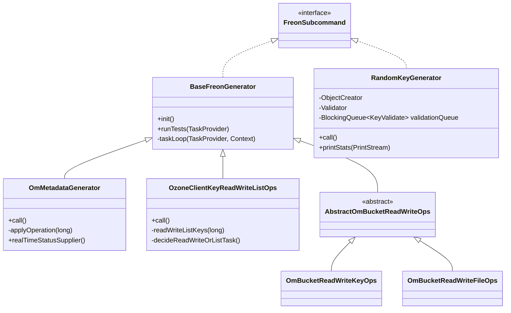

# Bench &amp; Insight / freon

**Classes:** 42    **Kinds:** service:34, cli:6, abstract:2

## Overview

Freon is Ozone's primary load-generation and benchmarking framework. Every subcommand registers itself via `FreonSubcommand` (a `@MetaInfServices` marker) and is discovered at startup by `Freon`, the picocli top-level command. All modern subcommands extend `BaseFreonGenerator`, which wires a fixed thread pool, an `AtomicLong` counter, a `ProgressBar`, and a Codahale `MetricRegistry` together; the subclass supplies a single `TaskProvider` lambda to `runTests()`. `RandomKeyGenerator` is the oldest subcommand and pre-dates `BaseFreonGenerator`: it owns its own executor loop, tracks histogram latencies for volume/bucket/key operations, and optionally posts completed keys onto a `LinkedBlockingQueue<KeyValidate>` for background MD5 verification. `OmMetadataGenerator` (subcommand `ommg`) extends `BaseFreonGenerator` and drives OM directly via `OzoneManagerProtocol`, exercising CREATE/READ/LOOKUP/LIST/HEAD operations and optionally routing reads to OM followers. `OzoneClientKeyReadWriteListOps` blends reads, writes, and list calls in configurable percentage splits, with each thread backed by its own `OzoneClient` instance.

## Class table

### Sub-feature: `ozone.freon`

| reading_order | fqcn | kind | logic | loc | study (min) | role |
|--:|---|---|---|--:|--:|---|
| 1384 | `org.apache.hadoop.ozone.freon.AbstractOmBucketReadWriteOps` | abstract | mixed | 150~ | 45 | Abstract class for OmBucketReadWriteFileOps/KeyOps Freon class implementations. |
| 1385 | `org.apache.hadoop.ozone.freon.HadoopBaseFreonGenerator` | abstract | mixed | 50~ | 30 | Base class for Freon generator tests that requires  FileSystem instance. |
| 1386 | `org.apache.hadoop.ozone.freon.RandomKeyGenerator` | cli | logic-heavy | 975~ | 60 | inferred(from-md): Data generator tool to generate as much keys as possible. |
| 1387 | `org.apache.hadoop.ozone.freon.OmMetadataGenerator` | cli | logic-heavy | 425~ | 60 | Data generator tool test om performance. |
| 1388 | `org.apache.hadoop.ozone.freon.BaseFreonGenerator` | service | logic-heavy | 400~ | 60 | inferred(from-md): Base class for simplified performance tests. |
| 1389 | `org.apache.hadoop.ozone.freon.OzoneClientKeyReadWriteListOps` | service | logic-heavy | 200~ | 45 | Ozone key generator/reader for performance test. |
| 1390 | `org.apache.hadoop.ozone.freon.DNRPCLoadGenerator` | cli | mixed | 125~ | 30 | Utility to generate RPC request to DN. |
| 1391 | `org.apache.hadoop.ozone.freon.HadoopDirTreeGenerator` | cli | mixed | 125~ | 30 | inferred: HadoopDirTreeGenerator — role not documented. |
| 1392 | `org.apache.hadoop.ozone.freon.DatanodeChunkValidator` | cli | mixed | 125~ | 30 | Data validator of chunks to use pure datanode XCeiver interface. |
| 1393 | `org.apache.hadoop.ozone.freon.ProgressBar` | service | mixed | 125~ | 30 | Creates and runs a ProgressBar in new Thread which gets printed on the provided PrintStream. |
| 1394 | `org.apache.hadoop.ozone.freon.OzoneClientKeyGenerator` | cli | mixed | 100~ | 30 | Data generator tool test om performance. |
| 1395 | `org.apache.hadoop.ozone.freon.RangeKeysGenerator` | service | mixed | 100~ | 30 | Ozone range keys generator for performance test. |
| 1396 | `org.apache.hadoop.ozone.freon.OzoneClientKeyValidator` | cli | mixed | 100~ | 30 | Data generator tool test om performance. |
| 1397 | `org.apache.hadoop.ozone.freon.HsyncGenerator` | cli | mixed | 100~ | 30 | Data generator tool test hsync/write synchronization performance. |
| 1398 | `org.apache.hadoop.ozone.freon.OmKeyGenerator` | cli | mixed | 75~ | 30 | Data generator tool test om performance. |
| 1399 | `org.apache.hadoop.ozone.freon.OmRPCLoadGenerator` | cli | mixed | 75~ | 30 | Utility to generate RPC request to OM with or without payload. |
| 1400 | `org.apache.hadoop.ozone.freon.ContentGenerator` | service | mixed | 75~ | 30 | inferred: ContentGenerator — role not documented. |
| 1401 | `org.apache.hadoop.ozone.freon.OzoneClientKeyListReader` | cli | mixed | 75~ | 30 | inferred: OzoneClientKeyListReader — role not documented. |
| 1402 | `org.apache.hadoop.ozone.freon.S3KeyGenerator` | cli | mixed | 75~ | 30 | inferred: S3KeyGenerator — role not documented. |
| 1403 | `org.apache.hadoop.ozone.freon.FollowerReader` | cli | mixed | 50~ | 30 | Data generator tool test om performance. |
| 1404 | `org.apache.hadoop.ozone.freon.FreonHttpServer` | service | mixed | 50~ | 30 | Http server to provide metrics + profile endpoint. |
| 1405 | `org.apache.hadoop.ozone.freon.HadoopFsValidator` | cli | mixed | 50~ | 30 | Data generator tool test om performance. |
| 1406 | `org.apache.hadoop.ozone.freon.OmBucketRemover` | cli | mixed | 50~ | 30 | Data generator tool test om performance. |
| 1407 | `org.apache.hadoop.ozone.freon.OmBucketGenerator` | cli | mixed | 50~ | 30 | Data generator tool test om performance. |
| 1408 | `org.apache.hadoop.ozone.freon.HadoopNestedDirGenerator` | cli | mixed | 50~ | 30 | inferred: HadoopNestedDirGenerator — role not documented. |
| 1409 | `org.apache.hadoop.ozone.freon.HadoopFsGenerator` | cli | mixed | 50~ | 30 | Data generator tool test om performance. |
| 1410 | `org.apache.hadoop.ozone.freon.OzoneClientKeyRemover` | cli | mixed | 50~ | 30 | Data remover tool test om performance. |
| 1411 | `org.apache.hadoop.ozone.freon.PathSchema` | service | mixed | 25~ | 30 | Class to generate the path based on a counter. |
| 1412 | `org.apache.hadoop.ozone.freon.OzoneClientCreator` | service | mixed | 25~ | 30 | Creates and closes Ozone clients. |
| 1413 | `org.apache.hadoop.ozone.freon.StorageSizeConverter` | service | mixed | 25~ | 30 | A Picocli custom converter for parsing command line string values into StorageSize objects. |
| 1414 | `org.apache.hadoop.ozone.freon.S3BucketGenerator` | cli | mixed | 25~ | 30 | Generate buckets via the s3 interface. |
| 1415 | `org.apache.hadoop.ozone.freon.FreonReplicationOptions` | service | mixed | 25~ | 30 | Options for specifying replication config for Freon. |
| 1416 | `org.apache.hadoop.ozone.freon.S3EntityGenerator` | service | mixed | 25~ | 30 | Initiliazing common aspects of S3BucketGenerator and S3KeyGenerator. |
| 1417 | `org.apache.hadoop.ozone.freon.FreonS3TraceContextRequestHandler` | service | mixed | 25~ | 30 | Adds W3C trace context headers to each outgoing S3 request so the S3 Gateway can attach its spans to the Freon task s... |
| 1418 | `org.apache.hadoop.ozone.freon.SameKeyReader` | cli | mixed | 25~ | 30 | Data generator tool test om performance. |
| 1419 | `org.apache.hadoop.ozone.freon.KeyGeneratorUtil` | service | mixed | 25~ | 30 | Utility class to generate key name from a given key index. |
| 1420 | `org.apache.hadoop.ozone.freon.DatanodeChunkGenerator` | cli | mixed | 175~ | 20 | inferred: DatanodeChunkGenerator — role not documented. |
| 1421 | `org.apache.hadoop.ozone.freon.DatanodeBlockPutter` | cli | mixed | 100~ | 20 | inferred: DatanodeBlockPutter — role not documented. |
| 1422 | `org.apache.hadoop.ozone.freon.OmBucketReadWriteKeyOps` | cli | mixed | 75~ | 20 | inferred: OmBucketReadWriteKeyOps — role not documented. |
| 1423 | `org.apache.hadoop.ozone.freon.Freon` | cli | mixed | 50~ | 20 | Ozone data generator and performance test tool. |
| 1424 | `org.apache.hadoop.ozone.freon.OmBucketReadWriteFileOps` | cli | mixed | 50~ | 20 | inferred: OmBucketReadWriteFileOps — role not documented. |
| 1425 | `org.apache.hadoop.ozone.freon.FreonSubcommand` | cli | mixed | 25~ | 20 | Marker interface for subcommands to be registered for ozone freon. |

## Diagram

## Anchor details

### `RandomKeyGenerator`

- **path:** `hadoop-ozone/freon/src/main/java/org/apache/hadoop/ozone/freon/RandomKeyGenerator.java`
- **loc:** 975~    **difficulty:** 5    **study:** 60 min    **concurrency:** thread-safe    **persistence:** in-memory
- **entry points:** `init`, `call`, `run`
- **key collaborators:** `org.apache.hadoop.hdds.HddsConfigKeys`, `org.apache.hadoop.hdds.StringUtils`, `org.apache.hadoop.hdds.cli.HddsVersionProvider`, `org.apache.hadoop.hdds.client.ReplicationConfig`, `org.apache.hadoop.hdds.conf.OzoneConfiguration`, `org.apache.hadoop.hdds.conf.StorageSize`
- **test exemplar:** `hadoop-ozone/integration-test/src/test/java/org/apache/hadoop/ozone/freon/TestRandomKeyGenerator.java`
- **role:** Data generator tool to generate as much keys as possible.
- The inner `ObjectCreator.createObjects()` method serializes creation order: all volumes first, then all buckets, then all keys, using `AtomicInteger`/`AtomicLong` counters so multiple threads partition the work. The critical subtlety is `waitUntilAddedToMap()`: a key-creating thread that races ahead of bucket creation spins with a 10 ms sleep until the bucket appears in the `ConcurrentHashMap`, causing silent latency spikes if buckets are slow to materialize.

### `OmMetadataGenerator`

- **path:** `hadoop-ozone/freon/src/main/java/org/apache/hadoop/ozone/freon/OmMetadataGenerator.java`
- **loc:** 425~    **difficulty:** 5    **study:** 60 min    **concurrency:** single-threaded    **persistence:** in-memory
- **entry points:** `call`
- **key collaborators:** `org.apache.hadoop.hdds.cli.HddsVersionProvider`, `org.apache.hadoop.hdds.client.ReplicationConfig`, `org.apache.hadoop.hdds.conf.OzoneConfiguration`, `org.apache.hadoop.hdds.conf.StorageSize`, `org.apache.hadoop.hdds.utils.IOUtils`, `org.apache.hadoop.ozone.client.OzoneClient`
- **role:** Data generator tool test om performance.
- The `MIXED` operation mode assigns an `Operation[]` array (built in `initMixedOperation()`) so that each worker thread with a given `threadSequenceId` always executes the same operation type — enabling steady per-operation concurrency ratios. The follower-affinity path (`--enable-follower-read-affinity`) reaches into `Hadoop3OmTransport.getOmFollowerReadFailoverProxyProvider()` and calls the `@VisibleForTesting` method `changeInitialProxyForTest()`, making it fragile if the transport implementation changes.

### `BaseFreonGenerator`

- **path:** `hadoop-ozone/freon/src/main/java/org/apache/hadoop/ozone/freon/BaseFreonGenerator.java`
- **loc:** 400~    **difficulty:** 5    **study:** 60 min    **concurrency:** actor/queue    **persistence:** in-memory
- **entry points:** `init`
- **key collaborators:** `org.apache.hadoop.hdds.conf.OzoneConfiguration`, `org.apache.hadoop.hdds.conf.TimeDurationUtil`, `org.apache.hadoop.hdds.scm.pipeline.Pipeline`, `org.apache.hadoop.hdds.scm.protocol.StorageContainerLocationProtocol`, `org.apache.hadoop.hdds.tracing.TracingUtil`, `org.apache.hadoop.hdds.utils.HAUtils`
- **role:** Base class for simplified performance tests.
- `runTests()` is the sole entry point subclasses call; it chains `setup()`, `startTaskRunners()`, `waitForCompletion()`, `shutdown()`, and `reportAnyFailure()`. The time-based mode (`--duration`) replaces the `testNo` ceiling with a wall-clock check inside each task-loop iteration, and the `ProgressBar` supplier switches from `successCounter + failureCounter` to elapsed seconds. The `prefix` field supports double-underscore environment variable interpolation (e.g. `__MY_VAR__`) via `resolvePrefix()`, intended for multi-node runs where each host must generate distinct object names.

### `OzoneClientKeyReadWriteListOps`

- **path:** `hadoop-ozone/freon/src/main/java/org/apache/hadoop/ozone/freon/OzoneClientKeyReadWriteListOps.java`
- **loc:** 200~    **difficulty:** 4    **study:** 45 min    **concurrency:** single-threaded    **persistence:** in-memory
- **entry points:** `call`
- **key collaborators:** `org.apache.hadoop.hdds.cli.HddsVersionProvider`, `org.apache.hadoop.hdds.conf.OzoneConfiguration`, `org.apache.hadoop.ozone.client.OzoneClient`, `org.apache.hadoop.ozone.client.OzoneKeyDetails`
- **role:** Ozone key generator/reader for performance test.
- `decideReadWriteOrListTask()` draws a uniform random integer in `[1, 100]` and compares against `percentageRead` and `percentageRead + percentageList` thresholds, so the default (both zero) always issues write tasks. Key names are either MD5-scrambled (via `KeyGeneratorUtil.generateMd5KeyName()`) to spread them lexicographically, or lexically contiguous with `--contiguous`, which changes hotspot behaviour on OM prefix scans significantly.

## Design docs

- `hadoop-hdds/docs/content/design/distributed-tracing-OpenTelemetry.md` — covers the OpenTelemetry tracing integration that Freon exercises via `TracingUtil` and `FreonS3TraceContextRequestHandler`.
- `hadoop-hdds/docs/content/design/s3-performance.md` — S3 Gateway performance design, directly relevant to the `S3KeyGenerator` and `S3BucketGenerator` subcommands.
- no dedicated Freon design doc under `hadoop-hdds/docs/content/` on this branch.

## Seminal JIRAs / PRs

- HDDS-14771. Split server-side load testers from freon (created the vapor submodule).
- HDDS-14447. Support multiple clients in OmMetadataGenerator.
- HDDS-15586. Add freon command to read a user-supplied list of existing keys (added OzoneClientKeyListReader).
- HDDS-15653. RandomKeyGenerator should reject negative inputs (input validation hardening).
- HDDS-14814. Unify fragmented traces for Freon randomkeys command.
- HDDS-9279. Basic implementation of OM Follower read (added follower-affinity support to OmMetadataGenerator).
- HDDS-2453. Add Freon tests for S3 MPU Keys.

## Sharp edges

- `RandomKeyGenerator.waitUntilAddedToMap()` (`RandomKeyGenerator.java:986`) spins with `Thread.sleep(10)` when a key-writer thread outpaces the bucket-creator threads. If bucket creation fails silently, the spin never terminates and the run hangs indefinitely with no timeout.
- `OmMetadataGenerator` LIST_KEYS and LIST_STATUS operations throw `NoSuchFileException` if fewer objects exist than `batchSize * threadCount`, but this manifests as a Freon `failureCounter` increment rather than a clear diagnostic message — users must read the log to distinguish a setup error from a real OM regression.
- `OzoneClientKeyReadWriteListOps` creates one `OzoneClient` per thread in `call()` but the per-client close loop uses index-based `null` guards; if `createOzoneClient()` throws mid-loop, already-opened clients in `ozoneClients[0..i-1]` are closed by the `finally` block but the exception is not wrapped with the index, making connection-limit errors hard to trace.

## Related features

- `components/bench-insight/vapor.md` — SCM/datanode-level benchmarks split from freon by HDDS-14771.
- `components/bench-insight/insight.md` — runtime observability tool for the same Ozone services Freon exercises.
- `components/bench-insight/ozone-tools.md` — `ozone local` single-node cluster useful for running Freon locally.
- `components/S3 Gateway/s3gateway.md` — S3 Gateway layer targeted by `S3KeyGenerator` and `S3BucketGenerator`.
- `components/Ozone Manager/om-request.md` — OM request handling layer under load from `OmMetadataGenerator`.

## Self-quiz

1. `BaseFreonGenerator.runTests()` calls `startTaskRunners()` which submits `taskLoop()` lambdas to the thread pool. Which method in `BaseFreonGenerator` is the single extension point a subclass must supply, and what is its functional interface name?
2. `RandomKeyGenerator` maintains a `BlockingQueue<KeyValidate>` for write validation. Under what condition does the `Validator` runnable (`RandomKeyGenerator.java:1264`) exit its loop, and why could a write-validation hang occur if the main thread sets `completed = true` before all items are drained?
3. `OmMetadataGenerator.initMixedOperation()` validates that the sum of `--opsnum` values equals `--threads`. What exception is thrown if they differ, and at which call site?
4. `OzoneClientKeyReadWriteListOps.getKeyName()` has two modes controlled by `--linear`. Describe how each mode selects the key index and what the `--contiguous` flag additionally changes about the key name format.
5. `BaseFreonGenerator.resolvePrefix()` supports environment variable interpolation. Give the exact regex pattern it uses and explain why it matters for multi-node freon runs.

Answers

Answer 1: The extension point is `TaskProvider.executeNextTask(long step)` — a `@FunctionalInterface` defined inside `BaseFreonGenerator`. The subclass passes a lambda (or method reference) for this to `runTests()`.

Answer 2: The `Validator` exits when `completed && validationQueue.isEmpty()`. If the main thread sets `completed = true` just before a writer enqueues the last item, the `Validator` may observe `completed=true` and an empty queue in the same check iteration, draining one item short. In practice `validationQueue.poll(5, SECONDS)` would time out and loop back to re-check, so the hang scenario requires the writer to enqueue after the validator's final `isEmpty()` check — a narrow race.

Answer 3: `IllegalArgumentException` is thrown inside `initMixedOperation()` at the line: `if (ops.size() != opsNum.size() || opsNum.stream().mapToInt(x -> x).sum() != getThreadNo())`.

Answer 4: In `--linear` mode, `NEXT_NUMBER.getAndUpdate(x -> (x + 1) % range)` increments atomically within `[0, range)` starting from `startIndex`. In the default random mode, `ThreadLocalRandom.current().nextLong(startIndex, startIndex + range)` draws uniformly. The `--contiguous` flag changes the key name from `prefix/md5(index)` to `prefix/index`, removing hash-based lexicographic scattering.

Answer 5: The pattern is `__(.+?)__` (see `BaseFreonGenerator.java:87`). It replaces tokens like `__HOSTNAME__` with the matching environment variable value, allowing each physical machine in a distributed freon run to generate distinct object name prefixes without a shared coordinator.

