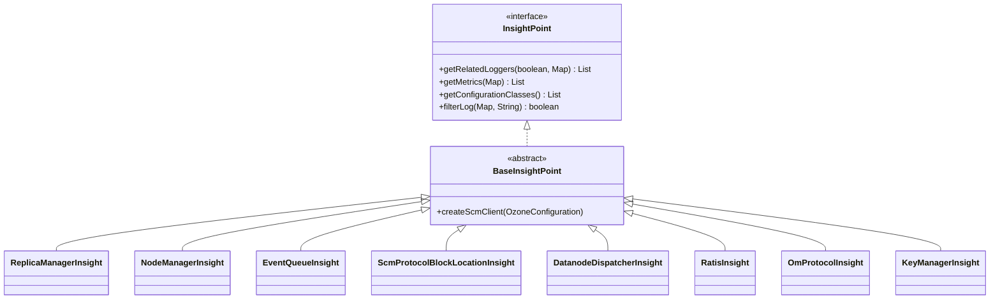

# Bench &amp; Insight / insight

**Classes:** 25    **Kinds:** service:16, cli:4, data:2, interface:1, abstract:1, metrics:1

## Overview

Insight is a CLI observability tool (`ozone insight`) that surfaces live logs, metrics, and configuration values from running Ozone services without requiring direct access to service JVMs. The central abstraction is `InsightPoint`, an interface whose implementations (one per observable subsystem) declare which loggers, metrics, and configuration classes are relevant. `BaseInsightPoint` provides default empty implementations so concrete subclasses only override what they expose. The three CLI entry points (`LogSubcommand`, `MetricsSubCommand`, `ConfigurationSubCommand`) each resolve an `InsightPoint` by name, then use `InsightHttpUtils` to make SPNEGO-authenticated HTTP calls to the service's web server — setting log levels via the Log4j servlet endpoint for `log`, scraping the Prometheus/Codahale metrics endpoint for `metrics`, and fetching the configuration endpoint for `config`. Component-specific insight classes (`ReplicaManagerInsight`, `DatanodeDispatcherInsight`, `OmProtocolInsight`, etc.) encode the exact logger names and metric group names for their subsystem, serving as living documentation of what is observable in each service.

## Class table

### Sub-feature: `insight.datanode`

| reading_order | fqcn | kind | logic | loc | study (min) | role |
|--:|---|---|---|--:|--:|---|
| 2696 | `org.apache.hadoop.ozone.insight.datanode.DatanodeDispatcherInsight` | service | mixed | 50~ | 30 | Insight definition for HddsDispatcher. |
| 2697 | `org.apache.hadoop.ozone.insight.datanode.PipelineComponentUtil` | service | mixed | 25~ | 30 | Utilities to handle pipelines. |
| 2698 | `org.apache.hadoop.ozone.insight.datanode.RatisInsight` | service | mixed | 25~ | 30 | Insight definition for datanode/pipeline metrics. |

### Sub-feature: `insight.om`

| reading_order | fqcn | kind | logic | loc | study (min) | role |
|--:|---|---|---|--:|--:|---|
| 2699 | `org.apache.hadoop.ozone.insight.om.KeyManagerInsight` | service | mixed | 50~ | 30 | Insight implementation for the key management related operations. |
| 2700 | `org.apache.hadoop.ozone.insight.om.OmProtocolInsight` | service | mixed | 25~ | 30 | Insight definition for the OM RPC server. |

### Sub-feature: `insight.scm`

| reading_order | fqcn | kind | logic | loc | study (min) | role |
|--:|---|---|---|--:|--:|---|
| 2701 | `org.apache.hadoop.ozone.insight.scm.ReplicaManagerInsight` | service | mixed | 150~ | 45 | Insight definition to check the replication manager internal state. |
| 2702 | `org.apache.hadoop.ozone.insight.scm.NodeManagerInsight` | service | mixed | 50~ | 30 | Insight definition to check node manager / node report events. |
| 2703 | `org.apache.hadoop.ozone.insight.scm.ScmProtocolSecurityInsight` | service | mixed | 25~ | 30 | Insight metric to check the SCM block location protocol behaviour. |
| 2704 | `org.apache.hadoop.ozone.insight.scm.ScmProtocolContainerLocationInsight` | service | mixed | 25~ | 30 | Insight metric to check the SCM block location protocol behaviour. |
| 2705 | `org.apache.hadoop.ozone.insight.scm.ScmProtocolDatanodeInsight` | service | mixed | 25~ | 30 | Insight metric to check the SCM datanode protocol behaviour. |
| 2706 | `org.apache.hadoop.ozone.insight.scm.ScmProtocolBlockLocationInsight` | service | mixed | 25~ | 30 | Insight metric to check the SCM block location protocol behaviour. |
| 2707 | `org.apache.hadoop.ozone.insight.scm.EventQueueInsight` | service | mixed | 25~ | 30 | Insight definition to check internal events. |

### Sub-feature: `ozone.insight`

| reading_order | fqcn | kind | logic | loc | study (min) | role |
|--:|---|---|---|--:|--:|---|
| 2708 | `org.apache.hadoop.ozone.insight.InsightPoint` | interface | mixed | 25~ | 20 | Definition of a specific insight points. |
| 2709 | `org.apache.hadoop.ozone.insight.BaseInsightPoint` | abstract | mixed | 100~ | 30 | Default implementation of Insight point logic. |
| 2710 | `org.apache.hadoop.ozone.insight.InsightHttpUtils` | service | mixed | 50~ | 30 | Utility class for making HTTP/HTTPS calls with SPNEGO authentication support. |
| 2711 | `org.apache.hadoop.ozone.insight.Insight` | service | mixed | 25~ | 30 | Command line utility to check logs/metrics of internal ozone components. |
| 2712 | `org.apache.hadoop.ozone.insight.MetricGroupDisplay` | service | mixed | 25~ | 30 | Definition of a group of metrics which can be displayed. |
| 2713 | `org.apache.hadoop.ozone.insight.MetricDisplay` | service | mixed | 25~ | 30 | Definition of one displayable hadoop metrics. |
| 2714 | `org.apache.hadoop.ozone.insight.LogSubcommand` | cli | mixed | 125~ | 20 | Subcommand to display log. |
| 2715 | `org.apache.hadoop.ozone.insight.BaseInsightSubCommand` | cli | mixed | 100~ | 20 | Parent class for all the insight subcommands. |
| 2716 | `org.apache.hadoop.ozone.insight.Component` | service | mixed | 50~ | 10 | Identifier an ozone component. |
| 2717 | `org.apache.hadoop.ozone.insight.ConfigurationSubCommand` | cli | mixed | 50~ | 20 | Subcommand to show configuration values/documentation. |
| 2718 | `org.apache.hadoop.ozone.insight.ListSubCommand` | cli | mixed | 25~ | 20 | Subcommand to list of the available insight points. |
| 2719 | `org.apache.hadoop.ozone.insight.LoggerSource` | service | mixed | 25~ | 10 | Definition of a log source. |
| 2720 | `org.apache.hadoop.ozone.insight.MetricsSubCommand` | metrics | mixed | 75~ | 20 | Command line interface to show metrics for a specific component. |

## Diagram

## Anchor details

_No logic-heavy anchors in this feature; the classes are primarily data / dto / config / cli._

## Design docs

- no dedicated design doc under `hadoop-hdds/docs/content/` on this branch for the insight CLI tool.
- `hadoop-hdds/docs/content/design/distributed-tracing-OpenTelemetry.md` — adjacent observability context; the insight tool complements tracing by exposing live log streams.

## Seminal JIRAs / PRs

- HDDS-9883. Support HTTPS with ozone insight command (added `InsightHttpUtils` SPNEGO support, HDDS-13883 in log).
- HDDS-12274. Fix license headers and imports for ozone-insight.
- HDDS-12848. Create new submodule for ozone admin (separated insight from admin submodule).
- HDDS-13199. Remove DatanodeDetails#getUuid and DatanodeID#getUuid methods (touched vapor/insight).
- HDDS-14607. Create submodule hdds-cli-common (refactored CLI base classes used by insight).

## Sharp edges

- `LogSubcommand` sets logger levels on the remote service via the web endpoint and registers a JVM shutdown hook to reset them back to `INFO`. If the process is killed with `kill -9`, the elevated log level remains active on the remote service indefinitely — there is no server-side TTL.
- `InsightHttpUtils` uses the service's HTTP/HTTPS address from `ozone-site.xml`. In a Kerberos-secured cluster the SPNEGO negotiation requires a valid TGT; if the calling user's ticket has expired, all `ozone insight` subcommands fail with an opaque `401` rather than a credential expiry message.

## Related features

- `components/bench-insight/freon.md` — Freon generates load that insight is used to observe.
- `components/bench-insight/ozone-tools.md` — `ozone local` is a convenient target for running insight locally.
- `components/Ozone Manager/om-request.md` — `OmProtocolInsight` and `KeyManagerInsight` expose OM internals.
- `components/SCM/scm-replication.md` — `ReplicaManagerInsight` and `NodeManagerInsight` expose SCM replication state.

## Self-quiz

1. `InsightPoint` declares `filterLog(Map<String, String> filters, String logLine)`. Which class provides the default implementation returning `true` for all lines, and which subcommand calls it to decide whether to print a streamed log line?
2. `LogSubcommand.call()` calls `setLogLevels()` twice. Explain the purpose of each call and what the shutdown hook guarantees.
3. `BaseInsightPoint.createScmClient()` throws `IllegalArgumentException` if a specific config key is absent. Name the key and explain why this check exists at the insight layer rather than inside SCM.
4. `ReplicaManagerInsight` is the largest insight point implementation. What kind of information does it expose (metrics vs. loggers vs. config), and which Ozone service does it connect to?
5. `MetricsSubCommand` scrapes metrics from a service's web endpoint. Why does the insight tool use HTTP rather than JMX or Prometheus scraping directly, and what does `InsightHttpUtils` add over a plain HTTP client?

Answers

Answer 1: `BaseInsightPoint` provides `filterLog()` returning `true` by default. `LogSubcommand.streamLog()` passes `insight.filterLog(filters, logLine)` as the `Predicate<String>` to decide which log lines to print to stdout.

Answer 2: The first `setLogLevels()` call (before streaming starts) raises the target loggers to the requested level so the service emits more detail. The shutdown hook's second call resets them back to `INFO`, ensuring that stopping `ozone insight log` does not permanently leave the remote service in verbose mode.

Answer 3: The key is `ScmConfigKeys.OZONE_SCM_CLIENT_ADDRESS_KEY`. The check exists at the insight layer because insight resolves service addresses from config at the CLI level to build HTTP URLs; SCM itself would never receive the call if the address is missing, so the validation must happen client-side.

Answer 4: `ReplicaManagerInsight` exposes SCM replication manager metrics (via `getMetrics()`) and related loggers (via `getRelatedLoggers()`). It connects to the SCM service. It targets the ReplicationManager subsystem, which tracks container under/over-replication.

Answer 5: Ozone services expose their metrics and log endpoints over HTTP (the same web UI endpoints used by the browser). Using HTTP avoids opening additional JMX or Prometheus ports. `InsightHttpUtils` adds SPNEGO (Kerberos) authentication so the CLI can call secured cluster endpoints without manual token management.

