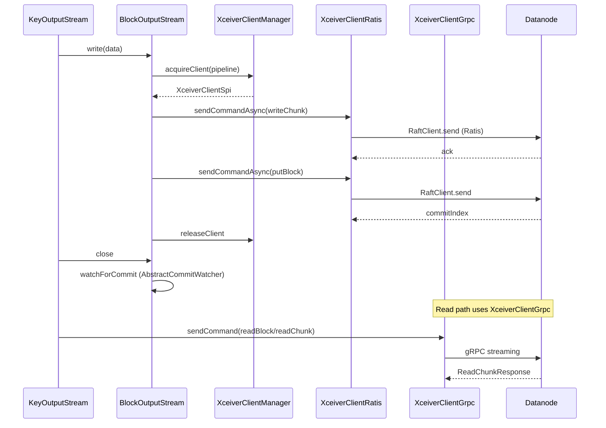

# Client / hdds-client

**Classes:** 50    **Kinds:** service:30, factory:6, abstract:5, interface:4, metrics:2, exception:2, config:1

## Overview

The `hdds-client` feature contains the transport and I/O primitives the Ozone client uses to communicate directly with datanodes. On the write side, `BlockOutputStream` buffers data in a `BufferPool`, issues async `writeChunk` and `putBlock` gRPC calls, and tracks pending acknowledgements via `AbstractCommitWatcher`; `BlockDataStreamOutput` provides a parallel path using Ratis DataStream for lower-copy streaming writes. On the read side, `BlockInputStream` fetches block metadata via `GetBlock`, then delegates per-chunk reads to `ChunkInputStream`; `StreamBlockInputStream` uses a gRPC server-side streaming call (`ReadBlock`) for sequential reads with flow-control. The three `XceiverClientSpi` implementations — `XceiverClientRatis` (Raft consensus writes), `XceiverClientGrpc` (standalone gRPC), and `XceiverClientShortCircuit` (UNIX domain socket local reads) — are created and cached by `XceiverClientManager`, which evicts stale connections by time. The EC sub-tree mirrors this structure: `ECBlockOutputStream` writes one stripe cell per call, and `ECBlockReconstructedStripeInputStream` reconstructs missing data blocks from parity cells using a `RawErasureDecoder`.

## Diagram

## Class table

### Sub-feature: `xceiver-clients`

| reading_order | fqcn | kind | logic | loc | study (min) | role |
|--:|---|---|---|--:|--:|---|
| 84 | `org.apache.hadoop.hdds.scm.XceiverClientGrpc` | service | logic-heavy | 575~ | 60 | XceiverClientSpi implementation, the standalone client. |
| 85 | `org.apache.hadoop.hdds.scm.XceiverClientShortCircuit` | service | logic-heavy | 475~ | 60 | XceiverClientSpi implementation, the client to read local replica through short circuit. |
| 86 | `org.apache.hadoop.hdds.scm.XceiverClientRatis` | service | logic-heavy | 275~ | 45 | An abstract implementation of XceiverClientSpi using Ratis. |
| 87 | `org.apache.hadoop.hdds.scm.XceiverClientManager` | service | logic-heavy | 225~ | 45 | XceiverClientManager is responsible for the lifecycle of XceiverClient instances. |
| 88 | `org.apache.hadoop.hdds.scm.XceiverClientCreator` | service | mixed | 100~ | 30 | Factory for XceiverClientSpi implementations. |
| 89 | `org.apache.hadoop.hdds.scm.StreamBufferArgs` | service | mixed | 75~ | 30 | This class encapsulates the arguments that are required for Ozone client StreamBuffer. |
| 90 | `org.apache.hadoop.hdds.scm.ErrorInjector` | interface | mixed | 25~ | 30 | Client side error injector allowing simulating receiving errors from server side. |
| 91 | `org.apache.hadoop.hdds.scm.XceiverClientFactory` | factory | mixed | 25~ | 20 | Interface to provide XceiverClient when needed. |
| 92 | `org.apache.hadoop.hdds.scm.ContainerClientMetrics` | metrics | logic-heavy | 250~ | 20 | Container client metrics that describe how data writes are distributed to pipelines. |
| 93 | `org.apache.hadoop.hdds.scm.XceiverClientMetrics` | metrics | mixed | 100~ | 20 | The client metrics for the Storage Container protocol. |

### Sub-feature: `write-streams`

| reading_order | fqcn | kind | logic | loc | study (min) | role |
|--:|---|---|---|--:|--:|---|
| 94 | `org.apache.hadoop.hdds.scm.storage.AbstractCommitWatcher` | abstract | mixed | 100~ | 30 | This class executes watchForCommit on ratis pipeline and releases buffers once data successfully gets replicated. |
| 95 | `org.apache.hadoop.hdds.scm.storage.AbstractDataStreamOutput` | abstract | mixed | 75~ | 30 | This class is used for error handling methods. |
| 96 | `org.apache.hadoop.ozone.client.io.ByteBufferOutputStream` | abstract | mixed | 25~ | 30 | A ByteBufferStreamOutput supporting OutputStream. |
| 97 | `org.apache.hadoop.hdds.scm.storage.BlockOutputStream` | service | logic-heavy | 875~ | 60 | An OutputStream used by the REST service in combination with the SCMClient to write the value of a key to a sequence... |
| 98 | `org.apache.hadoop.hdds.scm.storage.BlockDataStreamOutput` | service | logic-heavy | 525~ | 60 | An ByteBufferStreamOutput used by the REST service in combination with the SCMClient to write the value of a key to a... |
| 99 | `org.apache.hadoop.hdds.scm.storage.BufferPool` | service | mixed | 150~ | 45 | A bounded pool implementation that provides ChunkBuffers. |
| 100 | `org.apache.hadoop.hdds.scm.storage.RatisBlockOutputStream` | service | mixed | 50~ | 30 | An OutputStream used by the REST service in combination with the SCMClient to write the value of a key to a sequence... |
| 101 | `org.apache.hadoop.hdds.scm.storage.CommitWatcher` | service | mixed | 25~ | 30 | This class maintains the map of the commitIndexes to be watched for successful replication in the datanodes in a give... |
| 102 | `org.apache.hadoop.hdds.scm.storage.StreamCommitWatcher` | service | mixed | 25~ | 30 | This class executes watchForCommit on ratis pipeline and releases buffers once data successfully gets replicated. |

### Sub-feature: `scm.storage`

| reading_order | fqcn | kind | logic | loc | study (min) | role |
|--:|---|---|---|--:|--:|---|
| 103 | `org.apache.hadoop.hdds.scm.storage.StreamBuffer` | service | mixed | 25~ | 30 | Used for streaming write. |
| 104 | `org.apache.hadoop.hdds.scm.storage.DomainSocketFactory` | factory | logic-heavy | 200~ | 20 | A factory to help create DomainSocket. |

### Sub-feature: `read-streams`

| reading_order | fqcn | kind | logic | loc | study (min) | role |
|--:|---|---|---|--:|--:|---|
| 105 | `org.apache.hadoop.hdds.scm.storage.BlockExtendedInputStream` | abstract | mixed | 75~ | 20 | Abstract class used as an interface for input streams related to Ozone blocks. |
| 106 | `org.apache.hadoop.hdds.scm.storage.PartInputStream` | interface | mixed | 25~ | 20 | A stream that can be a part of a MultipartInputStream. |
| 107 | `org.apache.hadoop.hdds.scm.storage.ExtendedInputStream` | abstract | mixed | 50~ | 30 | Abstact class which extends InputStream and some common interfaces used by various Ozone InputStream classes. |
| 108 | `org.apache.hadoop.hdds.scm.storage.StreamBlockInputStream` | service | logic-heavy | 475~ | 60 | An java.io.InputStream called from KeyInputStream to read a block from the container. |
| 109 | `org.apache.hadoop.hdds.scm.storage.ChunkInputStream` | service | logic-heavy | 425~ | 60 | An InputStream called from BlockInputStream to read a chunk from the container. |
| 110 | `org.apache.hadoop.hdds.scm.storage.BlockInputStream` | service | logic-heavy | 425~ | 60 | An InputStream called from KeyInputStream to read a block from the container. |
| 111 | `org.apache.hadoop.hdds.scm.storage.MultipartInputStream` | service | logic-heavy | 200~ | 45 | A stream for accessing multipart streams. |
| 112 | `org.apache.hadoop.hdds.scm.storage.LocalChunkInputStream` | service | mixed | 50~ | 30 | An InputStream called from BlockInputStream to read a chunk from the local block replica directly. |
| 113 | `org.apache.hadoop.ozone.client.io.BlockInputStreamFactoryImpl` | factory | mixed | 50~ | 20 | Factory class to create various BlockStream instances. |
| 114 | `org.apache.hadoop.ozone.client.io.BlockInputStreamFactory` | factory | mixed | 25~ | 20 | Interface used by classes which need to obtain BlockStream instances. |
| 115 | `org.apache.hadoop.ozone.client.io.BadDataLocationException` | exception | data-only | 50~ | 10 | Exception used to indicate a problem with a specific block location, allowing the failed location to be communicated... |
| 116 | `org.apache.hadoop.ozone.client.io.InsufficientLocationsException` | exception | data-only | 25~ | 10 | Exception thrown by EC Input Streams if there are not enough locations to read the EC data successfully. |

### Sub-feature: `ec-transport-read`

| reading_order | fqcn | kind | logic | loc | study (min) | role |
|--:|---|---|---|--:|--:|---|
| 117 | `org.apache.hadoop.ozone.client.io.ECBlockReconstructedStripeInputStream` | service | logic-heavy | 500~ | 60 | Class to read EC encoded data from blocks a stripe at a time, when some of the data blocks are not available. |
| 118 | `org.apache.hadoop.ozone.client.io.ECBlockInputStream` | service | logic-heavy | 350~ | 45 | Class to read data from an EC Block Group. |
| 119 | `org.apache.hadoop.hdds.scm.storage.ECBlockOutputStream` | service | logic-heavy | 250~ | 45 | Handles the chunk EC writes for an EC internal block. |
| 120 | `org.apache.hadoop.ozone.client.io.ECBlockReconstructedInputStream` | service | mixed | 175~ | 45 | Input stream which wraps a ECBlockReconstructedStripeInputStream to allow a EC Block to be read via the traditional I... |
| 121 | `org.apache.hadoop.ozone.client.io.ECBlockInputStreamProxy` | service | mixed | 175~ | 45 | Top level class used to read data from EC Encoded blocks. |
| 122 | `org.apache.hadoop.hdds.scm.ECXceiverClientGrpc` | service | mixed | 50~ | 30 | XceiverClientSpi implementation to work specifically with EC related requests. |
| 123 | `org.apache.hadoop.ozone.client.io.ECBlockInputStreamFactoryImpl` | factory | mixed | 50~ | 20 | Factory class to create various BlockStream instances. |
| 124 | `org.apache.hadoop.ozone.client.io.ECBlockInputStreamFactory` | factory | mixed | 25~ | 20 | Interface used by factories which create ECBlockInput streams for reconstruction or non-reconstruction reads. |

### Sub-feature: `client-utils`

| reading_order | fqcn | kind | logic | loc | study (min) | role |
|--:|---|---|---|--:|--:|---|
| 125 | `org.apache.hadoop.hdds.scm.storage.ByteBufferStreamOutput` | interface | mixed | 25~ | 20 | This interface is similar to java.io.OutputStream except that this class support ByteBuffer instead of byte[]. |
| 126 | `org.apache.hadoop.hdds.scm.storage.ByteReaderStrategy` | interface | mixed | 25~ | 20 | A Reader interface to work with InputStream. |
| 127 | `org.apache.hadoop.ozone.client.io.ByteArrayStreamOutput` | abstract | mixed | 25~ | 30 | An OutputStream supporting ByteBufferStreamOutput. |
| 128 | `org.apache.hadoop.hdds.scm.client.HddsClientUtils` | service | mixed | 175~ | 45 | Utility methods for Ozone and Container Clients. |
| 129 | `org.apache.hadoop.ozone.client.io.BoundedElasticByteBufferPool` | service | mixed | 75~ | 30 | A bounded version of ElasticByteBufferPool that limits the total size of buffers that can be cached in the pool. |
| 130 | `org.apache.hadoop.hdds.scm.storage.DomainPeer` | service | mixed | 50~ | 30 | Represents a peer that we communicate with by using blocking I/O on a UNIX domain socket. |
| 131 | `org.apache.hadoop.hdds.scm.storage.ByteArrayReader` | service | mixed | 25~ | 30 | An ByteReaderStrategy implementation which supports byte[] as the input read data buffer. |
| 132 | `org.apache.hadoop.hdds.scm.storage.ByteBufferReader` | service | mixed | 25~ | 30 | An ByteReaderStrategy implementation which supports ByteBuffer as the input read data buffer. |
| 133 | `org.apache.hadoop.hdds.scm.OzoneClientConfig` | config | logic-heavy | 575~ | 20 | Configuration values for Ozone Client. |

## Anchor details

### `BlockOutputStream`

- **path:** `hadoop-hdds/client/src/main/java/org/apache/hadoop/hdds/scm/storage/BlockOutputStream.java`
- **loc:** 875~    **difficulty:** 5    **study:** 60 min    **concurrency:** thread-safe    **persistence:** in-memory
- **entry points:** `write`, `close`
- **key collaborators:** `org.apache.hadoop.hdds.scm.ContainerClientMetrics`, `org.apache.hadoop.hdds.scm.OzoneClientConfig`, `org.apache.hadoop.hdds.scm.StreamBufferArgs`, `org.apache.hadoop.hdds.scm.XceiverClientFactory`, `org.apache.hadoop.hdds.client.BlockID`, `org.apache.hadoop.hdds.protocol.DatanodeDetails`
- **test exemplar:** `hadoop-ozone/integration-test/src/test/java/org/apache/hadoop/ozone/client/rpc/TestBlockOutputStream.java`
- **role:** An OutputStream used by the REST service in combination with the SCMClient to write the value of a key to a s...

`BlockOutputStream` batches bytes into fixed-size `ChunkBuffer` slots from a `BufferPool`, fires async `writeChunkAsync` followed by `putBlockAsync` on every `flushPeriod` boundary, and drains pending futures in `watchForCommit` before returning from `close`. The `allowPutBlockPiggybacking` flag (set when the datanode version supports `COMBINED_PUTBLOCK_WRITECHUNK_RPC`) collapses the final writeChunk and putBlock into a single RPC, reducing latency for small writes. The `ioException` `AtomicReference` is the sole cross-thread error channel: the response executor sets it and the write thread checks it on every call.

### `XceiverClientGrpc`

- **path:** `hadoop-hdds/client/src/main/java/org/apache/hadoop/hdds/scm/XceiverClientGrpc.java`
- **loc:** 575~    **difficulty:** 5    **study:** 60 min    **concurrency:** thread-safe    **persistence:** in-memory
- **entry points:** `close`
- **key collaborators:** `org.apache.hadoop.hdds.scm.client.HddsClientUtils`, `org.apache.hadoop.hdds.HddsConfigKeys`, `org.apache.hadoop.hdds.HddsUtils`, `org.apache.hadoop.hdds.client.BlockID`, `org.apache.hadoop.hdds.conf.ConfigurationSource`, `org.apache.hadoop.hdds.protocol.DatanodeDetails`
- **test exemplar:** `hadoop-ozone/integration-test/src/test/java/org/apache/hadoop/hdds/scm/TestXceiverClientGrpc.java`
- **role:** XceiverClientSpi implementation, the standalone client.

Maintains one `ManagedChannel` per datanode in the pipeline (a `ConcurrentMap<UUID, XceiverClientProtocolServiceStub>`). A `Semaphore` bounds inflight async requests. The channel is shared across multiple concurrent readers via reference-counting in `XceiverClientManager`, and `close()` performs a non-blocking shutdown with a 5-second wait (`SHUTDOWN_WAIT_MAX_SECONDS`). Writes via this client are NOT replicated — it is safe only for EC replica-index targets or read-only operations.

### `BlockDataStreamOutput`

- **path:** `hadoop-hdds/client/src/main/java/org/apache/hadoop/hdds/scm/storage/BlockDataStreamOutput.java`
- **loc:** 525~    **difficulty:** 5    **study:** 60 min    **concurrency:** actor/queue    **persistence:** in-memory
- **entry points:** `write`, `close`
- **key collaborators:** `org.apache.hadoop.hdds.scm.OzoneClientConfig`, `org.apache.hadoop.hdds.scm.XceiverClientFactory`, `org.apache.hadoop.hdds.scm.XceiverClientManager`, `org.apache.hadoop.hdds.scm.XceiverClientMetrics`, `org.apache.hadoop.hdds.scm.XceiverClientRatis`, `org.apache.hadoop.hdds.client.BlockID`
- **test exemplar:** `hadoop-ozone/integration-test/src/test/java/org/apache/hadoop/ozone/client/rpc/TestBlockDataStreamOutput.java`
- **role:** An ByteBufferStreamOutput used by the REST service in combination with the SCMClient to write the value of a...

Uses the Ratis `DataStreamApi` (`DataStreamOutput`) rather than regular Raft RPCs: data is sent via a zero-copy NIO channel to the Ratis leader, which streams it to followers without serialising through the Raft log. The separate `putBlockAsync` call at flush time still goes through the standard Raft path to commit block metadata. `StreamCommitWatcher` replaces `CommitWatcher` to handle the two-phase (stream + putBlock) completion tracking.

### `ECBlockReconstructedStripeInputStream`

- **path:** `hadoop-hdds/client/src/main/java/org/apache/hadoop/ozone/client/io/ECBlockReconstructedStripeInputStream.java`
- **loc:** 500~    **difficulty:** 5    **study:** 60 min    **concurrency:** actor/queue    **persistence:** in-memory
- **entry points:** `close`
- **key collaborators:** `org.apache.hadoop.hdds.scm.OzoneClientConfig`, `org.apache.hadoop.hdds.scm.XceiverClientFactory`, `org.apache.hadoop.hdds.scm.storage.BlockExtendedInputStream`, `org.apache.hadoop.hdds.scm.storage.ByteReaderStrategy`, `org.apache.hadoop.hdds.client.BlockID`, `org.apache.hadoop.hdds.client.ECReplicationConfig`
- **test exemplar:** `hadoop-hdds/client/src/test/java/org/apache/hadoop/ozone/client/io/TestECBlockReconstructedStripeInputStream.java`
- **role:** Class to read EC encoded data from blocks a stripe at a time, when some of the data blocks are not available.

`readStripe(ByteBuffer[])` is the only public read entry point; the standard `InputStream.read` methods throw `NotImplementedException`. The class submits concurrent futures to read data cells and parity cells, then calls `RawErasureDecoder.decode` if any data cells are missing. The set of "bad" locations is accumulated across stripe reads in a `SortedSet<Integer>` so degraded reads fall over to parity without re-discovering failures on every call. inferred: the executor used for concurrent cell reads is passed in at construction; closing the stream shuts down streams but not the executor.

### `XceiverClientShortCircuit`

- **path:** `hadoop-hdds/client/src/main/java/org/apache/hadoop/hdds/scm/XceiverClientShortCircuit.java`
- **loc:** 475~    **difficulty:** 5    **study:** 60 min    **concurrency:** thread-safe    **persistence:** in-memory
- **entry points:** `close`, `run`
- **key collaborators:** `org.apache.hadoop.hdds.scm.storage.DomainSocketFactory`, `org.apache.hadoop.hdds.conf.ConfigurationSource`, `org.apache.hadoop.hdds.protocol.DatanodeDetails`, `org.apache.hadoop.hdds.scm.pipeline.Pipeline`, `org.apache.hadoop.hdds.security.exception.SCMSecurityException`, `org.apache.hadoop.hdds.tracing.TracingUtil`
- **role:** XceiverClientSpi implementation, the client to read local replica through short circuit.

Opens a UNIX domain socket to the local datanode, writes a framed request using `DATA_TRANSFER_MAGIC_CODE` and `DATA_TRANSFER_VERSION`, then reads a length-prefixed protobuf response via `CodedInputStream`. A background `Timer` periodically pings the socket to detect stale connections. `BlockInputStream` prefers this client when the local node is a pipeline member and falls back to `XceiverClientGrpc` if the UNIX socket read fails (tracked by `fallbackToGrpc` `AtomicBoolean`).

### `StreamBlockInputStream`

- **path:** `hadoop-hdds/client/src/main/java/org/apache/hadoop/hdds/scm/storage/StreamBlockInputStream.java`
- **loc:** 475~    **difficulty:** 5    **study:** 60 min    **concurrency:** actor/queue    **persistence:** in-memory
- **entry points:** `read`, `close`
- **key collaborators:** `org.apache.hadoop.hdds.scm.OzoneClientConfig`, `org.apache.hadoop.hdds.scm.XceiverClientFactory`, `org.apache.hadoop.hdds.scm.XceiverClientGrpc`, `org.apache.hadoop.hdds.StringUtils`, `org.apache.hadoop.hdds.client.BlockID`, `org.apache.hadoop.hdds.protocol.DatanodeDetails`
- **test exemplar:** `hadoop-ozone/integration-test/src/test/java/org/apache/hadoop/ozone/client/rpc/read/TestStreamBlockInputStream.java`
- **role:** An &#123;@link java.

Uses a gRPC server-side streaming call (one `ReadBlock` request, multiple response messages) rather than issuing one `ReadChunk` RPC per chunk. Responses are queued via a `StreamObserver` and consumed lazily in `read()`. The `onNext` handler must check the response payload length against expected chunk size to avoid an `IndexOutOfBoundsException` on short payloads (see HDDS-15794). A pre-read buffer accumulates up to `preReadSize` bytes ahead of the current position to absorb bursty upstream delays.

### `ChunkInputStream`

- **path:** `hadoop-hdds/client/src/main/java/org/apache/hadoop/hdds/scm/storage/ChunkInputStream.java`
- **loc:** 425~    **difficulty:** 5    **study:** 60 min    **concurrency:** single-threaded    **persistence:** in-memory
- **entry points:** `read`, `close`
- **key collaborators:** `org.apache.hadoop.hdds.scm.XceiverClientFactory`, `org.apache.hadoop.hdds.client.BlockID`, `org.apache.hadoop.hdds.protocol.DatanodeDetails`, `org.apache.hadoop.hdds.scm.XceiverClientSpi`, `org.apache.hadoop.hdds.scm.pipeline.Pipeline`, `org.apache.hadoop.ozone.common.Checksum`
- **test exemplar:** `hadoop-ozone/integration-test/src/test/java/org/apache/hadoop/ozone/client/rpc/read/TestChunkInputStream.java`
- **role:** An InputStream called from BlockInputStream to read a chunk from the container.

Lazily allocates a `XceiverClientSpi` on the first read. Data arrives as an array of `ByteBuffer` instances from `ReadChunkResponseProto`; each buffer maps to one checksum boundary. The `bufferOffsets` array stores the byte offset of each buffer within the chunk so that `seek` can find the correct buffer without scanning. Checksum verification runs per buffer, not per RPC, so a partial seek followed by a full read still verifies every byte that is delivered.

### `BlockInputStream`

- **path:** `hadoop-hdds/client/src/main/java/org/apache/hadoop/hdds/scm/storage/BlockInputStream.java`
- **loc:** 425~    **difficulty:** 5    **study:** 60 min    **concurrency:** single-threaded    **persistence:** in-memory
- **entry points:** `close`
- **key collaborators:** `org.apache.hadoop.hdds.scm.OzoneClientConfig`, `org.apache.hadoop.hdds.scm.XceiverClientFactory`, `org.apache.hadoop.hdds.scm.XceiverClientShortCircuit`, `org.apache.hadoop.hdds.client.BlockID`, `org.apache.hadoop.hdds.scm.XceiverClientSpi`, `org.apache.hadoop.hdds.scm.container.common.helpers.StorageContainerException`
- **test exemplar:** `hadoop-hdds/client/src/test/java/org/apache/hadoop/hdds/scm/storage/TestBlockInputStream.java`
- **role:** An InputStream called from KeyInputStream to read a block from the container.

Issues a `GetBlock` RPC at initialisation to retrieve the ordered list of `ChunkInfo` objects, then creates one `ChunkInputStream` (or `LocalChunkInputStream`) per chunk. Holds a `pipelineRef` `AtomicReference` so the pipeline can be refreshed on `ContainerNotOpenException` without re-creating the stream. The `fallbackToGrpc` flag on the shared `XceiverClientShortCircuit` slot ensures that a UNIX socket failure on chunk N does not force another attempt on chunk N+1.

### `ECBlockInputStream`

- **path:** `hadoop-hdds/client/src/main/java/org/apache/hadoop/ozone/client/io/ECBlockInputStream.java`
- **loc:** 350~    **difficulty:** 4    **study:** 45 min    **concurrency:** single-threaded    **persistence:** in-memory
- **entry points:** `read`, `close`
- **key collaborators:** `org.apache.hadoop.hdds.scm.OzoneClientConfig`, `org.apache.hadoop.hdds.scm.XceiverClientFactory`, `org.apache.hadoop.hdds.scm.storage.BlockExtendedInputStream`, `org.apache.hadoop.hdds.scm.storage.ByteReaderStrategy`, `org.apache.hadoop.hdds.client.BlockID`, `org.apache.hadoop.hdds.client.ContainerBlockID`
- **test exemplar:** `hadoop-hdds/client/src/test/java/org/apache/hadoop/ozone/client/io/TestECBlockInputStream.java`
- **role:** Class to read data from an EC Block Group.

Reads only the data cells (indices 0 to `numDataBlks - 1`) in the normal path without decoding. When a data cell is absent it wraps itself in an `ECBlockReconstructedStripeInputStream` via `ECBlockInputStreamProxy`. This class tracks the logical position within the stripe to skip unused data tail bytes in the last stripe of a file.

### `XceiverClientRatis`

- **path:** `hadoop-hdds/client/src/main/java/org/apache/hadoop/hdds/scm/XceiverClientRatis.java`
- **loc:** 275~    **difficulty:** 4    **study:** 45 min    **concurrency:** thread-safe    **persistence:** in-memory
- **entry points:** `close`
- **key collaborators:** `org.apache.hadoop.hdds.scm.client.HddsClientUtils`, `org.apache.hadoop.hdds.HddsUtils`, `org.apache.hadoop.hdds.conf.ConfigurationSource`, `org.apache.hadoop.hdds.protocol.DatanodeDetails`, `org.apache.hadoop.hdds.ratis.ContainerCommandRequestMessage`, `org.apache.hadoop.hdds.ratis.RatisHelper`
- **role:** An abstract implementation of XceiverClientSpi using Ratis.

Wraps a single `RaftClient` whose lifecycle is owned by an `AtomicReference` to allow lazy creation. Maintains a `ConcurrentHashMap<UUID, Long>` of per-server commit indices to implement `watchForCommit` without an extra RPC — it compares local info against the majority threshold. The `watchType` field (`ALL_COMMITTED` vs `MAJORITY_COMMITTED`) drives whether a write returns after majority or all-node acknowledgement.

### `ECBlockOutputStream`

- **path:** `hadoop-hdds/client/src/main/java/org/apache/hadoop/hdds/scm/storage/ECBlockOutputStream.java`
- **loc:** 250~    **difficulty:** 4    **study:** 45 min    **concurrency:** actor/queue    **persistence:** in-memory
- **entry points:** `write`
- **key collaborators:** `org.apache.hadoop.hdds.scm.ContainerClientMetrics`, `org.apache.hadoop.hdds.scm.OzoneClientConfig`, `org.apache.hadoop.hdds.scm.StreamBufferArgs`, `org.apache.hadoop.hdds.scm.XceiverClientFactory`, `org.apache.hadoop.hdds.client.BlockID`, `org.apache.hadoop.hdds.client.ECReplicationConfig`
- **role:** Handles the chunk EC writes for an EC internal block.

Subclasses `BlockOutputStream` but bypasses the Ratis/commit-watch path: each `write` call sends one `writeChunk` directly to a single datanode (the EC replica target at `replicaIndex`) via `XceiverClientGrpc`. `putBlock` is called once per stripe after all data and parity cells have been written so that the block metadata covers all cells atomically. The `executorService` pool is shared across all cells of an EC block group.

### `XceiverClientManager`

- **path:** `hadoop-hdds/client/src/main/java/org/apache/hadoop/hdds/scm/XceiverClientManager.java`
- **loc:** 225~    **difficulty:** 4    **study:** 45 min    **concurrency:** thread-safe    **persistence:** in-memory
- **entry points:** `close`, `build`
- **key collaborators:** `org.apache.hadoop.hdds.scm.storage.DomainSocketFactory`, `org.apache.hadoop.hdds.conf.Config`, `org.apache.hadoop.hdds.conf.ConfigGroup`, `org.apache.hadoop.hdds.conf.ConfigType`, `org.apache.hadoop.hdds.conf.ConfigurationSource`, `org.apache.hadoop.hdds.protocol.DatanodeDetails`
- **test exemplar:** `hadoop-ozone/integration-test/src/test/java/org/apache/hadoop/hdds/scm/TestXceiverClientManager.java`
- **role:** XceiverClientManager is responsible for the lifecycle of XceiverClient instances.

Wraps a Guava `Cache<String, XceiverClientSpi>` keyed by pipeline ID string with time-based eviction (`staleThreshold`). The `RemovalListener` calls `close()` on evicted clients. A `ConcurrentHashMap<String, DatanodeDetails>` caches local-datanode lookups so short-circuit eligibility checks do not call DNS on every read. The `getXceiverClientMetrics()` static field means metrics are shared across all manager instances in a JVM.

## Design docs

- `hadoop-hdds/docs/content/design/short-circuit-read.md` — design for `XceiverClientShortCircuit` and UNIX domain socket reads (HDDS-10685).
- `hadoop-hdds/docs/content/design/ec.md` — Erasure Coding design covering EC write/read path including `ECBlockOutputStream` and `ECBlockReconstructedStripeInputStream` (HDDS-3816).
- `hadoop-hdds/docs/content/design/multiraft.md` — multi-Raft pipeline design relevant to `XceiverClientRatis` pipeline membership.

## Seminal JIRAs / PRs

- HDDS-13973. The ground work to support stream read block (`StreamBlockInputStream` introduced).
- HDDS-13974. Use the same gRPC stream for reading the same block.
- HDDS-15758. Commit PutBlock without Raft in Client (piggybacking putBlock on writeChunk RPC).
- HDDS-14571. Remove synchronized methods from `XceiverClientGrpc`.
- HDDS-15480. Potential for NPE / infinite loop in `StreamBlockReader`.
- HDDS-15551. Stream reads should respect gRPC flow control backpressure.
- HDDS-15794. `StreamBlockInputStream.onNext` may throw `IndexOutOfBoundsException` on short payloads.

## Sharp edges

- `BlockOutputStream.write` is not thread-safe despite the class being marked `thread-safe` in the atlas: the `ioException` `AtomicReference` is the only cross-thread field; the data path (`currentBuffer`, `chunkIndex`) is single-writer. Concurrent callers will silently corrupt data. (`hadoop-hdds/client/src/main/java/org/apache/hadoop/hdds/scm/storage/BlockOutputStream.java`, line ~118–160)
- `XceiverClientGrpc` does NOT replicate data; using it for Ratis-3 writes silently produces a non-replicated block. This is the intended use only for standalone/EC replica-index targets. (`hadoop-hdds/client/src/main/java/org/apache/hadoop/hdds/scm/XceiverClientGrpc.java`, javadoc lines 84–89)
- `ECBlockReconstructedStripeInputStream.readStripe` is the only valid read entry point; calling the inherited `InputStream.read` methods throws `NotImplementedException` at runtime with no compile-time warning. (HDDS-3816; `hadoop-hdds/client/src/main/java/org/apache/hadoop/ozone/client/io/ECBlockReconstructedStripeInputStream.java`, lines ~63–73)

## Related features

- `components/client/ozone-client.md` — `KeyOutputStream`, `ECKeyOutputStream`, and `BlockOutputStreamEntryPool` that drive `BlockOutputStream` and `ECBlockOutputStream`.
- `components/dn/container-io.md` — datanode-side container read/write handlers that serve the gRPC calls made by `XceiverClientGrpc` and `XceiverClientRatis`.
- `components/ratis-integration/ratis-client.md` — Ratis client configuration and `RatisHelper` used by `XceiverClientRatis`.
- `components/interfaces/datanode-proto.md` — Protobuf definitions (`ContainerProtos`) for all request/response types used in this feature.

## Self-quiz

1. `BlockOutputStream.write` fires async RPCs and then `watchForCommit` blocks on futures during `close`. What field coordinates errors between the gRPC response thread and the calling thread, and what is the risk if a caller ignores an exception from `write`?
2. `XceiverClientManager` caches clients in a Guava time-expiring cache. What happens to a cached `XceiverClientRatis` instance when it is evicted, and what interface method triggers the cleanup?
3. `ChunkInputStream` stores `bufferOffsets[]`. Explain how `seek(pos)` uses this array to jump to the right `ByteBuffer` without scanning all buffers linearly.
4. `ECBlockReconstructedStripeInputStream.readStripe` requires callers to provide exactly `dataNum` `ByteBuffer` objects each with `ecChunkSize` remaining. What happens if the caller provides buffers of the wrong size, and where in the class is this enforced?
5. Trace a replicated (Ratis-3) key write from `KeyOutputStream.write` through to a datanode `writeChunk` RPC, naming every intermediate class in this feature group.

Answers

Answer 1: The `ioException` `AtomicReference<IOException>` is set by the response executor thread; `write` checks it at the top of each call. If a caller swallows an exception from `write`, subsequent calls will also fail, and the partial chunk state in `currentBuffer` is undefined, so a successful-looking `close` may `putBlock` with corrupt or zero-padded data.

Answer 2: The Guava `RemovalListener` registered in the `XceiverClientManager` constructor calls `xceiverClient.close()` on eviction. For `XceiverClientRatis` this calls `RaftClient.close()` which drains in-flight requests and shuts down the gRPC transport.

Answer 3: `bufferOffsets[i]` holds the absolute byte offset of the start of buffer `i` within the chunk. `seek(pos)` iterates `bufferOffsets` until it finds the first `i` where `bufferOffsets[i] <= pos < bufferOffsets[i+1]`, then sets `bufferIndex = i` and positions the buffer's internal pointer to `pos - bufferOffsets[i]`.

Answer 4: inferred: the `Preconditions` checks in `readStripe` verify the buffer array length equals `dataNum` and each buffer has exactly `ecChunkSize` remaining; a mismatch throws `IllegalArgumentException` before any network I/O. (Verify in `ECBlockReconstructedStripeInputStream.java`.)

Answer 5: `KeyOutputStream.write` → `BlockOutputStreamEntry.write` (in ozone-client) → `BlockOutputStream.write` (hdds-client) → `BlockOutputStream.writeChunkToContainer` → `ContainerProtocolCalls.writeChunkAsync` → `XceiverClientSpi.sendCommandAsync` → `XceiverClientRatis.sendCommandAsync` → `RaftClient.async().send(ContainerCommandRequestMessage)`.

