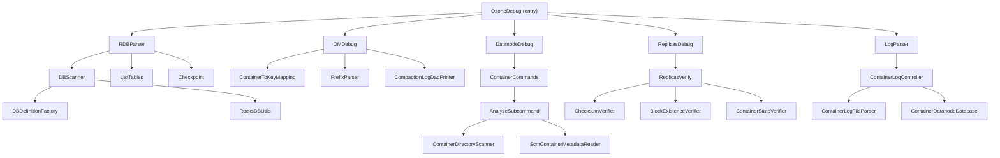

# Debug &amp; Repair / debug

**Classes:** 76    **Kinds:** service:52, cli:13, data:4, interface:3, abstract:2, factory:1, dto:1

## Overview

The `debug` feature group provides offline and live inspection tools for every Ozone metadata store and data path. `DBScanner` is the universal read-only RocksDB scanner: it opens any Ozone DB in read-only mode, decodes values through the registered `DBColumnFamilyDefinition` codecs, and streams JSON output with optional field-projection and filter expressions through a thread-pool plus a sequenced `LogWriter`. `ContainerToKeyMapping` walks the OM fileTable and keyTable to resolve block locations back to full FSO or OBS key paths for a given set of container IDs, building a temporary `omdirtree.db` for FSO directory resolution. `ReplicasVerify` is the live replica checker: it iterates keys across a scope (key/bucket/volume/cluster) and runs pluggable `ReplicaVerifier` implementations (checksum, block-existence, container-state) reporting results as JSON. `ContainerDatanodeDatabase` underpins the container-log parser by persisting DN state-transition events into an in-process SQLite database for post-hoc analysis. `AnalyzeSubcommand` cross-checks on-disk container directories against an offline SCM RocksDB to surface orphans, duplicates, and DELETED-but-present containers.

## Diagram

## Class table

### Sub-feature: `audit.parser`

| reading_order | fqcn | kind | logic | loc | study (min) | role |
|--:|---|---|---|--:|--:|---|
| 1308 | `org.apache.hadoop.ozone.debug.audit.parser.AuditParser` | cli | mixed | 25~ | 20 | Ozone audit parser tool. |

### Sub-feature: `container.analyze`

| reading_order | fqcn | kind | logic | loc | study (min) | role |
|--:|---|---|---|--:|--:|---|
| 1309 | `org.apache.hadoop.ozone.debug.datanode.container.analyze.ContainerDirectoryScanner` | service | mixed | 175~ | 45 | Read-only walker for container directories under hdds.datanode.dir. |
| 1310 | `org.apache.hadoop.ozone.debug.datanode.container.analyze.ScmContainerMetadataReader` | service | mixed | 75~ | 30 | Read-only lookup of container metadata from scm.db. |
| 1311 | `org.apache.hadoop.ozone.debug.datanode.container.analyze.ContainerDiskOccurrence` | service | mixed | 25~ | 30 | On-disk occurrence of a container directory on a DataNode volume. |
| 1312 | `org.apache.hadoop.ozone.debug.datanode.container.analyze.ContainerScanResult` | service | mixed | 25~ | 30 | Result of a ContainerDirectoryScanner walk over DataNode storage volumes. |
| 1313 | `org.apache.hadoop.ozone.debug.datanode.container.analyze.AnalyzeSubcommand` | cli | logic-heavy | 200~ | 20 | inferred(from-md): `ozone debug datanode container analyze`. |

### Sub-feature: `container.utils`

| reading_order | fqcn | kind | logic | loc | study (min) | role |
|--:|---|---|---|--:|--:|---|
| 1314 | `org.apache.hadoop.ozone.debug.logs.container.utils.ContainerDatanodeDatabase` | service | logic-heavy | 550~ | 60 | Handles creation and interaction with the database. |
| 1315 | `org.apache.hadoop.ozone.debug.logs.container.utils.ContainerLogFileParser` | service | mixed | 150~ | 45 | Parses container log files and stores container details into a database. |
| 1316 | `org.apache.hadoop.ozone.debug.logs.container.utils.SQLDBConstants` | service | mixed | 125~ | 30 | Constants used for ContainerDatanodeDatabase. |
| 1317 | `org.apache.hadoop.ozone.debug.logs.container.utils.DatanodeContainerInfo` | dto | data-only | 100~ | 10 | Holds information about a container. |

### Sub-feature: `datanode.container`

| reading_order | fqcn | kind | logic | loc | study (min) | role |
|--:|---|---|---|--:|--:|---|
| 1318 | `org.apache.hadoop.ozone.debug.datanode.container.ContainerCommands` | cli | mixed | 125~ | 20 | Subcommand to group container replica related operations. |
| 1319 | `org.apache.hadoop.ozone.debug.datanode.container.ExportSubcommand` | cli | mixed | 50~ | 20 | Handles ozone debug datanode container export command. |
| 1320 | `org.apache.hadoop.ozone.debug.datanode.container.InspectSubcommand` | cli | mixed | 25~ | 20 | ozone debug datanode container inspect, a command to run KeyValueContainerMetadataInspector. |
| 1321 | `org.apache.hadoop.ozone.debug.datanode.container.InfoSubcommand` | cli | mixed | 25~ | 20 | Handles ozone debug datanode container info command. |
| 1322 | `org.apache.hadoop.ozone.debug.datanode.container.ListSubcommand` | cli | mixed | 25~ | 20 | Handles ozone debug datanode container list command. |

### Sub-feature: `debug.datanode`

| reading_order | fqcn | kind | logic | loc | study (min) | role |
|--:|---|---|---|--:|--:|---|
| 1323 | `org.apache.hadoop.ozone.debug.datanode.DatanodeDebug` | service | mixed | 25~ | 30 | Datanode debug related commands. |

### Sub-feature: `debug.kerberos`

| reading_order | fqcn | kind | logic | loc | study (min) | role |
|--:|---|---|---|--:|--:|---|
| 1324 | `org.apache.hadoop.ozone.debug.kerberos.DiagnosticProbe` | interface | mixed | 25~ | 20 | Interface for a diagnostic probe executed by ozone debug kerberos subcommands. |
| 1325 | `org.apache.hadoop.ozone.debug.kerberos.ConfigProbe` | abstract | mixed | 50~ | 30 | Base class for probes with common helpers. |
| 1326 | `org.apache.hadoop.ozone.debug.kerberos.KerberosTicketProbe` | service | mixed | 50~ | 30 | Checks the current Kerberos authentication state of the process. |
| 1327 | `org.apache.hadoop.ozone.debug.kerberos.JvmKerberosProbe` | service | mixed | 50~ | 30 | Validates JVM-level Kerberos related system properties. |
| 1328 | `org.apache.hadoop.ozone.debug.kerberos.PrincipalMappingProbe` | service | mixed | 50~ | 30 | Validates auth_to_local principal mapping. |
| 1329 | `org.apache.hadoop.ozone.debug.kerberos.HostProbe` | service | mixed | 50~ | 30 | HostProbe to handle system-level failures gracefully and report actionable errors instead of failing silently. |
| 1330 | `org.apache.hadoop.ozone.debug.kerberos.KeytabProbe` | service | mixed | 50~ | 30 | Validates existence and readability of Ozone service keytab. |
| 1331 | `org.apache.hadoop.ozone.debug.kerberos.AuthorizationProbe` | service | mixed | 50~ | 30 | Validates Ozone and Hadoop RPC authorization configuration. |
| 1332 | `org.apache.hadoop.ozone.debug.kerberos.EnvironmentProbe` | service | mixed | 25~ | 30 | Prints environment variables relevant to Kerberos and Ozone. |
| 1333 | `org.apache.hadoop.ozone.debug.kerberos.KerberosConfigProbe` | service | mixed | 25~ | 30 | Validates system-level Kerberos configuration (krb5.conf) and realm. |
| 1334 | `org.apache.hadoop.ozone.debug.kerberos.HttpAuthProbe` | service | mixed | 25~ | 30 | Prints HTTP Kerberos authentication configuration for Ozone services. |
| 1335 | `org.apache.hadoop.ozone.debug.kerberos.SecurityConfigProbe` | service | mixed | 25~ | 30 | Validates Hadoop and Ozone security configuration. |
| 1336 | `org.apache.hadoop.ozone.debug.kerberos.KinitProbe` | service | mixed | 25~ | 30 | Validates that kinit is available on the system PATH. |
| 1337 | `org.apache.hadoop.ozone.debug.kerberos.DiagnoseSubcommand` | cli | mixed | 75~ | 20 | Kerberos diagnostic command for Ozone. |
| 1338 | `org.apache.hadoop.ozone.debug.kerberos.TranslatePrincipalSubcommand` | cli | mixed | 50~ | 20 | inferred: TranslatePrincipalSubcommand — role not documented. |
| 1339 | `org.apache.hadoop.ozone.debug.kerberos.ProbeResult` | data | data-only | 25~ | 10 | Enum to represent probe result. |
| 1340 | `org.apache.hadoop.ozone.debug.kerberos.KerberosSubcommand` | cli | mixed | 25~ | 20 | Subcommand for ozone debug kerberos related operation. |

### Sub-feature: `debug.ldb`

| reading_order | fqcn | kind | logic | loc | study (min) | role |
|--:|---|---|---|--:|--:|---|
| 1341 | `org.apache.hadoop.ozone.debug.ldb.ValueSchema` | service | mixed | 100~ | 20 | Get schema of value for scm.db, om.db or container db file. |
| 1342 | `org.apache.hadoop.ozone.debug.ldb.DBScanner` | service | logic-heavy | 800~ | 60 | Parser for scm.db, om.db or container db file. |
| 1343 | `org.apache.hadoop.ozone.debug.ldb.RDBParser` | service | mixed | 25~ | 30 | Tool that parses rocksdb file. |
| 1344 | `org.apache.hadoop.ozone.debug.ldb.ListTables` | service | mixed | 25~ | 30 | List all column Families/Tables in db. |
| 1345 | `org.apache.hadoop.ozone.debug.ldb.Checkpoint` | service | mixed | 25~ | 30 | Create a checkpoint for a rocksDB. |

### Sub-feature: `debug.logs`

| reading_order | fqcn | kind | logic | loc | study (min) | role |
|--:|---|---|---|--:|--:|---|
| 1346 | `org.apache.hadoop.ozone.debug.logs.LogParser` | service | mixed | 25~ | 30 | Entry point for Ozone debug log parsing and analysis commands. |

### Sub-feature: `debug.om`

| reading_order | fqcn | kind | logic | loc | study (min) | role |
|--:|---|---|---|--:|--:|---|
| 1347 | `org.apache.hadoop.ozone.debug.om.ContainerToKeyMapping` | service | logic-heavy | 400~ | 60 | Tool to map full key paths that use the specified containers. |
| 1348 | `org.apache.hadoop.ozone.debug.om.PrefixParser` | service | mixed | 150~ | 45 | Tool that parses OM db file for prefix table. |
| 1349 | `org.apache.hadoop.ozone.debug.om.CompactionLogDagPrinter` | service | mixed | 50~ | 30 | Handler to generate image for current compaction DAG. |
| 1350 | `org.apache.hadoop.ozone.debug.om.OMDebug` | service | mixed | 25~ | 30 | OM debug related commands. |

### Sub-feature: `debug.ratis`

| reading_order | fqcn | kind | logic | loc | study (min) | role |
|--:|---|---|---|--:|--:|---|
| 1351 | `org.apache.hadoop.ozone.debug.ratis.RatisDebug` | service | mixed | 25~ | 30 | Ratis debug related commands. |

### Sub-feature: `debug.replicas`

| reading_order | fqcn | kind | logic | loc | study (min) | role |
|--:|---|---|---|--:|--:|---|
| 1352 | `org.apache.hadoop.ozone.debug.replicas.ReplicaVerifier` | interface | mixed | 25~ | 20 | Functional interface for implementing a block verifier. |
| 1353 | `org.apache.hadoop.ozone.debug.replicas.ReplicasVerify` | service | logic-heavy | 375~ | 45 | inferred(from-md): Verify replicas command. |
| 1354 | `org.apache.hadoop.ozone.debug.replicas.ContainerStateVerifier` | service | mixed | 175~ | 45 | Verifies the state of a replica from the DN. |
| 1355 | `org.apache.hadoop.ozone.debug.replicas.BlockVerificationResult` | service | mixed | 25~ | 30 | Json structure for replicas to pass through each check and give output. |
| 1356 | `org.apache.hadoop.ozone.debug.replicas.BlockExistenceVerifier` | service | mixed | 25~ | 30 | Verifies block existence by making getBlock calls to the datanode. |
| 1357 | `org.apache.hadoop.ozone.debug.replicas.ReplicasDebug` | service | mixed | 25~ | 30 | Replicas debug related commands. |
| 1358 | `org.apache.hadoop.ozone.debug.replicas.ChecksumVerifier` | service | mixed | 25~ | 30 | Verifies the checksum of blocks by checking each replica associated with a given key. |

### Sub-feature: `logs.container`

| reading_order | fqcn | kind | logic | loc | study (min) | role |
|--:|---|---|---|--:|--:|---|
| 1359 | `org.apache.hadoop.ozone.debug.logs.container.ContainerLogParser` | service | mixed | 75~ | 30 | inferred: ContainerLogParser — role not documented. |
| 1360 | `org.apache.hadoop.ozone.debug.logs.container.ListContainers` | service | mixed | 50~ | 30 | List containers based on the parameter given. |
| 1361 | `org.apache.hadoop.ozone.debug.logs.container.ContainerLogController` | service | mixed | 50~ | 30 | A controller for managing container log operations like parsing and listing containers. |
| 1362 | `org.apache.hadoop.ozone.debug.logs.container.DuplicateOpenContainersCommand` | cli | mixed | 25~ | 20 | Subcommand to list containers that have duplicate OPEN states. |
| 1363 | `org.apache.hadoop.ozone.debug.logs.container.ContainerInfoCommand` | cli | mixed | 25~ | 20 | Command to display detailed information of a single container by ID. |

### Sub-feature: `ozone.debug`

| reading_order | fqcn | kind | logic | loc | study (min) | role |
|--:|---|---|---|--:|--:|---|
| 1364 | `org.apache.hadoop.ozone.debug.CheckNative` | service | mixed | 25~ | 30 | CLI command to check if native libraries are loaded. |
| 1365 | `org.apache.hadoop.ozone.debug.OzoneDebug` | service | mixed | 25~ | 30 | Ozone Debug Command line tool. |
| 1366 | `org.apache.hadoop.ozone.debug.VersionDebug` | service | mixed | 25~ | 30 | Show internal component version information as JSON. |
| 1367 | `org.apache.hadoop.ozone.debug.RocksDBUtils` | service | mixed | 25~ | 30 | RocksDB specific utility functions. |
| 1368 | `org.apache.hadoop.ozone.debug.DBDefinitionFactory` | factory | mixed | 50~ | 20 | Utility class to get appropriate DBDefinition. |

### Sub-feature: `ozone.fsck`

| reading_order | fqcn | kind | logic | loc | study (min) | role |
|--:|---|---|---|--:|--:|---|
| 1369 | `org.apache.hadoop.ozone.fsck.ContainerMapper` | service | mixed | 75~ | 30 | Generates Container Id to Blocks and BlockDetails mapping. |
| 1370 | `org.apache.hadoop.ozone.fsck.BlockIdDetails` | service | mixed | 50~ | 30 | Getter and Setter for BlockDetails. |

### Sub-feature: `ozone.graph`

| reading_order | fqcn | kind | logic | loc | study (min) | role |
|--:|---|---|---|--:|--:|---|
| 1371 | `org.apache.ozone.graph.Edge` | service | mixed | 25~ | 30 | Overrides the DefaultEdge so that it doesn't print source and target vertex names in the image. |
| 1372 | `org.apache.ozone.graph.PrintableGraph` | service | mixed | 50~ | 10 | Wrapped over Graph to get an image of MutableGraph. |

### Sub-feature: `ozone.utils`

| reading_order | fqcn | kind | logic | loc | study (min) | role |
|--:|---|---|---|--:|--:|---|
| 1373 | `org.apache.hadoop.ozone.utils.Filter` | service | mixed | 75~ | 10 | Represent class which has info of what operation and value a set of records should be filtered with. |

### Sub-feature: `parser.common`

| reading_order | fqcn | kind | logic | loc | study (min) | role |
|--:|---|---|---|--:|--:|---|
| 1374 | `org.apache.hadoop.ozone.debug.audit.parser.common.DatabaseHelper` | service | mixed | 150~ | 45 | Database helper for ozone audit parser tool. |
| 1375 | `org.apache.hadoop.ozone.debug.audit.parser.common.ParserConsts` | service | mixed | 25~ | 30 | Constants used for ozone audit parser. |

### Sub-feature: `parser.handler`

| reading_order | fqcn | kind | logic | loc | study (min) | role |
|--:|---|---|---|--:|--:|---|
| 1376 | `org.apache.hadoop.ozone.debug.audit.parser.handler.LoadCommandHandler` | cli | mixed | 25~ | 30 | Load command handler for ozone audit parser. |
| 1377 | `org.apache.hadoop.ozone.debug.audit.parser.handler.QueryCommandHandler` | cli | mixed | 25~ | 30 | Custom query command handler for ozone audit parser. |
| 1378 | `org.apache.hadoop.ozone.debug.audit.parser.handler.TemplateCommandHandler` | cli | mixed | 25~ | 30 | inferred: TemplateCommandHandler — role not documented. |

### Sub-feature: `parser.model`

| reading_order | fqcn | kind | logic | loc | study (min) | role |
|--:|---|---|---|--:|--:|---|
| 1379 | `org.apache.hadoop.ozone.debug.audit.parser.model.AuditEntry` | service | mixed | 125~ | 30 | POJO used for ozone audit parser tool. |

### Sub-feature: `ratis.parse`

| reading_order | fqcn | kind | logic | loc | study (min) | role |
|--:|---|---|---|--:|--:|---|
| 1380 | `org.apache.hadoop.ozone.debug.ratis.parse.BaseLogParser` | abstract | mixed | 25~ | 30 | Base Ratis Log Parser used by generic, datanode etc. |
| 1381 | `org.apache.hadoop.ozone.debug.ratis.parse.RatisLogParser` | service | mixed | 50~ | 30 | Parse Ratis Log CLI implementation. |

### Sub-feature: `replicas.chunk`

| reading_order | fqcn | kind | logic | loc | study (min) | role |
|--:|---|---|---|--:|--:|---|
| 1382 | `org.apache.hadoop.ozone.debug.replicas.chunk.ChunkKeyHandler` | cli | mixed | 150~ | 20 | Class that gives chunk location given a specific key. |
| 1383 | `org.apache.hadoop.ozone.debug.replicas.chunk.ChunkType` | data | data-only | 25~ | 10 | The type of chunks of an Erasure Coded key. |

## Anchor details

### `DBScanner`

- **path:** `hadoop-ozone/cli-debug/src/main/java/org/apache/hadoop/ozone/debug/ldb/DBScanner.java`
- **loc:** 800~    **difficulty:** 5    **study:** 60 min    **concurrency:** thread-safe    **persistence:** RocksDB
- **entry points:** `call`, `run`
- **key collaborators:** `org.apache.hadoop.ozone.debug.DBDefinitionFactory`, `org.apache.hadoop.ozone.debug.RocksDBUtils`, `org.apache.hadoop.ozone.utils.Filter`, `org.apache.hadoop.hdds.cli.AbstractSubcommand`, `org.apache.hadoop.hdds.conf.OzoneConfiguration`, `org.apache.hadoop.hdds.scm.block.DeletedBlockLogStateManagerImpl`
- **role:** Parser for scm.
- `call()` opens the target RocksDB in read-only mode via `ManagedRocksDB.openReadOnly`, then delegates to `printTable` which resolves the column family via `DBDefinitionFactory.getDefinition` and drives a batch-and-thread-pool pipeline: the inner `Task` deserializes key+value pairs in parallel while `LogWriter` serializes output in strict sequence-ID order to guarantee that JSON output matches the RocksDB iterator order even under concurrent decoding. The filter expression parser in `checkFilteredObject` uses reflection on the decoded POJO and supports `EQUALS`, `LESSER`, `GREATER`, and `REGEX` operators; a subtle invariant is that field lookup uses `ValueSchema.getAllFields` (which traverses the full class hierarchy), so filtering on inherited fields works correctly.

### `ContainerDatanodeDatabase`

- **path:** `hadoop-ozone/cli-debug/src/main/java/org/apache/hadoop/ozone/debug/logs/container/utils/ContainerDatanodeDatabase.java`
- **loc:** 550~    **difficulty:** 5    **study:** 60 min    **concurrency:** single-threaded    **persistence:** in-memory
- **key collaborators:** `org.apache.hadoop.hdds.conf.OzoneConfiguration`, `org.apache.hadoop.hdds.scm.container.ContainerHealthState`, `org.apache.hadoop.ozone.om.OMConfigKeys`
- **role:** Handles creation and interaction with the database.
- Backs a file-based SQLite database (journal mode OFF, exclusive locking, synchronous OFF) populated from parsed DN container log files. The `analyzeContainerHealth` method computes health verdicts — UNDER_REPLICATED, OVER_REPLICATED, QUASI_CLOSED_STUCK, MISMATCHED_REPLICATION, OPEN_UNHEALTHY, UNHEALTHY — by examining the latest per-datanode state from the `DatanodeContainerLogTable`; the replication-factor comparison uses `DEFAULT_REPLICATION_FACTOR` which is resolved once at class load time from `OzoneConfiguration`, so the class reflects cluster config at analysis time rather than at runtime.

### `ContainerToKeyMapping`

- **path:** `hadoop-ozone/cli-debug/src/main/java/org/apache/hadoop/ozone/debug/om/ContainerToKeyMapping.java`
- **loc:** 400~    **difficulty:** 5    **study:** 60 min    **concurrency:** single-threaded    **persistence:** RocksDB
- **entry points:** `call`
- **key collaborators:** `org.apache.hadoop.hdds.cli.AbstractSubcommand`, `org.apache.hadoop.hdds.conf.ConfigurationSource`, `org.apache.hadoop.hdds.conf.OzoneConfiguration`, `org.apache.hadoop.hdds.utils.db.DBColumnFamilyDefinition`, `org.apache.hadoop.hdds.utils.db.DBStore`, `org.apache.hadoop.hdds.utils.db.DBStoreBuilder`
- **test exemplar:** `hadoop-ozone/cli-debug/src/test/java/org/apache/hadoop/ozone/debug/om/TestContainerToKeyMapping.java`
- **role:** Tool to map full key paths that use the specified containers.
- For FSO buckets, `prepareDirIdTree` materializes the entire directory table into a temporary `omdirtree.db` (a RocksDB with a single `dirTreeTable` CF keyed by objectID); `reconstructFullPath` then walks parent pointers upward through this in-process DB to assemble the full `/volume/bucket/dir/.../file` path. Multipart uploads with `schemaVersion == SPLIT_PARTS_TABLE_SCHEMA_VERSION` require scanning `multipartPartsTable` with a `OmMultipartPartKey.prefix(uploadId)` scan rather than reading embedded parts from `multipartInfoTable`, since HDDS-15949 split legacy in-value part storage across a separate table.

### `ReplicasVerify`

- **path:** `hadoop-ozone/cli-debug/src/main/java/org/apache/hadoop/ozone/debug/replicas/ReplicasVerify.java`
- **loc:** 375~    **difficulty:** 4    **study:** 45 min    **concurrency:** thread-safe    **persistence:** in-memory
- **key collaborators:** `org.apache.hadoop.hdds.client.ReplicationConfig`, `org.apache.hadoop.hdds.protocol.DatanodeDetails`, `org.apache.hadoop.hdds.scm.cli.ScmOption`, `org.apache.hadoop.hdds.server.JsonUtils`, `org.apache.hadoop.ozone.client.ObjectStore`, `org.apache.hadoop.ozone.client.OzoneBucket`
- **role:** Verify replicas command.
- `execute()` builds the list of `ReplicaVerifier` instances (checksum, block-existence, container-state) based on CLI flags and registers a `ShutdownHookManager` hook to print a summary even on SIGINT, making the summary reliable for long-running cluster-wide scans. The `processKey` method iterates `getBlocksLatestVersionOnly()` and for each replica node calls every verifier producing a nested JSON structure: volume/bucket/key &gt; blocks &gt; replicas &gt; checks. Directory-marker keys (names ending with `/`) are skipped explicitly with a TODO comment referencing HDDS-12094.

### `AnalyzeSubcommand`

- **path:** `hadoop-ozone/cli-debug/src/main/java/org/apache/hadoop/ozone/debug/datanode/container/analyze/AnalyzeSubcommand.java`
- **loc:** 200~    **difficulty:** 2    **study:** 20 min    **concurrency:** single-threaded    **persistence:** in-memory
- **entry points:** `call`
- **key collaborators:** `org.apache.hadoop.hdds.cli.AbstractSubcommand`, `org.apache.hadoop.hdds.conf.OzoneConfiguration`, `org.apache.hadoop.hdds.utils.HddsServerUtil`, `org.apache.hadoop.ozone.container.common.helpers.DatanodeVersionFile`, `org.apache.hadoop.ozone.container.common.utils.StorageVolumeUtil`, `org.apache.hadoop.ozone.container.common.volume.HddsVolume`
- **test exemplar:** `hadoop-ozone/cli-debug/src/test/java/org/apache/hadoop/ozone/debug/datanode/container/analyze/TestAnalyzeSubcommand.java`
- **role:** `ozone debug datanode container analyze`.
- Before querying the offline SCM DB, `checkClusterIdConsistency` reads the VERSION file adjacent to the SCM DB and the DataNode's first volume VERSION file to compare cluster IDs; mismatches cause the SCM checks to be skipped with a warning rather than reporting false positives. The `--scm-db` path may point to either the `scm.db` directory itself or its parent metadata directory — `ScmContainerMetadataReader.resolveScmDbDirectory` handles both forms.

## Design docs

- `hadoop-hdds/docs/content/design/tools.md` — "Improved Layout of Ozone Tools" (HDDS-14595): documents the motivation and structure of the `ozone debug` and `ozone repair` CLI layout, the separation into `cli-debug`/`cli-repair` submodules, and the safety contract for repair commands.
- `hadoop-hdds/docs/content/design/dn-merge-rocksdb.md` — "Merge Container RocksDB in DN" (HDDS-3630): explains the schema V3 single-DB-per-volume model that `DBScanner --dn-schema=V3` and `AnalyzeSubcommand` both reason about.
- `hadoop-hdds/docs/content/design/container-reconciliation.md` — covers container state reconciliation, directly related to the state checks in `ContainerStateVerifier` and the container health analysis in `ContainerDatanodeDatabase`.

## Seminal JIRAs / PRs

- HDDS-14595. Create new submodules for ozone debug/repair
- HDDS-15455. Implement custom DataNode container directory discovery and duplicate detection
- HDDS-15456. Add SCM DB lookup and identify orphan (wrt SCM) and deleted-but-present containers
- HDDS-14518. Support open keys and MPU in ContainerToKeyMapping tool
- HDDS-15949. Handle split MPU part counting for abort batch sizing and container-key-mapping CLI
- HDDS-13063. Support splitting JSON output to multiple valid JSON files in a directory
- HDDS-15730. Support more StatefulService types in DBScanner

## Sharp edges

- `DBScanner` uses a single static `compact` flag (line 172: `private static boolean compact`) initialized at class-load time from the picocli default. If multiple `DBScanner` instances are created in the same JVM (e.g., in tests), the compact flag from the last parsed command bleeds into the `JsonSerializationHelper.WRITER` static initializer; the `WRITER` is effectively only configured correctly for the first scan invocation in a process.
- `ContainerDatanodeDatabase` resolves `DEFAULT_REPLICATION_FACTOR` in a `static {}` block from a fresh `OzoneConfiguration()` (line 67-73). If the local `ozone-site.xml` differs from the cluster's configured value, container health verdicts (UNDER_REPLICATED, OVER_REPLICATED) will be computed against the wrong factor with no warning.
- `ContainerToKeyMapping.reconstructFullPath` silently counts files with missing parents as `unreferencedKeys` in the JSON output (line 451-456) instead of reporting them as an error. If a large directory delete is mid-flight when the tool runs, the unreferenced count may be non-zero without indicating corruption; `--in-progress` alone does not capture these.

## Related features

- `components/debug-repair/repair.md` — sibling repair feature that acts on FSO orphans identified by this debug tooling
- `components/rocksdb/ldb.md` — the lower-level RocksDB utilities (`ManagedRocksDB`, `DBStoreBuilder`) that `DBScanner` and `ContainerToKeyMapping` build on
- `components/om/snapshot.md` — snapshot FSO semantics affect which paths are reachable, interacting with `ContainerToKeyMapping`'s unreferenced-key count
- `components/dn/container.md` — the container state machine whose on-disk layout is inspected by `AnalyzeSubcommand` and `ContainerDatanodeDatabase`
- `components/scm/container.md` — the SCM container metadata read by `ScmContainerMetadataReader` inside `AnalyzeSubcommand`

## Self-quiz

1. `DBScanner.call()` opens the RocksDB and drives the scan. What guarantee does the inner `LogWriter` class provide, and which field in `LogWriter` enforces it?
2. `ContainerDatanodeDatabase.analyzeContainerHealth` uses `DEFAULT_REPLICATION_FACTOR`. Where is this value set, and what is the risk if the local configuration differs from the cluster?
3. `ContainerToKeyMapping` builds a temporary `omdirtree.db`. What is the key type and value type of `DIRTREE_TABLE_DEFINITION`, and how does `getDirParentNamePair` decode the value?
4. `ReplicasVerify.processKey` skips keys whose names end with `/`. Which JIRA is cited in the comment, and what is the stated reason?
5. `AnalyzeSubcommand.checkClusterIdConsistency` reads two VERSION files. Name the two classes it uses to read them and describe what happens when the IDs do not match.

Answers

Answer 1: `LogWriter` maintains an `expectedSequenceId` counter. `WriterTask.run()` only flushes a batch from the `logs` map when `logs.get(expectedSequenceId)` is non-null, then increments the counter. This ensures that even though `Task` instances complete out of order in the thread pool, the printed JSON preserves the original RocksDB iterator order.

Answer 2: `DEFAULT_REPLICATION_FACTOR` is set in the `static {}` initializer block (lines 66-73) by calling `new OzoneConfiguration()` and reading `OZONE_SERVER_DEFAULT_REPLICATION_KEY`. If the local node's `ozone-site.xml` has a different value than the cluster's actual replication factor, all under/over-replication verdicts will be computed against the wrong baseline, silently producing incorrect output.

Answer 3: `DIRTREE_TABLE_DEFINITION` is `DBColumnFamilyDefinition<Long, String>` (key: `LongCodec`, value: `StringCodec`). `getDirParentNamePair` splits the value string on the last `#` character: the substring before is the directory name, the substring after (possibly empty) is the parent objectID as a decimal string.

Answer 4: HDDS-12094. The comment on line 327 of `ReplicasVerify.checkBucket` reads `// TODO: Remove this check once HDDS-12094 is fixed`. Directory-marker keys (object-store emulation of empty directories) end with `/` and do not have block locations, so verifying them would produce spurious failures.

Answer 5: `ScmContainerMetadataReader.readScmClusterId` reads the VERSION file next to the SCM DB, and `StorageVolumeUtil.getClusterID` (via `DatanodeVersionFile.readFrom`) reads the DataNode volume VERSION. When the IDs differ, `checkClusterIdConsistency` prints a warning to stderr and returns `false`, causing `findOrphanAndDeletedButPresentContainers` to be skipped entirely.

