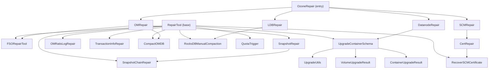

# Debug &amp; Repair / repair

**Classes:** 23    **Kinds:** service:20, cli:2, data:1

## Overview

The `repair` feature group provides offline, write-capable tools for correcting corruption in stopped Ozone services. All repair commands extend `RepairTool`, which enforces a dry-run / live-run gate (`isDryRun()`) and documents which service component must be offline before the tool is run. `FSORepairTool` is the most complex: it performs a DFS from each FSO bucket root using a temporary `temp.db` RocksDB instance to track reachable and pending-deletion objects, then moves unreachable (orphaned) files and directories into the OM deleted tables using batched `BatchOperation` writes. `UpgradeContainerSchema` migrates per-container schema V2 RocksDB instances into the single schema V3 volume-level DB by transferring every table row with a container-ID prefix, using `CompletableFuture` per volume for parallelism and lock/complete-file markers for idempotency. Other tools target narrower problems: `SnapshotChainRepair` fixes broken snapshot chain links in `snapshotInfoTable`, `RecoverSCMCertificate` restores accidentally deleted SCM certificates from the SCM DB, `TransactionInfoRepair` corrects the highest term-index in the OM or SCM transaction info table, and `CompactOMDB`/`RocksDBManualCompaction` trigger offline RocksDB compaction.

## Diagram

## Class table

### Sub-feature: `datanode.schemaupgrade`

| reading_order | fqcn | kind | logic | loc | study (min) | role |
|--:|---|---|---|--:|--:|---|
| 2673 | `org.apache.hadoop.ozone.repair.datanode.schemaupgrade.ContainerUpgradeResult` | service | mixed | 75~ | 30 | This class represents upgrade v2 to v3 container result. |
| 2674 | `org.apache.hadoop.ozone.repair.datanode.schemaupgrade.UpgradeUtils` | service | mixed | 75~ | 30 | Utils functions to help upgrade v2 to v3 container functions. |
| 2675 | `org.apache.hadoop.ozone.repair.datanode.schemaupgrade.VolumeUpgradeResult` | service | mixed | 75~ | 30 | This class contains v2 to v3 container upgrade result. |
| 2676 | `org.apache.hadoop.ozone.repair.datanode.schemaupgrade.UpgradeContainerSchema` | cli | logic-heavy | 375~ | 20 | This is the handler that process container upgrade command. |

### Sub-feature: `om.quota`

| reading_order | fqcn | kind | logic | loc | study (min) | role |
|--:|---|---|---|--:|--:|---|
| 2677 | `org.apache.hadoop.ozone.repair.om.quota.QuotaTrigger` | service | mixed | 50~ | 30 | Tool to trigger quota repair. |
| 2678 | `org.apache.hadoop.ozone.repair.om.quota.QuotaRepair` | service | mixed | 50~ | 30 | Ozone Repair CLI for quota. |
| 2679 | `org.apache.hadoop.ozone.repair.om.quota.QuotaStatus` | service | mixed | 25~ | 30 | Tool to get status of last triggered quota repair. |

### Sub-feature: `ozone.repair`

| reading_order | fqcn | kind | logic | loc | study (min) | role |
|--:|---|---|---|--:|--:|---|
| 2680 | `org.apache.hadoop.ozone.repair.TransactionInfoRepair` | service | mixed | 75~ | 30 | Tool to update the highest term-index in transaction info table. |
| 2681 | `org.apache.hadoop.ozone.repair.OzoneRepair` | service | mixed | 25~ | 30 | Ozone Repair Command line tool. |
| 2682 | `org.apache.hadoop.ozone.repair.RepairTool` | abstract | mixed | 125~ | 10 | Parent class for all actionable repair commands. |
| 2683 | `org.apache.hadoop.ozone.repair.ReadOnlyCommand` | cli | mixed | 25~ | 20 | Marker interface for repair subcommands that do not modify state. |

### Sub-feature: `repair.datanode`

| reading_order | fqcn | kind | logic | loc | study (min) | role |
|--:|---|---|---|--:|--:|---|
| 2684 | `org.apache.hadoop.ozone.repair.datanode.DatanodeRepair` | service | mixed | 25~ | 30 | Ozone Repair CLI for Datanode. |

### Sub-feature: `repair.ldb`

| reading_order | fqcn | kind | logic | loc | study (min) | role |
|--:|---|---|---|--:|--:|---|
| 2685 | `org.apache.hadoop.ozone.repair.ldb.RocksDBManualCompaction` | service | mixed | 75~ | 30 | Tool to perform compaction on a table. |
| 2686 | `org.apache.hadoop.ozone.repair.ldb.LDBRepair` | service | mixed | 25~ | 30 | Ozone Repair CLI for ldb. |

### Sub-feature: `repair.om`

| reading_order | fqcn | kind | logic | loc | study (min) | role |
|--:|---|---|---|--:|--:|---|
| 2687 | `org.apache.hadoop.ozone.repair.om.FSORepairTool` | service | logic-heavy | 600~ | 60 | Base Tool to identify and repair disconnected FSO trees across all buckets. |
| 2688 | `org.apache.hadoop.ozone.repair.om.OMRatisLogRepair` | service | mixed | 150~ | 45 | inferred: OMRatisLogRepair — role not documented. |
| 2689 | `org.apache.hadoop.ozone.repair.om.SnapshotChainRepair` | service | mixed | 100~ | 30 | Tool to repair snapshotInfoTable in case it has corrupted entries. |
| 2690 | `org.apache.hadoop.ozone.repair.om.CompactOMDB` | service | mixed | 75~ | 30 | Tool to perform compaction on a column family of an om.db. |
| 2691 | `org.apache.hadoop.ozone.repair.om.OMRepair` | service | mixed | 25~ | 30 | Ozone Repair CLI for OM. |
| 2692 | `org.apache.hadoop.ozone.repair.om.SnapshotRepair` | service | mixed | 25~ | 30 | Tool for snapshot related repairs. |

### Sub-feature: `repair.scm`

| reading_order | fqcn | kind | logic | loc | study (min) | role |
|--:|---|---|---|--:|--:|---|
| 2693 | `org.apache.hadoop.ozone.repair.scm.SCMRepair` | service | mixed | 25~ | 30 | Ozone Repair CLI for SCM. |

### Sub-feature: `scm.cert`

| reading_order | fqcn | kind | logic | loc | study (min) | role |
|--:|---|---|---|--:|--:|---|
| 2694 | `org.apache.hadoop.ozone.repair.scm.cert.RecoverSCMCertificate` | service | mixed | 150~ | 45 | In case of accidental deletion of SCM certificates from local storage, this tool restores the certs that are persiste... |
| 2695 | `org.apache.hadoop.ozone.repair.scm.cert.CertRepair` | service | mixed | 25~ | 30 | A dedicated subcommand for all certificate related repairs on SCM. |

## Anchor details

### `FSORepairTool`

- **path:** `hadoop-ozone/cli-repair/src/main/java/org/apache/hadoop/ozone/repair/om/FSORepairTool.java`
- **loc:** 600~    **difficulty:** 5    **study:** 60 min    **concurrency:** single-threaded    **persistence:** RocksDB
- **entry points:** `execute`, `run`, `close`, `build`
- **key collaborators:** `org.apache.hadoop.ozone.repair.RepairTool`, `org.apache.hadoop.hdds.conf.ConfigurationSource`, `org.apache.hadoop.hdds.conf.OzoneConfiguration`, `org.apache.hadoop.hdds.utils.db.BatchOperation`, `org.apache.hadoop.hdds.utils.db.CodecBuffer`, `org.apache.hadoop.hdds.utils.db.CodecBufferCodec`
- **test exemplar:** `hadoop-ozone/integration-test/src/test/java/org/apache/hadoop/ozone/repair/om/TestFSORepairTool.java`
- **role:** Base Tool to identify and repair disconnected FSO trees across all buckets.
- The `Impl.run()` method drives a three-phase per-bucket algorithm: (1) `markReachableObjectsInBucket` does a DFS from each bucket root using a stack, writing reachable objectID keys into `reachableTable` in `temp.db` via `BatchedTempWriter`; (2) `markPendingToDeleteObjectsInBucket` seeds another DFS from entries in `deletedDirectoryTable` to identify already-queued deletes; (3) `handlePendingToDeleteAndOrphanedObjects` scans `directoryTable` and `fileTable`, skipping reachable and pendingToDelete entries and moving the rest to `deletedDirectoryTable`/`deletedTable` via batched `BatchOperation`. The tool skips any bucket that has live snapshots (checked via `snapshotInfoTable`) because orphan detection is not safe when snapshot chains reference objects outside the active tree.

### `UpgradeContainerSchema`

- **path:** `hadoop-ozone/cli-repair/src/main/java/org/apache/hadoop/ozone/repair/datanode/schemaupgrade/UpgradeContainerSchema.java`
- **loc:** 375~    **difficulty:** 2    **study:** 20 min    **concurrency:** single-threaded    **persistence:** in-memory
- **entry points:** `execute`
- **key collaborators:** `org.apache.hadoop.ozone.repair.RepairTool`, `org.apache.hadoop.hdds.StringUtils`, `org.apache.hadoop.hdds.cli.HddsVersionProvider`, `org.apache.hadoop.hdds.conf.ConfigurationSource`, `org.apache.hadoop.hdds.conf.OzoneConfiguration`, `org.apache.hadoop.hdds.protocol.DatanodeDetails`
- **test exemplar:** `hadoop-ozone/cli-repair/src/test/java/org/apache/hadoop/ozone/repair/datanode/schemaupgrade/TestUpgradeContainerSchema.java`
- **role:** Offline upgrade of all schema V2 containers to schema V3 for a datanode.
- `UpgradeTask.upgradeContainer` opens the per-container schema V2 RocksDB via `BlockUtils.getUncachedDatanodeStore`, then calls `transferTableData` for each column family: it iterates the source table and writes every row into the schema V3 volume-level DB with a `DatanodeSchemaThreeDBDefinition.getContainerKeyPrefix(containerID)` prepended to the key, converting from per-container isolation to the shared per-volume index. Before writing, it creates a timestamped backup of the `container.db` directory (`dbBackup`) and renames the original `.container` metadata file to `.container.bak` before writing the updated V3 YAML (`rewriteAndBackupContainerDataFile`). A volume-level lock file (`upgradeTask.lock`) prevents concurrent runs, and a `complete` file prevents re-upgrading already-converted volumes.

## Design docs

- `hadoop-hdds/docs/content/design/tools.md` — "Improved Layout of Ozone Tools" (HDDS-14595): establishes the `RepairTool` base class contract, the offline-service requirement for write-capable tools, and the `ozone repair` command tree structure that these classes implement.
- `hadoop-hdds/docs/content/design/dn-merge-rocksdb.md` — "Merge Container RocksDB in DN" (HDDS-3630): explains schema V3 — the single per-volume RocksDB with container-ID prefixed keys — which is the target format `UpgradeContainerSchema` migrates containers into.
- `hadoop-hdds/docs/content/design/namespace-support.md` — covers FSO bucket layout and the objectID-based directory tree that `FSORepairTool` traverses and repairs.

## Seminal JIRAs / PRs

- HDDS-14595. Create new submodules for ozone debug/repair
- HDDS-14187. Use BatchOperation to batch writes to tables of FSORepairTool
- HDDS-15765. Fail fast when --node-id is omitted for OM compact/defrag on an HA cluster
- HDDS-15466. Make RocksDB bottommost level compaction options configurable for CLI tools
- HDDS-15342. Make RocksDB bottommost level compaction options configurable for background compaction

## Sharp edges

- `FSORepairTool` silently skips any FSO bucket that has at least one snapshot (check in `checkIfSnapshotExistsForBucket`). Orphaned files under a bucket with snapshots will not be reported or repaired. There is no summary count of skipped buckets, so an operator cannot tell how many buckets were bypassed without reading verbose logs.
- `UpgradeContainerSchema` relies on the `UpgradeUtils.isAlreadyUpgraded` check (which tests for the presence of the complete-flag file) to skip re-upgrades. If the complete file exists but the transfer was partial (e.g., the process was killed mid-container), the volume will be silently skipped and the partially-migrated container will not be retried without manually deleting the complete file.
- `FSORepairTool` must be run with all OMs stopped and Ratis logs fully flushed to the OM DB (via `ozone admin prepare`). Running it while OM is live can corrupt the namespace because the tool writes directly to RocksDB, bypassing Ratis. The tool header comment documents this requirement but there is no runtime enforcement.

## Related features

- `components/debug-repair/debug.md` — the sibling debug tooling that identifies orphaned containers and missing keys, feeding repair workflows
- `components/om/snapshot.md` — FSO snapshot semantics that `FSORepairTool` must respect when classifying reachable vs. orphaned objects
- `components/rocksdb/ldb.md` — the `DBStoreBuilder`, `BatchOperation`, and `TableIterator` abstractions that both repair anchors build on
- `components/dn/container.md` — the schema V2/V3 container storage layout that `UpgradeContainerSchema` migrates
- `components/om/request.md` — the OM request path that repair tools bypass (explaining why OM must be stopped)

## Self-quiz

1. `FSORepairTool.Impl.processBucket` calls three methods in order. Name them and describe the role each plays in the reachability algorithm.
2. What is `temp.db` in `FSORepairTool`, what tables does it contain, and why is it deleted at the end of the run?
3. `UpgradeContainerSchema.UpgradeTask.transferTableData` prepends a prefix to each key. What method generates this prefix, and what does it encode?
4. `FSORepairTool` uses `BatchedTempWriter`. What is its role, and what happens when `pending >= tempDbBatchSize`?
5. `UpgradeContainerSchema.execute()` checks `metadataLayoutFeature.layoutVersion() < needLayoutVersion`. What `HDDSLayoutFeature` constant is `needLayoutVersion` and what does the check prevent?

Answers

Answer 1: (1) `markReachableObjectsInBucket` — DFS from bucket root, writes reachable objectID keys to `reachableTable` in `temp.db`; (2) `markPendingToDeleteObjectsInBucket` — DFS from `deletedDirectoryTable` entries, writes already-queued-for-deletion keys to `pendingToDeleteTable`; (3) `handlePendingToDeleteAndOrphanedObjects` — full scan of `directoryTable` and `fileTable`, moves entries that are neither reachable nor pendingToDelete to `deletedDirectoryTable`/`deletedTable`.

Answer 2: `temp.db` is a temporary RocksDB instance created in the same directory as `om.db`. It holds two column families: `reachableTable` (keys = `/volID/bucketID/objectID`) and `pendingToDeleteTable` (keys = original directory/file table keys). It is deleted in the `finally` block of `Impl.run()` via `closeTempDB()` to ensure no stale state from a previous run affects re-runs.

Answer 3: `DatanodeSchemaThreeDBDefinition.getContainerKeyPrefix(containerID)` generates the prefix. It encodes the container ID as a fixed-length string (via `FixedLengthStringCodec`) so that all entries for a single container sort together in the volume-level RocksDB.

Answer 4: `BatchedTempWriter` buffers `put` calls to a `BatchOperation` against one of the `temp.db` tables. When `pending >= tempDbBatchSize`, it calls `flush()` which commits the pending batch and opens a new one. This bounds memory usage and avoids a single enormous RocksDB write. The `--batch-size` CLI option (default 10,000) controls the threshold.

Answer 5: `needLayoutVersion` is `HDDSLayoutFeature.DATANODE_SCHEMA_V3.layoutVersion()`. The check prevents running the upgrade tool on a software version that does not yet support schema V3, which would produce an invalid database.

