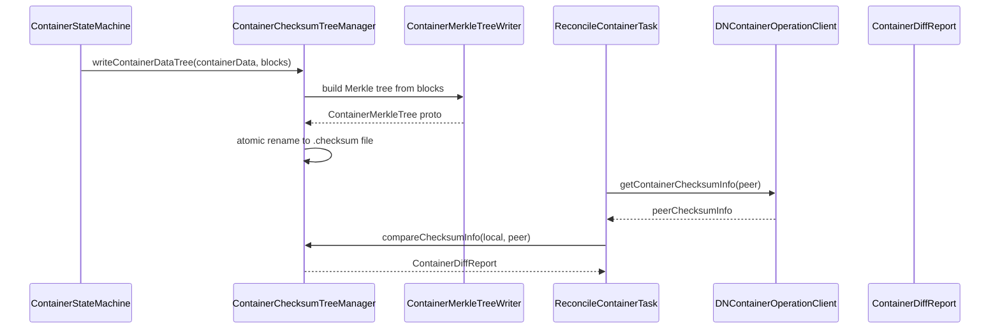

# DN / container-checksum

**Classes:** 6    **Kinds:** service:5, metrics:1

## Overview

The `container-checksum` feature group implements the Merkle-tree based container integrity and reconciliation subsystem introduced by HDDS-10239. Each container replica is summarized as a Merkle tree whose leaves are block checksums; `ContainerChecksumTreeManager` serializes this tree to a `.checksum` file alongside the container using striped per-container locks, so writers do not block each other and readers need no lock (the file is atomically renamed into place). `ContainerMerkleTreeWriter` builds the tree by iterating all block data, feeding each block through `ChecksumByteBuffer` instances. When SCM suspects divergence between replicas, it issues a `ReconcileContainerCommand`; `ReconcileContainerTask` runs inside `ReplicationSupervisor`, uses `DNContainerOperationClient` to fetch the peer's tree via gRPC, and produces a `ContainerDiffReport` enumerating which blocks differ. `ContainerMerkleTreeMetrics` tracks tree generation and comparison latencies.

## Diagram

## Class table

### Sub-feature: `container.checksum`

| reading_order | fqcn | kind | logic | loc | study (min) | role |
|--:|---|---|---|--:|--:|---|
| 1519 | `org.apache.hadoop.ozone.container.checksum.ContainerChecksumTreeManager` | service | logic-heavy | 250~ | 45 | This class coordinates reading and writing Container checksum information for all containers. |
| 1520 | `org.apache.hadoop.ozone.container.checksum.ContainerMerkleTreeWriter` | service | mixed | 175~ | 45 | This class constructs a Merkle tree that provides one checksum for all data within a container. |
| 1521 | `org.apache.hadoop.ozone.container.checksum.ContainerDiffReport` | service | mixed | 75~ | 30 | This class represents the difference between our replica of a container and a peer's replica of a container. |
| 1522 | `org.apache.hadoop.ozone.container.checksum.DNContainerOperationClient` | service | mixed | 75~ | 30 | This class wraps necessary container-level rpc calls for container reconciliation. |
| 1523 | `org.apache.hadoop.ozone.container.checksum.ReconcileContainerTask` | service | mixed | 50~ | 30 | Used to execute a container reconciliation task that has been queued from the ReplicationSupervisor. |
| 1524 | `org.apache.hadoop.ozone.container.checksum.ContainerMerkleTreeMetrics` | metrics | mixed | 100~ | 20 | Class to collect metrics related to container merkle tree. |

## Anchor details

### `ContainerChecksumTreeManager`

- **path:** `hadoop-hdds/container-service/src/main/java/org/apache/hadoop/ozone/container/checksum/ContainerChecksumTreeManager.java`
- **loc:** 250~    **difficulty:** 4    **study:** 45 min    **concurrency:** single-threaded    **persistence:** in-memory
- **key collaborators:** `org.apache.hadoop.hdds.conf.ConfigurationSource`, `org.apache.hadoop.hdds.scm.container.common.helpers.StorageContainerException`, `org.apache.hadoop.ozone.container.common.helpers.BlockData`, `org.apache.hadoop.ozone.container.common.impl.ContainerData`, `org.apache.hadoop.ozone.container.common.statemachine.DatanodeConfiguration`, `org.apache.hadoop.ozone.container.keyvalue.KeyValueContainerData`
- **test exemplar:** `hadoop-hdds/container-service/src/test/java/org/apache/hadoop/ozone/container/checksum/TestContainerChecksumTreeManager.java`
- **role:** This class coordinates reading and writing Container checksum information for all containers.

The key invariant is that `Striped<Lock>` with `DatanodeConfiguration.getContainerChecksumLockStripes()` stripes provides per-container mutual exclusion on writes; reads are always lock-free because the final file is written via `Files.move(tmp, dest, ATOMIC_MOVE)`. The `compareChecksumInfo` method is the entry point used by `ReconcileContainerTask` to generate a `ContainerDiffReport` without holding any lock.

## Design docs

- `hadoop-hdds/docs/content/design/container-reconciliation.md` — design for the container reconciliation feature, including the Merkle-tree approach for detecting divergent replicas.

## Seminal JIRAs / PRs

- HDDS-10374. Make container scanner generate Merkle trees during the scan.
- HDDS-10379. Datanodes generate initial container Merkle tree on close.
- HDDS-10928. Implement container comparison logic within datanodes.
- HDDS-11763. Implement container repair logic within datanodes.
- HDDS-13083. Handle cases where block deletion generates tree file before scanner.
- HDDS-13245. Container scanner must account for deleted blocks when building the Merkle tree.
- HDDS-12824. Optimize container checksum read during datanode startup.

## Sharp edges

- Block deletion can update the Merkle tree file concurrently with the scanner's write; HDDS-13083 added ordering logic, but callers must ensure `BlockDeletingTask` and the scanner do not race on the same container without going through `ContainerChecksumTreeManager`'s striped lock.
- The `.checksum` file is written only when all blocks are committed; if a datanode restarts mid-write, `HDDS-12824` reads an older tree on startup, so the first heartbeat after restart may report a stale checksum until the scanner regenerates it (HDDS-13237).

## Related features

- `components/dn/container-replication-dn.md` — `ReconcileContainerTask` is queued via `ReplicationSupervisor`.
- `components/dn/kv-container.md` — `KeyValueContainerCheck` provides the block data the tree is built from.
- `components/dn/dn-service.md` — `BlockDeletingService` triggers checksum updates after block deletion.
- `components/dn/ratis-statemachine-dn.md` — container close callback triggers initial tree generation.

## Self-quiz

1. `ContainerChecksumTreeManager.writeContainerDataTree` is called after container close and by the scanner. Which path acquires the striped lock, and why does the read path not need it?
2. What happens if the `.checksum` file is present but its content was generated before several block deletions took place? Cite the JIRA that addressed this.
3. Which class in this feature dispatches to the peer datanode over gRPC to fetch its Merkle tree, and what protocol does it use?
4. `ContainerDiffReport` contains a list of differing block IDs. What field in the Protobuf message distinguishes "block present on peer but missing locally" from "block present locally but missing on peer"?
5. Trace the path from SCM issuing a `ReconcileContainerCommand` to `ContainerChecksumTreeManager.compareChecksumInfo`. Name every intermediate class.

Answers

Answer 1: `writeContainerDataTree` acquires the stripe lock keyed on container ID; reads use `Files.move` atomic rename, so no lock is needed for readers to see a consistent file.
Answer 2: The tree reflects stale block counts. HDDS-13245 added logic so the scanner rebuilds the tree accounting for pending-deletion blocks; HDDS-13083 ordered block deletion to update the file immediately.
Answer 3: `DNContainerOperationClient` wraps a `XceiverClientManager`-managed gRPC channel to the peer datanode and calls `getContainerChecksumInfo`.
Answer 4: `TODO(verify)` — the proto field names for missing-locally vs. missing-on-peer differ; check `ContainerProtos.ContainerChecksumInfo` for exact field names.
Answer 5: SCM heartbeat response → `HeartbeatEndpointTask` → `StateContext.addCommand` → `ReconcileContainerCommandHandler.handle` → `ReconcileContainerTask.run` → `DNContainerOperationClient.getContainerChecksumInfo` (peer fetch) → `ContainerChecksumTreeManager.compareChecksumInfo`.

