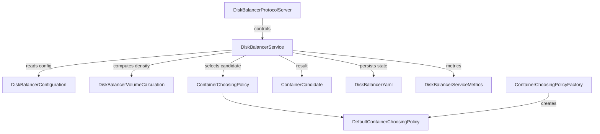

# DN / disk-balancer

**Classes:** 12    **Kinds:** service:7, interface:1, factory:1, dto:1, data:1, metrics:1

## Overview

The `disk-balancer` feature group implements the per-datanode disk balancing service that moves containers among local volumes to equalize disk utilization. `DiskBalancerService` extends `BackgroundService` and runs a configurable number of concurrent balancer threads. Each iteration calls `DiskBalancerVolumeCalculation` to compute per-volume data density, identifies source and destination volumes exceeding or falling below the configured `threshold`, then uses `DefaultContainerChoosingPolicy` to select a container on the overloaded source volume that fits the destination. The actual move copies the container directory to a `tmp/` location on the destination volume and atomically renames it into place, then schedules deferred deletion of the source replica after `replicaDeletionDelay` milliseconds (using monotonic time as of HDDS-15371). `DiskBalancerConfiguration` owns all tunables including `threshold`, `bandwidthInMB`, `parallelThread`, and `replicaDeletionDelay`. Balancer state is persisted to `diskbalancer.info` (YAML via `DiskBalancerYaml`) for crash recovery. `DiskBalancerProtocolServer` exposes an RPC interface so operators can start, stop, and query status without restarting the datanode.

## Diagram

## Class table

### Sub-feature: `container.diskbalancer`

| reading_order | fqcn | kind | logic | loc | study (min) | role |
|--:|---|---|---|--:|--:|---|
| 965 | `org.apache.hadoop.ozone.container.diskbalancer.DiskBalancerService` | service | logic-heavy | 600~ | 60 | A per-datanode disk balancing service takes in charge of moving contains among disks. |
| 966 | `org.apache.hadoop.ozone.container.diskbalancer.DiskBalancerConfiguration` | service | logic-heavy | 275~ | 45 | This class contains configuration values for the DiskBalancer. |
| 967 | `org.apache.hadoop.ozone.container.diskbalancer.DiskBalancerYaml` | service | mixed | 150~ | 45 | Class for creating diskbalancer.info file in yaml format. |
| 968 | `org.apache.hadoop.ozone.container.diskbalancer.DiskBalancerVolumeCalculation` | service | mixed | 100~ | 30 | Utility class for disk balancer volume calculations. |
| 969 | `org.apache.hadoop.ozone.container.diskbalancer.DiskBalancerProtocolServer` | service | mixed | 100~ | 30 | Server-side implementation of DiskBalancerProtocol for datanodes. |
| 970 | `org.apache.hadoop.ozone.container.diskbalancer.ContainerChoosingPolicyFactory` | factory | mixed | 25~ | 20 | A factory to create ContainerChoosingPolicy instances for the DiskBalancer. |
| 971 | `org.apache.hadoop.ozone.container.diskbalancer.DiskBalancerInfo` | dto | logic-heavy | 200~ | 10 | DiskBalancer's information to persist and for report. |
| 972 | `org.apache.hadoop.ozone.container.diskbalancer.DiskBalancerVersion` | data | data-only | 50~ | 10 | Defines versions for the DiskBalancerService. |
| 973 | `org.apache.hadoop.ozone.container.diskbalancer.DiskBalancerServiceMetrics` | metrics | mixed | 100~ | 20 | Metrics related to DiskBalancer Service running on Datanode. |

### Sub-feature: `diskbalancer.policy`

| reading_order | fqcn | kind | logic | loc | study (min) | role |
|--:|---|---|---|--:|--:|---|
| 974 | `org.apache.hadoop.ozone.container.diskbalancer.policy.ContainerChoosingPolicy` | interface | mixed | 25~ | 20 | This interface specifies the policy for choosing volumes and containers to balance. |
| 975 | `org.apache.hadoop.ozone.container.diskbalancer.policy.DefaultContainerChoosingPolicy` | service | mixed | 175~ | 45 | First chooses a source volume and destination volume pair based on ideal utilization and threshold, then chooses a co... |
| 976 | `org.apache.hadoop.ozone.container.diskbalancer.policy.ContainerCandidate` | service | mixed | 25~ | 30 | Result of consolidated volume and container selection for disk balancing. |

## Anchor details

### `DiskBalancerService`

- **path:** `hadoop-hdds/container-service/src/main/java/org/apache/hadoop/ozone/container/diskbalancer/DiskBalancerService.java`
- **loc:** 600~    **difficulty:** 5    **study:** 60 min    **concurrency:** thread-safe    **persistence:** in-memory
- **entry points:** `start`, `call`
- **key collaborators:** `org.apache.hadoop.ozone.container.diskbalancer.policy.ContainerCandidate`, `org.apache.hadoop.ozone.container.diskbalancer.policy.ContainerChoosingPolicy`, `org.apache.hadoop.hdds.conf.ConfigurationSource`, `org.apache.hadoop.hdds.fs.SpaceUsageSource`, `org.apache.hadoop.hdds.scm.container.ContainerID`, `org.apache.hadoop.hdds.scm.container.common.helpers.StorageContainerException`
- **test exemplar:** `hadoop-hdds/container-service/src/test/java/org/apache/hadoop/ozone/container/diskbalancer/TestDiskBalancerService.java`
- **role:** A per-datanode disk balancing service takes in charge of moving contains among disks.

The `pendingDeletionContainers` field is a `ConcurrentSkipListMap<Long, Queue<Container>>` keyed on monotonic deletion time; HDDS-15371 switched from wall clock to monotonic time to prevent premature deletions after NTP adjustments. The `deltaSizes` map tracks bytes freed from source volumes in the current cycle without modifying `committedBytes`, preventing negative committed-space (HDDS-15346).

### `DiskBalancerConfiguration`

- **path:** `hadoop-hdds/container-service/src/main/java/org/apache/hadoop/ozone/container/diskbalancer/DiskBalancerConfiguration.java`
- **loc:** 275~    **difficulty:** 4    **study:** 45 min    **concurrency:** single-threaded    **persistence:** in-memory
- **key collaborators:** `org.apache.hadoop.hdds.HddsUtils`, `org.apache.hadoop.hdds.conf.Config`, `org.apache.hadoop.hdds.conf.ConfigGroup`, `org.apache.hadoop.hdds.conf.ConfigTag`, `org.apache.hadoop.hdds.conf.ConfigType`
- **role:** This class contains configuration values for the DiskBalancer.

The `@PostConstruct`-annotated validation method verifies that `threshold` is in (0, 1) and `bandwidthInMB` is positive; HDDS-15278 added validation of the persisted YAML before applying it, and HDDS-15438 added stricter YAML validation on read.

## Design docs

- `hadoop-hdds/docs/content/design/diskbalancer.md` — original design document for the DiskBalancer feature.
- `hadoop-hdds/docs/content/feature/DiskBalancer.md` — user-facing feature description and CLI usage.

## Seminal JIRAs / PRs

- HDDS-14701. Consolidate DiskBalancerVolumeChoosingPolicy and ContainerChoosingPolicy.
- HDDS-15346. DiskBalancer should update delta sizes atomically.
- HDDS-15371. Use monotonic time for delayed replica deletion.
- HDDS-15524. Container parallel moves can overwrite pending source replica deletions.
- HDDS-15688. Retain in-memory PAUSED state when diskbalancer.info write fails.
- HDDS-15278. Validate persisted config before applying.
- HDDS-13602. Delay delete source container replica to avoid read failure.

## Sharp edges

- `pendingDeletionContainers` is keyed on absolute monotonic time; if the service is restarted the entries are lost and source replicas are never deleted, potentially wasting disk space until the next rebalance cycle (HDDS-15524 addressed a concurrent-move variant of this).
- `DiskBalancerService.operationalState` is `volatile` but multiple state transitions (RUNNING → STOPPING → STOPPED) are not atomic; concurrent `stop()` and `start()` calls can leave the service in an inconsistent state (HDDS-15688 partially mitigates by persisting state before updating in-memory).
- When `diskbalancer.info` is unreadable or missing the service silently starts in STOPPED state, so the operator must re-issue the start command after a crash that corrupts the YAML (HDDS-15438).

## Related features

- `components/dn/hdds-volume.md` — `DiskBalancerVolumeCalculation` reads volume space stats from `HddsVolume`.
- `components/dn/kv-container.md` — `KeyValueContainer` is the concrete type moved by the balancer.
- `components/dn/dn-statemachine.md` — `DiskBalancerProtocolServer` is registered in the datanode RPC server.
- `components/dn/dn-service.md` — `OzoneContainer` starts and holds a reference to `DiskBalancerService`.

## Self-quiz

1. `DiskBalancerService.call()` is the background task entry point. What triggers the method to skip balancing even when the service is RUNNING, and which field controls the threshold?
2. Why does the service use `pendingDeletionContainers` (a deferred deletion queue) rather than deleting the source replica immediately after the container is moved?
3. `DefaultContainerChoosingPolicy` computes "ideal utilization". If one volume has capacity 1 TB and the cluster average utilization is 60%, what is the target ideal usage for that volume?
4. `DiskBalancerYaml` persists `DiskBalancerInfo` to disk. What happens if the YAML is corrupted between writes (e.g., partial write), and which JIRA added protection against this?
5. `DiskBalancerProtocolServer` exposes `getDiskBalancerStatus`. Which datanode sub-system registers this server and on what port does it listen?

Answers

Answer 1: The service skips if the current throughput (bytes moved / elapsed time) exceeds `bandwidthInMB`; it also skips if all volumes are within `threshold` of the ideal density, or if `nextAvailableTime` (bandwidth throttle) has not elapsed.
Answer 2: Deferred deletion allows in-flight reads of the source replica to complete without getting a missing-block error; the delay is configurable via `hdds.datanode.disk.balancer.replica.deletion.delay`.
Answer 3: Target = capacity × ideal_utilization_fraction = 1 TB × 0.60 = 600 GB.
Answer 4: Without atomicity the service could read a partial file and fail to start. HDDS-15290 added an atomic write via `AtomicFileOutputStream`; HDDS-15438 added YAML structure validation before applying.
Answer 5: `DiskBalancerProtocolServer` is registered in `HddsDatanodeClientProtocolServer` which listens on the datanode client RPC port (not the replication port).

