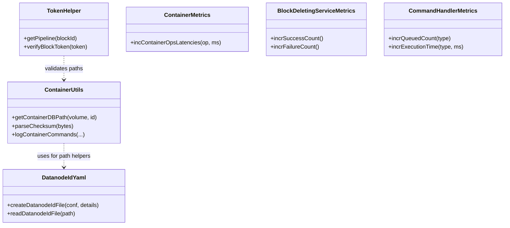

# DN / dn-helpers

**Classes:** 8    **Kinds:** service:5, metrics:3

## Overview

The `dn-helpers` feature group holds cross-cutting utility and metrics classes used throughout the container service layer. `ContainerUtils` provides a mix of static helpers: path computation for container directories, YAML serialization/deserialization helpers, and `StorageContainerException` factory methods. `DatanodeIdYaml` reads and writes the `datanode.id` YAML file that persists `DatanodeDetails` (UUID, ports, network location) across restarts; it is version-aware and annotated with `BelongsToHDDSLayoutVersion` to gate schema changes behind layout finalization. `DatanodeVersionFile` manages the storage-level version file used to detect incompatible upgrades. `TokenHelper` wraps block and container token managers so callers in `KeyValueHandler` need not distinguish between the two token types. Metrics classes (`ContainerMetrics`, `BlockDeletingServiceMetrics`, `CommandHandlerMetrics`) publish per-operation counters and latencies via the Hadoop metrics2 framework.

## Diagram

## Class table

### Sub-feature: `common.helpers`

| reading_order | fqcn | kind | logic | loc | study (min) | role |
|--:|---|---|---|--:|--:|---|
| 1527 | `org.apache.hadoop.ozone.container.common.helpers.ContainerUtils` | service | logic-heavy | 275~ | 45 | A mix of helper functions for containers. |
| 1528 | `org.apache.hadoop.ozone.container.common.helpers.DatanodeIdYaml` | service | logic-heavy | 200~ | 45 | Class for creating datanode.id file in yaml format. |
| 1529 | `org.apache.hadoop.ozone.container.common.helpers.DeletedContainerBlocksSummary` | service | mixed | 75~ | 30 | A helper class to wrap the info about under deletion container blocks. |
| 1530 | `org.apache.hadoop.ozone.container.common.helpers.TokenHelper` | service | mixed | 50~ | 30 | Wraps block and container token managers for datanode. |
| 1531 | `org.apache.hadoop.ozone.container.common.helpers.DatanodeVersionFile` | service | mixed | 25~ | 30 | This is a utility class which helps to create the version file on datanode and also validate the content of the versi... |
| 1532 | `org.apache.hadoop.ozone.container.common.helpers.ContainerMetrics` | metrics | mixed | 150~ | 20 | This class is for maintaining  the various Storage Container DataNode statistics and publishing them through the metr... |
| 1533 | `org.apache.hadoop.ozone.container.common.helpers.BlockDeletingServiceMetrics` | metrics | mixed | 150~ | 20 | Metrics related to Block Deleting Service running on Datanode. |
| 1534 | `org.apache.hadoop.ozone.container.common.helpers.CommandHandlerMetrics` | metrics | mixed | 75~ | 20 | This class collects and exposes metrics for CommandHandlerMetrics. |

## Anchor details

### `ContainerUtils`

- **path:** `hadoop-hdds/container-service/src/main/java/org/apache/hadoop/ozone/container/common/helpers/ContainerUtils.java`
- **loc:** 275~    **difficulty:** 4    **study:** 45 min    **concurrency:** single-threaded    **persistence:** in-memory
- **key collaborators:** `org.apache.hadoop.hdds.HddsConfigKeys`, `org.apache.hadoop.hdds.conf.ConfigurationSource`, `org.apache.hadoop.hdds.fs.SpaceUsageSource`, `org.apache.hadoop.hdds.protocol.DatanodeDetails`, `org.apache.hadoop.hdds.scm.container.common.helpers.StorageContainerException`, `org.apache.hadoop.hdds.utils.HddsServerUtil`
- **test exemplar:** `hadoop-hdds/container-service/src/test/java/org/apache/hadoop/ozone/container/common/helpers/TestContainerUtils.java`
- **role:** A mix of helper functions for containers.

Contains `verifyChecksum(data, checksum)` used by chunk readers and `getContainerDBPath(volume, id)` used when opening per-container RocksDB instances. The method `parseChecksum(bytes, checksumType)` feeds into the container scanner's data scan. HDDS-12151 added a minimum free-space guard here that `HddsDispatcher` calls before accepting a write.

### `DatanodeIdYaml`

- **path:** `hadoop-hdds/container-service/src/main/java/org/apache/hadoop/ozone/container/common/helpers/DatanodeIdYaml.java`
- **loc:** 200~    **difficulty:** 4    **study:** 45 min    **concurrency:** single-threaded    **persistence:** in-memory
- **key collaborators:** `org.apache.hadoop.hdds.conf.ConfigurationSource`, `org.apache.hadoop.hdds.protocol.DatanodeDetails`, `org.apache.hadoop.hdds.server.YamlUtils`, `org.apache.hadoop.hdds.upgrade.BelongsToHDDSLayoutVersion`, `org.apache.hadoop.hdds.upgrade.HDDSLayoutFeature`, `org.apache.hadoop.ozone.container.common.DatanodeLayoutStorage`
- **test exemplar:** `hadoop-hdds/container-service/src/test/java/org/apache/hadoop/ozone/container/common/helpers/TestDatanodeIdYaml.java`
- **role:** Reads and writes the `datanode.id` YAML file that persists `DatanodeDetails`.

The class annotates fields with `@BelongsToHDDSLayoutVersion` to conditionally include or exclude fields based on the current metadata layout version; this prevents older software from choking on new fields during rolling upgrades. HDDS-13955 added graceful handling for an empty or zero-byte `datanode.id` file that can appear after a crash mid-write.

## Design docs

- `hadoop-hdds/docs/content/concept/Datanodes.md` — general overview of the datanode layout and helper layers.

## Seminal JIRAs / PRs

- HDDS-13955. Handle empty `datanode.id` file gracefully.
- HDDS-12151. Fail write when volume is full, considering min free space.
- HDDS-12531. Use `AtomicFileOutputStream` to write YAML files.
- HDDS-14925. Enhance DN disk space management with soft and hard min-freespace limits.
- HDDS-1480. Prefer resolved datanode IP address over persisted IP address.

## Sharp edges

- `DatanodeIdYaml.readDatanodeIdFile` returns `null` if the file is empty (HDDS-13955); callers that do not null-check will NPE at registration time, causing the datanode to fail to start instead of generating a new identity.
- `ContainerUtils` static helpers are stateless but depend on `ConfigurationSource` constants; passing a misconfigured `ConfigurationSource` silently computes wrong paths, which can cause containers to be written to a different volume than expected.

## Related features

- `components/dn/dn-service.md` — `HddsDatanodeService` reads `datanode.id` via `DatanodeIdYaml` at startup.
- `components/dn/kv-container.md` — `KeyValueHandler` uses `ContainerMetrics` from this feature.
- `components/dn/dn-statemachine.md` — `CommandHandlerMetrics` is updated in each `CommandHandler.handle` implementation.
- `components/dn/dn-upgrade.md` — `DatanodeIdYaml` fields are gated behind `HDDSLayoutFeature`.

## Self-quiz

1. `DatanodeIdYaml.createDatanodeIdFile` uses `AtomicFileOutputStream`. Why is this important, and what can happen without it on a crash?
2. `ContainerUtils` contains a minimum-free-space check used by `HddsDispatcher`. Which configuration key controls the minimum free space threshold, and what error code is returned when the volume is too full?
3. `TokenHelper` wraps both block and container token managers. When is a container token required vs. a block token?
4. `DeletedContainerBlocksSummary` is populated by `HeartbeatEndpointTask`. What does it summarize and how does SCM use that information?
5. `BlockDeletingServiceMetrics` tracks success and failure counts. How are these metrics surfaced to operators?

Answers

Answer 1: Without atomic write, a partial file after a crash leaves a corrupt `datanode.id`; on restart the datanode reads a corrupt file and fails to parse `DatanodeDetails`, requiring manual intervention. `AtomicFileOutputStream` writes to a `.tmp` file and renames it atomically.
Answer 2: `hdds.datanode.du.reserved.percent` (or `hdds.datanode.du.reserved`) controls the minimum free space; `DISK_OUT_OF_SPACE` (`Result.DISK_OUT_OF_SPACE`) is returned.
Answer 3: A container token is required for container-level operations (create, close, delete); a block token is required for block-level I/O operations (get/put block, read/write chunk). `TokenHelper.verifyToken` selects the right manager based on the command type.
Answer 4: It summarizes the number of pending-deletion blocks per container, accumulated from the `DeleteBlocksCommand`; SCM uses this to avoid re-sending deletion commands for blocks already queued on the datanode.
Answer 5: Via the Hadoop metrics2 framework (JMX, file sink, or the Prometheus metrics endpoint exposed by the datanode HTTP server).

