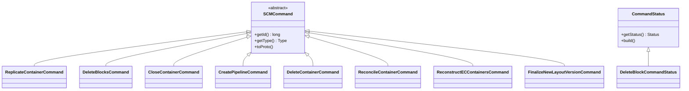

# DN / dn-scm-commands

**Classes:** 17    **Kinds:** cli:14, service:3

## Overview

The `dn-scm-commands` feature group defines the command objects that SCM sends to datanodes via the heartbeat response. `SCMCommand` is the abstract base that carries a command ID (from `HddsIdFactory`) and a `Type` enum; each concrete subclass (`ReplicateContainerCommand`, `DeleteBlocksCommand`, `CloseContainerCommand`, `CreatePipelineCommand`, `ClosePipelineCommand`, `DeleteContainerCommand`, `FinalizeNewLayoutVersionCommand`, `ReconcileContainerCommand`, `ReconstructECContainersCommand`, `SetNodeOperationalStateCommand`, `RefreshVolumeUsageCommand`, `ReregisterCommand`) corresponds to a specific SCM directive. `RegisteredCommand` is the response to a DN registration request. `CommandStatus` and `DeleteBlockCommandStatus` represent the DN's acknowledgment of command processing, sent back to SCM in the next heartbeat via `CommandStatusReportPublisher`. `CommandForDatanode` wraps a command with a destination datanode ID, used in the SCM event queue.

## Diagram

## Class table

### Sub-feature: `protocol.commands`

| reading_order | fqcn | kind | logic | loc | study (min) | role |
|--:|---|---|---|--:|--:|---|
| 836 | `org.apache.hadoop.ozone.protocol.commands.CommandStatus` | service | mixed | 100~ | 30 | A class that is used to communicate status of datanode commands. |
| 837 | `org.apache.hadoop.ozone.protocol.commands.DeleteBlockCommandStatus` | service | mixed | 50~ | 30 | Command status to report about block deletion. |
| 838 | `org.apache.hadoop.ozone.protocol.commands.CommandForDatanode` | service | mixed | 25~ | 30 | Command for the datanode with the destination address. |
| 839 | `org.apache.hadoop.ozone.protocol.commands.ReconstructECContainersCommand` | cli | mixed | 150~ | 20 | SCM command to request reconstruction of EC containers. |
| 840 | `org.apache.hadoop.ozone.protocol.commands.CreatePipelineCommand` | cli | mixed | 125~ | 20 | Asks datanode to create a pipeline. |
| 841 | `org.apache.hadoop.ozone.protocol.commands.ReplicateContainerCommand` | cli | mixed | 75~ | 20 | SCM command to request push-replication of a container to a target datanode. |
| 842 | `org.apache.hadoop.ozone.protocol.commands.CloseContainerCommand` | cli | mixed | 75~ | 20 | Asks datanode to close a container. |
| 843 | `org.apache.hadoop.ozone.protocol.commands.DeleteContainerCommand` | cli | mixed | 75~ | 20 | SCM command which tells the datanode to delete a container. |
| 844 | `org.apache.hadoop.ozone.protocol.commands.RegisteredCommand` | cli | mixed | 75~ | 20 | Response to Datanode Register call. |
| 845 | `org.apache.hadoop.ozone.protocol.commands.ReconcileContainerCommand` | cli | mixed | 50~ | 20 | Asks datanodes to reconcile the specified container with other container replicas. |
| 846 | `org.apache.hadoop.ozone.protocol.commands.SetNodeOperationalStateCommand` | cli | mixed | 50~ | 20 | A command used to persist the current node operational state on the datanode. |
| 847 | `org.apache.hadoop.ozone.protocol.commands.SCMCommand` | cli | mixed | 50~ | 20 | A class that acts as the base class to convert between Java and SCM commands in protobuf format. |
| 848 | `org.apache.hadoop.ozone.protocol.commands.DeleteBlocksCommand` | cli | mixed | 50~ | 20 | A SCM command asks a datanode to delete a number of blocks. |
| 849 | `org.apache.hadoop.ozone.protocol.commands.FinalizeNewLayoutVersionCommand` | cli | mixed | 50~ | 20 | Asks DataNode to Finalize new upgrade version. |
| 850 | `org.apache.hadoop.ozone.protocol.commands.ClosePipelineCommand` | cli | mixed | 50~ | 20 | Asks datanode to close a pipeline. |
| 851 | `org.apache.hadoop.ozone.protocol.commands.ReregisterCommand` | cli | mixed | 25~ | 20 | Informs a datanode to register itself with SCM again. |
| 852 | `org.apache.hadoop.ozone.protocol.commands.RefreshVolumeUsageCommand` | cli | mixed | 25~ | 20 | Asks datanode to refresh disk usage info immediately. |

## Anchor details

_No logic-heavy anchors in this feature; the classes are primarily data / dto / config / cli._

## Design docs

- `hadoop-hdds/docs/content/concept/Datanodes.md` — describes the command flow from SCM to DN.

## Seminal JIRAs / PRs

- HDDS-8882. Manage status of `DeleteBlocksCommand` in SCM to avoid sending duplicates.
- HDDS-13086. Block duplicate reconciliation requests for the same container on the datanode.
- HDDS-13060. Change `NodeManager.addDatanodeCommand(..)` to use `DatanodeID`.

## Sharp edges

- No sharp edges specific to this feature; commands are immutable value objects.

## Related features

- `components/dn/dn-statemachine.md` — `CommandDispatcher` routes each `SCMCommand` subtype to the matching `CommandHandler`.
- `components/dn/dn-service.md` — `HeartbeatEndpointTask` receives the command list from SCM and posts it to `StateContext`.
- `components/dn/container-replication-dn.md` — `ReplicateContainerCommand` is consumed by `ReplicateContainerCommandHandler`.

## Self-quiz

1. `SCMCommand` carries a command ID generated by `HddsIdFactory`. What is the purpose of this ID, and how does SCM use it to avoid resending a command?
2. `DeleteBlockCommandStatus` reports block deletion status back to SCM. What fields distinguish a "pending" status from a "executed" status?
3. `ReconstructECContainersCommand` carries a list of missing EC block indices and target datanodes. Which field specifies the target datanode for each missing stripe?
4. `CommandForDatanode` wraps a command with a `DatanodeDetails`. Where in the SCM code path is this wrapper created, and when is it unwrapped?
5. `RegisteredCommand` is the response to a DN registration. What fields does it carry, and how does the DN use the response to update its local state?

Answers

Answer 1: The command ID allows SCM to correlate `CommandStatus` reports from the DN back to the original command, so SCM can stop retransmitting once the DN has acknowledged execution.
Answer 2: `CommandStatus.Status` is an enum with PENDING, EXECUTED, FAILED; `DeleteBlockCommandStatus` additionally carries a `DeletedBlocksCount` field.
Answer 3: `ECReconstructionCommandInfo.getTargetDatanodes()` returns the list of target datanodes indexed by stripe index.
Answer 4: `CommandForDatanode` is created in SCM's `NodeManager` when a command is queued for a specific datanode; it is unwrapped in `HeartbeatEndpointTask` when building the heartbeat response, extracting the raw `SCMCommand` for the dn-side handler.
Answer 5: `RegisteredCommand` carries the assigned `DatanodeDetails` (possibly with updated ports or IP) and the cluster ID; the DN updates its `DatanodeLayoutStorage` with the confirmed details.

