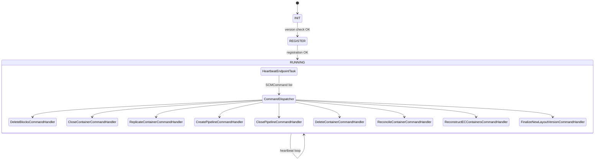

# DN / dn-statemachine

**Classes:** 21    **Kinds:** service:16, interface:3, data:1, metrics:1

## Overview

The `dn-statemachine` feature group implements the datanode's SCM-facing state machine and its command-dispatch subsystem. `DatanodeStateMachine` owns the central event loop that calls `StateContext.execute()` on a scheduled executor; `StateContext` maintains the active `DatanodeState` (INIT → REGISTER → RUNNING) and the per-endpoint `EndpointStateMachine` instances. `SCMConnectionManager` discovers and tracks RPC connections to all SCM nodes and Recon, creating `EndpointStateMachine` objects for each. `CommandDispatcher` receives `SCMCommand` objects from `HeartbeatEndpointTask` and routes each to the matching `CommandHandler` implementation; all handlers share the same `(SCMConnectionManager, StateContext)` constructor arguments. `DeleteBlocksCommandHandler` is the most complex handler: it uses a dedicated actor thread and a bounded queue to decouple SCM-side command receipt from the actual `BlockDeletingTask` execution; HDDS-13472 added a datanode shutdown on unrecoverable `Error` from block deletion. `DatanodeConfiguration` is the `@ConfigGroup`-annotated config bean covering block deletion threads, container close threads, disk check intervals, and the container checksum lock stripe count; it supports live reconfiguration via `ReconfigurableConfig`.

## Diagram

## Class table

### Sub-feature: `common.statemachine`

| reading_order | fqcn | kind | logic | loc | study (min) | role |
|--:|---|---|---|--:|--:|---|
| 807 | `org.apache.hadoop.ozone.container.common.statemachine.SCMConnectionManagerMXBean` | interface | mixed | 25~ | 20 | JMX information about the connected SCM servers. |
| 808 | `org.apache.hadoop.ozone.container.common.statemachine.EndpointStateMachineMBean` | interface | mixed | 25~ | 20 | JMX representation of an EndpointStateMachine. |
| 809 | `org.apache.hadoop.ozone.container.common.statemachine.DatanodeConfiguration` | service | logic-heavy | 1000~ | 60 | Configuration class used for high level datanode configuration parameters. |
| 810 | `org.apache.hadoop.ozone.container.common.statemachine.StateContext` | service | logic-heavy | 650~ | 60 | Current Context of State Machine. |
| 811 | `org.apache.hadoop.ozone.container.common.statemachine.DatanodeStateMachine` | service | logic-heavy | 475~ | 60 | State Machine Class. |
| 812 | `org.apache.hadoop.ozone.container.common.statemachine.SCMConnectionManager` | service | logic-heavy | 200~ | 45 | SCMConnectionManager - Acts as a class that manages the membership information of the SCMs that we are working with. |
| 813 | `org.apache.hadoop.ozone.container.common.statemachine.EndpointStateMachine` | service | mixed | 150~ | 10 | Endpoint is used as holder class that keeps state around the RPC endpoint. |
| 814 | `org.apache.hadoop.ozone.container.common.statemachine.DatanodeQueueMetrics` | metrics | mixed | 125~ | 20 | Class contains metrics related to Datanode queues. |

### Sub-feature: `statemachine.commandhandler`

| reading_order | fqcn | kind | logic | loc | study (min) | role |
|--:|---|---|---|--:|--:|---|
| 815 | `org.apache.hadoop.ozone.container.common.statemachine.commandhandler.CommandHandler` | interface | mixed | 25~ | 20 | Generic interface for handlers. |
| 816 | `org.apache.hadoop.ozone.container.common.statemachine.commandhandler.DeleteBlocksCommandHandler` | service | logic-heavy | 575~ | 60 | Handle block deletion commands. |
| 817 | `org.apache.hadoop.ozone.container.common.statemachine.commandhandler.DeleteContainerCommandHandler` | service | mixed | 125~ | 30 | Handler to process the DeleteContainerCommand from SCM. |
| 818 | `org.apache.hadoop.ozone.container.common.statemachine.commandhandler.CloseContainerCommandHandler` | service | mixed | 125~ | 30 | Handler for close container command received from SCM. |
| 819 | `org.apache.hadoop.ozone.container.common.statemachine.commandhandler.ClosePipelineCommandHandler` | service | mixed | 125~ | 30 | Handler for close pipeline command received from SCM. |
| 820 | `org.apache.hadoop.ozone.container.common.statemachine.commandhandler.CreatePipelineCommandHandler` | service | mixed | 100~ | 30 | Handler for create pipeline command received from SCM. |
| 821 | `org.apache.hadoop.ozone.container.common.statemachine.commandhandler.CommandDispatcher` | service | mixed | 100~ | 30 | Dispatches command to the correct handler. |
| 822 | `org.apache.hadoop.ozone.container.common.statemachine.commandhandler.SetNodeOperationalStateCommandHandler` | service | mixed | 75~ | 30 | Handle the SetNodeOperationalStateCommand sent from SCM to the datanode to persist the current operational state. |
| 823 | `org.apache.hadoop.ozone.container.common.statemachine.commandhandler.ReconstructECContainersCommandHandler` | service | mixed | 50~ | 30 | Command handler for reconstructing the lost EC containers. |
| 824 | `org.apache.hadoop.ozone.container.common.statemachine.commandhandler.RefreshVolumeUsageCommandHandler` | service | mixed | 50~ | 30 | Command handler to refresh usage info of all volumes. |
| 825 | `org.apache.hadoop.ozone.container.common.statemachine.commandhandler.ReplicateContainerCommandHandler` | service | mixed | 50~ | 30 | Command handler to push containers to a target datanode. |
| 826 | `org.apache.hadoop.ozone.container.common.statemachine.commandhandler.ReconcileContainerCommandHandler` | service | mixed | 50~ | 30 | Handles commands from SCM to reconcile a container replica on this datanode with the replicas on its peers. |
| 827 | `org.apache.hadoop.ozone.container.common.statemachine.commandhandler.FinalizeNewLayoutVersionCommandHandler` | service | mixed | 50~ | 30 | Handler for FinalizeNewLayoutVersion command received from SCM. |

## Anchor details

### `DatanodeConfiguration`

- **path:** `hadoop-hdds/container-service/src/main/java/org/apache/hadoop/ozone/container/common/statemachine/DatanodeConfiguration.java`
- **loc:** 1000~    **difficulty:** 5    **study:** 60 min    **concurrency:** single-threaded    **persistence:** RocksDB
- **key collaborators:** `org.apache.hadoop.hdds.conf.Config`, `org.apache.hadoop.hdds.conf.ConfigGroup`, `org.apache.hadoop.hdds.conf.ConfigTag`, `org.apache.hadoop.hdds.conf.ConfigType`, `org.apache.hadoop.hdds.conf.PostConstruct`, `org.apache.hadoop.hdds.conf.ReconfigurableConfig`
- **test exemplar:** `hadoop-hdds/container-service/src/test/java/org/apache/hadoop/ozone/container/common/statemachine/TestDatanodeConfiguration.java`
- **role:** `@ConfigGroup`-annotated configuration bean for all high-level datanode parameters.

Key parameters include `hdds.datanode.block.delete.threads.max` (thread pool size for `DeleteBlocksCommandHandler`), `containerChecksumLockStripes` (striped lock count for `ContainerChecksumTreeManager`), and `hdds.datanode.periodic.disk.check.interval.minutes`. The `@PostConstruct` validation method asserts that pool sizes are at least 1 and that intervals are positive; HDDS-15405 fixed a bug where `BackgroundService` pool size was not updated when the config was live-reconfigured.

### `StateContext`

- **path:** `hadoop-hdds/container-service/src/main/java/org/apache/hadoop/ozone/container/common/statemachine/StateContext.java`
- **loc:** 650~    **difficulty:** 5    **study:** 60 min    **concurrency:** thread-safe    **persistence:** in-memory
- **entry points:** `execute`
- **key collaborators:** `org.apache.hadoop.ozone.container.common.statemachine.commandhandler.ClosePipelineCommandHandler`, `org.apache.hadoop.hdds.conf.ConfigurationSource`, `org.apache.hadoop.hdds.scm.net.HostAndPort`, `org.apache.hadoop.ozone.container.common.states.DatanodeState`, `org.apache.hadoop.ozone.container.common.states.datanode.InitDatanodeState`, `org.apache.hadoop.ozone.container.common.states.datanode.RunningDatanodeState`
- **test exemplar:** `hadoop-hdds/container-service/src/test/java/org/apache/hadoop/ozone/container/common/statemachine/TestStateContext.java`
- **role:** Carries all mutable state shared among endpoint tasks and command handlers.

`StateContext` exposes two key queues: `containerActions` (pending ICRs and full container reports) and `commandQueue` (incoming SCM commands). Both are drained by `HeartbeatEndpointTask` during each heartbeat. The `nextState` field tracks the `DatanodeState` that `execute()` should transition to on the next iteration.

### `DeleteBlocksCommandHandler`

- **path:** `hadoop-hdds/container-service/src/main/java/org/apache/hadoop/ozone/container/common/statemachine/commandhandler/DeleteBlocksCommandHandler.java`
- **loc:** 575~    **difficulty:** 5    **study:** 60 min    **concurrency:** actor/queue    **persistence:** in-memory
- **entry points:** `handle`, `run`, `call`
- **key collaborators:** `org.apache.hadoop.ozone.container.common.statemachine.DatanodeConfiguration`, `org.apache.hadoop.ozone.container.common.statemachine.SCMConnectionManager`, `org.apache.hadoop.ozone.container.common.statemachine.StateContext`, `org.apache.hadoop.hdds.conf.ConfigurationSource`, `org.apache.hadoop.hdds.scm.container.common.helpers.StorageContainerException`, `org.apache.hadoop.hdds.upgrade.HDDSLayoutFeature`
- **test exemplar:** `hadoop-hdds/container-service/src/test/java/org/apache/hadoop/ozone/container/common/statemachine/commandhandler/TestDeleteBlocksCommandHandler.java`
- **role:** Receives `DeleteBlocksCommand` from SCM and queues deletion transactions to `BlockDeletingService`.

`handle()` deserializes the `DeletedBlocksTransaction` list and passes each transaction to `BlockDeletingService` via an internal bounded queue. The actor thread (`run()`) drains the queue and invokes `BlockDeletingTask`. HDDS-13472 added an explicit `System.exit()` if an `Error` (e.g., `OutOfMemoryError`) escapes from the deletion task, to prevent silent data corruption from a half-deleted block.

### `DatanodeStateMachine`

- **path:** `hadoop-hdds/container-service/src/main/java/org/apache/hadoop/ozone/container/common/statemachine/DatanodeStateMachine.java`
- **loc:** 475~    **difficulty:** 5    **study:** 60 min    **concurrency:** thread-safe    **persistence:** in-memory
- **entry points:** `close`
- **key collaborators:** `org.apache.hadoop.ozone.container.common.statemachine.commandhandler.CloseContainerCommandHandler`, `org.apache.hadoop.ozone.container.common.statemachine.commandhandler.ClosePipelineCommandHandler`, `org.apache.hadoop.ozone.container.common.statemachine.commandhandler.CommandDispatcher`, `org.apache.hadoop.ozone.container.common.statemachine.commandhandler.CreatePipelineCommandHandler`, `org.apache.hadoop.ozone.container.common.statemachine.commandhandler.DeleteBlocksCommandHandler`, `org.apache.hadoop.ozone.container.common.statemachine.commandhandler.DeleteContainerCommandHandler`
- **test exemplar:** `hadoop-hdds/container-service/src/test/java/org/apache/hadoop/ozone/container/common/TestDatanodeStateMachine.java`
- **role:** State Machine Class.

### `SCMConnectionManager`

- **path:** `hadoop-hdds/container-service/src/main/java/org/apache/hadoop/ozone/container/common/statemachine/SCMConnectionManager.java`
- **loc:** 200~    **difficulty:** 4    **study:** 45 min    **concurrency:** thread-safe    **persistence:** in-memory
- **entry points:** `close`
- **key collaborators:** `org.apache.hadoop.hdds.conf.ConfigurationSource`, `org.apache.hadoop.hdds.scm.net.HostAndPort`, `org.apache.hadoop.hdds.utils.LegacyHadoopConfigurationSource`, `org.apache.hadoop.ozone.protocolPB.ReconDatanodeProtocolPB`, `org.apache.hadoop.ozone.protocolPB.StorageContainerDatanodeProtocolClientSideTranslatorPB`, `org.apache.hadoop.ozone.protocolPB.StorageContainerDatanodeProtocolPB`
- **test exemplar:** `hadoop-hdds/container-service/src/test/java/org/apache/hadoop/ozone/container/common/statemachine/TestSCMConnectionManager.java`
- **role:** SCMConnectionManager - Acts as a class that manages the membership information of the SCMs that we are working with.

## Design docs

- `hadoop-hdds/docs/content/concept/Datanodes.md` — describes the state machine and SCM heartbeat protocol.

## Seminal JIRAs / PRs

- HDDS-13472. Shut down datanode if Error occurs while processing delete blocks command.
- HDDS-15533. DNS refresh on heartbeat failure for DN to SCM.
- HDDS-15682. Use the original configured host and port to identify SCM nodes.
- HDDS-13890. Datanode supports dynamic configuration of SCM (ozone.scm.nodes reconfiguration).
- HDDS-15369. Fix datanode shutdown on `ozone.scm.nodes` reconfig.
- HDDS-15066. Read-Write Lock race leaves stale references creating orphan replicas.
- HDDS-15405. `BackgroundService` pool size unchanged by reconfiguration.

## Sharp edges

- `SCMConnectionManager.getEndpoints()` returns a snapshot of active SCM endpoints; if SCM nodes are reconfigured via `ozone.scm.nodes`, HDDS-15369 fixed a deadlock where the old endpoint list was held across a restart, but the reconfiguration path is still sensitive to lock ordering.
- `DeleteBlocksCommandHandler`'s bounded actor queue can overflow if SCM sends deletion commands faster than the DN can process them; once the queue is full, new commands are dropped and SCM will resend them (no explicit drop logging was added, making diagnosis difficult).

## Related features

- `components/dn/dn-service.md` — `OzoneContainer` and `HddsDatanodeService` own the lifecycle that `DatanodeStateMachine` drives.
- `components/dn/dn-reports.md` — report publishers post to `StateContext` which is drained by `HeartbeatEndpointTask`.
- `components/dn/ratis-statemachine-dn.md` — `ContainerStateMachine` handles Ratis-level writes independently of this state machine.
- `components/dn/container-replication-dn.md` — `ReplicateContainerCommandHandler` delegates to `ReplicationSupervisor`.

## Self-quiz

1. `DatanodeStateMachine` uses a `ScheduledExecutorService`. What is the period between state machine iterations, and which configuration key controls it?
2. `DeleteBlocksCommandHandler` uses an actor/queue pattern. What is the bounded capacity of the queue, and what happens when it is full?
3. `SCMConnectionManager` maintains multiple `EndpointStateMachine` instances (one per SCM address). When does it add a new endpoint, and when does it remove one?
4. `DatanodeConfiguration` is a `ReconfigurableConfig`. Which methods must it implement to support live reconfiguration, and which configuration keys are dynamically reconfigurable?
5. `StateContext.execute()` delegates to the current `DatanodeState`. Describe the responsibility of `InitDatanodeState.execute()` versus `RunningDatanodeState.execute()`.

Answers

Answer 1: `hdds.datanode.periodic.disk.check.interval.minutes` (default: `TODO(verify)`); the state machine heartbeat interval is separate and controlled by `hdds.heartbeat.interval`.
Answer 2: `TODO(verify)` — the queue capacity is set in the `DeleteBlocksCommandHandler` constructor (typically configured via `DatanodeConfiguration`); when full, `offer()` returns false and the command is dropped without error logging.
Answer 3: `SCMConnectionManager` adds an endpoint when `ozone.scm.nodes` is configured or reconfigured; it removes an endpoint when the SCM address is removed from configuration (HDDS-15369 covers the removal path).
Answer 4: It must implement `reconfigureProperty(String, String)` from `ReconfigurableConfig`; reconfigurable keys include `hdds.datanode.block.delete.threads.max` and disk check interval.
Answer 5: `InitDatanodeState.execute()` establishes the initial RPC connection to SCM and invokes `VersionEndpointTask`; `RunningDatanodeState.execute()` iterates over all endpoints and calls `HeartbeatEndpointTask` (and `RegisterEndpointTask` if not yet registered) for each one.

