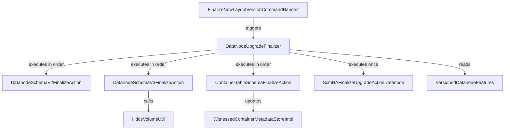

# DN / dn-upgrade

**Classes:** 7    **Kinds:** service:7

## Overview

The `dn-upgrade` feature group implements the datanode-side upgrade finalization framework. `DataNodeUpgradeFinalizer` extends the common `AbstractUpgradeFinalizer` and is invoked by `FinalizeNewLayoutVersionCommandHandler` when SCM signals that all nodes in the cluster are ready to finalize. It iterates through the registered `HDDSUpgradeAction` implementations in layout version order. Three concrete actions are defined: `DatanodeSchemaV2FinalizeAction` (baseline first upgrade), `DatanodeSchemaV3FinalizeAction` (migrates containers to per-disk RocksDB schema v3 via `HddsVolumeUtil`), and `ContainerTableSchemaFinalizeAction` (updates `containerIds` table values from string to proto format). `ScmHAFinalizeUpgradeActionDatanode` runs the SCM HA upgrade path exactly once by checking a marker in the layout storage. `VersionedDatanodeFeatures` maps each `HDDSLayoutFeature` to the corresponding schema version string used in `KeyValueContainerData`.

## Diagram

## Class table

### Sub-feature: `container.upgrade`

| reading_order | fqcn | kind | logic | loc | study (min) | role |
|--:|---|---|---|--:|--:|---|
| 1595 | `org.apache.hadoop.ozone.container.upgrade.VersionedDatanodeFeatures` | service | mixed | 75~ | 30 | Utility class to retrieve the version of a feature that corresponds to the metadata layout version specified by the p... |
| 1596 | `org.apache.hadoop.ozone.container.upgrade.ScmHAFinalizeUpgradeActionDatanode` | service | mixed | 75~ | 30 | Action to run upgrade flow for SCM HA exactly once. |
| 1597 | `org.apache.hadoop.ozone.container.upgrade.DataNodeUpgradeFinalizer` | service | mixed | 50~ | 30 | UpgradeFinalizer for the DataNode. |
| 1598 | `org.apache.hadoop.ozone.container.upgrade.ContainerTableSchemaFinalizeAction` | service | mixed | 50~ | 30 | Upgrade Action for DataNode for update the table schema data of containerIds Table. |
| 1599 | `org.apache.hadoop.ozone.container.upgrade.DatanodeSchemaV3FinalizeAction` | service | mixed | 25~ | 30 | Upgrade Action for DataNode for SCHEMA V3. |
| 1600 | `org.apache.hadoop.ozone.container.upgrade.DatanodeSchemaV2FinalizeAction` | service | mixed | 25~ | 30 | Upgrade Action for DataNode for the very first first Upgrade Version. |
| 1601 | `org.apache.hadoop.ozone.container.upgrade.UpgradeUtils` | service | mixed | 25~ | 30 | Util methods for upgrade. |

## Anchor details

_No logic-heavy anchors in this feature; the classes are primarily data / dto / config / cli._

## Design docs

- `hadoop-hdds/docs/content/feature/dn-merge-rocksdb.md` — describes the schema v3 migration that `DatanodeSchemaV3FinalizeAction` performs.

## Seminal JIRAs / PRs

- HDDS-6597. Non-rolling upgrade supports container schema v3 (`DatanodeSchemaV3FinalizeAction` introduced).
- HDDS-6760. SCM HA finalization: happy path (`ScmHAFinalizeUpgradeActionDatanode` introduced).
- HDDS-14569. Remove support for upgrade actions that run outside of finalization.
- HDDS-13176. `containerIds` table value format changed to proto (`ContainerTableSchemaFinalizeAction`).

## Sharp edges

- `DatanodeSchemaV3FinalizeAction.execute()` migrates all container RocksDB instances to a per-disk layout; this is not reversible without downgrade to a pre-schema-v3 binary, as the new layout is incompatible with older datanodes.

## Related features

- `components/dn/dn-rocksdb.md` — schema v3 stores are initialized by `DatanodeStoreSchemaThreeImpl`.
- `components/dn/dn-statemachine.md` — `FinalizeNewLayoutVersionCommandHandler` triggers `DataNodeUpgradeFinalizer`.
- `components/dn/hdds-volume.md` — `DbVolume` is the per-disk DB volume created by `DatanodeSchemaV3FinalizeAction`.

## Self-quiz

1. `DataNodeUpgradeFinalizer` iterates upgrade actions in layout version order. What mechanism ensures actions are executed in the correct order and not re-executed after a restart?
2. `ContainerTableSchemaFinalizeAction.execute()` updates the `containerIds` table values. Does it use a single batch write, and what happens if the node crashes mid-migration?
3. `VersionedDatanodeFeatures` maps layout features to schema version strings. Which schema version is returned for `HDDSLayoutFeature.DATANODE_SCHEMA_V3`?
4. `ScmHAFinalizeUpgradeActionDatanode` runs "exactly once". How does it detect that it has already run?
5. After `DatanodeSchemaV3FinalizeAction` completes, are schema v1 and v2 container RocksDB instances deleted immediately or left on disk?

Answers

Answer 1: The `HDDSLayoutVersionManager` persists the current layout version in storage; each action checks `HDDSLayoutVersionManager.getMetadataLayoutVersion()` and only runs if the action's layout version is greater than the persisted version.
Answer 2: `TODO(verify)` — it is expected to use batched writes per container entry; if the node crashes mid-migration, the finalizer re-runs from the last committed layout version (idempotent per-container updates).
Answer 3: `VersionedDatanodeFeatures.getSchemaVersion(HDDSLayoutFeature.DATANODE_SCHEMA_V3)` returns `"3"`.
Answer 4: It writes a marker to `DatanodeLayoutStorage` that records the SCM HA upgrade as done; on restart it checks this marker before running.
Answer 5: Schema v1/v2 RocksDB instances are not deleted by the finalization action; they remain on disk until the operator or a subsequent cleanup tool removes them.

