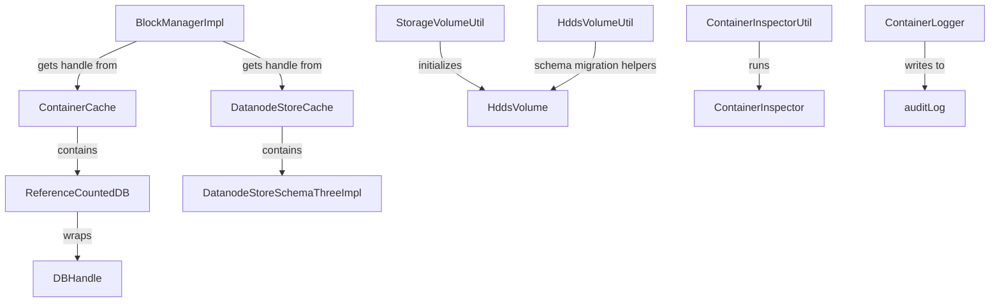

# DN / dn-utils

**Classes:** 11    **Kinds:** service:8, interface:1, abstract:1, metrics:1

## Overview

The `dn-utils` feature group provides shared utility infrastructure used across the container service layer. `ContainerCache` is a thread-safe LRU map (`SynchronizedLRUMap`) that maps container paths to `ReferenceCountedDB` handles; it prevents redundant RocksDB opens and ensures handles are closed only when all users have released them. `ReferenceCountedDB` wraps a `DBHandle` with an atomic reference count; `close()` decrements the count and calls the actual DB close only when it reaches zero. `DatanodeStoreCache` is the v3-specific cache (by `HddsVolume` path → `DatanodeStoreSchemaThreeImpl`) that replaces `ContainerCache` for per-disk schema v3 stores. `StorageVolumeUtil` initializes a volume directory's `VERSION` file and validates its content on startup. `HddsVolumeUtil` provides helpers for schema migration and for deriving container and DB paths from an `HddsVolume`. `ContainerInspectorUtil` manages pluggable `ContainerInspector` implementations that log container metadata during datanode startup. `ContainerLogger` writes container operation events to the datanode container audit log.

## Diagram

## Class table

### Sub-feature: `common.utils`

| reading_order | fqcn | kind | logic | loc | study (min) | role |
|--:|---|---|---|--:|--:|---|
| 1602 | `org.apache.hadoop.ozone.container.common.utils.DiskCheckUtil` | service | mixed | 150~ | 20 | Utility class that supports checking disk health when provided a directory where the disk is mounted. |
| 1603 | `org.apache.hadoop.ozone.container.common.utils.StorageVolumeUtil` | service | mixed | 175~ | 45 | A util class for StorageVolume. |
| 1604 | `org.apache.hadoop.ozone.container.common.utils.ContainerCache` | service | mixed | 150~ | 45 | container cache is a LRUMap that maintains the DB handles. |
| 1605 | `org.apache.hadoop.ozone.container.common.utils.ContainerLogger` | service | mixed | 75~ | 30 | Utility class defining methods to write to the datanode container log. |
| 1606 | `org.apache.hadoop.ozone.container.common.utils.HddsVolumeUtil` | service | mixed | 75~ | 30 | A util class for HddsVolume. |
| 1607 | `org.apache.hadoop.ozone.container.common.utils.DatanodeStoreCache` | service | mixed | 75~ | 30 | Cache for all per-disk DB handles under schema v3. |
| 1608 | `org.apache.hadoop.ozone.container.common.utils.ContainerInspectorUtil` | service | mixed | 50~ | 30 | Utility class to manage container inspectors. |
| 1609 | `org.apache.hadoop.ozone.container.common.utils.ReferenceCountedDB` | service | mixed | 50~ | 30 | Class to implement reference counting over instances handed by Container Cache. |
| 1610 | `org.apache.hadoop.ozone.container.common.utils.RawDB` | service | mixed | 25~ | 30 | Just a wrapper for DatanodeStore. |
| 1611 | `org.apache.hadoop.ozone.container.common.utils.ContainerCacheMetrics` | metrics | mixed | 50~ | 20 | Metrics for the usage of ContainerDB. |

### Sub-feature: `utils.db`

| reading_order | fqcn | kind | logic | loc | study (min) | role |
|--:|---|---|---|--:|--:|---|
| 1612 | `org.apache.hadoop.ozone.container.common.utils.db.DatanodeDBProfile` | abstract | mixed | 75~ | 30 | The class manages DBProfiles for Datanodes. |

## Anchor details

_No logic-heavy anchors in this feature; the classes are primarily data / dto / config / cli._

## Design docs

- no dedicated design doc under hadoop-hdds/docs/content/ on this branch.

## Seminal JIRAs / PRs

- HDDS-15623. Disk check may not completely read test file (`DiskCheckUtil`).
- HDDS-14888. Improve `DiskCheckUtil.checkReadWrite` to tolerate disk full.
- HDDS-15455. Implement Custom DataNode Container Directory Discovery and Duplicate Detection (uses `StorageVolumeUtil`).
- HDDS-13629. Upgrade commons-collections to commons-collections4 (affects `ContainerCache`).

## Sharp edges

- `ContainerCache` is a synchronized LRU map; eviction calls `close()` on the evicted `ReferenceCountedDB`. If there are still live readers holding the handle when it is evicted, the reference count will be &gt; 0 and the underlying DB will not close immediately — but the handle is removed from the cache map, so the next `getDB()` call will open a new DB instance for the same path. This can momentarily leave two open handles for the same path if the eviction race is not handled carefully.

## Related features

- `components/dn/dn-rocksdb.md` — `AbstractDatanodeStore` is the DB implementation managed by `ReferenceCountedDB`.
- `components/dn/kv-container-impl.md` — `BlockManagerImpl` obtains DB handles via `BlockUtils.getDB(containerData, conf)` which calls into `ContainerCache`.
- `components/dn/hdds-volume.md` — `StorageVolumeUtil.checkVolume()` calls `DiskCheckUtil` during periodic health checks.

## Self-quiz

1. `ContainerCache.getDB(containerData, conf)` opens a RocksDB if not cached. What happens if two threads call `getDB()` for the same container simultaneously?
2. `ReferenceCountedDB.close()` decrements a count and conditionally closes the underlying DB. What is the contract for callers — must they call `close()` after every `getDB()` call?
3. `DiskCheckUtil.checkReadWrite(dir)` writes a test file. Why is it important that the test file is deleted even when the check fails?
4. `ContainerInspectorUtil.process(containerData, store)` invokes all registered inspectors. When is this called during the datanode lifecycle?
5. `ContainerLogger` writes to a separate container audit log. Which log file name is used, and is it the same as the datanode audit log?

Answers

Answer 1: `ContainerCache` uses `synchronized` on the LRU map; the second thread blocks until the first has inserted the new handle, then finds it already cached. However if both threads open independently before either inserts, the later winner will close the earlier-opened DB — this is a subtle race. In practice, schema v3 uses `DatanodeStoreCache` which uses `ConcurrentHashMap.computeIfAbsent` to avoid this.
Answer 2: Yes; every `getDB()` call increments the reference count and must be balanced by a matching `close()` call, typically done via try-with-resources on `ReferenceCountedDB`.
Answer 3: Left-over test files from failed checks can fill the disk or confuse disk-usage accounting.
Answer 4: `ContainerInspectorUtil.process()` is called by `ContainerReader` for each container loaded at startup (controlled by a configuration flag that enables inspection mode).
Answer 5: The container log is written to a separate file named `container.log` (or similar) under the datanode log directory; it is not the same as the datanode audit log.

