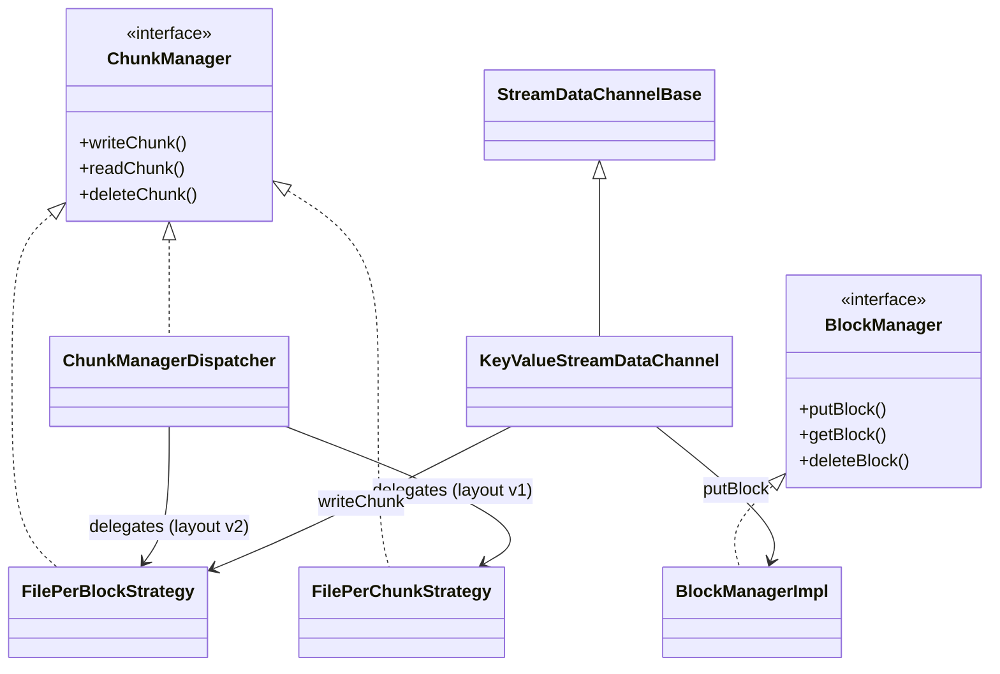

# DN / kv-container-impl

**Classes:** 10    **Kinds:** service:8, abstract:1, factory:1

## Overview

The `kv-container-impl` feature group contains the concrete implementations of `BlockManager` and `ChunkManager` for KeyValue containers. `BlockManagerImpl` implements `BlockManager` against RocksDB: `putBlock` writes a `BlockData` proto to the `blockDataTable`, `getBlock` reads it, and `deleteBlock` marks it pending-deletion. `FilePerBlockStrategy` (the current default) implements `ChunkManager` by storing all chunks for a block in a single file; reads use `MappedBufferManager` to reuse mapped byte buffers for performance. `FilePerChunkStrategy` (legacy) stores each chunk as a separate file. `ChunkManagerDispatcher` selects between the two strategies based on the container's layout version. `KeyValueStreamDataChannel` bridges the Ratis streaming write path (`StreamDataChannelBase`) to `BlockManagerImpl` and `FilePerBlockStrategy`. `Buffers` accumulates Ratis streaming write buffers until the block is finalized. `ChunkManagerDummyImpl` is used for performance testing only.

## Diagram

## Class table

### Sub-feature: `keyvalue.impl`

| reading_order | fqcn | kind | logic | loc | study (min) | role |
|--:|---|---|---|--:|--:|---|
| 186 | `org.apache.hadoop.ozone.container.keyvalue.impl.StreamDataChannelBase` | abstract | mixed | 100~ | 30 | For write state machine data. |
| 187 | `org.apache.hadoop.ozone.container.keyvalue.impl.FilePerBlockStrategy` | service | logic-heavy | 275~ | 45 | This class is for performing chunk related operations. |
| 188 | `org.apache.hadoop.ozone.container.keyvalue.impl.BlockManagerImpl` | service | logic-heavy | 275~ | 45 | This class is for performing block related operations on the KeyValue Container. |
| 189 | `org.apache.hadoop.ozone.container.keyvalue.impl.FilePerChunkStrategy` | service | logic-heavy | 225~ | 45 | This class is for performing chunk related operations. |
| 190 | `org.apache.hadoop.ozone.container.keyvalue.impl.KeyValueStreamDataChannel` | service | mixed | 175~ | 45 | This class is used to get the DataChannel for streaming. |
| 191 | `org.apache.hadoop.ozone.container.keyvalue.impl.ChunkManagerDispatcher` | service | mixed | 100~ | 30 | Selects ChunkManager implementation to use for each chunk operation. |
| 192 | `org.apache.hadoop.ozone.container.keyvalue.impl.MappedBufferManager` | service | mixed | 75~ | 30 | A Manager who manages the mapped buffers to under a predefined total count, also support reuse mapped buffers. |
| 193 | `org.apache.hadoop.ozone.container.keyvalue.impl.ChunkManagerDummyImpl` | service | mixed | 75~ | 30 | Implementation of ChunkManager built for running performance tests. |
| 194 | `org.apache.hadoop.ozone.container.keyvalue.impl.Buffers` | service | mixed | 50~ | 30 | Keep the last org.apache.hadoop.ozone.container.keyvalue.impl.Buffers#max bytes in the buffer in order to create putB... |
| 195 | `org.apache.hadoop.ozone.container.keyvalue.impl.ChunkManagerFactory` | factory | mixed | 25~ | 20 | Select an appropriate ChunkManager implementation as per config setting. |

## Anchor details

### `FilePerBlockStrategy`

- **path:** `hadoop-hdds/container-service/src/main/java/org/apache/hadoop/ozone/container/keyvalue/impl/FilePerBlockStrategy.java`
- **loc:** 275~    **difficulty:** 4    **study:** 45 min    **concurrency:** thread-safe    **persistence:** in-memory
- **entry points:** `close`
- **key collaborators:** `org.apache.hadoop.hdds.client.BlockID`, `org.apache.hadoop.hdds.scm.container.common.helpers.StorageContainerException`, `org.apache.hadoop.ozone.common.ChunkBuffer`, `org.apache.hadoop.ozone.common.ChunkBufferToByteString`, `org.apache.hadoop.ozone.container.common.helpers.BlockData`, `org.apache.hadoop.ozone.container.common.helpers.ChunkInfo`
- **test exemplar:** `hadoop-hdds/container-service/src/test/java/org/apache/hadoop/ozone/container/keyvalue/impl/TestFilePerBlockStrategy.java`
- **role:** `ChunkManager` implementation storing all chunks for a block in a single file.

`writeChunk()` positions at `chunkInfo.getOffset()` within the block file and writes the chunk buffer; read uses `MappedBufferManager` to memory-map the block file and return a `ByteString`-backed buffer without copying. HDDS-15357 fixed a `WeakReference` race in `MappedBufferManager` where a GC-collected mapping was reused before remapping, causing data corruption.

### `BlockManagerImpl`

- **path:** `hadoop-hdds/container-service/src/main/java/org/apache/hadoop/ozone/container/keyvalue/impl/BlockManagerImpl.java`
- **loc:** 275~    **difficulty:** 4    **study:** 45 min    **concurrency:** single-threaded    **persistence:** RocksDB
- **key collaborators:** `org.apache.hadoop.hdds.client.BlockID`, `org.apache.hadoop.hdds.conf.ConfigurationSource`, `org.apache.hadoop.hdds.scm.ScmConfigKeys`, `org.apache.hadoop.hdds.scm.container.common.helpers.StorageContainerException`, `org.apache.hadoop.hdds.upgrade.HDDSLayoutFeature`, `org.apache.hadoop.hdds.utils.db.BatchOperation`
- **test exemplar:** `hadoop-hdds/container-service/src/test/java/org/apache/hadoop/ozone/container/keyvalue/impl/TestBlockManagerImpl.java`
- **role:** This class is for performing block related operations on the KeyValue Container.

### `FilePerChunkStrategy`

- **path:** `hadoop-hdds/container-service/src/main/java/org/apache/hadoop/ozone/container/keyvalue/impl/FilePerChunkStrategy.java`
- **loc:** 225~    **difficulty:** 4    **study:** 45 min    **concurrency:** single-threaded    **persistence:** in-memory
- **key collaborators:** `org.apache.hadoop.hdds.client.BlockID`, `org.apache.hadoop.hdds.scm.container.common.helpers.StorageContainerException`, `org.apache.hadoop.ozone.OzoneConsts`, `org.apache.hadoop.ozone.common.ChunkBuffer`, `org.apache.hadoop.ozone.common.ChunkBufferToByteString`, `org.apache.hadoop.ozone.container.common.helpers.BlockData`
- **test exemplar:** `hadoop-hdds/container-service/src/test/java/org/apache/hadoop/ozone/container/keyvalue/impl/TestFilePerChunkStrategy.java`
- **role:** This class is for performing chunk related operations.

## Design docs

- `hadoop-hdds/docs/content/concept/Containers.md` — describes the block/chunk storage model inside a KeyValue container.

## Seminal JIRAs / PRs

- HDDS-15357. Fix `MappedBufferManager` WeakReference races.
- HDDS-12883. Close file descriptor of block file in datanode.
- HDDS-13286. Fail stream write when the volume is full.
- HDDS-14183. Attempted to decrement available space to a negative value.
- HDDS-15758. Commit PutBlock without Raft in Client.
- HDDS-15757. Streaming Write also commit PutBlock at the time of closing.

## Sharp edges

- `MappedBufferManager` holds `WeakReference<MappedByteBuffer>` entries; under GC pressure the buffer can be collected while still referenced by a `ChunkBufferToByteString` wrapper, causing a silent read of stale data. HDDS-15357 addressed one such race, but callers must ensure the `MappedByteBuffer` is strongly referenced until the data is consumed.
- `BlockManagerImpl.putBlock()` writes to RocksDB without acquiring the container read/write lock; if `KeyValueContainer.close()` races with a concurrent `putBlock`, the close may complete before all blocks are flushed.

## Related features

- `components/dn/kv-container.md` — `KeyValueHandler` calls these implementations via the `BlockManager`/`ChunkManager` interfaces.
- `components/dn/ratis-statemachine-dn.md` — `KeyValueStreamDataChannel` bridges Ratis streaming writes to `FilePerBlockStrategy`.
- `components/dn/dn-rocksdb.md` — `BlockManagerImpl` writes to `DatanodeStore.getBlockDataTable()`.

## Self-quiz

1. `FilePerBlockStrategy` vs `FilePerChunkStrategy`: what is the on-disk layout difference, and why does schema v2 (file-per-block) reduce file-descriptor pressure?
2. `MappedBufferManager` limits the total number of mapped buffers. What happens when the limit is reached and a new chunk read is requested?
3. `BlockManagerImpl.putBlock()` stores `BlockData` in RocksDB. What is the key format for schema v3, and which codec encodes it?
4. `KeyValueStreamDataChannel.write()` is called by the Ratis state machine. What is the `DispatcherContext.Stage` at this point, and how does it differ from the `COMMIT_STAGE`?
5. `ChunkManagerFactory` selects the `ChunkManager` implementation. What configuration key controls whether `FilePerBlockStrategy` or `FilePerChunkStrategy` is used for new containers?

Answers

Answer 1: `FilePerChunkStrategy` creates one file per chunk (e.g., `blockId_chunk0`, `blockId_chunk1`); `FilePerBlockStrategy` creates one file per block containing all chunks. File-per-block reduces FD count from (blocks × chunks/block) to just (blocks), which is significant for containers with many small blocks.
Answer 2: `MappedBufferManager.getMappedBuffer()` evicts the LRU mapped buffer to make room, then creates a new mapping; if eviction is not possible (all buffers are strongly referenced), it falls back to an unmapped read.
Answer 3: The key is `FixedLengthStringCodec.encode(containerId) + blockId.getLocalID()` (length-prefixed container ID followed by the block local ID); `FixedLengthStringCodec` encodes the container ID.
Answer 4: At `WRITE_STATE_MACHINE_DATA` stage, the data bytes are written to the block file but the RocksDB `PutBlock` entry is not yet committed; at `COMMIT_STAGE` the `BlockData` is written to RocksDB to make the block durable.
Answer 5: `ozone.chunk.layout` or `hdds.container.chunk.layout`; the value `FILE_PER_BLOCK` (layout v2) selects `FilePerBlockStrategy`, `FILE_PER_CHUNK` (layout v1) selects `FilePerChunkStrategy`.

