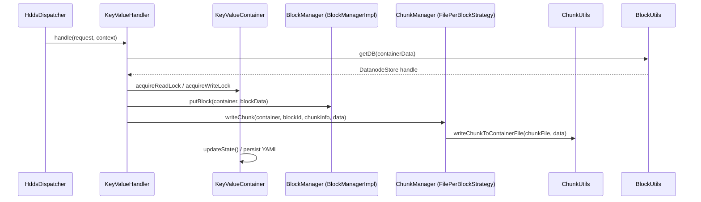

# DN / kv-container

**Classes:** 13    **Kinds:** service:10, interface:2, data:1

## Overview

The `kv-container` feature group implements the KeyValue container type, which is the only production container type in Ozone. `KeyValueHandler` (1825 LOC) is the main dispatcher: it receives every container command from `HddsDispatcher`, performs container-state validation, and delegates to `BlockManager` (for block operations) or `ChunkManager` (for chunk operations). `KeyValueContainer` owns the container's lifecycle state transitions (OPEN → CLOSING → CLOSED) under a per-container `ReadWriteLock`, persists state to the `.container` YAML, and manages the container directory. `KeyValueContainerData` extends `ContainerData` and adds KV-specific fields: `schemaVersion`, `dbFile`, and block/byte count statistics. `KeyValueContainerCheck` runs integrity checks by re-hashing chunks against stored checksums. `KeyValueContainerUtil` provides helpers for initializing and deleting container directories. `ChunkUtils` is the low-level I/O helper for reading and writing chunk files, including checksum verification. `BlockUtils` opens the RocksDB handle for a container via `ContainerCache`. `TarContainerPacker` serializes a container to/from a tar archive for replication.

## Diagram

## Class table

### Sub-feature: `container.keyvalue`

| reading_order | fqcn | kind | logic | loc | study (min) | role |
|--:|---|---|---|--:|--:|---|
| 173 | `org.apache.hadoop.ozone.container.keyvalue.KeyValueHandler` | service | logic-heavy | 1825~ | 60 | Handler for KeyValue Container type. |
| 174 | `org.apache.hadoop.ozone.container.keyvalue.KeyValueContainer` | service | logic-heavy | 650~ | 60 | Class to perform KeyValue Container operations. |
| 175 | `org.apache.hadoop.ozone.container.keyvalue.KeyValueContainerCheck` | service | logic-heavy | 325~ | 45 | Class to run integrity checks on Datanode Containers. |
| 176 | `org.apache.hadoop.ozone.container.keyvalue.KeyValueContainerData` | service | logic-heavy | 250~ | 45 | This class represents the KeyValueContainer metadata, which is the in-memory representation of container metadata and... |
| 177 | `org.apache.hadoop.ozone.container.keyvalue.TarContainerPacker` | service | mixed | 150~ | 45 | Compress/uncompress KeyValueContainer data to a tar archive. |
| 178 | `org.apache.hadoop.ozone.container.keyvalue.PendingDelete` | service | mixed | 25~ | 30 | Class used to hold pending deletion info such as block count and total size Information. |
| 179 | `org.apache.hadoop.ozone.container.keyvalue.KeyValueContainerMetadataInspector` | service | logic-heavy | 400~ | 10 | Container inspector for key value container metadata. |

### Sub-feature: `keyvalue.helpers`

| reading_order | fqcn | kind | logic | loc | study (min) | role |
|--:|---|---|---|--:|--:|---|
| 180 | `org.apache.hadoop.ozone.container.keyvalue.helpers.KeyValueContainerUtil` | service | logic-heavy | 325~ | 45 | Class which defines utility methods for KeyValueContainer. |
| 181 | `org.apache.hadoop.ozone.container.keyvalue.helpers.ChunkUtils` | service | logic-heavy | 325~ | 45 | Utility methods for chunk operations for KeyValue container. |
| 182 | `org.apache.hadoop.ozone.container.keyvalue.helpers.BlockUtils` | service | mixed | 175~ | 45 | Utils functions to help block functions. |
| 183 | `org.apache.hadoop.ozone.container.keyvalue.helpers.KeyValueContainerLocationUtil` | service | mixed | 50~ | 30 | Class which provides utility methods for container locations. |

### Sub-feature: `keyvalue.interfaces`

| reading_order | fqcn | kind | logic | loc | study (min) | role |
|--:|---|---|---|--:|--:|---|
| 184 | `org.apache.hadoop.ozone.container.keyvalue.interfaces.ChunkManager` | interface | mixed | 75~ | 20 | Chunk Manager allows read, write, delete and listing of chunks in a container. |
| 185 | `org.apache.hadoop.ozone.container.keyvalue.interfaces.BlockManager` | interface | mixed | 25~ | 20 | BlockManager is for performing key related operations on the container. |

## Anchor details

### `KeyValueHandler`

- **path:** `hadoop-hdds/container-service/src/main/java/org/apache/hadoop/ozone/container/keyvalue/KeyValueHandler.java`
- **loc:** 1825~    **difficulty:** 5    **study:** 60 min    **concurrency:** thread-safe    **persistence:** RocksDB
- **entry points:** `handle`
- **key collaborators:** `org.apache.hadoop.ozone.container.keyvalue.helpers.BlockUtils`, `org.apache.hadoop.ozone.container.keyvalue.helpers.ChunkUtils`, `org.apache.hadoop.ozone.container.keyvalue.helpers.KeyValueContainerUtil`, `org.apache.hadoop.ozone.container.keyvalue.interfaces.BlockManager`, `org.apache.hadoop.ozone.container.keyvalue.interfaces.ChunkManager`, `org.apache.hadoop.hdds.HddsUtils`
- **test exemplar:** `hadoop-hdds/container-service/src/test/java/org/apache/hadoop/ozone/container/keyvalue/TestKeyValueHandler.java`
- **role:** The primary command handler for all KeyValue container operations (block and chunk I/O, container lifecycle).

`handle()` dispatches on `ContainerProtos.Type` to specific private methods (e.g., `handlePutBlock`, `handleWriteChunk`, `handleCloseContainer`). Container lock acquisition (`acquireReadLock` vs `acquireWriteLock`) depends on the command type: reads use read locks, writes and state transitions use write locks. HDDS-15301 fixed that a malformed `PutBlock` request should not mark the container UNHEALTHY via `HddsDispatcher` without a valid scan result.

### `KeyValueContainer`

- **path:** `hadoop-hdds/container-service/src/main/java/org/apache/hadoop/ozone/container/keyvalue/KeyValueContainer.java`
- **loc:** 650~    **difficulty:** 5    **study:** 60 min    **concurrency:** thread-safe    **persistence:** RocksDB
- **entry points:** `create`, `close`
- **key collaborators:** `org.apache.hadoop.ozone.container.keyvalue.helpers.BlockUtils`, `org.apache.hadoop.ozone.container.keyvalue.helpers.KeyValueContainerLocationUtil`, `org.apache.hadoop.ozone.container.keyvalue.helpers.KeyValueContainerUtil`, `org.apache.hadoop.hdds.HddsUtils`, `org.apache.hadoop.hdds.conf.ConfigurationSource`, `org.apache.hadoop.hdds.scm.container.common.helpers.StorageContainerException`
- **test exemplar:** `hadoop-hdds/container-service/src/test/java/org/apache/hadoop/ozone/container/keyvalue/TestKeyValueContainer.java`
- **role:** Class to perform KeyValue Container operations.

### `KeyValueContainerCheck`

- **path:** `hadoop-hdds/container-service/src/main/java/org/apache/hadoop/ozone/container/keyvalue/KeyValueContainerCheck.java`
- **loc:** 325~    **difficulty:** 4    **study:** 45 min    **concurrency:** single-threaded    **persistence:** in-memory
- **key collaborators:** `org.apache.hadoop.ozone.container.keyvalue.helpers.BlockUtils`, `org.apache.hadoop.ozone.container.keyvalue.helpers.ChunkUtils`, `org.apache.hadoop.ozone.container.keyvalue.helpers.KeyValueContainerLocationUtil`, `org.apache.hadoop.hdds.StringUtils`, `org.apache.hadoop.hdds.conf.ConfigurationSource`, `org.apache.hadoop.hdds.scm.container.common.helpers.StorageContainerException`
- **test exemplar:** `hadoop-hdds/container-service/src/test/java/org/apache/hadoop/ozone/container/keyvalue/TestKeyValueContainerCheck.java`
- **role:** Class to run integrity checks on Datanode Containers.

### `KeyValueContainerUtil`

- **path:** `hadoop-hdds/container-service/src/main/java/org/apache/hadoop/ozone/container/keyvalue/helpers/KeyValueContainerUtil.java`
- **loc:** 325~    **difficulty:** 4    **study:** 45 min    **concurrency:** single-threaded    **persistence:** RocksDB
- **key collaborators:** `org.apache.hadoop.ozone.container.keyvalue.KeyValueContainerData`, `org.apache.hadoop.ozone.container.keyvalue.PendingDelete`, `org.apache.hadoop.hdds.conf.ConfigurationSource`, `org.apache.hadoop.hdds.upgrade.HDDSLayoutFeature`, `org.apache.hadoop.hdds.utils.db.Table`, `org.apache.hadoop.ozone.OzoneConsts`
- **role:** Class which defines utility methods for KeyValueContainer.

### `ChunkUtils`

- **path:** `hadoop-hdds/container-service/src/main/java/org/apache/hadoop/ozone/container/keyvalue/helpers/ChunkUtils.java`
- **loc:** 325~    **difficulty:** 4    **study:** 45 min    **concurrency:** thread-safe    **persistence:** in-memory
- **key collaborators:** `org.apache.hadoop.hdds.scm.container.common.helpers.StorageContainerException`, `org.apache.hadoop.ozone.OzoneConsts`, `org.apache.hadoop.ozone.common.ChunkBuffer`, `org.apache.hadoop.ozone.common.ChunkBufferToByteString`, `org.apache.hadoop.ozone.common.utils.BufferUtils`, `org.apache.hadoop.ozone.container.common.helpers.ChunkInfo`
- **test exemplar:** `hadoop-hdds/container-service/src/test/java/org/apache/hadoop/ozone/container/keyvalue/helpers/TestChunkUtils.java`
- **role:** Utility methods for chunk operations for KeyValue container.

### `KeyValueContainerData`

- **path:** `hadoop-hdds/container-service/src/main/java/org/apache/hadoop/ozone/container/keyvalue/KeyValueContainerData.java`
- **loc:** 250~    **difficulty:** 4    **study:** 45 min    **concurrency:** thread-safe    **persistence:** RocksDB
- **key collaborators:** `org.apache.hadoop.ozone.container.keyvalue.helpers.KeyValueContainerUtil`, `org.apache.hadoop.hdds.scm.container.common.helpers.StorageContainerException`, `org.apache.hadoop.hdds.upgrade.HDDSLayoutFeature`, `org.apache.hadoop.hdds.utils.db.BatchOperation`, `org.apache.hadoop.hdds.utils.db.Table`, `org.apache.hadoop.ozone.container.common.impl.ContainerData`
- **test exemplar:** `hadoop-hdds/container-service/src/test/java/org/apache/hadoop/ozone/container/common/TestKeyValueContainerData.java`
- **role:** This class represents the KeyValueContainer metadata, which is the in-memory representation of container metadata and...

## Design docs

- `hadoop-hdds/docs/content/concept/Containers.md` — container lifecycle and KeyValue container architecture.

## Seminal JIRAs / PRs

- HDDS-15301. Malformed PutBlock request can mark container UNHEALTHY.
- HDDS-15291. DN should fail unreferenced block deletion on file errors.
- HDDS-15066. Read-Write Lock race leaves stale references creating orphan replicas.
- HDDS-14763. Reconciliation incorrectly skips blocks with only metadata present.
- HDDS-14183. Attempted to decrement available space to a negative value.
- HDDS-12873. Improve ContainerData statistics synchronization.
- HDDS-14577. Handle missing metadata dir when updating container state.

## Sharp edges

- `KeyValueContainer.acquireWriteLock()` is held during `close()` and state updates; a slow YAML write under this lock can block concurrent reads and heartbeat ICR sends that also need the lock.
- `KeyValueContainerData.bytesUsed` is updated non-atomically in some code paths (HDDS-12873 improved this but did not fix all call sites); slight over- or under-reporting of container size is possible under concurrent writes.

## Related features

- `components/dn/kv-container-impl.md` — `FilePerBlockStrategy` and `BlockManagerImpl` are the concrete `ChunkManager`/`BlockManager` implementations.
- `components/dn/dn-service.md` — `HddsDispatcher` routes to `KeyValueHandler`.
- `components/dn/dn-rocksdb.md` — `KeyValueContainerData.dbFile` points to the container's RocksDB.
- `components/dn/container-checksum.md` — `KeyValueContainerCheck` is called by the scanner; `ContainerChecksumTreeManager` is updated after close.

## Self-quiz

1. `KeyValueHandler.handle()` dispatches on `ContainerProtos.Type`. For a `WRITE_CHUNK` command, which specific method handles it, and does it acquire a read or write lock on the container?
2. `KeyValueContainer.close()` transitions the container to CLOSING then CLOSED. What prevents two concurrent `CloseContainerCommand` handlers from transitioning the same container twice?
3. `KeyValueContainerData.dbFile` points to the per-container RocksDB file. For schema v3, where is this file located relative to the `DbVolume`?
4. `TarContainerPacker` produces a tar archive for replication. What is included in the archive, and what file extension does the `.container` metadata file use?
5. `KeyValueContainerCheck.fullCheck()` re-hashes chunks. What happens if it detects a mismatch: does it mark the container UNHEALTHY, attempt repair, or log only?

Answers

Answer 1: `handleWriteChunk()` handles `WRITE_CHUNK`; it acquires a read lock on the container (writes to block/chunk data do not change container lifecycle state, so a read lock is sufficient while the chunk write proceeds).
Answer 2: `KeyValueContainer.acquireWriteLock()` guards state transitions; the second handler finds the container already in CLOSING or CLOSED state and returns a no-op response without error.
Answer 3: For schema v3, `dbFile` points to `<dbVolume>/<clusterId>/<datanodeUuid>/container/<containerId>.db`.
Answer 4: The tar includes the `.container` YAML file and all chunk files under the container's `chunks/` directory; the YAML uses the `.container` extension.
Answer 5: `KeyValueContainerCheck.fullCheck()` marks the container UNHEALTHY via `ContainerController.markContainerUnhealthy()` and sends an ICR to SCM; no automatic repair is attempted by the scanner itself.

