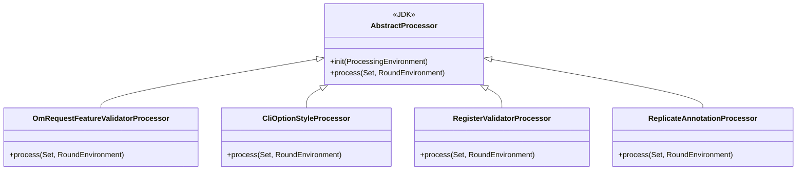

# HddsCommon / annotations

**Classes:** 4    **Kinds:** service:4

## Overview

The `annotations` feature group provides four compile-time annotation processors that enforce Ozone-specific code conventions at javac time, before any test or runtime can catch them. `OmRequestFeatureValidatorProcessor` checks that OM request handler classes carry a `@FeatureValidator` when required, and that validators satisfy their interface. `CliOptionStyleProcessor` rejects picocli `@Option` fields that use camelCase instead of the required `--ozone.xxx` kebab style. `RegisterValidatorProcessor` confirms that classes annotated with `@RegisterValidator` implement the expected validator interface. `ReplicateAnnotationProcessor` verifies that methods tagged `@Replicate` accept `OMRequest` and return `OMResponse`. All four register as `javax.annotation.processing.Processor` services and run on the `-proc` path during every module compile.

## Diagram

## Class table

### Sub-feature: `ozone.annotations`

| reading_order | fqcn | kind | logic | loc | study (min) | role |
|--:|---|---|---|--:|--:|---|
| 1636 | `org.apache.ozone.annotations.OmRequestFeatureValidatorProcessor` | service | mixed | 175~ | 45 | This class is an annotation processor that is hooked into the java compiler and is used to validate the OMRequest wit... |
| 1637 | `org.apache.ozone.annotations.CliOptionStyleProcessor` | service | mixed | 75~ | 30 | Validates that picocli options use the preferred Ozone CLI option style. |
| 1638 | `org.apache.ozone.annotations.RegisterValidatorProcessor` | service | mixed | 75~ | 30 | into the java compiler and is used to validate the Registered Validators annotations in the codebase, to ensure that... |
| 1639 | `org.apache.ozone.annotations.ReplicateAnnotationProcessor` | service | mixed | 50~ | 30 | Annotation Processor that verifies if the methods that are marked with Replicate annotation have proper method signat... |

## Anchor details

No class in this feature is marked `logic-heavy`; all four are `mixed`. The most structurally significant processor is `OmRequestFeatureValidatorProcessor`: it cross-references two annotation types (`@OMRequest` and `@FeatureValidator`) in the same compilation round, walking the element hierarchy to confirm each handler that declares a feature also registers at least one passing validator — logic that requires understanding both the annotation model and the OM request class hierarchy.

## Design docs

No dedicated design doc under `hadoop-hdds/docs/content/` on this branch. The closest adjacent design is `hadoop-hdds/docs/content/design/omha.md`, which describes OM Raft replication — the context in which `@Replicate` and `@FeatureValidator` enforcement matters most.

## Seminal JIRAs / PRs

- HDDS-15558. Prevent deprecated CLI options
- HDDS-11981. Add annotation for registering feature validator
- HDDS-10998. Declare annotation processors explicitly
- HDDS-8934. SCMHAInvocationHandler throws undeclared exceptions

## Sharp edges

- `CliOptionStyleProcessor` fires only for fields using the picocli `@Option` annotation; plain Hadoop `conf.get()` call sites are not checked, so camelCase key strings can still slip through in non-picocli code paths (HDDS-15558).
- Annotation processors run only in modules that list them in `META-INF/services/javax.annotation.processing.Processor`. Adding a new processor to `hadoop-hdds/annotations` without wiring the service entry produces silent no-ops rather than build errors (HDDS-10998).

## Related features

- [`config-annotations.md`](config-annotations.md) — `ConfigFileGenerator` is also a javac annotation processor in the same HDDS common layer
- [`upgrade-framework.md`](upgrade-framework.md) — `@FeatureValidator` checks tie into upgrade layout finalization
- [`framework-protocol.md`](framework-protocol.md) — `@Replicate` targets OM RPC handler methods defined in the framework-protocol layer
- [`ratis-integration.md`](ratis-integration.md) — Ratis apply thread is the runtime counterpart to the compile-time `@Replicate` contract

## Self-quiz

1. All four processors extend `AbstractProcessor` and override `process()`. Which processor also overrides `init()`, and why does it need access to the `ProcessingEnvironment`?
2. `CliOptionStyleProcessor` enforces the `--ozone.xxx` kebab style. What happens if a developer adds a new picocli command in a module that does not include `hadoop-hdds/annotations` on its annotation-processor path?
3. `ReplicateAnnotationProcessor` checks the method signature. What are the exact required parameter type and return type it enforces, and which Protobuf message classes are they?
4. `OmRequestFeatureValidatorProcessor` cross-references two annotation types. Name both annotations and describe at a high level the condition that causes it to emit a compiler error.
5. `RegisterValidatorProcessor` validates that classes annotated with `@RegisterValidator` implement a required interface. How does it determine which interface is required — is it hardcoded or derived from the annotation itself?

Answers

Answer 1: `ReplicateAnnotationProcessor` overrides `init()` to capture the `Messager` from the `ProcessingEnvironment`, which it uses to emit compiler errors or warnings without throwing exceptions.
Answer 2: The check silently does nothing — the processor is not invoked if the module does not wire it as a service. The bad option name compiles without error (HDDS-10998).
Answer 3: The method must accept `OzoneManagerProtocolProtos.OMRequest` and return `OzoneManagerProtocolProtos.OMResponse`.
Answer 4: `@OMRequest` and `@FeatureValidator`. The processor emits an error when a handler class is annotated with `@OMRequest` but has no associated `@FeatureValidator`-annotated class satisfying the validator contract.
Answer 5: The required interface is derived from the `@RegisterValidator` annotation's own metadata — the annotation element specifies which interface the annotated class must implement, so the processor reads that element value at compile time rather than using a hardcoded string.

