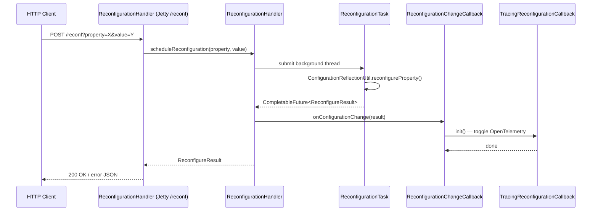

# HddsCommon / config-runtime

**Classes:** 7    **Kinds:** service:4, config:2, abstract:1

## Overview

`config-runtime` provides the mechanisms for inspecting and changing Ozone service configuration at runtime without restarting. `ReconfigurableBase` is the abstract base that services extend to declare which properties support live reconfiguration; its `run()` thread loop polls for in-flight `ReconfigurationTask` completions. `ReconfigurationHandler` is the Jetty handler exposed at `/reconf`; it owns a registry of property names mapped to handler functions and schedules a background `ReconfigurationTask`, storing a `CompletableFuture<ReconfigureResult>` for async polling. `HddsConfServlet` serves `/conf` GET and POST requests to read or set individual properties, using `HttpServletUtils` with a guard against logging user-controlled input. `ReconfigurationChangeCallback` is a one-method interface invoked after reconfiguration completes; `TracingReconfigurationCallback` is the only bundled implementation, toggling OpenTelemetry tracing on or off. The `reconfigurable = true` flag on `@Config` is the sole gate: fields without it are silently skipped during a live-reconfiguration pass.

## Diagram

## Class table

### Sub-feature: `hdds.conf`

| reading_order | fqcn | kind | logic | loc | study (min) | role |
|--:|---|---|---|--:|--:|---|
| 1669 | `org.apache.hadoop.hdds.conf.ReconfigurableBase` | abstract | mixed | 150~ | 45 | Base class to support dynamic reconfiguration of configuration properties at runtime. |
| 1670 | `org.apache.hadoop.hdds.conf.HddsConfServlet` | service | mixed | 150~ | 45 | A servlet to print out the running configuration data. |
| 1671 | `org.apache.hadoop.hdds.conf.ReconfigurationHandler` | service | mixed | 125~ | 30 | Keeps track of reconfigurable properties and the corresponding functions that implement reconfiguration. |
| 1672 | `org.apache.hadoop.hdds.conf.TracingReconfigurationCallback` | service | mixed | 25~ | 30 | Reconfiguration hook for ozone.tracing settings. |
| 1673 | `org.apache.hadoop.hdds.conf.ReconfigurationChangeCallback` | interface | mixed | 25~ | 30 | Callback interface to handle configuration changes after a reconfiguration task completes. |
| 1674 | `org.apache.hadoop.hdds.conf.DatanodeRatisServerConfig` | config | data-only | 150~ | 20 | Datanode Ratis server Configuration. |
| 1675 | `org.apache.hadoop.hdds.conf.DatanodeRatisGrpcConfig` | config | data-only | 25~ | 20 | Ratis Grpc Config Keys. |

## Anchor details

No classes in this feature are classified `logic-heavy`. The two most substantial classes are:

- `ReconfigurationHandler` — registers property-to-function mappings and coordinates the background reconfiguration task; its `close()` shuts down the executor, which is the resource leak guarded by HDDS-14766. Notably it holds a `Map<String, ReconfigurationChangeCallback>` so each reconfigurable property can invoke a distinct post-change action.
- `ReconfigurableBase` — the `run()` loop in this abstract class is the thread that drives async reconfiguration; subclasses must call `registerReconfigurableProperty()` during initialization or their properties will not be visible to `ReconfigurationHandler`.

## Design docs

- `hadoop-hdds/docs/content/design/distributed-tracing-OpenTelemetry.md` — covers `TracingReconfigurationCallback` context: how tracing is toggled at runtime via `TracingUtil`.
- No dedicated design doc exists for the reconfiguration servlet mechanism itself under `hadoop-hdds/docs/content/design/` on this branch.

## Seminal JIRAs / PRs

- HDDS-13804. Make server tracing config dynamically reconfigurable
- HDDS-14766. Close ReconfigurationHandler
- HDDS-14764. Allow Datanode to dynamically reconfigure SCM node addresses
- HDDS-13258. Refactor HttpServletResponse HddsConfServlet
- HDDS-12554. Support callback on completed reconfiguration
- HDDS-11375. DN startup fails due to illegal raft.grpc.message.size.max

## Sharp edges

- `ReconfigurationHandler` holds an `ExecutorService` that must be shut down via `close()`; prior to HDDS-14766, forgetting to call `close()` leaked a thread per service restart (`ReconfigurationHandler.java`, `close()` method).
- The `reconfigurable = true` flag on `@Config` is the sole gate for live reconfig; omitting it means operator-issued POST requests to `/reconf` silently succeed but leave the running value unchanged — there is no warning.
- `DatanodeRatisGrpcConfig` existed partly because of HDDS-11375: a missing bounds check on `raft.grpc.message.size.max` caused DN startup failure when the value was set above the gRPC library default; the fix added a validation in this config POJO.

## Related features

- [`config-common.md`](config-common.md) — `OzoneConfiguration` and `@ConfigGroup` POJOs that the reconfiguration layer reads from and writes to.
- [`config-annotations.md`](config-annotations.md) — `@Config(reconfigurable = true)` is the annotation gate that controls which fields `ReconfigurationHandler` can update.
- [`tracing-common.md`](tracing-common.md) — `TracingUtil` and `TracingConfig` are what `TracingReconfigurationCallback` toggles.
- [`http-server.md`](http-server.md) — `HttpServer2` is the server that registers the `/reconf` handler and `/conf` servlet.

## Self-quiz

1. What is the role of `ReconfigurationHandler.close()`, and which JIRA added it? What resource was being leaked before?
2. A developer adds `@Config(key = "hdds.foo.bar", reconfigurable = false)` to a new field. An operator POSTs `/reconf?property=hdds.foo.bar&value=new`. What happens and why?
3. `TracingReconfigurationCallback.init()` is listed as an entry point. When is it called relative to `ReconfigurationChangeCallback.onConfigurationChange()`?
4. `DatanodeRatisServerConfig` and `DatanodeRatisGrpcConfig` are both `@ConfigGroup` POJOs in this feature. Which JIRA motivated adding `DatanodeRatisGrpcConfig` and what failure did it prevent?
5. Describe the end-to-end flow when a Datanode operator issues `ozone admin reconf start datanode` — which classes in this feature are involved, in what order?

Answers

Answer 1: `close()` shuts down the `ExecutorService` that runs background reconfiguration tasks; HDDS-14766 added it. Before, the thread pool was never shut down on service stop, causing a thread leak per restart.
Answer 2: The property is silently skipped; `ReconfigurationHandler` only invokes the registered handler function for properties explicitly registered with `reconfigurable = true`; no error or warning is returned to the operator.
Answer 3: `TracingReconfigurationCallback` is registered as a `ReconfigurationChangeCallback`; after `ReconfigurationTask` completes, `ReconfigurationHandler` calls `onConfigurationChange()`, which in turn calls `TracingReconfigurationCallback.init()` to apply the new tracing setting via `TracingUtil`.
Answer 4: HDDS-11375; DN startup failed because gRPC rejected a `raft.grpc.message.size.max` value exceeding the library maximum; the fix added a bounds-check validation inside `DatanodeRatisGrpcConfig`.
Answer 5: The CLI resolves to the `ReconfigureProtocol` RPC; the Datanode's `ReconfigurableBase.run()` is the background thread; `ReconfigurationHandler.scheduleReconfiguration()` creates a `ReconfigurationTask`; on completion `ReconfigurationChangeCallback.onConfigurationChange()` fires any registered callbacks including `TracingReconfigurationCallback`.

