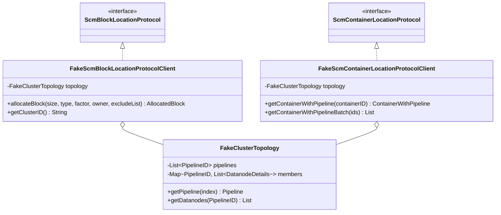

# HddsCommon / framework-freon

**Classes:** 3    **Kinds:** service:3

## Overview

`framework-freon` contains three in-framework helpers that allow Freon load-generator subcommands to bypass a real SCM when running synthetic workloads. `FakeClusterTopology` holds pre-generated pipeline and datanode placement data, allowing Freon to simulate a realistic cluster topology without issuing SCM RPCs. `FakeScmBlockLocationProtocolClient` implements `ScmBlockLocationProtocol` with synthesized responses keyed off `FakeClusterTopology`, enabling block allocation calls to return plausible pipeline and container data. `FakeScmContainerLocationProtocolClient` does the same for the container-location protocol path. Together they allow Freon write benchmarks to exercise the full client write path — including pipeline selection and container routing — against a simulated cluster, which removes SCM as a bottleneck and isolates datanode or network performance. These classes live in `hadoop-hdds/framework` rather than the main Freon module because they depend on shared HDDS protocol interfaces.

## Diagram

## Class table

### Sub-feature: `hdds.freon`

| reading_order | fqcn | kind | logic | loc | study (min) | role |
|--:|---|---|---|--:|--:|---|
| 1676 | `org.apache.hadoop.hdds.freon.FakeClusterTopology` | service | mixed | 50~ | 30 | inferred: FakeClusterTopology — role not documented. |
| 1677 | `org.apache.hadoop.hdds.freon.FakeScmBlockLocationProtocolClient` | service | mixed | 50~ | 30 | Fake SCM client to return a simulated block location. |
| 1678 | `org.apache.hadoop.hdds.freon.FakeScmContainerLocationProtocolClient` | service | mixed | 25~ | 30 | Fake SCM client to return a simulated block location. |

## Anchor details

No classes in this feature are classified `logic-heavy`. The conceptually central class is `FakeClusterTopology`, which seeds a deterministic set of pipelines and datanode assignments from configured parameters; the two fake protocol clients are essentially adapters that delegate placement decisions to it. Reading `FakeClusterTopology` first reveals the data contract both fake clients depend on.

## Design docs

no dedicated design doc under hadoop-hdds/docs/content/ on this branch

## Seminal JIRAs / PRs

- HDDS-12188. Move server-only upgrade classes from hdds-common to hdds-server-framework
- HDDS-3621. Separate client/server/admin proto files of HDDS to separated subprojects

## Sharp edges

- `FakeClusterTopology` generates topology deterministically from construction parameters; two Freon instances started with different parameters will produce non-overlapping container ID spaces, which means cross-instance reads will fail if the fake clients are mixed.
- Both `FakeScmBlockLocationProtocolClient` and `FakeScmContainerLocationProtocolClient` implement their respective protocols but do not implement optional methods (e.g., batch allocation variants); callers that reach those code paths against a fake client will hit an `UnsupportedOperationException` rather than a compile-time gap.

## Related features

- [`pipeline-common.md`](pipeline-common.md) — `Pipeline` and `PipelineID` are the core types that `FakeClusterTopology` generates and the fake clients return.
- [`container-common.md`](container-common.md) — `ContainerWithPipeline` and `AllocatedBlock` are the response types the fake clients produce.
- [`protocol-common.md`](protocol-common.md) — `ScmBlockLocationProtocol` and `ScmContainerLocationProtocol` interfaces that the fake clients implement.
- [`framework-protocol.md`](framework-protocol.md) — real SCM protocol client implementations that the fake clients shadow for load-testing.

## Self-quiz

1. Why do `FakeScmBlockLocationProtocolClient` and `FakeScmContainerLocationProtocolClient` live in `hadoop-hdds/framework` rather than directly in the Freon submodule?
2. `FakeClusterTopology` is `single-threaded` according to the class table. What does this mean for a Freon benchmark that runs multiple writer threads each holding a reference to the same `FakeClusterTopology` instance?
3. What would happen if a Freon subcommand called a batch allocation method on `FakeScmBlockLocationProtocolClient` that is not implemented by the fake client?
4. Describe a scenario where using the fake SCM clients would produce benchmark results that do not reflect real cluster behavior. What aspect of the real SCM path is missing?
5. HDDS-3621 separated client/server/admin proto files. How does that split affect where `FakeScmBlockLocationProtocolClient` must reside in the module hierarchy?

Answers

Answer 1: These classes implement `ScmBlockLocationProtocol` and `ScmContainerLocationProtocol`, which are defined in HDDS interface modules; placing them in `hadoop-hdds/framework` avoids creating an upward dependency from the Freon module onto the framework protocol layer.
Answer 2: `FakeClusterTopology` is not synchronized; multiple concurrent writer threads sharing one instance may observe data races on its internal pipeline/datanode maps. Each Freon thread should construct its own instance, or construction must complete before any thread accesses the shared topology.
Answer 3: The method would throw `UnsupportedOperationException` at runtime, ending the Freon run with an error rather than a compilation failure.
Answer 4: The fake clients return synthetic pipelines with no real Ratis state machine behind them; the pipeline selection logic, write quorum, and container commit steps are absent. A benchmark result reflects only client-side serialization and network throughput to real datanodes, not SCM contention or pipeline creation latency.
Answer 5: After HDDS-3621, the client-facing SCM protocols live in a dedicated interface submodule; `FakeScmBlockLocationProtocolClient` must depend on that module. Placing it in `hadoop-hdds/framework` (which already depends on the interface modules) satisfies this without adding a new module dependency.

