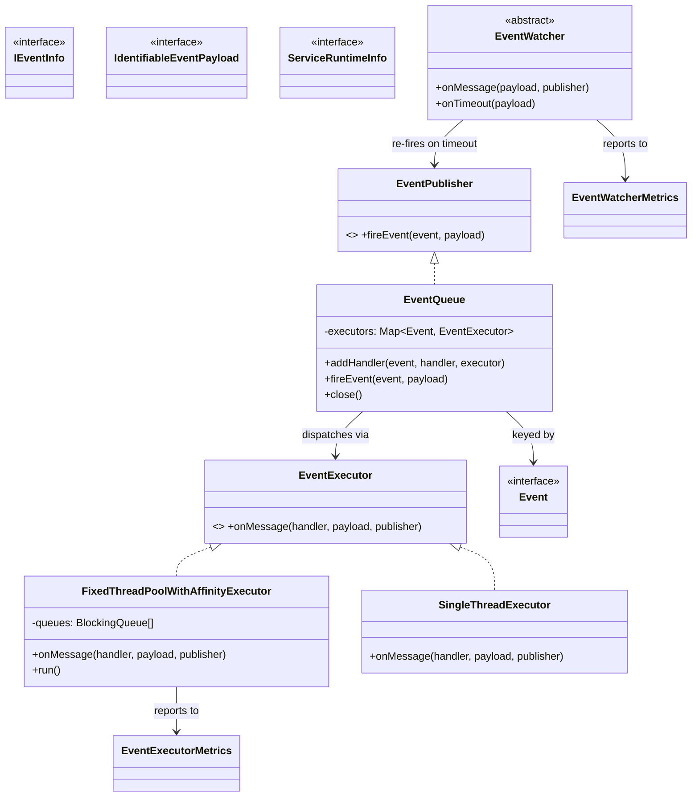

# HddsCommon / framework-server

**Classes:** 20    **Kinds:** service:11, interface:6, metrics:2, abstract:1

## Overview

The `framework-server` feature group provides two largely independent capabilities: server lifecycle utilities and an in-process event bus. `ServerUtils` supplies static helpers for resolving metadata directory paths, enforcing 700 permissions on those directories (HDDS-14574), and constructing SCM-specific directory layouts. The event bus is centered on `EventQueue`, which maintains per-`Event`-type executor pools and routes messages to registered `EventHandler` instances asynchronously. `FixedThreadPoolWithAffinityExecutor` extends this by pinning all events sharing a key (e.g., container ID) to the same thread, preserving processing order without external locking; a modulo skew bug in the queue assignment was corrected by HDDS-15338. `OzoneAdmins` and `OzoneBlacklist` enforce cluster-wide access control by checking user and group membership; HDDS-14843 added cluster-wide blacklisting on OM. `OzoneProtocolMessageDispatcher` wraps RPC dispatch with tracing and per-message logging, used by SCM and OM server implementations.

## Diagram

## Class table

### Sub-feature: `hdds.server`

| reading_order | fqcn | kind | logic | loc | study (min) | role |
|--:|---|---|---|--:|--:|---|
| 1706 | `org.apache.hadoop.hdds.server.ServiceRuntimeInfo` | interface | mixed | 25~ | 20 | Common runtime information for any service components. |
| 1707 | `org.apache.hadoop.hdds.server.ServerUtils` | service | logic-heavy | 225~ | 45 | Generic utilities for all HDDS/Ozone servers. |
| 1708 | `org.apache.hadoop.hdds.server.OzoneAdmins` | service | mixed | 125~ | 30 | This class contains ozone admin user information, username and group, and is able to check whether the provided UserG... |
| 1709 | `org.apache.hadoop.hdds.server.OzoneBlacklist` | service | mixed | 100~ | 30 | This class contains the blacklisted user information, username and group and is able to check whether the provided Us... |
| 1710 | `org.apache.hadoop.hdds.server.OzoneProtocolMessageDispatcher` | service | mixed | 75~ | 30 | Dispatch message after tracing and message logging for insight. |
| 1711 | `org.apache.hadoop.hdds.server.ServiceRuntimeInfoImpl` | service | mixed | 25~ | 30 | Helper base class to report the standard version and runtime information. |
| 1712 | `org.apache.hadoop.hdds.server.YamlUtils` | service | mixed | 25~ | 30 | YAML utilities. |

### Sub-feature: `server.events`

| reading_order | fqcn | kind | logic | loc | study (min) | role |
|--:|---|---|---|--:|--:|---|
| 1713 | `org.apache.hadoop.hdds.server.events.IEventInfo` | interface | mixed | 25~ | 20 | Get various information of event fired. |
| 1714 | `org.apache.hadoop.hdds.server.events.IdentifiableEventPayload` | interface | mixed | 25~ | 20 | Event with an additional unique identifier. |
| 1715 | `org.apache.hadoop.hdds.server.events.Event` | interface | mixed | 25~ | 20 | Identifier of an async event. |
| 1716 | `org.apache.hadoop.hdds.server.events.EventExecutor` | interface | mixed | 25~ | 20 | Executors defined the  way how an EventHandler should be called. |
| 1717 | `org.apache.hadoop.hdds.server.events.EventPublisher` | interface | mixed | 25~ | 20 | Client interface to send a new event. |
| 1718 | `org.apache.hadoop.hdds.server.events.EventWatcher` | abstract | mixed | 100~ | 30 | Event watcher the (re)send a message after timeout. |
| 1719 | `org.apache.hadoop.hdds.server.events.EventQueue` | service | logic-heavy | 225~ | 45 | Simple async event processing utility. |
| 1720 | `org.apache.hadoop.hdds.server.events.FixedThreadPoolWithAffinityExecutor` | service | logic-heavy | 200~ | 45 | Fixed thread pool EventExecutor to call all the event handler one-by-one. |
| 1721 | `org.apache.hadoop.hdds.server.events.SingleThreadExecutor` | service | mixed | 50~ | 30 | Simple EventExecutor to call all the event handler one-by-one. |
| 1722 | `org.apache.hadoop.hdds.server.events.TypedEvent` | service | mixed | 25~ | 30 | Basic event implementation to implement custom events. |
| 1723 | `org.apache.hadoop.hdds.server.events.EventHandler` | interface | mixed | 25~ | 30 | Processor to react on an event. |
| 1724 | `org.apache.hadoop.hdds.server.events.EventExecutorMetrics` | metrics | mixed | 75~ | 20 | Metrics source for EventExecutor implementations. |
| 1725 | `org.apache.hadoop.hdds.server.events.EventWatcherMetrics` | metrics | mixed | 25~ | 20 | Metrics for any event watcher. |

## Anchor details

### `ServerUtils`

- **path:** `hadoop-hdds/framework/src/main/java/org/apache/hadoop/hdds/server/ServerUtils.java`
- **loc:** 225~    **difficulty:** 4    **study:** 45 min    **concurrency:** single-threaded    **persistence:** in-memory
- **key collaborators:** `org.apache.hadoop.hdds.HddsConfigKeys`, `org.apache.hadoop.hdds.conf.ConfigurationSource`, `org.apache.hadoop.hdds.conf.OzoneConfiguration`, `org.apache.hadoop.hdds.recon.ReconConfigKeys`, `org.apache.hadoop.hdds.scm.ScmConfigKeys`, `org.apache.hadoop.ozone.OzoneConfigKeys`
- **test exemplar:** `hadoop-hdds/framework/src/test/java/org/apache/hadoop/hdds/server/TestServerUtils.java`
- **role:** Generic utilities for all HDDS/Ozone servers.
- **note:** `getOzoneMetaDirPath` and `getScmDbDir` resolve metadata directories from config and call `Files.setPosixFilePermissions` to enforce 700 mode (HDDS-14574). These are called during SCM and OM startup before any RocksDB databases are opened, making this a security gate for metadata directory access.

### `EventQueue`

- **path:** `hadoop-hdds/framework/src/main/java/org/apache/hadoop/hdds/server/events/EventQueue.java`
- **loc:** 225~    **difficulty:** 4    **study:** 45 min    **concurrency:** single-threaded    **persistence:** in-memory
- **entry points:** `close`
- **key collaborators:** `org.apache.hadoop.hdds.scm.net.InnerNode`, `org.apache.hadoop.hdds.scm.net.NodeImpl`
- **test exemplar:** `hadoop-hdds/framework/src/test/java/org/apache/hadoop/hdds/server/events/TestEventQueue.java`
- **role:** Simple async event processing utility.
- **note:** Internally maintains a `Map<Event, List<EventExecutor>>`. Calling `addHandler` registers a handler-executor pair; `fireEvent` locates the executor list for the event type and submits the payload. Because each event type can have its own executor, `FixedThreadPoolWithAffinityExecutor` can be registered for high-throughput events (e.g., container reports) while `SingleThreadExecutor` handles low-frequency control events.

### `FixedThreadPoolWithAffinityExecutor`

- **path:** `hadoop-hdds/framework/src/main/java/org/apache/hadoop/hdds/server/events/FixedThreadPoolWithAffinityExecutor.java`
- **loc:** 200~    **difficulty:** 4    **study:** 45 min    **concurrency:** actor/queue    **persistence:** in-memory
- **entry points:** `onMessage`, `close`, `run`
- **role:** Fixed thread pool EventExecutor to call all the event handler one-by-one.
- **note:** Uses `payload.getId() % threadCount` to pick a queue, so all events for the same container ID land on the same thread. HDDS-15338 fixed a skew bug where thread count was not a power of two, causing uneven queue fill. The fix ensures the modulo distributes uniformly regardless of pool size.

## Design docs

- `hadoop-hdds/docs/content/design/scmha.md` — SCM HA topology that drives the event-based container report processing through `EventQueue`.
- `hadoop-hdds/docs/content/design/decommissioning.md` — decommission workflow uses `EventQueue` and `EventWatcher` to track node state transitions with timeout re-fires.

## Seminal JIRAs / PRs

- HDDS-15338. Fix affinity executor queue assignment skew
- HDDS-14843. Support cluster-wide blacklist on OM
- HDDS-14574. Enforce 700 permissions on Ozone Metadata and Data directories
- HDDS-14207. Inconsistent Ozone admin check
- HDDS-13753. Use forked Hadoop RPC
- HDDS-9438. Improve ProtocolMessageMetrics

## Sharp edges

- `FixedThreadPoolWithAffinityExecutor` requires that event payloads implement `IdentifiableEventPayload`; passing a plain payload silently falls back to round-robin assignment, breaking ordering guarantees without any warning (see `FixedThreadPoolWithAffinityExecutor.java`).
- `OzoneAdmins` caches admin user and group lists at construction time; a running OM or SCM does not see config changes to `ozone.administrators` without a restart, despite the reconfiguration protocol existing in the framework (HDDS-14207 exposed an inconsistency in how this was checked).

## Related features

- [`framework-utils.md`](framework-utils.md) — `HddsServerUtil` and `HAUtils` consumed by the same SCM/OM server startup paths
- [`framework-protocol.md`](framework-protocol.md) — `OzoneProtocolMessageDispatcher` wraps the RPC handlers built from these translators
- [`metrics-utils.md`](metrics-utils.md) — `EventExecutorMetrics` and `EventWatcherMetrics` integrate with Hadoop metrics2
- [`tracing-common.md`](tracing-common.md) — trace propagation inside `OzoneProtocolMessageDispatcher`
- [`scm-common.md`](scm-common.md) — SCM uses `EventQueue` as its primary internal message bus

## Self-quiz

1. `EventQueue.fireEvent(event, payload)` locates an executor list by event type. What happens if no handler has been registered for that event type — does it throw or silently drop?
2. `FixedThreadPoolWithAffinityExecutor` routes events by `payload.getId() % threadCount`. What interface must a payload implement to supply this ID, and where is that interface defined in this feature group?
3. `ServerUtils.getOzoneMetaDirPath` enforces directory permissions at startup. What permission bits does it set and why does setting them at startup matter rather than at directory creation?
4. `OzoneBlacklist` was added by HDDS-14843. How does it differ from `OzoneAdmins` in terms of the check it performs (allow vs. deny)?
5. `EventWatcher` re-fires an event after a timeout. Which method is called on timeout, and what must a subclass do with the re-fired payload?

Answers

Answer 1: `EventQueue` silently drops the event if no executor is registered for that event type. There is no exception thrown; callers should register a handler or use `addHandler` before firing. Check `EventQueue.java` `fireEvent` implementation for the null/empty guard.

Answer 2: The payload must implement `IdentifiableEventPayload`, which declares `getId()` returning a `long`. That interface is defined in `hadoop-hdds/framework/src/main/java/org/apache/hadoop/hdds/server/events/IdentifiableEventPayload.java` within this feature group.

Answer 3: `ServerUtils` sets POSIX permissions `rwx------` (700). Setting them at startup rather than creation ensures that directories created by a previous run with incorrect permissions (e.g., umask 022 leaving them 755) are corrected before any process opens metadata files.

Answer 4: `OzoneAdmins` uses an allowlist — only listed users/groups are permitted admin operations. `OzoneBlacklist` uses a denylist — listed users/groups are refused access even if they would otherwise be authorized, enabling quick revocation without changing the admin allowlist.

Answer 5: `onTimeout(payload, publisher)` is called. The subclass must call `publisher.fireEvent(...)` to re-insert the payload into the event bus, or take a compensating action. The abstract `EventWatcher` tracks in-flight payloads and removes them once a `complete` event is received; if it is not received within the timeout, `onTimeout` fires.

