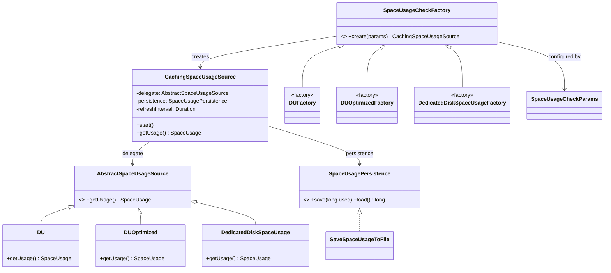

# HddsCommon / fs-utils

**Classes:** 12    **Kinds:** service:6, factory:4, interface:1, abstract:1

## Overview

The `fs-utils` feature group implements disk space accounting for datanode storage volumes. The core abstraction is `SpaceUsageSource` (from `AbstractSpaceUsageSource`), with two concrete implementations: `DU`, which shells out to the Unix `du` command for accurate recursive measurement, and `DedicatedDiskSpaceUsage`, which reads a pre-written file left by the volume to avoid repeated `du` scans. `CachingSpaceUsageSource` wraps either implementation, caches the last result, and refreshes asynchronously on a background thread; HDDS-15112 added a guard against negative values returned by the underlying source. `SpaceUsageCheckFactory` and its subclasses (`DUFactory`, `DUOptimizedFactory`, `DedicatedDiskSpaceUsageFactory`) are config-driven factories selected via `hdds.datanode.du.factory.classname`, allowing operators to trade accuracy for speed. `SaveSpaceUsageToFile` and `SpaceUsagePersistence` handle persistence of the cached value across restarts so that the first post-restart report is not zero.

## Diagram

## Class table

### Sub-feature: `hdds.fs`

| reading_order | fqcn | kind | logic | loc | study (min) | role |
|--:|---|---|---|--:|--:|---|
| 1757 | `org.apache.hadoop.hdds.fs.SpaceUsagePersistence` | interface | mixed | 25~ | 20 | Interface for saving and loading space usage information. |
| 1758 | `org.apache.hadoop.hdds.fs.AbstractSpaceUsageSource` | abstract | mixed | 50~ | 30 | Convenience parent class for SpaceUsageSource implementations. |
| 1759 | `org.apache.hadoop.hdds.fs.CachingSpaceUsageSource` | service | logic-heavy | 200~ | 45 | Stores space usage and refreshes it periodically. |
| 1760 | `org.apache.hadoop.hdds.fs.DU` | service | mixed | 100~ | 30 | Uses the unix 'du' program to calculate space usage. |
| 1761 | `org.apache.hadoop.hdds.fs.SaveSpaceUsageToFile` | service | mixed | 50~ | 30 | Saves and loads space usage information to/from a file. |
| 1762 | `org.apache.hadoop.hdds.fs.SpaceUsageCheckParams` | service | mixed | 50~ | 30 | Parameters for performing disk space usage checks. |
| 1763 | `org.apache.hadoop.hdds.fs.DUOptimized` | service | mixed | 25~ | 30 | Make use of DU class that uses the unix 'du' program to calculate space usage of metadata excluding container data. |
| 1764 | `org.apache.hadoop.hdds.fs.DedicatedDiskSpaceUsage` | service | mixed | 25~ | 30 | Fast but inaccurate class to tell how much space a directory is using. |
| 1765 | `org.apache.hadoop.hdds.fs.SpaceUsageCheckFactory` | factory | mixed | 75~ | 20 | Configures disk space checks (du, df, etc.) for HDDS volumes, allowing different implementations and parameters for d... |
| 1766 | `org.apache.hadoop.hdds.fs.DUOptimizedFactory` | factory | mixed | 25~ | 20 | Uses DU for all volumes excluding container data. |
| 1767 | `org.apache.hadoop.hdds.fs.DUFactory` | factory | mixed | 25~ | 20 | Uses DU for all volumes. |
| 1768 | `org.apache.hadoop.hdds.fs.DedicatedDiskSpaceUsageFactory` | factory | mixed | 25~ | 20 | Uses DedicatedDiskSpaceUsage for all volumes. |

## Anchor details

### `CachingSpaceUsageSource`

- **path:** `hadoop-hdds/framework/src/main/java/org/apache/hadoop/hdds/fs/CachingSpaceUsageSource.java`
- **loc:** 200~    **difficulty:** 4    **study:** 45 min    **concurrency:** thread-safe    **persistence:** in-memory
- **entry points:** `start`
- **key collaborators:** `org.apache.hadoop.hdds.annotation.InterfaceAudience`, `org.apache.hadoop.hdds.annotation.InterfaceStability`
- **test exemplar:** `hadoop-hdds/framework/src/test/java/org/apache/hadoop/hdds/fs/TestCachingSpaceUsageSource.java`
- **role:** Stores space usage and refreshes it periodically.
- **note:** Uses an `AtomicReference<SpaceUsage>` for the cached value so `getUsage()` is lock-free. The refresh thread calls the delegate, guards against negative values (HDDS-15112), and persists the result via `SpaceUsagePersistence` so the next restart reads a non-zero initial value. The refresh thread name bug (newline in name) was fixed by HDDS-15470.

## Design docs

- `hadoop-hdds/docs/content/design/dn-usedspace-calculation.md` — dedicated design doc covering `DU`, `DUOptimized`, `CachingSpaceUsageSource`, and the factory selection mechanism.
- `hadoop-hdds/docs/content/design/diskbalancer.md` — DiskBalancer uses the space usage values reported by these classes to determine which volumes to rebalance.

## Seminal JIRAs / PRs

- HDDS-15470. Disk usage refresh thread name has newline
- HDDS-15112. Handle negative space usage values gracefully in CachingSpaceUsageSource
- HDDS-14179. StorageVolume.getCurrentUsage() should return a fixed usage
- HDDS-12924. datanode used space calculation optimization
- HDDS-12353. Move SpaceUsage implementations to hdds-server-framework

## Sharp edges

- `CachingSpaceUsageSource` guards against negative values from the underlying source (HDDS-15112), but if the delegate throws an exception the cache is not updated and the stale value from the previous cycle continues to be reported; a persistent `du` failure is therefore invisible until the value becomes stale enough to trigger SCM action.
- `DedicatedDiskSpaceUsage` reads `File.getUsableSpace()` rather than `getFreeSpace()`; on some filesystems (e.g., XFS with reserved blocks) these differ, and the used-space derived value can be lower than actual usage.

## Related features

- [`storage-common.md`](storage-common.md) — `StorageVolume` calls into `CachingSpaceUsageSource` and `SpaceUsageCheckFactory`
- [`framework-utils.md`](framework-utils.md) — `BackgroundService` provides the periodic task model that `CachingSpaceUsageSource` follows
- [`container-common.md`](container-common.md) — container used-space reporting at the datanode layer consumes values from this feature
- [`hdds-utils.md`](hdds-utils.md) — shared datanode utilities that interact with storage volume space tracking

## Self-quiz

1. `SpaceUsageCheckFactory` selects an implementation via `hdds.datanode.du.factory.classname`. What class is chosen by default, and where is that default defined in the codebase?
2. `CachingSpaceUsageSource.start()` launches a background thread. What does that thread do when the underlying `DU.getUsage()` returns a negative value after HDDS-15112?
3. `DedicatedDiskSpaceUsage` avoids running `du`. What does it do instead, and under what operational condition is it less accurate than `DU`?
4. `SaveSpaceUsageToFile` implements `SpaceUsagePersistence`. What file does it write to, and why does reading that file at startup matter for the first SCM heartbeat after a datanode restart?
5. `DUOptimized` differs from `DU`. What does it exclude from the measurement, and which factory class selects it?

Answers

Answer 1: The default factory is `SpaceUsageCheckFactory` itself (which delegates to `DUFactory`). The default class name `org.apache.hadoop.hdds.fs.DUFactory` is defined as the default value for `HddsConfigKeys.HDDS_DATANODE_DU_FACTORY_CLASSNAME` in `HddsConfigKeys.java`.

Answer 2: After HDDS-15112, `CachingSpaceUsageSource` clamps negative values to zero before updating the `AtomicReference` and before calling `persistence.save(...)`. The stale previous value is not retained; zero is stored and reported instead, which is less misleading than a negative used-space figure.

Answer 3: `DedicatedDiskSpaceUsage` calls `File.getUsableSpace()` on the volume's root directory and subtracts from the total capacity — no subprocess is spawned. It is less accurate when the volume contains data written outside the datanode's control (e.g., other processes writing to the same disk), because it measures free space at the filesystem level rather than what the datanode itself has written.

Answer 4: `SaveSpaceUsageToFile` writes the used bytes to a plain text file named `storage/current/used` (or similar, relative to the volume root). At startup, `CachingSpaceUsageSource` loads this value so the first heartbeat to SCM contains a non-zero used-space figure; without this, SCM would temporarily believe the volume is empty and might over-allocate containers before the first `du` run completes.

Answer 5: `DUOptimized` excludes container data directories from the `du` measurement (containers are tracked separately). It is selected by `DUOptimizedFactory` via `hdds.datanode.du.factory.classname=org.apache.hadoop.hdds.fs.DUOptimizedFactory`, and is suited for deployments where container data is large but metadata overhead is what the operator wants to measure.

