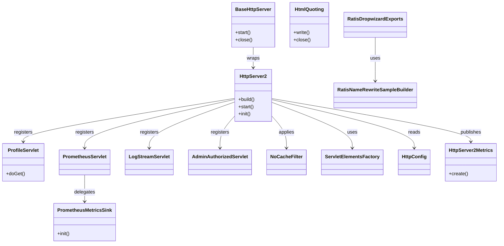

# HddsCommon / http-server

**Classes:** 14    **Kinds:** service:8, metrics:2, abstract:1, config:1, factory:1, data:1

## Overview

The `http-server` feature group provides the embedded Jetty-based HTTP infrastructure shared by all Ozone services. `HttpServer2` is a fork of Hadoop's `HttpServer2` that assembles a Jetty `Server` with connector and handler chains, supports SPNEGO authentication via `AuthenticationFilter`, and embeds `PrometheusServlet`, `ProfileServlet`, `LogStreamServlet`, and a `LogLevel` servlet. `BaseHttpServer` wraps `HttpServer2` and owns the `start`/`close` lifecycle; every Ozone service (SCM, OM, datanode, S3 Gateway) subclasses it rather than managing Jetty directly. `ProfileServlet` invokes async-profiler via JNI to produce CPU and allocation flame graphs over HTTP, blocking the request thread for the profiling duration. `PrometheusServlet` walks Hadoop Metrics2 registries and renders them in the Prometheus text exposition format, while `RatisDropwizardExports` bridges Dropwizard metrics from Apache Ratis into the same pipeline with Ratis-specific name rewriting via `RatisNameRewriteSampleBuilder`. `HttpServer2Metrics` tracks the Jetty thread-pool state as Metrics2 counters.

## Diagram

## Class table

### Sub-feature: `server.http`

| reading_order | fqcn | kind | logic | loc | study (min) | role |
|--:|---|---|---|--:|--:|---|
| 1938 | `org.apache.hadoop.hdds.server.http.BaseHttpServer` | abstract | logic-heavy | 300~ | 45 | Base class for HTTP server of the Ozone related components. |
| 1939 | `org.apache.hadoop.hdds.server.http.HttpServer2` | service | logic-heavy | 1175~ | 60 | Create a Jetty embedded server to answer http requests. |
| 1940 | `org.apache.hadoop.hdds.server.http.ProfileServlet` | service | logic-heavy | 350~ | 45 | &lt;pre&gt; Servlet that runs async-profiler as web-endpoint. |
| 1941 | `org.apache.hadoop.hdds.server.http.HtmlQuoting` | service | mixed | 150~ | 45 | This class is responsible for quoting HTML characters. |
| 1942 | `org.apache.hadoop.hdds.server.http.RatisDropwizardExports` | service | mixed | 75~ | 30 | Collect Dropwizard metrics, but rename ratis specific metrics. |
| 1943 | `org.apache.hadoop.hdds.server.http.AdminAuthorizedServlet` | service | mixed | 25~ | 30 | General servlet which is admin-authorized. |
| 1944 | `org.apache.hadoop.hdds.server.http.PrometheusServlet` | service | mixed | 25~ | 30 | Servlet to publish hadoop metrics in prometheus format. |
| 1945 | `org.apache.hadoop.hdds.server.http.NoCacheFilter` | service | mixed | 25~ | 30 | Servlet filter to add no caching headers. |
| 1946 | `org.apache.hadoop.hdds.server.http.LogStreamServlet` | service | mixed | 25~ | 30 | Servlet to stream the current logs to the response. |
| 1947 | `org.apache.hadoop.hdds.server.http.HttpConfig` | config | data-only | 25~ | 20 | Singleton to get access to Http related configuration. |
| 1948 | `org.apache.hadoop.hdds.server.http.ServletElementsFactory` | factory | mixed | 25~ | 20 | Factory class which helps to create different types of servlet elements. |
| 1949 | `org.apache.hadoop.hdds.server.http.RatisNameRewriteSampleBuilder` | data | data-only | 75~ | 10 | Collect Dropwizard metrics and rename ratis specific metrics. |
| 1950 | `org.apache.hadoop.hdds.server.http.PrometheusMetricsSink` | metrics | mixed | 75~ | 20 | Metrics sink for prometheus exporter. |
| 1951 | `org.apache.hadoop.hdds.server.http.HttpServer2Metrics` | metrics | mixed | 50~ | 20 | Metrics related to HttpServer threadPool. |

## Anchor details

### `BaseHttpServer`

- **path:** `hadoop-hdds/framework/src/main/java/org/apache/hadoop/hdds/server/http/BaseHttpServer.java`
- **loc:** 300~    **difficulty:** 4    **study:** 45 min    **concurrency:** single-threaded    **persistence:** in-memory
- **entry points:** `start`, `close`
- **key collaborators:** `org.apache.hadoop.hdds.HddsConfigKeys`, `org.apache.hadoop.hdds.conf.ConfigurationSource`, `org.apache.hadoop.hdds.conf.HddsConfServlet`, `org.apache.hadoop.hdds.conf.HddsPrometheusConfig`, `org.apache.hadoop.hdds.conf.MutableConfigurationSource`, `org.apache.hadoop.hdds.utils.LegacyHadoopConfigurationSource`
- **test exemplar:** `hadoop-hdds/framework/src/test/java/org/apache/hadoop/hdds/server/http/TestBaseHttpServer.java`
- **role:** Base class for HTTP server of the Ozone related components.
- **insight:** Subclasses override `getHttpServer()` to supply their `HttpServer2.Builder`, giving each Ozone service control over bind address, context path, and which additional servlets are registered, while the base handles Kerberos SPNEGO filter wiring and metrics registration uniformly.

### `HttpServer2`

- **path:** `hadoop-hdds/framework/src/main/java/org/apache/hadoop/hdds/server/http/HttpServer2.java`
- **loc:** 1175~    **difficulty:** 5    **study:** 60 min    **concurrency:** single-threaded    **persistence:** in-memory
- **entry points:** `build`, `start`, `init`
- **key collaborators:** `org.apache.hadoop.hdds.annotation.InterfaceAudience`, `org.apache.hadoop.hdds.annotation.InterfaceStability`, `org.apache.hadoop.hdds.conf.ConfigurationSource`, `org.apache.hadoop.hdds.conf.MutableConfigurationSource`, `org.apache.hadoop.hdds.conf.OzoneConfiguration`, `org.apache.hadoop.hdds.utils.LegacyHadoopConfigurationSource`
- **test exemplar:** `hadoop-hdds/framework/src/test/java/org/apache/hadoop/hdds/server/http/TestHttpServer2.java`
- **role:** Create a Jetty embedded server to answer http requests.
- **insight:** Uses a `Builder` pattern; once `build()` completes the `Server` object is fully configured and immutable. HDDS-13024 fixed a bind-address regression where using `0.0.0.0` as the listen address caused the redirect URL handed to clients to also contain `0.0.0.0`; the fix resolves the actual hostname for the redirect separately from the bind address.

### `ProfileServlet`

- **path:** `hadoop-hdds/framework/src/main/java/org/apache/hadoop/hdds/server/http/ProfileServlet.java`
- **loc:** 350~    **difficulty:** 4    **study:** 45 min    **concurrency:** single-threaded    **persistence:** in-memory
- **test exemplar:** `hadoop-hdds/framework/src/test/java/org/apache/hadoop/hdds/server/http/TestProfileServlet.java`
- **role:** Servlet that runs async-profiler as web-endpoint.
- **insight:** Checks for the async-profiler native agent at request time via a `ProcessBuilder` call to the `jattach` binary; if absent, it returns a 501. Query parameters (`event`, `duration`, `output`) are forwarded directly to async-profiler, so the servlet itself has no profiling logic — it is purely a thin HTTP shim over the native agent.

## Design docs

no dedicated design doc under hadoop-hdds/docs/content/ on this branch

## Seminal JIRAs / PRs

- HDDS-15152. SSL protocol config not applied to Jetty when set to default
- HDDS-10819. Respect ssl.server.include.cipher.list and ssl.enabled.protocols in HttpServer2
- HDDS-13511. Log level servlet does not work with SLF4J v2
- HDDS-13344. Fix ProxyUserAuthenticationFilter addition in HttpServer2
- HDDS-13132. Convert redundant fields to local var
- HDDS-13024. HTTP connect to 0.0.0.0 failed

## Sharp edges

- HDDS-13024: `HttpServer2` resolved the bind address (`0.0.0.0`) as the redirect address sent to clients; the bug is in `HttpServer2.java` in the connector-URL construction path — binding on a wildcard address and using that same address in client-facing redirects are not equivalent.
- HDDS-13511: The `LogLevel` servlet uses `java.util.logging` reflection to change log levels, which broke with SLF4J v2 that no longer bridges to JUL automatically; services that upgraded SLF4J without patching `HttpServer2` silently lost the `/logLevel` endpoint.
- HDDS-15152: TLS protocol restrictions set via `ssl.server.exclude.cipher.list` or `ssl.enabled.protocols` were not applied to the Jetty `SslContextFactory` when those properties matched the compiled-in defaults, meaning the server accepted cipher suites the operator intended to forbid.

## Related features

- [`metrics-utils.md`](metrics-utils.md) — gRPC metrics infrastructure that pairs with HTTP-exposed Prometheus scraping
- [`tracing-common.md`](tracing-common.md) — OpenTelemetry tracing that adds trace context to HTTP request handling
- [`framework-server.md`](framework-server.md) — server lifecycle utilities used alongside `BaseHttpServer`
- [`security-common.md`](security-common.md) — Kerberos/SPNEGO filter wired by `HttpServer2`
- [`ratis-integration.md`](ratis-integration.md) — Ratis Dropwizard metrics bridged by `RatisDropwizardExports`

## Self-quiz

1. `HttpServer2.build()` returns an `HttpServer2` instance; which class calls `build()` and owns the resulting object lifecycle?
2. `ProfileServlet` is marked `concurrency: single-threaded` yet serves HTTP requests. Why is this not a concurrency problem in practice?
3. `RatisDropwizardExports` and `RatisNameRewriteSampleBuilder` work together — what does each one contribute to the Prometheus metric name?
4. `PrometheusServlet` delegates to `PrometheusMetricsSink`. Which Hadoop Metrics2 interface does `PrometheusMetricsSink` implement, and what method gets called on each scrape?
5. After HDDS-13024, how does `HttpServer2` determine the host to include in the redirect URL when the configured bind address is `0.0.0.0`?

Answers

Answer 1: `BaseHttpServer` (or its concrete subclass, e.g. the SCM or OM HTTP server) calls `new HttpServer2.Builder()...build()` and stores the result; `start()` and `close()` in `BaseHttpServer` delegate to the stored instance.
Answer 2: async-profiler itself is single-threaded internally and the servlet intentionally serialises concurrent profile requests — see the `AtomicBoolean` lock in `ProfileServlet` that returns HTTP 409 if a profile is already in progress.
Answer 3: `RatisDropwizardExports` iterates the Dropwizard `MetricRegistry` and calls `RatisNameRewriteSampleBuilder` to transform Ratis metric names (e.g. replacing internal prefix tokens) into valid Prometheus label-safe names before emitting samples.
Answer 4: `PrometheusMetricsSink` implements `MetricsSink`; Hadoop Metrics2 calls `putMetrics(MetricsRecord)` on each registered sink when the system flushes, and `PrometheusMetricsSink` formats each record into the Prometheus text line format.
Answer 5: `HttpServer2` calls `InetAddress.getLocalHost().getCanonicalHostName()` (or the configured `dfs.hosts.ip.bind.address` equivalent) to resolve the actual hostname when the bind address is the wildcard, then uses that resolved hostname in the Location header.

