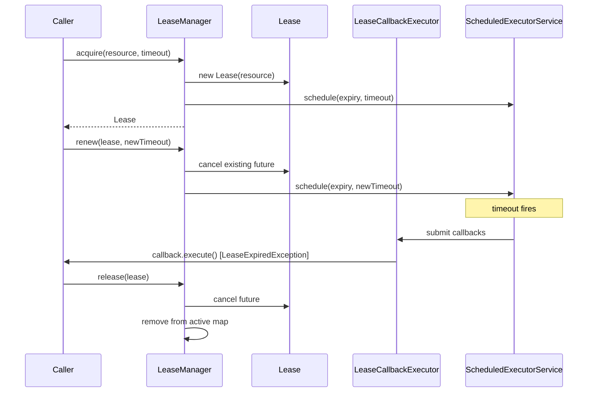

# HddsCommon / lease-manager

**Classes:** 8    **Kinds:** exception:5, service:3

## Overview

The `lease-manager` feature group provides a generic time-bounded resource lease mechanism used primarily by HDDS for SCM-side pipeline provisioning timeouts. `LeaseManager<T>` is the central coordinator: `acquire(resource, timeout)` creates a `Lease<T>` and schedules an expiry task on an internal `ScheduledExecutorService`; `release(lease)` cancels the future before it fires. Each `Lease<T>` holds the resource reference, the expiry `ScheduledFuture`, and a list of callbacks; `renew(timeout)` cancels the old future and reschedules, extending the deadline. When a lease expires, `LeaseCallbackExecutor` runs the registered callbacks on a dedicated single-thread executor, keeping callback execution off the scheduler thread. The five exception subclasses (`LeaseException`, `LeaseNotFoundException`, `LeaseAlreadyExistException`, `LeaseExpiredException`, `LeaseManagerNotRunningException`) form a protocol contract that callers use to distinguish double-acquire, missing-lease, expired-lease, and lifecycle violations. `LeaseManager` itself is thread-safe; `Lease` is not and must be accessed under the manager's lock.

## Diagram

## Class table

### Sub-feature: `ozone.lease`

| reading_order | fqcn | kind | logic | loc | study (min) | role |
|--:|---|---|---|--:|--:|---|
| 1952 | `org.apache.hadoop.ozone.lease.LeaseManager` | service | mixed | 150~ | 45 | LeaseManager is someone who can provide you leases based on your requirement. |
| 1953 | `org.apache.hadoop.ozone.lease.Lease` | service | mixed | 75~ | 30 | This class represents the lease created on a resource. |
| 1954 | `org.apache.hadoop.ozone.lease.LeaseCallbackExecutor` | service | mixed | 25~ | 30 | This class is responsible for executing the callbacks of a lease in case of timeout. |
| 1955 | `org.apache.hadoop.ozone.lease.LeaseExpiredException` | exception | data-only | 25~ | 10 | This exception represents that the lease that is being accessed has expired. |
| 1956 | `org.apache.hadoop.ozone.lease.LeaseManagerNotRunningException` | exception | data-only | 25~ | 10 | This exception represents that there LeaseManager service is not running. |
| 1957 | `org.apache.hadoop.ozone.lease.LeaseException` | exception | data-only | 25~ | 10 | This exception represents all lease related exceptions. |
| 1958 | `org.apache.hadoop.ozone.lease.LeaseAlreadyExistException` | exception | data-only | 25~ | 10 | This exception represents that there is already a lease acquired on the same resource. |
| 1959 | `org.apache.hadoop.ozone.lease.LeaseNotFoundException` | exception | data-only | 25~ | 10 | This exception represents that the lease that is being accessed does not exist. |

## Anchor details

No classes are classified `logic-heavy` in the JSON data; the most complex runtime behaviour lives in `LeaseManager` (thread-safe, `mixed` weight) and `LeaseCallbackExecutor` (callback dispatch).

### `LeaseManager`

- **path:** `hadoop-hdds/framework/src/main/java/org/apache/hadoop/ozone/lease/LeaseManager.java`
- **loc:** 150~    **difficulty:** 4    **study:** 45 min    **concurrency:** thread-safe    **persistence:** in-memory
- **entry points:** `start`, `run`
- **test exemplar:** `hadoop-hdds/framework/src/test/java/org/apache/hadoop/ozone/lease/TestLeaseManager.java`
- **role:** Central coordinator for lease acquisition, renewal, and release.
- **insight:** Internally maintains a `ConcurrentHashMap<T, Lease<T>>` from resource to active lease. The background `run()` loop is minimal — expiry is handled entirely by the `ScheduledExecutorService` futures rather than a polling thread. Callers that do not explicitly call `release()` before the timeout will trigger callbacks; callers that release first cancel the future, preventing spurious callbacks.

## Design docs

no dedicated design doc under hadoop-hdds/docs/content/ on this branch

## Seminal JIRAs / PRs

- HDDS-12641. Move Lease to hdds-server-framework
- HDDS-12897. Enable EmptyLineSeparator checkstyle rule

## Sharp edges

- `LeaseManager` is thread-safe but `Lease` is not. Callers that hold a `Lease` reference and call `renew()` concurrently without external synchronisation may observe a cancelled future being re-cancelled or a new future scheduled against a stale timeout; the safe pattern is to route all `renew` calls through `LeaseManager`.
- Callbacks registered on a `Lease` run on the `LeaseCallbackExecutor`'s single thread. A slow or blocking callback delays all subsequent expiry callbacks for other leases sharing the same executor instance.

## Related features

- [`framework-server.md`](framework-server.md) — server lifecycle utilities in the same `hdds-server-framework` module where `LeaseManager` now lives after HDDS-12641
- [`pipeline-common.md`](pipeline-common.md) — SCM pipeline provisioning that uses `LeaseManager` for pipeline creation timeouts
- [`scm-common.md`](scm-common.md) — SCM-side resource management that coordinates with lease-based timeouts
- [`ratis-integration.md`](ratis-integration.md) — Ratis pipeline setup whose SCM-side lifecycle interacts with lease expiry

## Self-quiz

1. `LeaseManager.acquire()` throws `LeaseAlreadyExistException` — which data structure makes this check possible, and what is its key type?
2. What happens to a `Lease` callback if the caller calls `LeaseManager.release()` before the timeout fires? Explain the cancellation path.
3. Why does `LeaseCallbackExecutor` use a single-thread executor rather than a shared thread pool?
4. `LeaseManagerNotRunningException` is thrown from several `LeaseManager` methods. Which internal state does `LeaseManager` check, and where is that state set?
5. `Lease.renew(timeout)` must atomically cancel the old future and schedule a new one. What concurrency problem arises if these two steps are not atomic, and how does the implementation guard against it?

Answers

Answer 1: `LeaseManager` maintains a `ConcurrentHashMap<T, Lease<T>>` keyed by resource reference; `putIfAbsent` returns a non-null value when a lease already exists, which the method converts to `LeaseAlreadyExistException`.
Answer 2: `LeaseManager.release()` calls `lease.cancel()`, which calls `future.cancel(false)` on the scheduled expiry task; a cancelled `ScheduledFuture` never fires, so no callbacks execute.
Answer 3: A single-thread executor ensures callbacks execute serially and in-order per lease; it also prevents a rogue callback from starving other callers by exhausting a shared pool.
Answer 4: `LeaseManager` tracks a `running` boolean (or equivalent) set to `true` in `start()` and `false` in `stop()`; every public method checks this flag under synchronisation and throws `LeaseManagerNotRunningException` if `false`.
Answer 5: If cancel and reschedule are non-atomic, the old future can fire between the two steps and trigger callbacks prematurely. The implementation holds the `Lease` monitor (`synchronized` block) while performing both the `cancel` and the `schedule` call to prevent this window.

