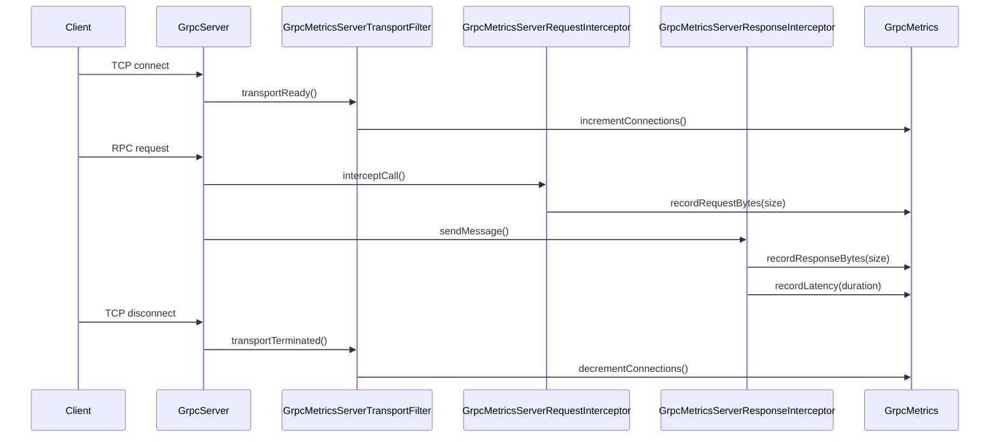

# HddsCommon / metrics-utils

**Classes:** 4    **Kinds:** metrics:4

## Overview

The `metrics-utils` feature group provides gRPC-level observability for Ozone's server-side gRPC endpoints by wiring Hadoop Metrics2 counters into the gRPC interceptor and transport-filter extension points. `GrpcMetrics` is a `MetricsSource` that owns the counter and gauge fields for request count, inbound byte sizes, outbound byte sizes, and active connection count; it is registered with the Metrics2 system and is therefore scraped by the Prometheus sink. `GrpcMetricsServerRequestInterceptor` is a `ServerInterceptor` that intercepts each incoming call: it starts a per-call timer and a byte counter, then attaches a custom `ServerCall.Listener` to count inbound message bytes via `onMessage`. `GrpcMetricsServerResponseInterceptor` is the paired outbound-side interceptor: it wraps the `ServerCall` to count bytes in `sendMessage` and records the call duration when the call closes. `GrpcMetricsServerTransportFilter` extends gRPC's `ServerTransportFilter` to increment and decrement the active-connection gauge on `transportReady` and `transportTerminated` respectively. All four classes were moved into `hdds-server-framework` in HDDS-12640 to make them reusable across services.

## Diagram

## Class table

### Sub-feature: `grpc.metrics`

| reading_order | fqcn | kind | logic | loc | study (min) | role |
|--:|---|---|---|--:|--:|---|
| 1960 | `org.apache.hadoop.ozone.grpc.metrics.GrpcMetrics` | metrics | mixed | 125~ | 20 | Class which maintains metrics related to using GRPC. |
| 1961 | `org.apache.hadoop.ozone.grpc.metrics.GrpcMetricsServerRequestInterceptor` | metrics | mixed | 50~ | 20 | Interceptor to gather metrics based on grpc server request. |
| 1962 | `org.apache.hadoop.ozone.grpc.metrics.GrpcMetricsServerResponseInterceptor` | metrics | mixed | 25~ | 20 | Interceptor to gather metrics based on grpc server response. |
| 1963 | `org.apache.hadoop.ozone.grpc.metrics.GrpcMetricsServerTransportFilter` | metrics | mixed | 25~ | 20 | Transport filter class for tracking active client connections. |

## Anchor details

No classes in this feature are classified `logic-heavy`; all four are `mixed`. The central state holder is `GrpcMetrics`.

### `GrpcMetrics`

- **path:** `hadoop-hdds/framework/src/main/java/org/apache/hadoop/ozone/grpc/metrics/GrpcMetrics.java`
- **loc:** 125~    **difficulty:** 2    **study:** 20 min    **concurrency:** single-threaded    **persistence:** in-memory
- **entry points:** `create`
- **key collaborators:** `org.apache.hadoop.ozone.OzoneConfigKeys`, `org.apache.hadoop.ozone.OzoneConsts`, `org.apache.hadoop.ozone.util.MetricUtil`
- **role:** Hadoop Metrics2 source that owns all gRPC-level counters and gauges.
- **insight:** Uses `@Metric` annotated fields (MutableCounterLong, MutableRate, etc.) which Hadoop Metrics2 discovers via reflection at registration time. The `create()` factory registers the instance under a caller-supplied name, allowing multiple gRPC services (OM, SCM, DN) to each have their own `GrpcMetrics` instance distinguished by the source name.

## Design docs

no dedicated design doc under hadoop-hdds/docs/content/ on this branch

## Seminal JIRAs / PRs

- HDDS-12640. Move GrpcMetrics to hdds-server-framework
- HDDS-12880. Move field declarations to start of class in hdds-server-framework
- HDDS-6631. Fix typos in output/exception messages

## Sharp edges

- `GrpcMetrics` is marked `concurrency: single-threaded` despite being shared across concurrent gRPC calls. The `@Metric`-annotated `MutableCounterLong` and `MutableRate` fields are themselves thread-safe (they use `AtomicLong` internally), but `GrpcMetrics` as a whole does not synchronise across multiple fields — increments to request-count and byte-count for the same call are not atomic with respect to each other, so a snapshot during a scrape may see a partially updated request record.

## Related features

- [`http-server.md`](http-server.md) — `PrometheusServlet` scrapes the Metrics2 system that `GrpcMetrics` registers with
- [`tracing-common.md`](tracing-common.md) — OpenTelemetry tracing that decorates the same gRPC interceptor chain
- [`framework-server.md`](framework-server.md) — shared server framework in the same module
- [`framework-protocol.md`](framework-protocol.md) — gRPC protocol definitions for the services these metrics instrument

## Self-quiz

1. `GrpcMetrics.create(name)` registers the instance with Hadoop Metrics2. What happens if `create()` is called twice with the same name in the same JVM?
2. `GrpcMetricsServerRequestInterceptor` records inbound bytes in `onMessage`. At what point in the gRPC call lifecycle is `onMessage` called relative to the service handler?
3. `GrpcMetricsServerTransportFilter.transportTerminated()` must decrement the connection count. What gRPC extension point does `GrpcMetricsServerTransportFilter` implement, and how is it registered on the `ServerBuilder`?
4. Which `GrpcMetrics` field tracks per-operation latency, and what Metrics2 type (counter, rate, gauge) does it use?
5. If a gRPC call returns an error before sending any response bytes, does `GrpcMetricsServerResponseInterceptor` still record the call? Explain by referencing the `close()` callback.

Answers

Answer 1: Hadoop Metrics2 `DefaultMetricsSystem.register()` throws `MetricsException` if a source with the same name is already registered; callers are expected to check or use a unique per-service name to avoid collision.
Answer 2: `onMessage` is called after the message is decoded from the wire but before the service handler processes it; it is part of the `ServerCall.Listener` callback chain, so it runs on the gRPC transport thread before the method handler executes.
Answer 3: `GrpcMetricsServerTransportFilter` extends `ServerTransportFilter`; it is added to the `ServerBuilder` via `serverBuilder.addTransportFilter(new GrpcMetricsServerTransportFilter(grpcMetrics))`.
Answer 4: `GrpcMetrics` uses a `MutableRate` field (annotated `@Metric`) for per-operation latency; `MutableRate` tracks both count and cumulative time and exposes them as two separate Metrics2 metrics (rate and average).
Answer 5: Yes. `GrpcMetricsServerResponseInterceptor` wraps `ServerCall.close()` — even on error paths gRPC calls `close(Status, Metadata)` exactly once, so the latency and request-count are always recorded regardless of whether any response bytes were sent.

