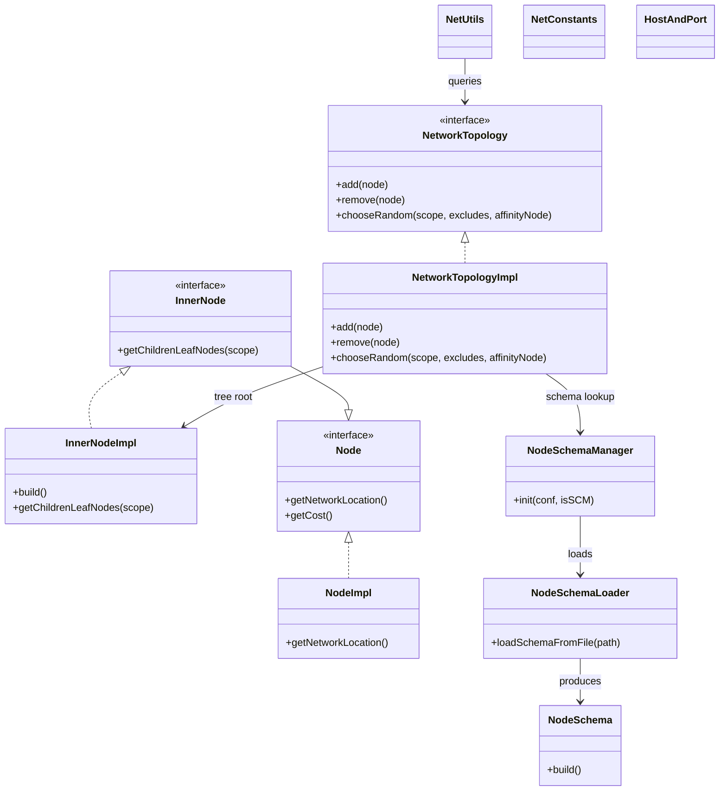

# HddsCommon / network-topology

**Classes:** 12    **Kinds:** service:7, interface:4, data:1

## Overview

The `network-topology` feature group models the physical cluster layout as a weighted tree and drives rack-aware datanode placement in SCM. The tree is rooted at a virtual root; interior nodes are racks, rows, or datacenters represented by `InnerNodeImpl`, which stores a `List<Node>` of children and supports path-based subtree lookups. Leaf nodes correspond to individual datanodes and are represented by `NodeImpl`. `NetworkTopologyImpl` is the live in-memory tree held by SCM: `add(node)` and `remove(node)` maintain the tree, while `chooseRandom(scope, excludes, affinityNode)` selects a node satisfying placement constraints such as cross-rack diversity. `NodeSchemaLoader` parses the operator-supplied YAML topology schema at SCM startup to determine how many topology layers exist and what their cost weights are; HDDS-14857 made the underlying XML parser secure against XXE. `NodeSchemaManager` wraps the loader result and provides the `NodeSchema` lookup used during `add`. `NetUtils`, `NetConstants`, `Node`, `NetworkTopology`, and `InnerNode` provide the utility, constant, and interface layer shared between `hdds-common` and `hdds-framework`.

## Diagram

## Class table

### Sub-feature: `scm.net`

| reading_order | fqcn | kind | logic | loc | study (min) | role |
|--:|---|---|---|--:|--:|---|
| 1964 | `org.apache.hadoop.hdds.scm.net.NodeImpl` | service | mixed | 175~ | 20 | A thread safe class that implements interface Node. |
| 1965 | `org.apache.hadoop.hdds.scm.net.Node` | interface | mixed | 25~ | 20 | The interface defines a node in a network topology. |
| 1966 | `org.apache.hadoop.hdds.scm.net.NetworkTopology` | interface | mixed | 25~ | 20 | The interface defines a network topology. |
| 1967 | `org.apache.hadoop.hdds.scm.net.InnerNode` | interface | mixed | 25~ | 20 | The interface defines an inner node in a network topology. |
| 1968 | `org.apache.hadoop.hdds.scm.net.NetworkTopologyImpl` | service | logic-heavy | 600~ | 60 | The class represents a cluster of computers with a tree hierarchical network topology. |
| 1969 | `org.apache.hadoop.hdds.scm.net.InnerNodeImpl` | service | logic-heavy | 425~ | 60 | A thread safe class that implements InnerNode interface. |
| 1970 | `org.apache.hadoop.hdds.scm.net.NodeSchemaLoader` | service | logic-heavy | 350~ | 45 | A Network topology layer schema loading tool that loads user defined network layer schema data from a XML configurati... |
| 1971 | `org.apache.hadoop.hdds.scm.net.NodeSchemaManager` | service | mixed | 100~ | 30 | The class manages all network topology schemas. |
| 1972 | `org.apache.hadoop.hdds.scm.net.NetUtils` | service | mixed | 75~ | 30 | Utility class to facilitate network topology functions. |
| 1973 | `org.apache.hadoop.hdds.scm.net.HostAndPort` | service | mixed | 50~ | 30 | A class for host and port. |
| 1974 | `org.apache.hadoop.hdds.scm.net.NetConstants` | service | mixed | 25~ | 30 | Class to hold network topology related constants and configurations. |
| 1975 | `org.apache.hadoop.hdds.scm.net.NodeSchema` | service | mixed | 100~ | 10 | Network topology schema to housekeeper relevant information. |

## Anchor details

### `NetworkTopologyImpl`

- **path:** `hadoop-hdds/framework/src/main/java/org/apache/hadoop/hdds/scm/net/NetworkTopologyImpl.java`
- **loc:** 600~    **difficulty:** 5    **study:** 60 min    **concurrency:** thread-safe    **persistence:** in-memory
- **key collaborators:** `org.apache.hadoop.hdds.conf.ConfigurationSource`
- **test exemplar:** `hadoop-hdds/framework/src/test/java/org/apache/hadoop/hdds/scm/net/TestNetworkTopologyImpl.java`
- **role:** The class represents a cluster of computers with a tree hierarchical network topology.
- **insight:** Guards all tree mutations with a `ReadWriteLock`; `chooseRandom` takes a read lock so concurrent placement decisions do not block each other. The `affinityNode` parameter in `chooseRandom` biases selection toward nodes that share a topology ancestor with the given node (e.g., same rack), enabling co-location placement policies without modifying the tree structure.

### `InnerNodeImpl`

- **path:** `hadoop-hdds/framework/src/main/java/org/apache/hadoop/hdds/scm/net/InnerNodeImpl.java`
- **loc:** 425~    **difficulty:** 5    **study:** 60 min    **concurrency:** single-threaded    **persistence:** in-memory
- **entry points:** `build`
- **role:** A thread safe class that implements InnerNode interface.
- **insight:** Implements `getLeafNodes(excludedScopes, excludedNodes)` by recursively descending the child list; the recursion terminates at leaf-level `NodeImpl` instances. The `build()` factory constructs `InnerNodeImpl` from a network path string (e.g. `/default-rack`) by splitting on `/` and looking up the corresponding `NodeSchema` layer for each segment.

### `NodeSchemaLoader`

- **path:** `hadoop-hdds/framework/src/main/java/org/apache/hadoop/hdds/scm/net/NodeSchemaLoader.java`
- **loc:** 350~    **difficulty:** 4    **study:** 45 min    **concurrency:** single-threaded    **persistence:** in-memory
- **key collaborators:** `org.apache.hadoop.hdds.server.YamlUtils`
- **test exemplar:** `hadoop-hdds/framework/src/test/java/org/apache/hadoop/hdds/scm/net/TestNodeSchemaLoader.java`
- **role:** A network topology layer schema loading tool that loads user-defined network layer schema data from a YAML configuration file.
- **insight:** After HDDS-14857 the loader uses `XMLUtils.newSecureFactory()` for any XML fallback path, preventing XXE attacks via a crafted topology config. The primary path reads YAML via `YamlUtils`; the XML path exists for backward compatibility. Schema validation catches unknown topology layer names before they can corrupt the runtime tree.

## Design docs

- `hadoop-hdds/docs/content/design/topology.md` — rack-awareness model, network topology YAML schema format, and placement constraint design

## Seminal JIRAs / PRs

- HDDS-14934. Enable PMD rule ConsecutiveAppendsShouldReuse
- HDDS-14857. Use XMLUtils.newSecureFactory
- HDDS-14609. Remove dependency on snakeyaml from hdds-common

## Sharp edges

- HDDS-14857: before the fix, `NodeSchemaLoader`'s XML fallback path used a default `DocumentBuilderFactory` without disabling external entity resolution, making SCM vulnerable to XXE if a malicious topology file was placed at the configured path; the fix is in `NodeSchemaLoader.java` in the XML parsing block.
- HDDS-14609: snakeyaml was replaced with a secure alternative in `NodeSchemaLoader`; if your branch depends on snakeyaml types being on the hdds-common classpath for topology parsing, they will be absent after this change.

## Related features

- [`scm-common.md`](scm-common.md) — SCM pipeline and container placement that consumes `NetworkTopologyImpl.chooseRandom()`
- [`pipeline-common.md`](pipeline-common.md) — pipeline creation logic that uses rack-aware node selection
- [`protocol-common.md`](protocol-common.md) — `DatanodeDetails` carries the network location string that `NodeImpl` stores
- [`config-runtime.md`](config-runtime.md) — `ConfigurationSource` passed to `NetworkTopologyImpl` and `NodeSchemaManager.init()`
- [`framework-utils.md`](framework-utils.md) — `YamlUtils` used by `NodeSchemaLoader` for YAML parsing

## Self-quiz

1. `NetworkTopologyImpl.chooseRandom(scope, excludes, affinityNode)` takes a read lock. Why is a read lock sufficient here rather than a write lock?
2. `NodeSchemaLoader` supports both YAML and XML input formats. What determines which parser is used, and what security property does `XMLUtils.newSecureFactory()` enforce?
3. `InnerNodeImpl.build()` constructs a node from a network path string such as `/default-datacenter/default-rack`. How does it determine which `NodeSchema` layer applies to each path segment?
4. `NetworkTopologyImpl` is thread-safe but `InnerNodeImpl` is marked `single-threaded`. How does `NetworkTopologyImpl` guarantee safe access to `InnerNodeImpl` children during concurrent `chooseRandom` calls?
5. `NodeSchemaManager.init(conf, isSCM)` has an `isSCM` boolean. What behaviour changes between SCM and non-SCM initialization, and which classes downstream are affected?

Answers

Answer 1: `chooseRandom` only reads the tree (traverses children, samples a leaf) and does not modify any node references; a read lock allows multiple concurrent placement decisions to proceed in parallel. Only `add()` and `remove()` need write locks.
Answer 2: `NodeSchemaLoader` checks the file extension or a configuration key to choose YAML vs XML; `XMLUtils.newSecureFactory()` sets `FEATURE_SECURE_PROCESSING`, disables DOCTYPE declarations, and disables external entity resolution, preventing XXE.
Answer 3: `InnerNodeImpl.build()` splits the path on `/`, then for each segment calls `NodeSchemaManager.getNodeSchema(level)` where `level` is the segment's depth in the path, mapping each depth to a `NodeSchema` that specifies the layer's name pattern and cost.
Answer 4: `NetworkTopologyImpl` holds the read lock across the entire `chooseRandom` traversal, preventing concurrent `add()`/`remove()` write operations from modifying `InnerNodeImpl`'s child list while traversal is in progress; `InnerNodeImpl` itself does not need its own locking because it is always accessed under the topology-level lock.
Answer 5: When `isSCM=true`, `NodeSchemaManager` also configures the leaf-layer schema to accept `DatanodeDetails` network locations; non-SCM initialization (e.g. for client-side topology awareness) skips that step. Downstream, `NetworkTopologyImpl.add(node)` uses the schema to validate the node's path depth, so an incorrectly initialised manager would reject valid datanode paths.

