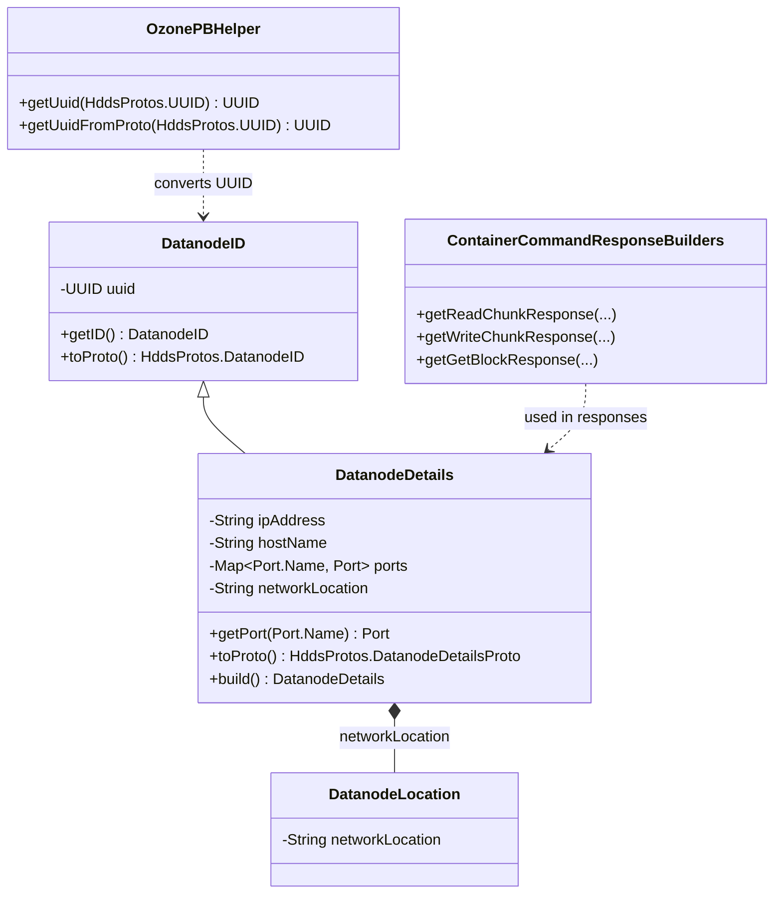

# HddsCommon / protocol-common

**Classes:** 4    **Kinds:** service:3, data:1

## Overview

This feature group defines the wire-level identity model for datanodes and the Protobuf translation helpers used across SCM, OM, and container-service boundaries. `DatanodeDetails` is the principal identity object for a datanode: it holds a `DatanodeID` (UUID), IP address, hostname, and a typed port map covering STANDALONE, RATIS, REST, REPLICATION, and DATASTREAM endpoints. `DatanodeID` is a lightweight value type introduced in HDDS-12970 to carry just the UUID; `DatanodeDetails` extends it so code that only needs the identifier does not pay for a full node-description copy. HDDS-13199 removed the deprecated `getUuid()` accessor from both types in favor of `getID()` returning `DatanodeID`, reducing accidental identity comparison by raw UUID. `OzonePBHelper` provides conversion between Java `UUID` and Protobuf `HddsProtos.UUID`, while `ContainerCommandResponseBuilders` assembles typed response protos (read-chunk, write-chunk, get-block, etc.) so each handler does not hand-build the response structure.

## Diagram

## Class table

### Sub-feature: `hdds.protocol`

| reading_order | fqcn | kind | logic | loc | study (min) | role |
|--:|---|---|---|--:|--:|---|
| 2024 | `org.apache.hadoop.hdds.protocol.DatanodeDetails` | service | logic-heavy | 650~ | 60 | DatanodeDetails class contains details about DataNode like: - UUID of the DataNode. |
| 2025 | `org.apache.hadoop.hdds.protocol.DatanodeID` | service | mixed | 75~ | 30 | DatanodeID is the primary identifier of the Datanode. |

### Sub-feature: `scm.protocolPB`

| reading_order | fqcn | kind | logic | loc | study (min) | role |
|--:|---|---|---|--:|--:|---|
| 2026 | `org.apache.hadoop.hdds.scm.protocolPB.OzonePBHelper` | service | mixed | 25~ | 30 | Helper class for converting protobuf objects. |
| 2027 | `org.apache.hadoop.hdds.scm.protocolPB.ContainerCommandResponseBuilders` | data | logic-heavy | 225~ | 10 | A set of helper functions to create responses to container commands. |

## Anchor details

### `DatanodeDetails`

- **path:** `hadoop-hdds/common/src/main/java/org/apache/hadoop/hdds/protocol/DatanodeDetails.java`
- **loc:** 650~    **difficulty:** 5    **study:** 60 min    **concurrency:** single-threaded    **persistence:** in-memory
- **entry points:** `build`
- **key collaborators:** `org.apache.hadoop.hdds.DatanodeVersion`, `org.apache.hadoop.hdds.HddsUtils`, `org.apache.hadoop.hdds.annotation.InterfaceAudience`, `org.apache.hadoop.hdds.annotation.InterfaceStability`, `org.apache.hadoop.hdds.scm.net.NetConstants`, `org.apache.hadoop.hdds.scm.net.NetUtils`
- **test exemplar:** `hadoop-hdds/common/src/test/java/org/apache/hadoop/hdds/protocol/TestDatanodeDetails.java`
- **role:** DatanodeDetails class contains details about DataNode like: - UUID of the DataNode. The port map uses `Port.Name` enum values (STANDALONE, RATIS, REST, REPLICATION, DATASTREAM) as keys; HDDS-12992 added DATASTREAM so clients can route streaming writes to the dedicated port. HDDS-10767 flagged that passing full `DatanodeDetails` objects through container location caches was expensive; `DatanodeID` was introduced as the lightweight alternative.

## Design docs

- `hadoop-hdds/docs/content/design/topology.md` — rack-topology placement used by `DatanodeLocation`

## Seminal JIRAs / PRs

- HDDS-12991. Recreate pipelines after enabling ratis write streaming
- HDDS-13199. Remove DatanodeDetails#getUuid and DatanodeID#getUuid methods
- HDDS-12970. Use DatanodeID in Pipeline
- HDDS-12992. Clients should not use gRPC port for Streaming
- HDDS-10767. Reducing DatanodeDetails in ContainerLocationCache

## Sharp edges

- HDDS-13199 removed `getUuid()` from `DatanodeDetails` and `DatanodeID`; code that still calls `getUuid()` compiles against older API jars but will fail at runtime with `NoSuchMethodError` in mixed-version clusters.
- `DatanodeDetails` is not thread-safe; SCM code that updates port entries after construction must hold the pipeline state lock. Reading stale port data can cause clients to connect to the wrong datanode port type.

## Related features

- [`pipeline-common.md`](pipeline-common.md) — `Pipeline` carries `List<DatanodeDetails>` as its node set
- [`ratis-integration.md`](ratis-integration.md) — `RatisHelper` reads `DatanodeDetails` ports to build `RaftPeer` addresses
- [`network-topology.md`](network-topology.md) — topology-aware placement consumes `DatanodeLocation`
- [`container-common.md`](container-common.md) — container location responses embed `DatanodeDetails`
- [`scm-common.md`](scm-common.md) — SCM NodeManager indexes datanodes by `DatanodeID`

## Self-quiz

1. What is the inheritance relationship between `DatanodeID` and `DatanodeDetails`, and why was `DatanodeID` introduced as a separate class (cite the JIRA)?
2. Which `Port.Name` values are defined in `DatanodeDetails`, and which one was added to support the datastream (gRPC streaming) write path?
3. `OzonePBHelper.getUuid` converts from which proto type to `java.util.UUID`, and where is this conversion used in the container command path?
4. Why does `ContainerCommandResponseBuilders` exist as a separate utility class rather than having each handler build its own response inline?
5. `DatanodeDetails.toProto()` produces which Protobuf message type, and where is that proto defined in the source tree?

Answers

Answer 1: `DatanodeDetails` extends `DatanodeID`. `DatanodeID` was introduced in HDDS-12970 so that `Pipeline` and container location maps could hold just the UUID reference without copying the full hostname, IP, and port map of each datanode.
Answer 2: STANDALONE, RATIS, REST, REPLICATION, DATASTREAM. DATASTREAM was added (HDDS-12992) for the dedicated gRPC-based write-streaming path so clients can distinguish it from the regular RATIS Raft port.
Answer 3: `OzonePBHelper.getUuid` converts `HddsProtos.UUID` (two longs: mostSigBits, leastSigBits) to `java.util.UUID`. It is used when deserializing `DatanodeDetailsProto` in SCM heartbeat and pipeline assignment responses.
Answer 4: Centralizing response construction in `ContainerCommandResponseBuilders` enforces a consistent status-code and result-field layout across all container command types, making it easier to add new fields (e.g., checksum data, block token) without touching every handler.
Answer 5: `toProto()` returns `HddsProtos.DatanodeDetailsProto`, defined in `hadoop-hdds/interface-client/src/main/proto/hdds.proto`.

