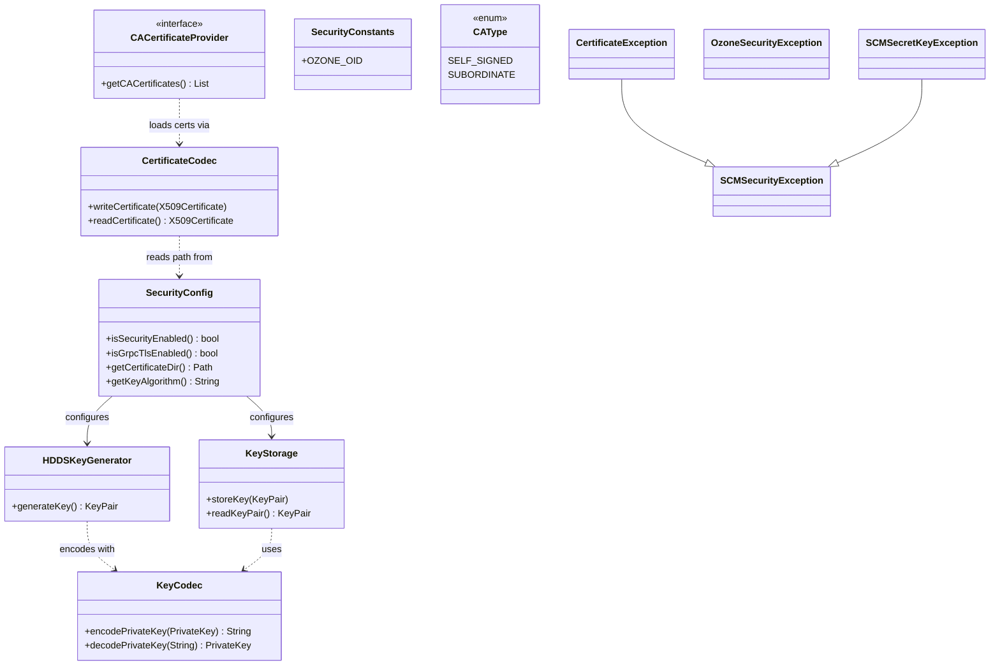

# HddsCommon / security-common

**Classes:** 12    **Kinds:** service:4, exception:4, util:2, config:1, data:1

## Overview

The security-common feature provides the foundational PKI and TLS primitives used by SCM, OM, datanodes, and the S3 Gateway. `SecurityConfig` is the single `@ConfigGroup` POJO for TLS and Kerberos settings; every component that needs a certificate or key reads from it via accessors such as `isSecurityEnabled()`, `isGrpcTlsEnabled()`, and `getCertificateDir()`. `HDDSKeyGenerator` creates RSA or EC key pairs according to the algorithm and key-size values from `SecurityConfig`, while `KeyStorage` persists and reloads those key pairs from disk in PEM format. `CertificateCodec` reads and writes X.509 certificates in PEM, backed by BouncyCastle; `KeyCodec` does the same for private and public keys. `CACertificateProvider` is the interface through which components supply a trust anchor to the gRPC `ClientTrustManager`. `SecurityConstants` collects OID strings for PKIX/PKCS structures. The four exception classes (`SCMSecurityException`, `CertificateException`, `OzoneSecurityException`, `SCMSecretKeyException`) form a hierarchy rooted at `SCMSecurityException`. Since HDDS-13781, certificate expiry comparison in `X509Util` is DST-aware.

## Diagram

## Class table

### Sub-feature: `certificate.authority`

| reading_order | fqcn | kind | logic | loc | study (min) | role |
|--:|---|---|---|--:|--:|---|
| 2055 | `org.apache.hadoop.hdds.security.x509.certificate.authority.CAType` | data | data-only | 25~ | 10 | Certificate authority type. |

### Sub-feature: `certificate.client`

| reading_order | fqcn | kind | logic | loc | study (min) | role |
|--:|---|---|---|--:|--:|---|
| 2056 | `org.apache.hadoop.hdds.security.x509.certificate.client.CACertificateProvider` | interface | mixed | 25~ | 30 | An interface that defines a trust anchor provider API this class relies on. |

### Sub-feature: `certificate.utils`

| reading_order | fqcn | kind | logic | loc | study (min) | role |
|--:|---|---|---|--:|--:|---|
| 2057 | `org.apache.hadoop.hdds.security.x509.certificate.utils.CertificateCodec` | util | mixed | 175~ | 20 | A class used to read and write X.509 certificates  PEM encoded Streams. |

### Sub-feature: `hdds.security`

| reading_order | fqcn | kind | logic | loc | study (min) | role |
|--:|---|---|---|--:|--:|---|
| 2058 | `org.apache.hadoop.hdds.security.SecurityConstants` | service | mixed | 25~ | 30 | Class to define constants that are used in relation to different PKIX, PKCS, and CMS Structures as defined by &lt;a href... |
| 2059 | `org.apache.hadoop.hdds.security.SecurityConfig` | config | logic-heavy | 350~ | 20 | A class that deals with all Security related configs in HDDS. |

### Sub-feature: `security.exception`

| reading_order | fqcn | kind | logic | loc | study (min) | role |
|--:|---|---|---|--:|--:|---|
| 2060 | `org.apache.hadoop.hdds.security.exception.SCMSecurityException` | exception | data-only | 50~ | 10 | Root Security Exception call for all Certificate related Exceptions. |
| 2061 | `org.apache.hadoop.hdds.security.exception.OzoneSecurityException` | exception | data-only | 25~ | 10 | Security exceptions thrown at Ozone layer. |
| 2062 | `org.apache.hadoop.hdds.security.exception.SCMSecretKeyException` | exception | data-only | 25~ | 10 | Exception for all secret key related errors. |

### Sub-feature: `x509.exception`

| reading_order | fqcn | kind | logic | loc | study (min) | role |
|--:|---|---|---|--:|--:|---|
| 2063 | `org.apache.hadoop.hdds.security.x509.exception.CertificateException` | exception | data-only | 25~ | 10 | Certificate Exceptions from the SCM Security layer. |

### Sub-feature: `x509.keys`

| reading_order | fqcn | kind | logic | loc | study (min) | role |
|--:|---|---|---|--:|--:|---|
| 2064 | `org.apache.hadoop.hdds.security.x509.keys.KeyStorage` | service | mixed | 100~ | 30 | inferred: KeyStorage — role not documented. |
| 2065 | `org.apache.hadoop.hdds.security.x509.keys.HDDSKeyGenerator` | service | mixed | 25~ | 30 | A class to generate Key Pair for use with Certificates. |
| 2066 | `org.apache.hadoop.hdds.security.x509.keys.KeyCodec` | util | mixed | 25~ | 20 | KeyCodec for encoding and decoding private and public keys. |

## Anchor details

_No logic-heavy anchors in this feature; the classes are primarily data / dto / config / util._

## Design docs

- `hadoop-hdds/docs/content/design/token.md` — describes the block token and delegation token schemes that depend on the key and certificate primitives in this feature.
- `hadoop-hdds/docs/content/design/tde.md` — Transparent Data Encryption, which builds on `SecurityConfig` and the key management layer.
- `hadoop-hdds/docs/content/design/secure-s3.md` — S3 Gateway secure mode, which uses `SecurityConfig` and `CertificateCodec` for mTLS setup.

## Seminal JIRAs / PRs

- HDDS-15094. Make protocol and cipher configurable for gRPC TLS
- HDDS-14207. Inconsistent Ozone admin check
- HDDS-13781. Certificate expiry date should consider DST
- HDDS-12989. Throw CodecException for the Codec byte[] methods
- HDDS-12947. Add CodecException
- HDDS-13721. Move admin interface usage out of hdds-common

## Sharp edges

- HDDS-13781: before the fix, `CertificateCodec`/`X509Util` expiry comparisons used `Date.before()` on wall-clock times without a fixed `TimeZone`, causing certificates to appear expired or not-yet-valid by up to one hour during DST transitions.
- `SecurityConfig.isGrpcTlsEnabled()` returns true only when both `ozone.security.enabled` and `hdds.grpc.tls.enabled` are set; deployers who set only the gRPC flag see silently unencrypted channels.

## Related features

- [`security-tokens.md`](security-tokens.md) — block and container tokens that use the key material managed here
- [`scm-common.md`](scm-common.md) — `ClientTrustManager` consumes `CACertificateProvider` defined here
- [`audit-common.md`](audit-common.md) — audit logging tied to the security exception hierarchy
- [`protocol-common.md`](protocol-common.md) — gRPC channel builders that read `SecurityConfig` for TLS setup
- [`config-common.md`](config-common.md) — `@ConfigGroup` annotation wiring used by `SecurityConfig`

## Self-quiz

1. `SecurityConfig.isSecurityEnabled()` reads from which configuration key, and in which file is that key defined?
2. `HDDSKeyGenerator` supports multiple key algorithms. How does it read the algorithm setting, and what is the default?
3. `KeyStorage` persists key pairs on disk in PEM format. What happens if the key file already exists when `storeKey()` is called — does it overwrite or throw?
4. `CertificateCodec` implements `Codec<X509Certificate>`. After HDDS-12947, what exception type must it throw on serialization failure, and where is that type defined?
5. `CAType` is an enum with `SELF_SIGNED` and `SUBORDINATE`. Which component in the system holds a `SUBORDINATE` CA, and why?

Answers

Answer 1: `SecurityConfig` reads `HddsConfigKeys.HDDS_GRPC_ENABLED` and `OzoneConfigKeys.OZONE_SECURITY_ENABLED`; the key strings are defined in `hadoop-hdds/common/src/main/java/org/apache/hadoop/hdds/HddsConfigKeys.java`.
Answer 2: `HDDSKeyGenerator` reads `SecurityConfig.getKeyAlgorithm()` (backed by config key `hdds.key.algorithm`); the default is RSA.
Answer 3: `KeyStorage` overwrites the existing file; it does not check for prior existence, so callers must ensure they only call `storeKey()` once during bootstrapping.
Answer 4: After HDDS-12947, all `Codec` implementations throw `CodecException` (in `hadoop-hdds/common`); `CertificateCodec` wraps BouncyCastle and IO errors in `CodecException` rather than letting them propagate as unchecked exceptions.
Answer 5: OM holds a `SUBORDINATE` CA issued by the SCM root CA; this allows OM to issue delegation tokens whose certificate chain roots at SCM without exposing the SCM private key to each client.

