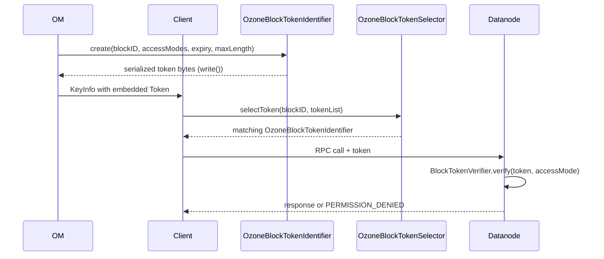

# HddsCommon / security-tokens

**Classes:** 3    **Kinds:** service:2, abstract:1

## Overview

The security-tokens feature implements short-lived bearer tokens that authorize individual block operations on datanodes without requiring a Kerberos round-trip for every read or write. `ShortLivedTokenIdentifier` is the abstract base that carries the common fields: expiry time, owner, and token kind. `OzoneBlockTokenIdentifier` extends it with the `BlockID`, the set of allowed `AccessModes` (READ, WRITE, DELETE, COPY), and the block's maximum byte length; OM issues these tokens and attaches them to `KeyInfo`. `OzoneBlockTokenSelector` selects the correct token from a collection by matching on the block ID. On the datanode, `OzoneBlockTokenSecretManager` (outside this feature, but a primary consumer) issues and verifies tokens using HMAC-SHA256; since HDDS-7831 replaced RSA signing with symmetric HMAC, verification is significantly cheaper on the datanode hot path. The token bytes are written by `OzoneBlockTokenIdentifier.write()` using a `DataOutput` stream and travel on the wire inside the Hadoop `Token` wrapper.

## Diagram

## Class table

### Sub-feature: `security.token`

| reading_order | fqcn | kind | logic | loc | study (min) | role |
|--:|---|---|---|--:|--:|---|
| 2067 | `org.apache.hadoop.hdds.security.token.ShortLivedTokenIdentifier` | abstract | mixed | 75~ | 30 | Base class for short-lived tokens (block, container). |
| 2068 | `org.apache.hadoop.hdds.security.token.OzoneBlockTokenIdentifier` | service | mixed | 125~ | 30 | Block token identifier for Ozone/HDDS. |
| 2069 | `org.apache.hadoop.hdds.security.token.OzoneBlockTokenSelector` | service | mixed | 25~ | 30 | A block token selector for Ozone. |

## Anchor details

_No logic-heavy anchors in this feature; the classes are primarily data / identifier / selector._

## Design docs

- `hadoop-hdds/docs/content/design/token.md` — describes the full delegation and block token lifecycle, the HMAC signing switch, and the renewal flow.

## Seminal JIRAs / PRs

- HDDS-13721. Move admin interface usage out of hdds-common
- HDDS-10054. Reduce DataNode token verification heap allocation cost
- HDDS-7831. Use symmetric secret key to sign and verify token
- HDDS-4729. Add token support for container admin operations

## Sharp edges

- `OzoneBlockTokenIdentifier` carries a `maxLength` field that the datanode checks to reject writes beyond the allocation; if OM issues a token with an incorrect `maxLength` (e.g., after a partial write is resumed), the datanode will reject the continuation write with a token validation error (HDDS-10054 context).
- The `AccessModes` set in the token is checked on every RPC; clients that cache tokens across operation types (read then write) will see a `PERMISSION_DENIED` on the second operation because the token was issued only for the first mode.

## Related features

- [`security-common.md`](security-common.md) — `SecurityConfig` and key management that back the HMAC secret
- [`scm-client-proxy.md`](scm-client-proxy.md) — `SCMSecurityProtocolFailoverProxyProvider` used to fetch secret key renewals from SCM
- [`container-common.md`](container-common.md) — container-level RPC that carries the block token
- [`protocol-common.md`](protocol-common.md) — gRPC stubs through which the token travels to the datanode

## Self-quiz

1. `OzoneBlockTokenIdentifier.write()` is the serialization entry point. What format does it write — Protobuf, Java DataOutput, or PEM?
2. `OzoneBlockTokenSelector.selectToken()` matches a token by what criterion — block ID, expiry, or access mode?
3. HDDS-7831 switched block token signing from RSA to HMAC-SHA256. What is the concrete performance benefit on the datanode, and what security assumption does HMAC require that RSA does not?
4. `ShortLivedTokenIdentifier` is abstract. What fields does it contribute to subclasses, and why are block tokens "short-lived" rather than delegating to the Kerberos KDC for each operation?
5. If a block token has `AccessModes = {READ}` and the datanode receives a WRITE RPC with that token, what happens, and which class performs the check?

Answers

Answer 1: `OzoneBlockTokenIdentifier.write()` uses Java `DataOutput` (Hadoop `Writable` serialization), not Protobuf or PEM.
Answer 2: `OzoneBlockTokenSelector` matches by block ID; it iterates the token list and returns the first token whose `BlockID` matches the requested block.
Answer 3: HMAC-SHA256 verification is a single symmetric MAC operation (microseconds) vs. RSA signature verification (milliseconds); the assumption HMAC adds is that the signing secret must remain shared and confidential between OM and all datanodes — a leaked secret compromises all outstanding tokens simultaneously.
Answer 4: `ShortLivedTokenIdentifier` contributes `expiryDate`, `owner`, and token kind; tokens are short-lived because each one is cryptographically bound to a specific block and expiry, so a stolen token cannot be replayed indefinitely, and the OM need not maintain a per-token revocation list.
Answer 5: The datanode's `BlockTokenVerifier.verify()` checks that the requested access mode is a member of the token's `allowedModes` set; if WRITE is absent, it throws a `BlockTokenException`, and the RPC returns `PERMISSION_DENIED` to the client.

