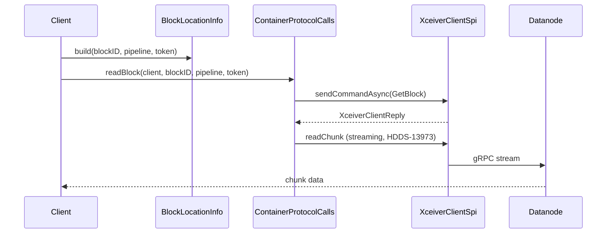

# HddsCommon / storage-common

**Classes:** 2    **Kinds:** service:1, dto:1

## Overview

`storage-common` provides the two classes that bridge OM key metadata to datanode block RPCs. `ContainerProtocolCalls` is a ~700-line static utility that constructs and dispatches every block-layer container command — `readChunk`, `writeChunk`, `putBlock`, `getBlock`, `listChunks` — through the `XceiverClientSpi` abstraction, wrapping each call in an OpenTelemetry trace span. gRPC streaming variants for block reads were added incrementally in HDDS-13973, HDDS-13974, and HDDS-13975, enabling pipelined chunk transfers on a single stream per block. `BlockLocationInfo` is the cross-layer data transfer object that carries a `BlockID`, the associated `Pipeline`, a security token, and a list of `ContainerBlockLocation` entries assembled from OM key metadata; it is passed down to `ContainerProtocolCalls` when a client opens a block for I/O.

## Diagram

## Class table

### Sub-feature: `scm.storage`

| reading_order | fqcn | kind | logic | loc | study (min) | role |
|--:|---|---|---|--:|--:|---|
| 2070 | `org.apache.hadoop.hdds.scm.storage.ContainerProtocolCalls` | service | logic-heavy | 700~ | 60 | Implementation of all container protocol calls performed by Container clients. |
| 2071 | `org.apache.hadoop.hdds.scm.storage.BlockLocationInfo` | dto | data-only | 150~ | 10 | One key can be too huge to fit in one container. |

## Anchor details

### `ContainerProtocolCalls`

- **path:** `hadoop-hdds/common/src/main/java/org/apache/hadoop/hdds/scm/storage/ContainerProtocolCalls.java`
- **loc:** 700~    **difficulty:** 5    **study:** 60 min    **concurrency:** single-threaded    **persistence:** in-memory
- **key collaborators:** `org.apache.hadoop.hdds.annotation.InterfaceStability`, `org.apache.hadoop.hdds.client.BlockID`, `org.apache.hadoop.hdds.protocol.DatanodeDetails`, `org.apache.hadoop.hdds.scm.XceiverClientReply`, `org.apache.hadoop.hdds.scm.XceiverClientSpi`, `org.apache.hadoop.hdds.scm.container.common.helpers.BlockNotCommittedException`
- **role:** Implementation of all container protocol calls performed by Container clients.
- **note:** Every public method is a static factory for a specific container command; the caller supplies the `XceiverClientSpi` and bears thread-safety responsibility. The streaming `readBlock` overload (HDDS-13973/13974/13975) reuses the same gRPC stream for all chunks in one block, avoiding repeated stream setup overhead at the cost of requiring the caller to drive back-pressure on the response iterator.

## Design docs

- no dedicated design doc under hadoop-hdds/docs/content/ on this branch

## Seminal JIRAs / PRs

- HDDS-13973. The ground work to support stream read block
- HDDS-13974. Use the same gRPC stream for reading the same block
- HDDS-13975. Limit the number of responses in stream read block
- HDDS-13680. migrate tracing to opentelemetry
- HDDS-15791. EC reconstructed RECOVERING container can be deleted by SCM
- HDDS-15581. ozone debug replicas chunk-info reports wrong block size for EC keys

## Sharp edges

- `ContainerProtocolCalls` is stateless and passes no executor; any concurrent invocation from multiple threads against the same `XceiverClientSpi` channel is the caller's responsibility to synchronize (concurrency field is `single-threaded`).
- The streaming `readBlock` path (HDDS-13973) accumulates response count via a semaphore limit; exceeding `ozone.scm.block.stream.read.max.inflight` silently stalls rather than throwing, making tuning mistakes hard to diagnose.

## Related features

- [pipeline-common.md](pipeline-common.md) — `Pipeline` is the routing object carried inside `BlockLocationInfo`
- [container-common.md](container-common.md) — container-layer DTOs consumed by `ContainerProtocolCalls`
- [security-tokens.md](security-tokens.md) — `OzoneBlockTokenIdentifier` attached to `BlockLocationInfo`
- [tracing-common.md](tracing-common.md) — `TracingUtil` used by `ContainerProtocolCalls` for span creation
- [scm-client-proxy.md](scm-client-proxy.md) — `XceiverClientSpi` implementations that `ContainerProtocolCalls` delegates to

## Self-quiz

1. `ContainerProtocolCalls.readBlock` has both a unary and a streaming variant. What JIRA introduced the streaming variant, and what problem did it solve?
2. What three fields does `BlockLocationInfo` carry that are required before `ContainerProtocolCalls` can dispatch a `getBlock` RPC?
3. Why is `ContainerProtocolCalls` marked `single-threaded` in `concurrency` even though it has no instance state?
4. When `BlockNotCommittedException` is thrown by `ContainerProtocolCalls`, what does that indicate about the block lifecycle?
5. How does `ContainerProtocolCalls` propagate an OpenTelemetry trace span into the outgoing gRPC call to the datanode?

Answers

Answer 1: HDDS-13973 introduced the streaming read variant. It enabled pipelined chunk transfers over a single gRPC stream, avoiding repeated stream setup for each chunk of a block.
Answer 2: `BlockID` (identifies the container and local block), `Pipeline` (identifies the datanode set and RPC endpoint), and a security token (`OzoneBlockTokenIdentifier`) for authenticated clusters.
Answer 3: Thread safety is the caller's responsibility because `ContainerProtocolCalls` is a pure static utility; the underlying `XceiverClientSpi` may not be thread-safe and the class makes no synchronization guarantees.
Answer 4: The block was written to the datanode but `putBlock` has not yet been acknowledged to SCM, meaning the write pipeline is still open or the commit RPC was lost.
Answer 5: `ContainerProtocolCalls` calls `TracingUtil.createSpan` and then `TracingUtil.exportCurrentSpan()` to serialize the span context into a string, which is embedded as a Protobuf field in the outgoing `ContainerCommandRequestProto`. `GrpcClientInterceptor` also injects the context into gRPC metadata headers automatically.

