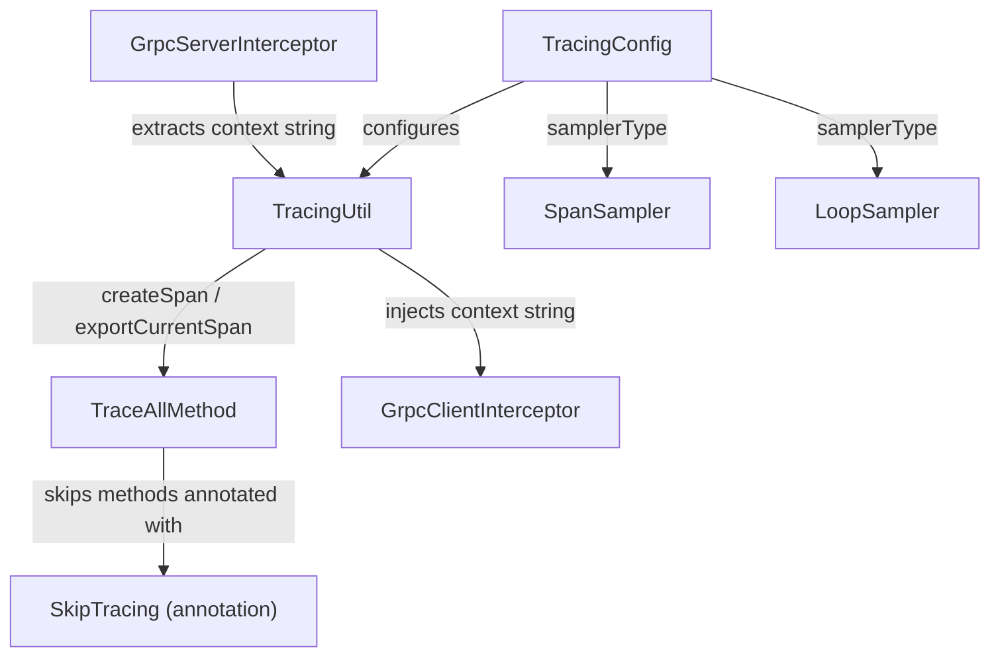

# HddsCommon / tracing-common

**Classes:** 8    **Kinds:** service:6, interface:1, config:1

## Overview

`tracing-common` contains the eight classes that implement distributed tracing across all Ozone services. The foundation is `TracingUtil`, which wraps the OpenTelemetry SDK (migrated from OpenTracing in HDDS-13680) and provides `createSpan`, `exportCurrentSpan`, and `importAndCreateSpan` for propagating trace context across RPC boundaries via serialized strings. `GrpcClientInterceptor` and `GrpcServerInterceptor` inject and extract that context automatically from gRPC metadata headers. `TraceAllMethod` is a Java dynamic-proxy `InvocationHandler` that wraps any interface implementation to produce a span per method call; `SkipTracing` is the annotation that exempts individual methods from that proxy. Sampling is controlled by `TracingConfig` (HDDS-14961) together with `SpanSampler` for named-span rules and `LoopSampler` for probability-based sampling in Freon load-generator loops. `BatchSpanProcessor` replaced `SimpleSpanProcessor` in HDDS-15579 to reduce per-span export latency under load.

## Diagram

## Class table

### Sub-feature: `hdds.tracing`

| reading_order | fqcn | kind | logic | loc | study (min) | role |
|--:|---|---|---|--:|--:|---|
| 2072 | `org.apache.hadoop.hdds.tracing.SkipTracing` | interface | mixed | 25~ | 20 | Annotation to mark methods that should be excluded from tracing. |
| 2073 | `org.apache.hadoop.hdds.tracing.TracingUtil` | service | logic-heavy | 375~ | 45 | Utility class to collect all the tracing helper methods. |
| 2074 | `org.apache.hadoop.hdds.tracing.TraceAllMethod` | service | mixed | 50~ | 30 | A Java proxy invocation handler to trace all the methods of the delegate class. |
| 2075 | `org.apache.hadoop.hdds.tracing.GrpcServerInterceptor` | service | mixed | 25~ | 30 | Interceptor to add the tracing id to the outgoing call header. |
| 2076 | `org.apache.hadoop.hdds.tracing.GrpcClientInterceptor` | service | mixed | 25~ | 30 | Interceptor to add the tracing id to the outgoing call header. |
| 2077 | `org.apache.hadoop.hdds.tracing.LoopSampler` | service | mixed | 25~ | 30 | Probability-based span sampler that samples spans independently. |
| 2078 | `org.apache.hadoop.hdds.tracing.SpanSampler` | service | mixed | 25~ | 30 | Custom Sampler that applies span-level sampling for configured span names, and delegates to parent-based strategy oth... |
| 2079 | `org.apache.hadoop.hdds.tracing.TracingConfig` | config | data-only | 100~ | 20 | OpenTelemetry tracing configuration for Ozone services. |

## Anchor details

### `TracingUtil`

- **path:** `hadoop-hdds/common/src/main/java/org/apache/hadoop/hdds/tracing/TracingUtil.java`
- **loc:** 375~    **difficulty:** 4    **study:** 45 min    **concurrency:** single-threaded    **persistence:** in-memory
- **entry points:** `execute`
- **key collaborators:** `org.apache.hadoop.hdds.conf.ConfigurationSource`
- **test exemplar:** `hadoop-hdds/common/src/test/java/org/apache/hadoop/hdds/tracing/TestTracingUtil.java`
- **role:** Utility class to collect all the tracing helper methods.
- **note:** `exportCurrentSpan()` base64-encodes the W3C TraceContext (via `StringCodec`) into a plain string that can be embedded in any Protobuf field, not just gRPC metadata headers — this is the mechanism that carries traces over Hadoop RPC calls. `importAndCreateSpan(name, serialized)` reverses the process on the receiving side, making the remote span the parent of the new local span.

## Design docs

- `hadoop-hdds/docs/content/design/distributed-tracing-OpenTelemetry.md` — design for migrating from OpenTracing to OpenTelemetry, covering `TracingUtil`, `GrpcClientInterceptor`, `GrpcServerInterceptor`, and the `BatchSpanProcessor` switch.

## Seminal JIRAs / PRs

- HDDS-13680. migrate tracing to opentelemetry
- HDDS-13804. Client aware tracing
- HDDS-14961. Introduce configuration for tracing
- HDDS-14765. Improve Trace Hierarchy for Ozone Shell Put Key
- HDDS-14814. Unify fragmented traces for Freon randomkeys
- HDDS-15579. Replace SimpleSpanProcessor with BatchSpanProcessor

## Sharp edges

- `TraceAllMethod` wraps every non-annotated method unconditionally; annotating a high-frequency internal method with `@SkipTracing` is required to avoid span-creation overhead in hot paths (e.g., Freon benchmark loops trigger `LoopSampler` for this reason).
- `TracingUtil.initTracing` must be called once per JVM before any span is created; calling it a second time (e.g., after a config reload) silently replaces the global `OpenTelemetry` instance, which can drop in-flight spans (HDDS-14961 introduced `ReconfigurableConfig` support to address reloads).

## Related features

- [framework-server.md](framework-server.md) — server startup wires `TracingUtil.initTracing` via service lifecycle hooks
- [config-common.md](config-common.md) — `TracingConfig` is registered with the Ozone `ConfigurationSource` framework
- [storage-common.md](storage-common.md) — `ContainerProtocolCalls` uses `TracingUtil` to create block-I/O spans
- [framework-protocol.md](framework-protocol.md) — Hadoop RPC interceptors use `TracingUtil.exportCurrentSpan` for non-gRPC hops

## Self-quiz

1. What encoding does `TracingUtil.exportCurrentSpan()` use to carry the trace context across a Hadoop RPC call, and which class implements that encoding?
2. Why was `SimpleSpanProcessor` replaced with `BatchSpanProcessor` in HDDS-15579? What observable behavior changed?
3. `TraceAllMethod` respects `@SkipTracing`. Name one concrete class in Ozone that uses `TraceAllMethod` as its proxy handler.
4. How do `GrpcClientInterceptor` and `GrpcServerInterceptor` differ in where they attach the trace context in the gRPC call?
5. If `TracingConfig.isEnabled()` returns false, what does `TracingUtil.createSpan` return, and does downstream code need to null-check the result?

Answers

Answer 1: `TracingUtil.exportCurrentSpan()` uses base64 encoding via `StringCodec` (the tracing-package one), which wraps the W3C TraceContext bytes into a plain Java `String` that can be set on any Protobuf string field.
Answer 2: `SimpleSpanProcessor` exported each span synchronously on the calling thread; `BatchSpanProcessor` buffers spans and exports them asynchronously, reducing per-RPC latency impact. The observable change is that spans may be delayed slightly before appearing in the backend but the calling thread is no longer blocked.
Answer 3: `OzoneManagerProtocolClientSideTranslatorPB` (and similar `*ClientSideTranslatorPB` classes) are wrapped by `TraceAllMethod` in their factory methods to trace all OM RPC calls.
Answer 4: `GrpcClientInterceptor` runs on the sending side and sets the context in the outgoing call metadata headers (before the RPC is sent). `GrpcServerInterceptor` runs on the receiving side and extracts the context from incoming call metadata to start a child span on the server.
Answer 5: When tracing is disabled, `TracingUtil.createSpan` returns a no-op `Span` (the OpenTelemetry SDK's `Span.getInvalid()`) rather than null, so callers do not need null checks.

