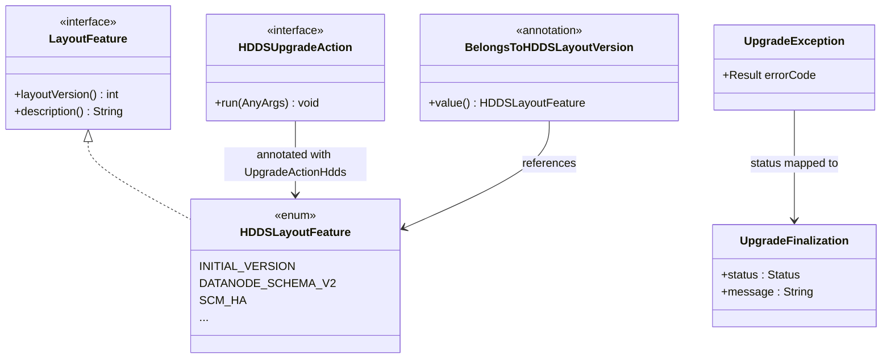

# HddsCommon / upgrade-common

**Classes:** 6    **Kinds:** interface:3, data:2, exception:1

## Overview

`upgrade-common` defines the shared vocabulary types that all three Ozone services (SCM, OM, and datanodes) use to participate in rolling upgrades. `LayoutFeature` is the root marker interface: each service implements it as an enum (e.g., `HDDSLayoutFeature`, `OMLayoutFeature`) where each constant represents one versioned capability gate. `BelongsToHDDSLayoutVersion` is a source annotation used to tag code that belongs to a specific layout version, supporting auditability. `HDDSUpgradeAction` is the action interface for SCM and datanode finalization steps; implementations are discovered and executed by the framework during finalization. `UpgradeFinalization` is the client-side DTO that carries finalization status across the admin RPC boundary. `UpgradeException` is thrown when any step in the upgrade sequence fails, carrying an error code that callers inspect to distinguish retriable from fatal states. HDDS-14569 simplified the model by removing pre-finalization action support, leaving finalization as the sole execution point.

## Diagram

## Class table

### Sub-feature: `hdds.upgrade`

| reading_order | fqcn | kind | logic | loc | study (min) | role |
|--:|---|---|---|--:|--:|---|
| 2080 | `org.apache.hadoop.hdds.upgrade.BelongsToHDDSLayoutVersion` | interface | mixed | 25~ | 20 | Annotation to mark a class or a field declaration that belongs to a specific HDDS Layout Version. |
| 2081 | `org.apache.hadoop.hdds.upgrade.HDDSUpgradeAction` | interface | mixed | 25~ | 20 | Upgrade Action for SCM and DataNodes. |
| 2082 | `org.apache.hadoop.hdds.upgrade.HDDSLayoutFeature` | data | data-only | 50~ | 10 | List of HDDS Features. |

### Sub-feature: `ozone.upgrade`

| reading_order | fqcn | kind | logic | loc | study (min) | role |
|--:|---|---|---|--:|--:|---|
| 2083 | `org.apache.hadoop.ozone.upgrade.LayoutFeature` | interface | mixed | 25~ | 20 | Generic Layout feature interface for Ozone. |
| 2084 | `org.apache.hadoop.ozone.upgrade.UpgradeFinalization` | service | mixed | 100~ | 10 | Client-side interface of upgrade finalization. |
| 2085 | `org.apache.hadoop.ozone.upgrade.UpgradeException` | exception | data-only | 25~ | 10 | Exception thrown when upgrade fails. |

## Anchor details

_No logic-heavy anchors in this feature; the classes are primarily data / dto / config / cli._

## Design docs

- `hadoop-hdds/docs/content/design/upgrade-dev-primer.md` — developer guide for adding new layout features and upgrade actions using these interfaces.
- `hadoop-hdds/docs/content/design/nonrolling-upgrade.md` — covers the upgrade lifecycle that `LayoutFeature`, `HDDSUpgradeAction`, and `UpgradeFinalization` participate in.

## Seminal JIRAs / PRs

- HDDS-11963. Add parent interface of component and layout versions for use in request validator
- HDDS-12188. Move server-only upgrade classes from hdds-common to hdds-server-framework
- HDDS-12354. Move Storage and UpgradeFinalizer to hdds-server-framework
- HDDS-12420. Move FinalizeUpgradeCommandUtil to hdds-common
- HDDS-14569. Remove support for upgrade actions that run outside of finalization

## Sharp edges

- `HDDSLayoutFeature` enum ordinal order is load-bearing: the metadata layout version stored on disk is the integer `layoutVersion()` of each constant, so inserting a new constant between existing ones would corrupt upgrades. New features must always be appended.
- HDDS-14569 removed the `BEFORE_FINALIZATION` action phase; any `HDDSUpgradeAction` implementation that still references the old `RunWith` enum variant will fail to compile against current code, a trap for backports.

## Related features

- [upgrade-framework.md](upgrade-framework.md) — `BasicUpgradeFinalizer` and `AbstractLayoutVersionManager` implement these interfaces
- [framework-server.md](framework-server.md) — service startup registers `HDDSLayoutVersionManager` which manages `HDDSLayoutFeature` constants
- [scm-common.md](scm-common.md) — SCM-side layout feature checks use `LayoutFeature` gating
- [ozone-common-primitives.md](ozone-common-primitives.md) — `Versioned` interface that `LayoutFeature` extends

## Self-quiz

1. Why must new `HDDSLayoutFeature` enum constants always be appended rather than inserted at an earlier position?
2. What was removed from the upgrade model in HDDS-14569, and why was that simplification safe?
3. `BelongsToHDDSLayoutVersion` is a source annotation. Name one concrete use of it in the codebase and explain what it communicates to a reviewer.
4. `UpgradeFinalization` is described as the client-side interface. What information does it carry, and which service exposes an RPC that returns it?
5. What distinguishes `HDDSUpgradeAction` from `LayoutFeature`? Why are they separate interfaces?

Answers

Answer 1: `HDDSLayoutFeature.layoutVersion()` returns the enum's integer representation, which is persisted to disk as the metadata layout version. Inserting a constant would shift all later integers, causing existing clusters to misidentify their stored layout version on upgrade.
Answer 2: HDDS-14569 removed upgrade actions that ran in a `BEFORE_FINALIZATION` phase (actions that executed when a new-software node first joined, before an admin triggered finalization). The simplification was safe because those actions were found to create race conditions; all mutation is now serialized under the finalization lock.
Answer 3: `@BelongsToHDDSLayoutVersion(HDDSLayoutFeature.DATANODE_SCHEMA_V2)` on a datanode schema field communicates that the field was introduced in that layout version and must not be read by older software. It is documentation and static analysis support, not runtime-enforced.
Answer 4: `UpgradeFinalization` carries a `Status` enum (ALREADY_FINALIZED, STARTING_FINALIZATION, FINALIZATION_IN_PROGRESS, FINALIZATION_DONE, FINALIZATION_FAILED) and an optional message string. SCM exposes it via the `StorageContainerManagerProtocol.finalizeUpgrade` / `queryUpgradeFinalizationProgress` RPCs.
Answer 5: `LayoutFeature` defines what a version-gated capability *is* (its version number and description). `HDDSUpgradeAction` defines the *migration work* to be done when that capability is finalized. They are separate so a feature can have no migration action (purely a gate) or multiple actions.

