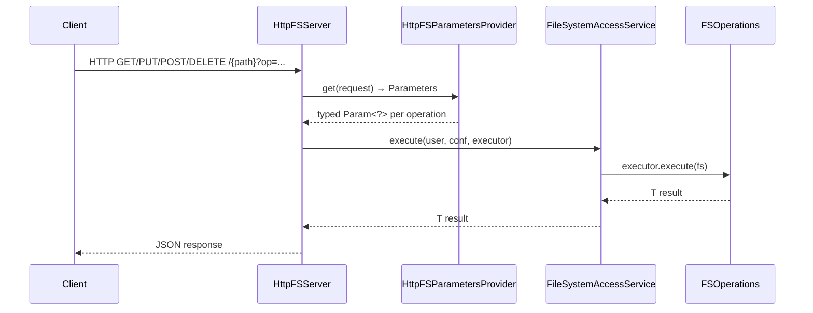

# Interfaces / httpfs

**Classes:** 48    **Kinds:** service:22, abstract:12, interface:7, exception:6, metrics:1

## Overview

HttpFS is an HTTP REST gateway that exposes the Hadoop FileSystem API over a WebHDFS-compatible wire protocol, allowing clients to access Ozone (or HDFS) without native Hadoop RPC. The core lifecycle owner is `Server`, which loads configuration from `#SERVER#-default.xml` / `#SERVER#-site.xml`, resolves `Service` implementations by interface de-duplication, and drives them through UNDEF → BOOTING → NORMAL states. `FileSystemAccessService` holds a per-user filesystem cache with periodic purge, enforces name-node whitelisting, and wraps all FS calls in `PrivilegedExceptionAction` for Kerberos delegation. `HttpFSServer` is the JAX-RS root resource; it dispatches every HTTP verb to an `FSOperations` inner-class executor, each of which implements `FileSystemAccess.FileSystemExecutor<T>` and returns JSON via `JsonUtil`. `HttpFSParametersProvider` maps HTTP query parameters to typed `Param<?>` instances keyed by `HttpFSConstants.Operation` enum, ensuring all parameter validation happens before the FS call.

## Diagram

## Class table

### Sub-feature: `fs.http`

| reading_order | fqcn | kind | logic | loc | study (min) | role |
|--:|---|---|---|--:|--:|---|
| 2472 | `org.apache.ozone.fs.http.HttpFSConstants` | interface | mixed | 150~ | 20 | Constants for the HttpFs server side implementations. |

### Sub-feature: `hdfs.web`

| reading_order | fqcn | kind | logic | loc | study (min) | role |
|--:|---|---|---|--:|--:|---|
| 2473 | `org.apache.ozone.hdfs.web.WebHdfsConstants` | service | mixed | 25~ | 30 | Declared WebHdfs constants. |

### Sub-feature: `http.server`

| reading_order | fqcn | kind | logic | loc | study (min) | role |
|--:|---|---|---|--:|--:|---|
| 2474 | `org.apache.ozone.fs.http.server.FSOperations` | service | logic-heavy | 1075~ | 60 | FileSystem operation executors used by HttpFSServer. |
| 2475 | `org.apache.ozone.fs.http.server.HttpFSServer` | service | logic-heavy | 925~ | 60 | Main class of HttpFSServer server. |
| 2476 | `org.apache.ozone.fs.http.server.HttpFSParametersProvider` | service | logic-heavy | 300~ | 45 | HttpFS ParametersProvider. |
| 2477 | `org.apache.ozone.fs.http.server.HttpFSServerWebServer` | service | mixed | 125~ | 30 | The HttpFS web server. |
| 2478 | `org.apache.ozone.fs.http.server.JsonUtil` | service | mixed | 75~ | 30 | JSON Utilities. |
| 2479 | `org.apache.ozone.fs.http.server.HttpFSAuthenticationFilter` | service | mixed | 75~ | 30 | Subclass of hadoop-auth &lt;code&gt;AuthenticationFilter&lt;/code&gt; that obtains its configuration from HttpFSServer's server c... |
| 2480 | `org.apache.ozone.fs.http.server.HttpFSServerWebApp` | service | mixed | 50~ | 30 | Bootstrap class that manages the initialization and destruction of the HttpFSServer server, it is a &lt;code&gt;javax.servl... |
| 2481 | `org.apache.ozone.fs.http.server.CheckUploadContentTypeFilter` | service | mixed | 50~ | 30 | Filter that Enforces the content-type to be application/octet-stream for POST and PUT requests. |
| 2482 | `org.apache.ozone.fs.http.server.HttpFSReleaseFilter` | service | mixed | 25~ | 30 | Filter that releases FileSystemAccess filesystem instances upon HTTP request completion. |
| 2483 | `org.apache.ozone.fs.http.server.HttpFSExceptionProvider` | exception | data-only | 50~ | 10 | JAX-RS &lt;code&gt;ExceptionMapper&lt;/code&gt; implementation that maps HttpFSServer's exceptions to HTTP status codes. |

### Sub-feature: `lib.lang`

| reading_order | fqcn | kind | logic | loc | study (min) | role |
|--:|---|---|---|--:|--:|---|
| 2484 | `org.apache.ozone.lib.lang.RunnableCallable` | service | mixed | 25~ | 30 | Adapter class that allows &lt;code&gt;Runnable&lt;/code&gt;s and &lt;code&gt;Callable&lt;/code&gt;s to be treated as the other. |
| 2485 | `org.apache.ozone.lib.lang.XException` | exception | data-only | 50~ | 10 | Generic exception that requires error codes and uses the a message template from the error code. |

### Sub-feature: `lib.server`

| reading_order | fqcn | kind | logic | loc | study (min) | role |
|--:|---|---|---|--:|--:|---|
| 2486 | `org.apache.ozone.lib.server.Server` | service | logic-heavy | 450~ | 20 | A Server class provides standard configuration, logging and Service lifecyle management. |
| 2487 | `org.apache.ozone.lib.server.Service` | interface | mixed | 25~ | 20 | Service interface for components to be managed by the Server class. |
| 2488 | `org.apache.ozone.lib.server.BaseService` | abstract | mixed | 50~ | 30 | Convenience class implementing the Service interface. |
| 2489 | `org.apache.ozone.lib.server.ServiceException` | exception | data-only | 25~ | 10 | Exception thrown by Service implementations. |
| 2490 | `org.apache.ozone.lib.server.ServerException` | exception | data-only | 25~ | 10 | Exception thrown by the Server class. |

### Sub-feature: `lib.service`

| reading_order | fqcn | kind | logic | loc | study (min) | role |
|--:|---|---|---|--:|--:|---|
| 2491 | `org.apache.ozone.lib.service.FileSystemAccess` | interface | mixed | 25~ | 20 | Interface for accessing the filesystem. |
| 2492 | `org.apache.ozone.lib.service.Groups` | interface | mixed | 25~ | 20 | Groups interface. |
| 2493 | `org.apache.ozone.lib.service.Scheduler` | interface | mixed | 25~ | 20 | Scheduler interface. |
| 2494 | `org.apache.ozone.lib.service.Instrumentation` | interface | mixed | 25~ | 20 | Hadoop server instrumentation implementation. |
| 2495 | `org.apache.ozone.lib.service.FileSystemAccessException` | exception | data-only | 25~ | 10 | Exception thrown when filesystem access problem. |

### Sub-feature: `lib.servlet`

| reading_order | fqcn | kind | logic | loc | study (min) | role |
|--:|---|---|---|--:|--:|---|
| 2496 | `org.apache.ozone.lib.servlet.ServerWebApp` | abstract | mixed | 75~ | 30 | Server subclass that implements &lt;code&gt;ServletContextListener&lt;/code&gt; and uses its lifecycle to start and stop the server. |
| 2497 | `org.apache.ozone.lib.servlet.FileSystemReleaseFilter` | abstract | mixed | 25~ | 30 | The &lt;code&gt;FileSystemReleaseFilter&lt;/code&gt; releases back to the FileSystemAccess service a &lt;code&gt;FileSystem&lt;/code&gt; inst... |
| 2498 | `org.apache.ozone.lib.servlet.HostnameFilter` | service | mixed | 50~ | 30 | Filter that resolves the requester hostname. |
| 2499 | `org.apache.ozone.lib.servlet.MDCFilter` | service | mixed | 25~ | 30 | Filter that sets request contextual information for the slf4j MDC. |

### Sub-feature: `lib.util`

| reading_order | fqcn | kind | logic | loc | study (min) | role |
|--:|---|---|---|--:|--:|---|
| 2500 | `org.apache.ozone.lib.util.ConfigurationUtils` | abstract | mixed | 25~ | 30 | Configuration utilities. |
| 2501 | `org.apache.ozone.lib.util.Check` | service | mixed | 25~ | 30 | Utility methods to check preconditions. |

### Sub-feature: `lib.wsrs`

| reading_order | fqcn | kind | logic | loc | study (min) | role |
|--:|---|---|---|--:|--:|---|
| 2502 | `org.apache.ozone.lib.wsrs.StringParam` | abstract | mixed | 50~ | 30 | Strinf parameter. |
| 2503 | `org.apache.ozone.lib.wsrs.EnumSetParam` | abstract | mixed | 50~ | 30 | Set of Enums as parameter. |
| 2504 | `org.apache.ozone.lib.wsrs.LongParam` | abstract | mixed | 25~ | 30 | Long parameter. |
| 2505 | `org.apache.ozone.lib.wsrs.EnumParam` | abstract | mixed | 25~ | 30 | Enum parameter. |
| 2506 | `org.apache.ozone.lib.wsrs.BooleanParam` | abstract | mixed | 25~ | 30 | Boolean parameter. |
| 2507 | `org.apache.ozone.lib.wsrs.Param` | abstract | mixed | 25~ | 30 | Base class of parameters. |
| 2508 | `org.apache.ozone.lib.wsrs.ShortParam` | abstract | mixed | 25~ | 30 | Short parameter. |
| 2509 | `org.apache.ozone.lib.wsrs.IntegerParam` | abstract | mixed | 25~ | 30 | Integer parameter. |
| 2510 | `org.apache.ozone.lib.wsrs.ParametersProvider` | service | mixed | 75~ | 30 | Provider that parses the request parameters based on the given parameter definition. |
| 2511 | `org.apache.ozone.lib.wsrs.JSONMapProvider` | service | mixed | 50~ | 30 | A &lt;code&gt;MessageBodyWriter&lt;/code&gt; implementation providing a JSON map. |
| 2512 | `org.apache.ozone.lib.wsrs.InputStreamEntity` | service | mixed | 25~ | 30 | This entity represents an input stream. |
| 2513 | `org.apache.ozone.lib.wsrs.Parameters` | service | mixed | 25~ | 30 | Class that contains all parsed JAX-RS parameters. |
| 2514 | `org.apache.ozone.lib.wsrs.ExceptionProvider` | exception | data-only | 25~ | 10 | JAX-RS &lt;code&gt;ExceptionMapper&lt;/code&gt; implementation that maps exceptions. |

### Sub-feature: `server.metrics`

| reading_order | fqcn | kind | logic | loc | study (min) | role |
|--:|---|---|---|--:|--:|---|
| 2515 | `org.apache.ozone.fs.http.server.metrics.HttpFSServerMetrics` | metrics | mixed | 125~ | 20 | This class is for maintaining  the various HttpFSServer statistics and publishing them through the metrics interfaces. |

### Sub-feature: `service.hadoop`

| reading_order | fqcn | kind | logic | loc | study (min) | role |
|--:|---|---|---|--:|--:|---|
| 2516 | `org.apache.ozone.lib.service.hadoop.FileSystemAccessService` | service | logic-heavy | 350~ | 45 | Provides authenticated filesystem access. |

### Sub-feature: `service.instrumentation`

| reading_order | fqcn | kind | logic | loc | study (min) | role |
|--:|---|---|---|--:|--:|---|
| 2517 | `org.apache.ozone.lib.service.instrumentation.InstrumentationService` | service | logic-heavy | 300~ | 45 | Hadoop server instrumentation. |

### Sub-feature: `service.scheduler`

| reading_order | fqcn | kind | logic | loc | study (min) | role |
|--:|---|---|---|--:|--:|---|
| 2518 | `org.apache.ozone.lib.service.scheduler.SchedulerService` | service | mixed | 100~ | 30 | Scheduler service. |

### Sub-feature: `service.security`

| reading_order | fqcn | kind | logic | loc | study (min) | role |
|--:|---|---|---|--:|--:|---|
| 2519 | `org.apache.ozone.lib.service.security.GroupsService` | service | mixed | 25~ | 30 | Service implementation to provide group mappings. |

## Anchor details

### `Server`

- **path:** `hadoop-ozone/httpfsgateway/src/main/java/org/apache/ozone/lib/server/Server.java`
- **loc:** 450~    **difficulty:** 2    **study:** 20 min    **concurrency:** single-threaded    **persistence:** in-memory
- **entry points:** `init`
- **key collaborators:** `org.apache.hadoop.hdds.annotation.InterfaceAudience`
- **role:** A Server class provides standard configuration, logging and Service lifecyle management.

The `services` map is a `LinkedHashMap<Class, Service>`, preserving insertion order; the last `Service` registered for a given interface interface silently wins (de-duplication on interface, not class), which is the intended override mechanism. The `init()` method re-reads log4j configuration from `#SERVER#-log4j.properties` on disk before initializing services, so a log-level change is picked up without a server restart.

### `FSOperations`

- **path:** `hadoop-ozone/httpfsgateway/src/main/java/org/apache/ozone/fs/http/server/FSOperations.java`
- **loc:** 1075~    **difficulty:** 5    **study:** 60 min    **concurrency:** single-threaded    **persistence:** in-memory
- **entry points:** `execute`
- **key collaborators:** `org.apache.hadoop.hdds.annotation.InterfaceAudience`
- **role:** FileSystem operation executors used by HttpFSServer.

Each public inner class (e.g., `FSOpen`, `FSCreate`, `FSMkdirs`) implements `FileSystemAccess.FileSystemExecutor<T>` and holds all parameters as constructor arguments, making the executor a value object that is safe to pass across the `FileSystemAccessService` boundary. The `FSOpen` executor handles the optional `offset`/`length` range by seeking and wrapping the stream inside `InputStreamEntity`.

### `HttpFSServer`

- **path:** `hadoop-ozone/httpfsgateway/src/main/java/org/apache/ozone/fs/http/server/HttpFSServer.java`
- **loc:** 925~    **difficulty:** 5    **study:** 60 min    **concurrency:** single-threaded    **persistence:** in-memory
- **entry points:** `run`
- **key collaborators:** `org.apache.hadoop.hdds.annotation.InterfaceAudience`
- **role:** Main class of HttpFSServer server.

`HttpFSServer` reads `httpfs.access.mode` at construction time and enforces read-only / write-only / read-write gating before any FS executor runs. The `fsExecute` helper delegates to `FileSystemAccessService.execute(shortUserName, conf, executor)` rather than obtaining a `FileSystem` directly, ensuring the filesystem cache and instrumentation hooks are always applied. Filesystem instances are bound to the current servlet request via `FileSystemReleaseFilter.setFileSystem(fs)` so they are returned to the cache on request completion even when exceptions are thrown.

### `FileSystemAccessService`

- **path:** `hadoop-ozone/httpfsgateway/src/main/java/org/apache/ozone/lib/service/hadoop/FileSystemAccessService.java`
- **loc:** 350~    **difficulty:** 4    **study:** 45 min    **concurrency:** thread-safe    **persistence:** in-memory
- **entry points:** `run`, `execute`
- **key collaborators:** `org.apache.hadoop.hdds.annotation.InterfaceAudience`
- **role:** Provides authenticated filesystem access.

The filesystem cache is a `ConcurrentHashMap` keyed by username, with reference counts managed by `AtomicInteger`. A periodic `SchedulerService` task (controlled by `FS_CACHE_PURGE_FREQUENCY` and `FS_CACHE_PURGE_TIMEOUT`) closes and evicts idle `FileSystem` instances, preventing connection leaks when many distinct users make one-off requests.

### `InstrumentationService`

- **path:** `hadoop-ozone/httpfsgateway/src/main/java/org/apache/ozone/lib/service/instrumentation/InstrumentationService.java`
- **loc:** 300~    **difficulty:** 4    **study:** 45 min    **concurrency:** thread-safe    **persistence:** in-memory
- **entry points:** `init`, `start`, `run`
- **key collaborators:** `org.apache.hadoop.hdds.annotation.InterfaceAudience`
- **role:** Hadoop server instrumentation.

`InstrumentationService` exposes counters and timers for each HttpFS operation group (e.g., `hadoop.filesystem.ops`, `hadoop.filesystem.errors`) via the `Instrumentation` interface, and publishes them as a JSON snapshot through the `INSTRUMENTATION` operation endpoint in `HttpFSServer`. inferred: the counters are maintained in thread-local accumulators that are periodically flushed to shared counters, based on the class pattern of similar Hadoop instrumentation implementations.

### `HttpFSParametersProvider`

- **path:** `hadoop-ozone/httpfsgateway/src/main/java/org/apache/ozone/fs/http/server/HttpFSParametersProvider.java`
- **loc:** 300~    **difficulty:** 4    **study:** 45 min    **concurrency:** single-threaded    **persistence:** in-memory
- **key collaborators:** `org.apache.hadoop.hdds.annotation.InterfaceAudience`
- **role:** HttpFS ParametersProvider.

The static `PARAMS_DEF` map is populated in a `static {}` block, keyed by `HttpFSConstants.Operation` enum values and mapping each operation to the exact set of `Param<?>` subclasses it accepts. This means an unknown parameter for a given operation is silently ignored rather than rejected — only parameters declared in `PARAMS_DEF` for the matched operation are parsed and validated.

## Design docs

- `hadoop-hdds/docs/content/design/httpfs.md` — design doc for the HttpFS gateway on Ozone.

## Seminal JIRAs / PRs

- HDDS-15808. Replace json-simple with Jackson in httpfsgateway.
- HDDS-13970. Remove HttpFS site.
- HDDS-13680. Migrate tracing to OpenTelemetry.
- HDDS-13168. Fix error response format in CheckUploadContentTypeFilter.
- HDDS-12696. Replace link to Hadoop with Ozone in httpfs site.xml.
- HDDS-12164. Rename and deprecate DFSConfigKeysLegacy config keys.

## Sharp edges

- `FileSystemAccessService` enforces a name-node whitelist (`NAME_NODE_WHITELIST` config key); if the list is set and a client requests a filesystem URI not on the list, the request is rejected with an `AccessControlException`. This whitelist applies to the target URI, not the requesting user, which can cause confusion when deploying HttpFS in front of Ozone alongside HDFS.
- `HttpFSServer` checks `httpfs.access.mode` only at construction time (per JAX-RS instance lifecycle). If the configuration is reloaded without restarting the servlet, the access mode remains stale — a `read-only` gateway will not become writable until the server is bounced.
- `FileSystemReleaseFilter.setFileSystem(fs)` stores the `FileSystem` in a `ThreadLocal`. If a response is streamed (e.g., OPEN returns an `InputStreamEntity`) and the response write happens on a different thread, the filesystem may be released prematurely. Callers must ensure streaming completes before the filter runs (HDDS-13168 touched related filter ordering).

## Related features

- `components/interfaces/ozonefs-common.md` — the Ozone FileSystem implementation that HttpFS exposes over HTTP.
- `components/interfaces/s3gateway.md` — sibling HTTP gateway for the S3 wire protocol.
- `components/ozone-manager/namespace.md` — OM namespace that both gateways ultimately call.

## Self-quiz

1. `HttpFSServer` reads `httpfs.access.mode` at construction time. What are the three possible values and how does the class enforce them at request time?
2. What is the de-duplication rule in `Server.services` when two `Service` implementations share the same interface, and where in the `Server` source is this enforced?
3. Why does `FileSystemAccessService` use a `ConcurrentHashMap` with `AtomicInteger` reference counts rather than a simple `synchronized` cache, and what event triggers eviction?
4. `FSOperations` inner classes each implement `FileSystemAccess.FileSystemExecutor<T>`. Trace the path from an HTTP `PUT /{path}?op=CREATE` request through `HttpFSServer.put()` to the `FSOperations.FSCreate.execute(fs)` call, naming every intermediate method.
5. `HttpFSParametersProvider.PARAMS_DEF` maps `Operation` → `Class<Param<?>>[]`. What happens when a client sends a query parameter that is not declared for the requested operation, and which class enforces this?

Answers

Answer 1: `read-only`, `write-only`, and `read-write`. `HttpFSServer` checks the mode in each JAX-RS method (`get`, `put`, `post`, `delete`) and throws an `AccessControlException` if the request type is disallowed before calling `fsExecute`.
Answer 2: The last `Service` registered for a given interface wins. `Server.init()` iterates the service list and uses the service's interface class as the map key, so later entries overwrite earlier ones in `LinkedHashMap`.
Answer 3: `ConcurrentHashMap` avoids a global lock on every `execute()` call. The `AtomicInteger` tracks in-flight uses so the purge task does not close a `FileSystem` that is actively in use. Eviction is triggered by the `SchedulerService` at the interval set by `FS_CACHE_PURGE_FREQUENCY`, evicting entries idle longer than `FS_CACHE_PURGE_TIMEOUT`.
Answer 4: HTTP PUT → `HttpFSServer.put()` → `fsExecute(ugi, new FSOperations.FSCreate(...))` → `FileSystemAccessService.execute(user, conf, executor)` → `executor.execute(fs)` = `FSCreate.execute(fs)` → `fs.create(path, ...)`.
Answer 5: Unknown parameters are silently ignored. `ParametersProvider.get(request)` only instantiates `Param<?>` classes listed in `PARAMS_DEF` for the current operation; query parameters with no matching entry are never parsed.

