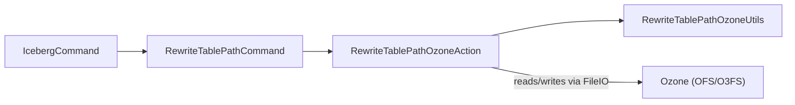

# Interfaces / iceberg

**Classes:** 4    **Kinds:** service:2, cli:2

## Overview

The `iceberg` feature provides Ozone-specific support for migrating Apache Iceberg table metadata from one storage prefix to another. The central class is `RewriteTablePathOzoneAction`, an implementation of the Iceberg `RewriteTablePath` action interface that rewrites all path references inside table metadata (version files, manifest lists, manifests, position-delete files) using a configurable thread pool. `RewriteTablePathOzoneUtils` supplies helper methods for path manipulation and staging-directory defaults. `RewriteTablePathCommand` wraps the action as a Picocli CLI subcommand so operators can trigger a table path migration via `ozone iceberg rewrite-table-path`. `IcebergCommand` is the parent Picocli command that groups all Iceberg-related subcommands under one entry point. The feature is entirely stateless relative to OM: it reads existing Iceberg metadata directly via Iceberg's `FileIO` abstraction and writes rewritten copies to a staging directory.

## Diagram

## Class table

### Sub-feature: `ozone.iceberg`

| reading_order | fqcn | kind | logic | loc | study (min) | role |
|--:|---|---|---|--:|--:|---|
| 2520 | `org.apache.hadoop.ozone.iceberg.RewriteTablePathOzoneAction` | service | logic-heavy | 675~ | 60 | An implementation of RewriteTablePath for Apache Ozone backed Iceberg tables. |
| 2521 | `org.apache.hadoop.ozone.iceberg.RewriteTablePathOzoneUtils` | service | mixed | 75~ | 30 | Helper methods used by RewriteTablePathOzoneAction when rewriting Iceberg table paths on Ozone-backed tables. |
| 2522 | `org.apache.hadoop.ozone.iceberg.RewriteTablePathCommand` | cli | mixed | 75~ | 20 | CLI to rewrite Iceberg table paths. |
| 2523 | `org.apache.hadoop.ozone.iceberg.IcebergCommand` | cli | mixed | 25~ | 20 | Parent command for Iceberg tables on Ozone. |

## Anchor details

### `RewriteTablePathOzoneAction`

- **path:** `hadoop-ozone/iceberg/src/main/java/org/apache/hadoop/ozone/iceberg/RewriteTablePathOzoneAction.java`
- **loc:** 675~    **difficulty:** 5    **study:** 60 min    **concurrency:** thread-safe    **persistence:** in-memory
- **entry points:** `execute`
- **test exemplar:** `hadoop-ozone/iceberg/src/test/java/org/apache/hadoop/ozone/iceberg/TestRewriteTablePathOzoneAction.java`
- **role:** An implementation of RewriteTablePath for Apache Ozone backed Iceberg tables.

`execute()` validates inputs (source ≠ target prefix, resolves start/end metadata versions from `TableMetadata.metadataFileLocation()` if not given), then calls `rebuildMetadata()` which walks the metadata history using Iceberg's `TableMetadata` and `RewriteTablePathUtil`. The class uses a fixed-size `ExecutorService` (`Executors.newFixedThreadPool(threads)`) with an `ExecutorCompletionService` and a `Semaphore` sized to `threads * MAX_INFLIGHT_MULTIPLIER` to bound in-flight rewrite tasks; this prevents OOM when the manifest graph is very wide. A `stagingDir` is auto-generated as `<metadataLocation>/copy-table-staging-<UUID>/` if not explicitly set.

## Design docs

- no dedicated design doc under `hadoop-hdds/docs/content/` on this branch.

## Seminal JIRAs / PRs

- HDDS-14938. Implement Iceberg RewriteTablePath action.
- HDDS-14939. Implement version file rewrite logic for path migration across metadata history.
- HDDS-14942. Implement manifest selection logic for rewrite based on snapshot delta.
- HDDS-14943. Implement rewrite logic for Iceberg's manifest-list files for path migration.
- HDDS-14944. Implement rewrite logic for Iceberg's manifest files for path migration.
- HDDS-14945. Implement Iceberg position delete file rewrite for path migration.
- HDDS-14946. Add CLI command for RewriteTablePathOzoneAction.

## Sharp edges

- The action does not commit the rewritten metadata to the target table; it only writes files to the staging directory and returns a file-list. Callers must separately move or register the staged files. Forgetting this step leaves dangling files in the staging directory and no migrated table.
- `startVersionName` and `endVersionName` are resolved against `TableMetadata.metadataLogEntries()`. If `startVersion` does not appear in the metadata log (e.g., it was truncated by Iceberg's `expire-snapshots`), the action throws `IllegalArgumentException` rather than silently skipping history — but the error message may not be immediately clear about log truncation (HDDS-15172 improved logging here).

## Related features

- `components/interfaces/ozonefs-common.md` — OzoneFileSystem used by Iceberg's FileIO when reading/writing table data.
- `components/interfaces/s3gateway.md` — alternate access path for Iceberg tables stored in Ozone via S3.
- `components/ozone-manager/namespace.md` — OM namespace that backs the Ozone paths referenced in Iceberg metadata.

## Self-quiz

1. `RewriteTablePathOzoneAction.execute()` creates a fixed thread pool. How does the class prevent unbounded in-flight rewrite tasks from exhausting memory, and which field controls the bound?
2. What happens if `startVersion` is not present in the `TableMetadata` metadata log, and which method validates this?
3. If the caller does not set a `stagingLocation`, where does `RewriteTablePathOzoneAction` write the rewritten files, and how is the path generated?
4. The action returns a `RewriteTablePath.Result`. What three fields does the result carry, and which one must the caller use to locate the migrated metadata entry point?
5. `RewriteTablePathCommand` is a Picocli subcommand. What parent command does it attach to, and what is the top-level CLI invocation pattern?

Answers

Answer 1: A `Semaphore` initialized to `threads * MAX_INFLIGHT_MULTIPLIER` (where `MAX_INFLIGHT_MULTIPLIER = 4`) is acquired before each task is submitted and released on completion. This bounds total queued + running tasks to `4 * threads`.
Answer 2: `validateAndSetStartVersion(TableMetadata)` iterates `tableMetadata.previousFiles()` looking for a metadata log entry whose location matches `startVersionName`. If not found it throws `IllegalArgumentException`.
Answer 3: The staging directory is set to `<metadataLocation>/copy-table-staging-<UUID>/`, where `metadataLocation` comes from `RewriteTablePathOzoneUtils.getMetadataLocation(table)` and the UUID is freshly generated per `execute()` call.
Answer 4: `stagingLocation` (where rewritten files live), `fileListLocation` (path to a file listing all rewritten files), and `latestVersion` (filename of the rewritten current metadata version). Callers use `latestVersion` and `stagingLocation` together to register the new table location.
Answer 5: `IcebergCommand` is the parent. The top-level invocation is `ozone iceberg rewrite-table-path [options]`.

