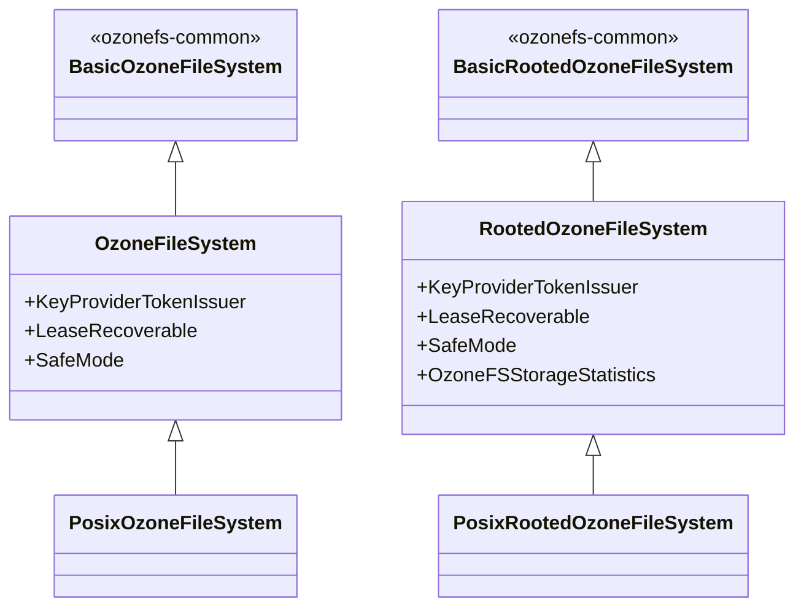

# Interfaces / ozonefs-hadoop-current

**Classes:** 6    **Kinds:** service:6

## Overview

`ozonefs-hadoop-current` (module `hadoop-ozone/ozonefs`) contains the full-featured Ozone FileSystem classes that require the current supported Hadoop release. Each class extends its base counterpart from `ozonefs-common` and adds capabilities that depend on current Hadoop APIs: `OzoneFileSystem` implements `KeyProviderTokenIssuer`, `LeaseRecoverable`, and `SafeMode`; `RootedOzoneFileSystem` adds the same plus `OzoneFSStorageStatistics` for storage-statistics tracking. `PosixRootedOzoneFileSystem` extends `RootedOzoneFileSystem` to expose POSIX-style metadata operations. `PosixOzoneFileSystem` does the same for the flat-bucket `o3fs://` style. The `OzFs` and `RootedOzFs` classes implement the `AbstractFileSystem` view required by the Hadoop `FileContext` API. This module is the one deployed alongside current Hadoop distributions; the hadoop2 and hadoop3 shims exist only for backward compatibility with older cluster versions.

## Diagram

## Class table

### Sub-feature: `fs.ozone`

| reading_order | fqcn | kind | logic | loc | study (min) | role |
|--:|---|---|---|--:|--:|---|
| 2525 | `org.apache.hadoop.fs.ozone.PosixRootedOzoneFileSystem` | service | mixed | 25~ | 30 | The PosixRootedOzoneFileSystem implementation. |
| 2526 | `org.apache.hadoop.fs.ozone.PosixOzoneFileSystem` | service | mixed | 25~ | 30 | The PosixOzoneFileSystem implementation. |

## Anchor details

_No logic-heavy anchors in this feature; the classes are primarily thin subclasses of ozonefs-common base classes._

## Design docs

- `hadoop-hdds/docs/content/interface/O3fs.md` — O3FS filesystem interface documentation.
- `hadoop-hdds/docs/content/interface/Ofs.md` — OFS (rooted) filesystem interface documentation.
- `hadoop-hdds/docs/content/design/ofs.md` — design doc for the rooted OFS implementation.

## Seminal JIRAs / PRs

- HDDS-14490. HadoopRpcOMFollowerProxyProvider should explicitly use OzoneManagerProtocolPB.
- HDDS-14379. Implement basic Hadoop OM client proxy provider to read from followers.
- HDDS-14043. Fix ls -e UnsupportedOperationException on ofs/o3fs.
- HDDS-13761. Remove hadoop-thirdparty protobuf compilation.
- HDDS-11635. Memory leak when using Ozone FS via Hadoop FileContext API.
- HDDS-11816. Ozone stream to support Hsync/Hflush.

## Sharp edges

- `OzoneFileSystem` (in this module) checks the `FORCE_LEASE_RECOVERY_ENV` environment variable in its constructor to set `forceRecovery`. This is intended as a test/debug override; leaving it set in production silently forces lease recovery on every open, which bypasses the normal recoverability check.
- `OzFs` and `RootedOzFs` implement `AbstractFileSystem` which is required for `FileContext` API usage. The `FileContext` lifecycle does not call `FileSystem.close()` on the underlying `FileSystem`; callers using `FileContext` must manage OzoneClient lifetime explicitly to avoid connection leaks (see HDDS-11635).

## Related features

- `components/interfaces/ozonefs-common.md` — base classes extended by this module.
- `components/interfaces/ozonefs-hadoop2.md` — Hadoop 2 shim.
- `components/interfaces/ozonefs-hadoop3.md` — Hadoop 3 shim.

## Self-quiz

1. Which Hadoop interfaces does `OzoneFileSystem` (in this module) implement beyond what `BasicOzoneFileSystem` provides, and what does each enable?
2. Why does `OzFs` (implementing `AbstractFileSystem`) exist alongside `OzoneFileSystem` (implementing `FileSystem`), and when must users configure one vs. the other?
3. `PosixRootedOzoneFileSystem` extends `RootedOzoneFileSystem`. What additional behavior do POSIX-style classes add over the base rooted filesystem?
4. Describe the `FORCE_LEASE_RECOVERY_ENV` check in `OzoneFileSystem` and the production risk of leaving it set.
5. What is the connection-leak risk when using `FileContext` with `RootedOzFs`, and how should it be mitigated?

Answers

Answer 1: `KeyProviderTokenIssuer` (for transparent encryption zone key-provider delegation tokens), `LeaseRecoverable` (for explicit lease recovery on failed writes), and `SafeMode` (for entering/leaving OM safe mode from the filesystem API).
Answer 2: `OzoneFileSystem` is used with `FileSystem.get()` / `fs.defaultFS`. `OzFs` is used with `FileContext` via `fs.AbstractFileSystem.get()`. Users must configure `fs.AbstractFileSystem.o3fs.impl=org.apache.hadoop.fs.ozone.OzFs` to use the `FileContext` API.
Answer 3: inferred: POSIX-style subclasses expose additional metadata operations (e.g., `setAcl`, `getAcl` with POSIX-style permissions) that are not part of the standard Hadoop `FileSystem` contract.
Answer 4: `FORCE_LEASE_RECOVERY_ENV` is an environment variable checked in the `OzoneFileSystem` constructor. If set, `forceRecovery=true` is applied for every lease recovery call. In production this bypasses the check for whether recovery is actually needed, causing unnecessary OM RPCs.
Answer 5: `FileContext` does not call `close()` on the underlying `FileSystem`. If `RootedOzFs` opens a `BasicRootedOzoneFileSystem` via `initialize()`, the `OzoneClient` held by the adapter is never explicitly closed. Callers must shut down the `FileContext` via `Closeable` methods or configure the `OzoneClient` with a connection pool that handles idle timeout.

