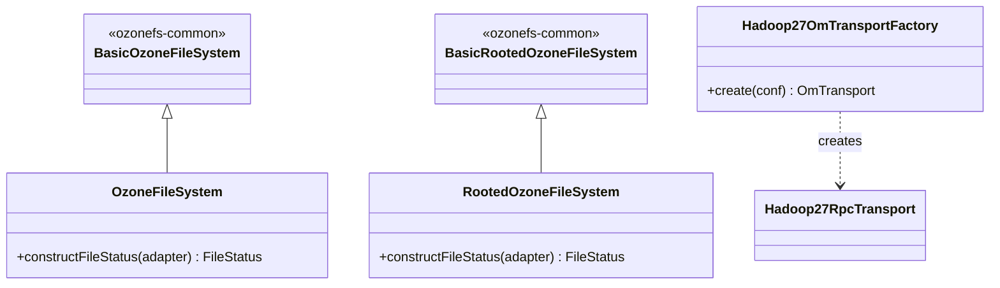

# Interfaces / ozonefs-hadoop2

**Classes:** 6    **Kinds:** service:5, factory:1

## Overview

`ozonefs-hadoop2` (module `hadoop-ozone/ozonefs-hadoop2`) is the shaded compatibility layer that packages the Ozone FileSystem for clusters running Hadoop 2.x. Because Hadoop 2 does not have the `KeyProviderTokenIssuer` or `LeaseRecoverable` interfaces, the `OzoneFileSystem` and `RootedOzoneFileSystem` classes here extend the `Basic*` base classes directly and override only `constructFileStatus()` to produce the older 10-argument Hadoop 2 `FileStatus` constructor (without encryption or visibility bits). `Hadoop27RpcTransport` provides a Hadoop 2.7-compatible Hadoop RPC transport with failover support, used as a drop-in for the OM RPC channel. `Hadoop27OmTransportFactory` creates this transport via the `OmTransport` SPI. The jar produced by this module is intended to be placed on Hadoop 2 cluster classpaths; it is built with shading to relocate Ozone's own protobuf and guava to avoid classpath conflicts.

## Diagram

## Class table

### Sub-feature: `fs.ozone`

| reading_order | fqcn | kind | logic | loc | study (min) | role |
|--:|---|---|---|--:|--:|---|
| 2527 | `org.apache.hadoop.fs.ozone.Hadoop27RpcTransport` | service | mixed | 50~ | 30 | Hadoop RPC based transport with failover support. |
| 2528 | `org.apache.hadoop.fs.ozone.Hadoop27OmTransportFactory` | factory | mixed | 25~ | 20 | OM Transport factory to create OM transport client with failover support. |

## Anchor details

_No logic-heavy anchors in this feature; the classes are primarily thin Hadoop-2-compatible subclasses of ozonefs-common base classes._

## Design docs

- `hadoop-hdds/docs/content/interface/O3fs.md` — O3FS filesystem interface documentation.
- `hadoop-hdds/docs/content/interface/Ofs.md` — OFS (rooted) filesystem interface documentation.

## Seminal JIRAs / PRs

- HDDS-14065. populate-cache fails at ozone-filesystem-hadoop2.
- HDDS-14056. Relocate protobuf in ozone-filesystem shaded jars.
- HDDS-13753. Use forked Hadoop RPC.
- HDDS-12281. Fix license headers and imports for ozone-filesystem-hadoop2.
- HDDS-10178. Shaded Jar build fails on case-insensitive filesystem.
- HDDS-11635. Memory leak when using Ozone FS via Hadoop FileContext API.

## Sharp edges

- The `constructFileStatus` override uses the Hadoop 2 ten-argument `FileStatus` constructor. When the same Ozone cluster is accessed from both a Hadoop 2 and a Hadoop 3 client, the Hadoop 2 client silently drops the encryption and HDFS-specific fields returned by OM (e.g., `isEncrypted`, ECPolicy) since the Hadoop 2 `FileStatus` has no slot for them.
- This module is shaded: Ozone's protobuf is relocated to avoid conflicts with Hadoop 2's bundled protobuf 2.5. If a third-party library on the Hadoop 2 classpath also relocates protobuf to the same prefix, silent class-loading conflicts can occur.

## Related features

- `components/interfaces/ozonefs-common.md` — base classes extended by this module.
- `components/interfaces/ozonefs-hadoop3.md` — Hadoop 3 shim (same pattern, different `FileStatus` constructor).
- `components/interfaces/ozonefs-hadoop-current.md` — current Hadoop shim with full capabilities.

## Self-quiz

1. What is the only method `OzoneFileSystem` (hadoop2) overrides from `BasicOzoneFileSystem`, and why is this override necessary for Hadoop 2 compatibility?
2. What problem does `Hadoop27RpcTransport` solve that the standard Ozone RPC transport does not handle on Hadoop 2?
3. Why is the jar produced by this module shaded, and what relocation is performed?
4. When the Hadoop 2 `FileStatus` constructor is used instead of the current one, which fields present on Ozone keys are silently discarded?
5. The `Hadoop27OmTransportFactory` uses the `OmTransport` SPI. How does Ozone discover which factory to use at runtime?

Answers

Answer 1: `constructFileStatus(FileStatusAdapter)` is overridden to call the 10-argument Hadoop 2 `FileStatus(length, isdir, replication, blocksize, modtime, accesstime, permission, owner, group, symlink, path)` constructor. This is necessary because Hadoop 2 `FileStatus` does not have the later fields added in Hadoop 3 (e.g., `isEncrypted`, ACLs).
Answer 2: Hadoop 2.7's Hadoop RPC does not support the same failover proxy provider mechanism as later versions. `Hadoop27RpcTransport` provides a compatible failover transport so OM HA is usable from Hadoop 2 clients.
Answer 3: The jar is shaded to relocate Ozone's bundled protobuf (3.x) so it does not conflict with Hadoop 2's bundled protobuf 2.5. The relocation prefix is defined in the module's Maven shade configuration.
Answer 4: Encryption zone information (`isEncrypted`, key name/version), erasure coding policy, and any Hadoop 3+ metadata fields are discarded because the Hadoop 2 `FileStatus` constructor has no parameters for them.
Answer 5: `OmTransport` implementations are discovered via Java `ServiceLoader` using the `META-INF/services/org.apache.hadoop.ozone.om.protocolPB.OmTransportFactory` file in the jar. The class named there is `Hadoop27OmTransportFactory`.

