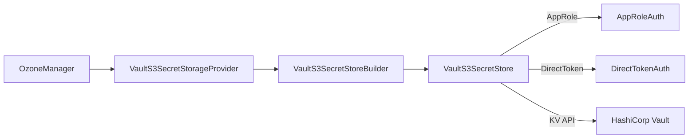

# Interfaces / s3-secret-store

**Classes:** 8    **Kinds:** service:4, interface:2, data:2

## Overview

`s3-secret-store` implements an optional pluggable backend for storing Ozone S3 user secrets (access-key / secret-key pairs) in HashiCorp Vault rather than in OM's internal RocksDB table. `VaultS3SecretStore` implements the `S3SecretStore` interface and connects to a Vault server using the BetterCloud Vault client; it stores each S3 secret as a Vault KV entry at a configurable `SECRET_PATH`. Authentication to Vault is abstracted via the `Auth` interface with two concrete implementations: `AppRoleAuth` (Vault AppRole method, recommended for production) and `DirectTokenAuth` (plain token from configuration, for development). `VaultS3SecretStorageProvider` is the `S3SecretStoreProvider` SPI entry point that OM uses to discover and instantiate the Vault backend when configured. `S3SecretRemoteStoreConfigurationKeys` holds all configuration key constants. When this backend is unavailable, OM falls back to RocksDB (HDDS-10469).

## Diagram

## Class table

### Sub-feature: `remote.vault`

| reading_order | fqcn | kind | logic | loc | study (min) | role |
|--:|---|---|---|--:|--:|---|
| 2541 | `org.apache.hadoop.ozone.s3.remote.vault.VaultS3SecretStore` | service | mixed | 125~ | 20 | Based on HashiCorp Vault secret storage. |
| 2542 | `org.apache.hadoop.ozone.s3.remote.vault.VaultS3SecretStorageProvider` | service | mixed | 25~ | 30 | Provider of S3SecretStoreProvider. |
| 2543 | `org.apache.hadoop.ozone.s3.remote.vault.VaultS3SecretStoreBuilder` | data | data-only | 125~ | 10 | Builder for VaultS3SecretStore. |

### Sub-feature: `s3.remote`

| reading_order | fqcn | kind | logic | loc | study (min) | role |
|--:|---|---|---|--:|--:|---|
| 2544 | `org.apache.hadoop.ozone.s3.remote.S3SecretRemoteStoreConfigurationKeys` | service | mixed | 25~ | 30 | Configuration keys for S3 secret store. |

### Sub-feature: `vault.auth`

| reading_order | fqcn | kind | logic | loc | study (min) | role |
|--:|---|---|---|--:|--:|---|
| 2545 | `org.apache.hadoop.ozone.s3.remote.vault.auth.Auth` | interface | mixed | 25~ | 20 | S3 remote secret store authenticate interface. |
| 2546 | `org.apache.hadoop.ozone.s3.remote.vault.auth.AppRoleAuth` | service | mixed | 25~ | 30 | Authentication method via app role. |
| 2547 | `org.apache.hadoop.ozone.s3.remote.vault.auth.DirectTokenAuth` | service | mixed | 25~ | 30 | Authentication via direct token providing from configuration. |
| 2548 | `org.apache.hadoop.ozone.s3.remote.vault.auth.AuthType` | data | data-only | 25~ | 10 | Type of authentication method. |

## Anchor details

_No logic-heavy anchors in this feature. `VaultS3SecretStore` is the most complex class; its logic is described below._

`VaultS3SecretStore` implements `S3SecretStore` (defined in the OM module) and uses `VaultConfig` / `SslConfig` from the BetterCloud Vault client library. Each S3 secret is stored as a Vault KV v2 entry under `secretPath/<username>`. The `get` method reads the secret using `vault.logical().read(secretPath + "/" + username)` and returns a `S3SecretValue`; `put` uses `vault.logical().write(...)`. The `Auth` abstraction (via `AppRoleAuth` or `DirectTokenAuth`) provides a `Vault` client instance pre-authenticated to the server; `VaultS3SecretStore` delegates authentication entirely to whichever `Auth` implementation is configured.

## Design docs

- no dedicated design doc under `hadoop-hdds/docs/content/` on this branch.

## Seminal JIRAs / PRs

- HDDS-10469. Ozone Manager should continue to work when S3 secret storage is unavailable.
- HDDS-12284. Fix license headers and imports for ozone-s3-secret-store.
- HDDS-10200. OM may terminate due to NPE in S3SecretValue proto conversion.
- HDDS-9905. Standardize nullability annotations.

## Sharp edges

- `DirectTokenAuth` stores a Vault token in plain text in the Ozone configuration. This is unsuitable for production: the token does not expire, and anyone with access to the configuration file can authenticate to Vault. Use `AppRoleAuth` for production deployments.
- When Vault is unavailable, OM falls back to its internal RocksDB S3 secret store (HDDS-10469). This fallback is transparent to S3 clients but means secrets created during Vault downtime are stored in a different backend. After Vault recovers, secrets from the fallback period must be manually reconciled.
- `VaultS3SecretStore` uses the BetterCloud Vault client (`com.bettercloud:vault-java-driver`), which is a third-party dependency not widely used elsewhere in Ozone. Version updates to this dependency are not tracked by the same governance as Hadoop-ecosystem dependencies.

## Related features

- `components/interfaces/s3gateway.md` — S3 Gateway that consumes S3 secrets validated against this store.
- `components/ozone-manager/s3-secret.md` — OM-side S3 secret management that uses the `S3SecretStore` interface.

## Self-quiz

1. What is the `S3SecretStore` interface, and where is it defined relative to this module?
2. Which two authentication methods does this module support for connecting to HashiCorp Vault, and when should each be used?
3. When Vault is unavailable at OM startup, what happens to S3 secret operations, and which JIRA introduced this behavior?
4. `VaultS3SecretStore` is classified as `interface` kind in the atlas, but it implements a concrete class. What is the correct interpretation, and what interface does it implement?
5. `VaultS3SecretStorageProvider` is the SPI entry point. How does OM discover it, and what configuration key must be set to enable the Vault backend?

Answers

Answer 1: `S3SecretStore` is defined in the `ozone-manager` module (`org.apache.hadoop.ozone.om.S3SecretStore`). It declares `get`, `put`, `delete`, and related methods for persisting S3 access-key/secret-key pairs.
Answer 2: `AppRoleAuth` (Vault AppRole method — recommended for production, uses role-id + secret-id) and `DirectTokenAuth` (a plain token from configuration — suitable for development only, no token rotation).
Answer 3: OM falls back to its internal RocksDB `S3SecretStore` implementation. This behavior was introduced by HDDS-10469 ("Ozone Manager should continue to work when S3 secret storage is unavailable").
Answer 4: `VaultS3SecretStore` is a concrete class (not a Java interface); the `interface` kind in the atlas is a classification error. It implements `org.apache.hadoop.ozone.om.S3SecretStore`.
Answer 5: `VaultS3SecretStorageProvider` implements the `S3SecretStoreProvider` SPI, discovered via `ServiceLoader`. The configuration key is `ozone.om.s3.secret.store.impl` (or similar key in `S3SecretRemoteStoreConfigurationKeys`), which must be set to the Vault provider class name.

