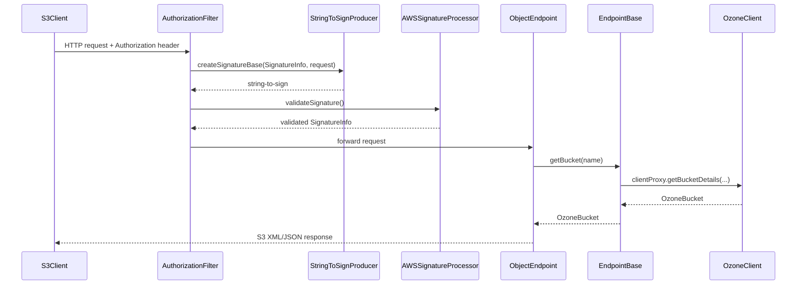

# Interfaces / s3gateway

**Classes:** 108    **Kinds:** service:75, dto:12, interface:5, data:5, exception:5, abstract:3, config:2, metrics:1

## Overview

The S3 Gateway is a JAX-RS HTTP server that exposes an AWS S3-compatible REST API on top of Ozone. All endpoints extend `EndpointBase`, which holds common helpers for building `OzoneClient` calls, emitting audit log entries, managing AWS metadata-key remapping (system keys like `ETag` and `Content-Type` are stored under a `RESERVED_USER_METADATA_KEY_PREFIX` prefix to avoid collisions with user-defined `x-amz-meta-*` headers), and reading signature information from the CDI-injected `SignatureInfo`. `ObjectEndpoint` handles key-level operations (PUT, GET, HEAD, DELETE, CopyObject, multipart upload) using a chain-of-responsibility pattern via `ObjectOperationHandlerChain`. `BucketEndpoint` handles bucket-level operations and listing. `StringToSignProducer` constructs the canonical string-to-sign for AWS Signature V4 and V2 without holding mutable state. `S3LifecycleConfiguration` parses and validates S3 lifecycle rules before forwarding them to the OM lifecycle API. `S3GatewayMetrics` tracks per-operation success/failure counters and latency histograms using the Hadoop Metrics2 framework, registered as a singleton.

## Diagram

## Class table

### Sub-feature: `s3-endpoints`

| reading_order | fqcn | kind | logic | loc | study (min) | role |
|--:|---|---|---|--:|--:|---|
| 1044 | `org.apache.hadoop.ozone.s3.endpoint.EndpointBase` | abstract | logic-heavy | 550~ | 60 | Basic helpers for all the REST endpoints. |
| 1045 | `org.apache.hadoop.ozone.s3.endpoint.BucketOperationHandler` | abstract | mixed | 25~ | 30 | Interface for handling bucket operations using chain of responsibility pattern. |
| 1046 | `org.apache.hadoop.ozone.s3.endpoint.ObjectOperationHandler` | abstract | mixed | 25~ | 30 | Interface for handling object operations using chain of responsibility pattern. |
| 1047 | `org.apache.hadoop.ozone.s3.endpoint.ObjectEndpoint` | service | logic-heavy | 950~ | 60 | Key level rest endpoints. |
| 1048 | `org.apache.hadoop.ozone.s3.endpoint.S3LifecycleConfiguration` | service | logic-heavy | 325~ | 45 | Request for put bucket lifecycle configuration. |
| 1049 | `org.apache.hadoop.ozone.s3.endpoint.BucketEndpoint` | service | logic-heavy | 275~ | 45 | Bucket level rest endpoints. |
| 1050 | `org.apache.hadoop.ozone.s3.endpoint.S3Acl` | service | logic-heavy | 200~ | 45 | Represents an S3 Access Control List (ACL) that defines permissions for S3 buckets and objects. |
| 1051 | `org.apache.hadoop.ozone.s3.endpoint.RootEndpoint` | service | mixed | 175~ | 45 | Top level rest endpoint. |
| 1052 | `org.apache.hadoop.ozone.s3.endpoint.ObjectEndpointStreaming` | service | mixed | 175~ | 45 | Key level rest endpoints for Streaming. |
| 1053 | `org.apache.hadoop.ozone.s3.endpoint.BucketCrudHandler` | service | mixed | 150~ | 45 | Handler for default bucket CRUD operations. |
| 1054 | `org.apache.hadoop.ozone.s3.endpoint.S3BucketAcl` | service | mixed | 150~ | 45 | Bucket ACL. |
| 1055 | `org.apache.hadoop.ozone.s3.endpoint.ListMultipartUploadsResult` | service | mixed | 150~ | 45 | AWS compatible REST response for list multipart upload. |
| 1056 | `org.apache.hadoop.ozone.s3.endpoint.BucketAclHandler` | service | mixed | 125~ | 30 | Handler for bucket ACL operations (?acl query parameter). |
| 1057 | `org.apache.hadoop.ozone.s3.endpoint.MultipartKeyHandler` | service | mixed | 100~ | 30 | Handles MPU (Multipart Upload) non-POST operations for object key endpoint. |
| 1058 | `org.apache.hadoop.ozone.s3.endpoint.BucketTaggingHandler` | service | mixed | 100~ | 30 | S3 bucket tagging (?tagging). |
| 1059 | `org.apache.hadoop.ozone.s3.endpoint.ObjectTaggingHandler` | service | mixed | 75~ | 30 | Handle requests for object tagging. |
| 1060 | `org.apache.hadoop.ozone.s3.endpoint.S3Tagging` | service | mixed | 75~ | 30 | S3 tagging. |
| 1061 | `org.apache.hadoop.ozone.s3.endpoint.S3Owner` | service | mixed | 75~ | 30 | Represents an owner of S3 resources in the Ozone S3 compatibility layer. |
| 1062 | `org.apache.hadoop.ozone.s3.endpoint.ObjectOperationHandlerChain` | service | mixed | 75~ | 30 | Chain of responsibility for ObjectOperationHandlers. |
| 1063 | `org.apache.hadoop.ozone.s3.endpoint.S3ObjectWriteGuard` | service | mixed | 75~ | 30 | Tracks bytes written for a write request and guards close-time commit. |
| 1064 | `org.apache.hadoop.ozone.s3.endpoint.PutBucketLifecycleConfigurationUnmarshaller` | service | mixed | 50~ | 30 | Custom unmarshaller to read Lifecycle configuration namespace. |
| 1065 | `org.apache.hadoop.ozone.s3.endpoint.BucketOperationHandlerChain` | service | mixed | 50~ | 30 | Chain of responsibility for BucketOperationHandlers. |
| 1066 | `org.apache.hadoop.ozone.s3.endpoint.MessageUnmarshaller` | service | mixed | 50~ | 30 | Unmarshaller to create instances of type T from XML, which may or may not have namespace. |
| 1067 | `org.apache.hadoop.ozone.s3.endpoint.ListMultipartUploadsHandler` | service | mixed | 50~ | 30 | Handler for listing multipart uploads in a bucket (?uploads query parameter). |
| 1068 | `org.apache.hadoop.ozone.s3.endpoint.S3RequestContext` | service | mixed | 50~ | 30 | inferred: S3RequestContext — role not documented. |
| 1069 | `org.apache.hadoop.ozone.s3.endpoint.AuditingBucketOperationHandler` | service | mixed | 50~ | 30 | Performs audit logging for BucketOperationHandlers. |
| 1070 | `org.apache.hadoop.ozone.s3.endpoint.AuditingObjectOperationHandler` | service | mixed | 50~ | 30 | Performs audit logging for ObjectOperationHandlers. |
| 1071 | `org.apache.hadoop.ozone.s3.endpoint.MultiDeleteRequestUnmarshaller` | service | mixed | 25~ | 30 | Custom unmarshaller to read MultiDeleteRequest w/wo namespace. |
| 1072 | `org.apache.hadoop.ozone.s3.endpoint.PlainTextMultipartUploadReader` | service | mixed | 25~ | 30 | Body reader to accept plain text MPU. |
| 1073 | `org.apache.hadoop.ozone.s3.endpoint.BucketGetLocationHandler` | service | mixed | 25~ | 30 | Handles GET bucket ?location (GetBucketLocation). |
| 1074 | `org.apache.hadoop.ozone.s3.endpoint.S3ObjectStreamingWriteGuard` | service | mixed | 25~ | 30 | Guards close-time commit for write request using datastream output. |
| 1075 | `org.apache.hadoop.ozone.s3.endpoint.CopyPartResult` | service | mixed | 25~ | 30 | Copy object Response. |
| 1076 | `org.apache.hadoop.ozone.s3.endpoint.XmlNamespaceFilter` | service | mixed | 25~ | 30 | SAX filter to force namespace usage. |
| 1077 | `org.apache.hadoop.ozone.s3.endpoint.CompleteMultipartUploadRequestUnmarshaller` | service | mixed | 25~ | 30 | Custom unmarshaller to read CompleteMultipartUploadRequest wo namespace. |
| 1078 | `org.apache.hadoop.ozone.s3.endpoint.ObjectAclHandler` | service | mixed | 25~ | 30 | Not implemented yet. |
| 1079 | `org.apache.hadoop.ozone.s3.endpoint.S3ConditionalRequest` | dto | logic-heavy | 225~ | 10 | Shared parsing and evaluation for S3 conditional request headers. |
| 1080 | `org.apache.hadoop.ozone.s3.endpoint.ListObjectResponse` | dto | data-only | 125~ | 10 | Response from the ListObject RPC Call. |
| 1081 | `org.apache.hadoop.ozone.s3.endpoint.ListPartsResponse` | dto | data-only | 125~ | 10 | Request for list parts of a multipart upload request. |
| 1082 | `org.apache.hadoop.ozone.s3.endpoint.MultiDeleteResponse` | dto | data-only | 75~ | 10 | Response for multi object delete request. |
| 1083 | `org.apache.hadoop.ozone.s3.endpoint.MultiDeleteRequest` | dto | data-only | 50~ | 10 | Request for multi object delete request. |
| 1084 | `org.apache.hadoop.ozone.s3.endpoint.MultipartUploadInitiateResponse` | dto | data-only | 25~ | 10 | Response for Initiate Multipart Upload request. |
| 1085 | `org.apache.hadoop.ozone.s3.endpoint.CopyObjectResponse` | dto | data-only | 25~ | 10 | Copy object Response. |
| 1086 | `org.apache.hadoop.ozone.s3.endpoint.CompleteMultipartUploadRequest` | dto | data-only | 25~ | 10 | Request for Complete Multipart Upload request. |
| 1087 | `org.apache.hadoop.ozone.s3.endpoint.CompleteMultipartUploadResponse` | dto | data-only | 25~ | 10 | Complete Multipart Upload request response. |
| 1088 | `org.apache.hadoop.ozone.s3.endpoint.ListDirectoryBucketsResponse` | dto | data-only | 25~ | 10 | Response from the ListDirectoryBuckets API call. |
| 1089 | `org.apache.hadoop.ozone.s3.endpoint.ListBucketResponse` | dto | data-only | 25~ | 10 | Response from the ListBucket RPC Call. |

### Sub-feature: `s3-signature`

| reading_order | fqcn | kind | logic | loc | study (min) | role |
|--:|---|---|---|--:|--:|---|
| 1090 | `org.apache.hadoop.ozone.s3.signature.SignatureParser` | interface | mixed | 25~ | 20 | Parser contract to extract signature information from header or query. |
| 1091 | `org.apache.hadoop.ozone.s3.signature.SignatureProcessor` | interface | mixed | 25~ | 20 | Parser to request auth parser for http request. |
| 1092 | `org.apache.hadoop.ozone.s3.signature.StringToSignProducer` | service | logic-heavy | 225~ | 45 | Stateless utility to create stringToSign, the base of the signature. |
| 1093 | `org.apache.hadoop.ozone.s3.signature.AWSSignatureProcessor` | service | mixed | 150~ | 45 | Parser to process AWS V2 and V4 auth request. |
| 1094 | `org.apache.hadoop.ozone.s3.signature.AuthorizationV4HeaderParser` | service | mixed | 150~ | 45 | Class to parse v4 auth information from header. |
| 1095 | `org.apache.hadoop.ozone.s3.signature.AuthorizationV4QueryParser` | service | mixed | 125~ | 30 | Parser for getting auth info from query parameters. |
| 1096 | `org.apache.hadoop.ozone.s3.signature.Credential` | service | mixed | 50~ | 30 | Credential in the AWS authorization header. |
| 1097 | `org.apache.hadoop.ozone.s3.signature.AuthOperation` | service | mixed | 25~ | 30 | Authentication/authorization actions for S3Gateway. |
| 1098 | `org.apache.hadoop.ozone.s3.signature.AuthorizationV2HeaderParser` | service | mixed | 25~ | 30 | Class to parse V2 auth information from header. |
| 1099 | `org.apache.hadoop.ozone.s3.signature.SignatureInfo` | dto | data-only | 150~ | 10 | Signature and related information. |
| 1100 | `org.apache.hadoop.ozone.s3.signature.AccessDeniedResourceException` | exception | data-only | 25~ | 10 | Signals a signature validation failure that AWS reports as 403 AccessDenied rather than 400 (e.g. |
| 1101 | `org.apache.hadoop.ozone.s3.signature.MalformedResourceException` | exception | data-only | 25~ | 10 | This exception is used to communicate validation errors when parsing signatures. |

### Sub-feature: `s3-secret-mgmt`

| reading_order | fqcn | kind | logic | loc | study (min) | role |
|--:|---|---|---|--:|--:|---|
| 1102 | `org.apache.hadoop.ozone.s3secret.S3AdminEndpoint` | interface | mixed | 25~ | 20 | Annotation to only allow admin users to access the endpoint. |
| 1103 | `org.apache.hadoop.ozone.s3secret.S3SecretEnabled` | interface | mixed | 25~ | 20 | Annotation to disable S3 Secure Endpoint. |
| 1104 | `org.apache.hadoop.ozone.s3secret.S3SecretManagementEndpoint` | service | mixed | 75~ | 30 | Endpoint to manage S3 secret. |
| 1105 | `org.apache.hadoop.ozone.s3secret.S3SecretEndpointBase` | service | mixed | 50~ | 30 | Base implementation of endpoint for working with S3 secret. |
| 1106 | `org.apache.hadoop.ozone.s3secret.Application` | service | mixed | 25~ | 30 | JaxRS resource definition. |
| 1107 | `org.apache.hadoop.ozone.s3secret.S3SecretAdminFilter` | service | mixed | 25~ | 30 | Filter that only allows admin to access endpoints annotated with S3AdminEndpoint. |
| 1108 | `org.apache.hadoop.ozone.s3secret.S3SecretEnabledEndpointRequestFilter` | service | mixed | 25~ | 30 | Filter that disables all endpoints annotated with S3SecretEnabled. |
| 1109 | `org.apache.hadoop.ozone.s3secret.S3SecretConfigKeys` | config | data-only | 25~ | 20 | This class contains constants for configuration keys used in S3 secret endpoint. |
| 1110 | `org.apache.hadoop.ozone.s3secret.S3SecretResponse` | dto | data-only | 25~ | 10 | Response with S3 secrets. |

### Sub-feature: `s3-common-types`

| reading_order | fqcn | kind | logic | loc | study (min) | role |
|--:|---|---|---|--:|--:|---|
| 1111 | `org.apache.hadoop.ozone.s3.commontypes.RequestParameters` | interface | mixed | 50~ | 20 | Allow looking up query parameters as primitive types. |
| 1112 | `org.apache.hadoop.ozone.s3.commontypes.KeyMetadata` | service | mixed | 50~ | 30 | Metadata object represents one key in the object store. |
| 1113 | `org.apache.hadoop.ozone.s3.commontypes.CommonPrefix` | service | mixed | 25~ | 30 | Directory name ("key prefix") in case of listing. |
| 1114 | `org.apache.hadoop.ozone.s3.commontypes.EncodingTypeObject` | service | mixed | 25~ | 30 | A converter to encode string if needed. |
| 1115 | `org.apache.hadoop.ozone.s3.commontypes.DirectoryBucketMetadata` | service | mixed | 25~ | 30 | Metadata for one S3 directory bucket in a ListDirectoryBuckets response. |
| 1116 | `org.apache.hadoop.ozone.s3.commontypes.BucketMetadata` | service | mixed | 25~ | 30 | Metadata object represents one bucket. |
| 1117 | `org.apache.hadoop.ozone.s3.commontypes.ObjectKeyNameAdapter` | service | mixed | 25~ | 30 | A converter to convert raw-String to S3 compliant object key name. |
| 1118 | `org.apache.hadoop.ozone.s3.commontypes.IsoDateAdapter` | service | mixed | 25~ | 30 | A converter to convert Instant to standard date string. |

### Sub-feature: `s3-errors`

| reading_order | fqcn | kind | logic | loc | study (min) | role |
|--:|---|---|---|--:|--:|---|
| 1119 | `org.apache.hadoop.ozone.s3.exception.S3ErrorTable` | data | logic-heavy | 200~ | 10 | This class represents errors from Ozone S3 service. |
| 1120 | `org.apache.hadoop.ozone.s3.exception.OS3Exception` | exception | data-only | 75~ | 10 | This class represents exceptions raised from Ozone S3 service. |
| 1121 | `org.apache.hadoop.ozone.s3.exception.BadRequestExceptionMapper` | exception | data-only | 25~ | 10 | Class that represents BadRequestException. |
| 1122 | `org.apache.hadoop.ozone.s3.exception.OS3ExceptionMapper` | exception | data-only | 25~ | 10 | Class the represents various errors returned by the Ozone S3 service. |

### Sub-feature: `s3-utils`

| reading_order | fqcn | kind | logic | loc | study (min) | role |
|--:|---|---|---|--:|--:|---|
| 1123 | `org.apache.hadoop.ozone.s3.util.S3Utils` | service | mixed | 125~ | 30 | Utilities. |
| 1124 | `org.apache.hadoop.ozone.s3.util.ContinueToken` | service | mixed | 100~ | 30 | Token which holds enough information to continue the key iteration. |
| 1125 | `org.apache.hadoop.ozone.s3.util.RFC1123Util` | service | mixed | 50~ | 30 | Stricter RFC1123 data format. |
| 1126 | `org.apache.hadoop.ozone.s3.util.RangeHeaderParserUtil` | service | mixed | 50~ | 30 | Utility class for S3. |
| 1127 | `org.apache.hadoop.ozone.s3.util.AuditUtils` | service | mixed | 25~ | 30 | Common utilities for operation auditing purposes. |
| 1128 | `org.apache.hadoop.ozone.s3.util.RangeHeader` | service | mixed | 25~ | 30 | Ranger Header class which hold startoffset, endoffset of the Range header value provided as part of get object. |
| 1129 | `org.apache.hadoop.ozone.s3.util.S3Consts` | service | mixed | 100~ | 10 | Set of constants used for S3 implementation. |
| 1130 | `org.apache.hadoop.ozone.s3.util.S3StorageType` | data | data-only | 25~ | 10 | Maps S3 storage class values to Ozone replication values. |

### Sub-feature: `s3-metrics`

| reading_order | fqcn | kind | logic | loc | study (min) | role |
|--:|---|---|---|--:|--:|---|
| 1131 | `org.apache.hadoop.ozone.s3.metrics.S3GatewayMetrics` | metrics | logic-heavy | 725~ | 20 | This class maintains S3 Gateway related metrics. |

### Sub-feature: `s3-audit`

| reading_order | fqcn | kind | logic | loc | study (min) | role |
|--:|---|---|---|--:|--:|---|
| 1132 | `org.apache.hadoop.ozone.audit.S3GAction` | data | data-only | 50~ | 10 | Enum to define Audit Action types for S3Gateway. |

### Sub-feature: `ozone.s3`

| reading_order | fqcn | kind | logic | loc | study (min) | role |
|--:|---|---|---|--:|--:|---|
| 1133 | `org.apache.hadoop.ozone.s3.SignedChunksInputStream` | service | mixed | 100~ | 30 | Input stream implementation to read body of a signed chunked upload. |
| 1134 | `org.apache.hadoop.ozone.s3.Gateway` | cli | mixed | 100~ | 30 | This class is used to start/stop S3 compatible rest server. |
| 1135 | `org.apache.hadoop.ozone.s3.OzoneClientCache` | service | mixed | 100~ | 30 | Cached ozone client for s3 requests. |
| 1136 | `org.apache.hadoop.ozone.s3.UnsignedChunksInputStream` | service | mixed | 100~ | 30 | Input stream implementation to read body of an unsigned chunked upload. |
| 1137 | `org.apache.hadoop.ozone.s3.S3GatewayWebAdminServer` | service | mixed | 100~ | 30 | HTTP server for serving static content and Ozone-specific endpoints (/conf, etc.). |
| 1138 | `org.apache.hadoop.ozone.s3.TracingFilter` | service | mixed | 75~ | 30 | Filter used to add tracing span. |
| 1139 | `org.apache.hadoop.ozone.s3.VirtualHostStyleFilter` | service | mixed | 75~ | 30 | Filter used to convert virtual host style pattern to path style pattern. |
| 1140 | `org.apache.hadoop.ozone.s3.MultiDigestInputStream` | service | mixed | 75~ | 30 | An InputStream that computes multiple message digests simultaneously as data is read from the underlying stream. |
| 1141 | `org.apache.hadoop.ozone.s3.EmptyContentTypeFilter` | service | mixed | 75~ | 30 | Filter to accept queries with empty string content-type (ruby sdk). |
| 1142 | `org.apache.hadoop.ozone.s3.AuthorizationFilter` | service | mixed | 50~ | 30 | Filter used to construct string to sign from unfiltered request. |
| 1143 | `org.apache.hadoop.ozone.s3.S3GatewayHttpServer` | service | mixed | 50~ | 30 | Http server to provide S3-compatible API. |
| 1144 | `org.apache.hadoop.ozone.s3.OzoneClientProducer` | service | mixed | 25~ | 30 | This class creates the OzoneClient for the Rest endpoints. |
| 1145 | `org.apache.hadoop.ozone.s3.HeaderPreprocessor` | service | mixed | 25~ | 30 | Filter to adjust request headers for compatible reasons. |
| 1146 | `org.apache.hadoop.ozone.s3.RequestIdentifier` | service | mixed | 25~ | 30 | Request specific identifiers. |
| 1147 | `org.apache.hadoop.ozone.s3.ClientIpFilter` | service | mixed | 25~ | 30 | Filter used to get ClientIP from HttpServletRequest. |
| 1148 | `org.apache.hadoop.ozone.s3.CommonHeadersContainerResponseFilter` | service | mixed | 25~ | 30 | This class adds common header responses for all the requests. |
| 1149 | `org.apache.hadoop.ozone.s3.OzoneConfigurationHolder` | service | mixed | 25~ | 30 | Ozone Configuration factory. |
| 1150 | `org.apache.hadoop.ozone.s3.GatewayApplication` | service | mixed | 25~ | 30 | JaxRS resource definition. |
| 1151 | `org.apache.hadoop.ozone.s3.S3GatewayConfigKeys` | config | data-only | 50~ | 20 | This class contains constants for configuration keys used in S3G. |

## Anchor details

### `EndpointBase`

- **path:** `hadoop-ozone/s3gateway/src/main/java/org/apache/hadoop/ozone/s3/endpoint/EndpointBase.java`
- **loc:** 550~    **difficulty:** 5    **study:** 60 min    **concurrency:** single-threaded    **persistence:** in-memory
- **key collaborators:** `org.apache.hadoop.ozone.s3.MultiDigestInputStream`, `org.apache.hadoop.ozone.s3.RequestIdentifier`, `org.apache.hadoop.ozone.s3.SignedChunksInputStream`, `org.apache.hadoop.ozone.s3.UnsignedChunksInputStream`, `org.apache.hadoop.ozone.s3.commontypes.RequestParameters`, `org.apache.hadoop.ozone.s3.exception.OS3Exception`
- **test exemplar:** `hadoop-ozone/s3gateway/src/test/java/org/apache/hadoop/ozone/s3/endpoint/TestEndpointBase.java`
- **role:** Basic helpers for all the REST endpoints.

`EndpointBase` defines `RESERVED_METADATA_KEYS` — an `ImmutableMap` that remaps system-level keys (`ETag`, `Content-Type`, `Cache-Control`, `Expires`, `Content-Encoding`, `Content-Language`, `Content-Disposition`) to internal `RESERVED_USER_METADATA_KEY_PREFIX`-prefixed keys on write, preventing user `x-amz-meta-*` headers from overwriting system metadata. On read, `REBUILT_RESERVED_KEYS` is used to reconstruct the original header names. This means any custom user metadata header that collides with a system header name is silently remapped; clients that store and retrieve such metadata will see the remapped key in listing results but the system value in dedicated response headers.

### `ObjectEndpoint`

- **path:** `hadoop-ozone/s3gateway/src/main/java/org/apache/hadoop/ozone/s3/endpoint/ObjectEndpoint.java`
- **loc:** 950~    **difficulty:** 5    **study:** 60 min    **concurrency:** single-threaded    **persistence:** in-memory
- **key collaborators:** `org.apache.hadoop.ozone.audit.S3GAction`, `org.apache.hadoop.ozone.s3.HeaderPreprocessor`, `org.apache.hadoop.ozone.s3.MultiDigestInputStream`, `org.apache.hadoop.ozone.s3.exception.OS3Exception`, `org.apache.hadoop.ozone.s3.exception.S3ErrorTable`, `org.apache.hadoop.ozone.s3.util.RFC1123Util`
- **test exemplar:** `hadoop-ozone/s3gateway/src/test/java/org/apache/hadoop/ozone/s3/endpoint/TestObjectEndpoint.java`
- **role:** Key level rest endpoints.

`ObjectEndpoint.init()` builds an `ObjectOperationHandlerChain` with `ObjectAclHandler`, `ObjectTaggingHandler`, `MultipartKeyHandler`, and itself, then wraps the chain in `AuditingObjectOperationHandler`. This chain-of-responsibility pattern means each handler examines the query parameters (`?acl`, `?tagging`, `?uploadId`, etc.) and either handles the request or passes it to the next handler. The `put()` method creates an `ObjectRequestContext` with `S3GAction.CREATE_KEY` before delegating to the chain; this context carries the audit action so `AuditingObjectOperationHandler` can log the correct action regardless of which handler ultimately processes the request.

### `S3LifecycleConfiguration`

- **path:** `hadoop-ozone/s3gateway/src/main/java/org/apache/hadoop/ozone/s3/endpoint/S3LifecycleConfiguration.java`
- **loc:** 325~    **difficulty:** 4    **study:** 45 min    **concurrency:** single-threaded    **persistence:** in-memory
- **key collaborators:** `org.apache.hadoop.ozone.s3.exception.OS3Exception`, `org.apache.hadoop.ozone.s3.exception.S3ErrorTable`, `org.apache.hadoop.ozone.client.OzoneBucket`, `org.apache.hadoop.ozone.client.OzoneLifecycleConfiguration`, `org.apache.hadoop.ozone.om.exceptions.OMException`, `org.apache.hadoop.ozone.om.helpers.OmLCAbortIncompleteMultipartUpload`
- **role:** Request for put bucket lifecycle configuration.

`S3LifecycleConfiguration` handles both `PUT ?lifecycle` and `GET ?lifecycle` at the bucket level. On put, it unmarshals the XML request body (using `PutBucketLifecycleConfigurationUnmarshaller` which handles both namespaced and non-namespaced XML) and translates S3 lifecycle rules into `OzoneLifecycleConfiguration` before calling `OzoneBucket.setLifecycleConfiguration`. On GET, it translates the Ozone lifecycle configuration back to S3-compatible XML. An `OMException` with `FEATURE_NOT_SUPPORTED` is mapped to `OS3Exception` with `NOT_IMPLEMENTED`.

### `BucketEndpoint`

- **path:** `hadoop-ozone/s3gateway/src/main/java/org/apache/hadoop/ozone/s3/endpoint/BucketEndpoint.java`
- **loc:** 275~    **difficulty:** 4    **study:** 45 min    **concurrency:** single-threaded    **persistence:** in-memory
- **key collaborators:** `org.apache.hadoop.ozone.audit.S3GAction`, `org.apache.hadoop.ozone.s3.commontypes.EncodingTypeObject`, `org.apache.hadoop.ozone.s3.commontypes.KeyMetadata`, `org.apache.hadoop.ozone.s3.exception.OS3Exception`, `org.apache.hadoop.ozone.s3.exception.S3ErrorTable`, `org.apache.hadoop.ozone.s3.util.ContinueToken`
- **role:** Bucket level rest endpoints.

`BucketEndpoint` routes requests through a `BucketOperationHandlerChain` (with `BucketAclHandler`, `BucketTaggingHandler`, `ListMultipartUploadsHandler`, `BucketGetLocationHandler`, and `BucketCrudHandler`) in the same chain-of-responsibility pattern as `ObjectEndpoint`. The `get()` method supports both ListObjects V1 and V2 by detecting the `list-type=2` query parameter. Key listing is paginated using `ContinueToken`, which encodes the last-seen key and ETag so listing can resume after a `NextContinuationToken`.

### `StringToSignProducer`

- **path:** `hadoop-ozone/s3gateway/src/main/java/org/apache/hadoop/ozone/s3/signature/StringToSignProducer.java`
- **loc:** 225~    **difficulty:** 4    **study:** 45 min    **concurrency:** single-threaded    **persistence:** in-memory
- **key collaborators:** `org.apache.hadoop.ozone.s3.exception.OS3Exception`, `org.apache.hadoop.ozone.s3.util.S3Utils`
- **test exemplar:** `hadoop-ozone/s3gateway/src/test/java/org/apache/hadoop/ozone/s3/signature/TestStringToSignProducer.java`
- **role:** Stateless utility to create stringToSign, the base of the signature.

`StringToSignProducer` is a `final` class with only `static` methods and no instance state. The `createSignatureBase` method constructs the canonical string for AWS Signature V4: it normalizes headers, applies the URL-encoding rules (`+`→`%20`, `*`→`%2A`, `%7E`→`~`), and validates the `x-amz-date` timestamp. Pre-signed URL expiration is checked here by comparing the timestamp + `X-Amz-Expires` against the current time; expired pre-signed URLs return `OS3Exception` with `PRECONDITION_FAILED` (HDDS-15851).

### `S3Acl`

- **path:** `hadoop-ozone/s3gateway/src/main/java/org/apache/hadoop/ozone/s3/endpoint/S3Acl.java`
- **loc:** 200~    **difficulty:** 4    **study:** 45 min    **concurrency:** single-threaded    **persistence:** in-memory
- **key collaborators:** `org.apache.hadoop.ozone.s3.exception.OS3Exception`, `org.apache.hadoop.ozone.s3.exception.S3ErrorTable`, `org.apache.hadoop.ozone.OzoneAcl`, `org.apache.hadoop.ozone.security.acl.IAccessAuthorizer`
- **role:** Represents an S3 Access Control List (ACL) that defines permissions for S3 buckets and objects.

`S3Acl` translates between S3 grant headers (`x-amz-grant-read`, `x-amz-grant-write`, etc.) and Ozone `IAccessAuthorizer.ACLType` values. The `CANNED_ACL_HEADER` (`x-amz-acl`) is defined but currently unsupported; attempting to use it returns `NOT_IMPLEMENTED`. The `ACLType` enum inner class maps S3 permission names (READ, WRITE, READ_ACP, WRITE_ACP, FULL_CONTROL) to their Ozone counterparts; `FULL_CONTROL` expands to the full set of Ozone permissions.

### `S3GatewayMetrics`

- **path:** `hadoop-ozone/s3gateway/src/main/java/org/apache/hadoop/ozone/s3/metrics/S3GatewayMetrics.java`
- **loc:** 725~    **difficulty:** 2    **study:** 20 min    **concurrency:** thread-safe    **persistence:** in-memory
- **entry points:** `close`, `create`
- **key collaborators:** `org.apache.hadoop.ozone.s3.S3GatewayConfigKeys`, `org.apache.hadoop.hdds.annotation.InterfaceAudience`, `org.apache.hadoop.hdds.conf.OzoneConfiguration`, `org.apache.hadoop.hdds.utils.IOUtils`, `org.apache.hadoop.ozone.OzoneConsts`, `org.apache.hadoop.ozone.util.PerformanceMetrics`
- **test exemplar:** `hadoop-ozone/s3gateway/src/test/java/org/apache/hadoop/ozone/s3/metrics/TestS3GatewayMetrics.java`
- **role:** This class maintains S3 Gateway related metrics.

`S3GatewayMetrics` is a singleton held in a `static volatile` field and registered with Hadoop Metrics2 via `DefaultMetricsSystem`. It exposes one `MutableCounterLong` pair (success + failure) per S3 operation, plus `PerformanceMetrics` for latency histograms. `HDDS-15565` removed an unnecessary internal lock; the class is now thread-safe through the Metrics2 infrastructure's own synchronization. The `close()` method unregisters the singleton from Metrics2 and nulls the static field, enabling clean reset between tests.

## Design docs

- `hadoop-hdds/docs/content/design/s3gateway.md` — architecture design for the S3 Gateway.
- `hadoop-hdds/docs/content/design/secure-s3.md` — design for S3 authentication in secure mode.
- `hadoop-hdds/docs/content/design/s3-performance.md` — S3 gateway performance analysis and tuning.
- `hadoop-hdds/docs/content/design/s3-conditional-requests.md` — design for S3 conditional request headers (If-Match, If-None-Match, etc.).
- `hadoop-hdds/docs/content/design/s3-object-lifecycle-management.md` — design for S3 lifecycle management.

## Seminal JIRAs / PRs

- HDDS-15958. Return InvalidURI for unreadable S3 object keys on GetObject.
- HDDS-15851. Return 403 for expired or out-of-range pre-signed S3 URLs.
- HDDS-15607. Return x-amz-meta-* user-defined object metadata on S3 GetObject.
- HDDS-15606. Support S3 object metadata headers (Cache-Control, Expires, Content-Encoding).
- HDDS-15512. Implement S3 PUT/GET/DELETE ?tagging on buckets.
- HDDS-15193. Move the "atomic key creation" logic from output stream to S3 endpoints.
- HDDS-14907. Conditional Delete (DeleteObject).
- HDDS-14665. Add upgrade handling to multipart requests.

## Sharp edges

- `EndpointBase.RESERVED_METADATA_KEYS` silently remaps user `x-amz-meta-*` headers that share a name with system headers (ETag, Content-Type, etc.) to an internal `RESERVED_USER_METADATA_KEY_PREFIX` prefix. A client that stores `x-amz-meta-etag: abc` will see it returned as `x-amz-meta-ozone-reserved-etag: abc` in `HeadObject` listings, not as `x-amz-meta-etag`. This is by design but surprises users migrating from AWS S3.
- `StringToSignProducer.createSignatureBase` uses `replaceAll` via `URL_ENCODE_SEARCH_CHARS`/`URL_ENCODE_REPLACE_CHARS` arrays with `StringUtils.replaceEach`, not regex — but pre-HDDS-15694 the code used `String.replaceAll` which treated `+` as a regex special character. Any code path that builds the canonical URI from user-supplied path segments must ensure those segments are already percent-encoded before entering `createSignatureBase`.
- `S3GatewayMetrics` is a `static volatile` singleton. In tests, failing to call `close()` after each test leaves a stale singleton registered with Metrics2, causing `MetricsException: Source with name...already exists` on the next test. `TestS3GatewayMetrics` uses `@AfterEach` to call `close()` for this reason.

## Related features

- `components/interfaces/s3-secret-store.md` — pluggable Vault backend for S3 secrets used by S3 Gateway.
- `components/interfaces/multitenancy-ranger.md` — Ranger-backed access control for multi-tenant S3 buckets.
- `components/ozone-manager/s3-secret.md` — OM-side S3 secret management called by the gateway.
- `components/ozone-manager/namespace.md` — OM namespace that S3 bucket and key operations ultimately modify.

## Self-quiz

1. `EndpointBase.RESERVED_METADATA_KEYS` remaps certain user `x-amz-meta-*` headers. Name three headers that are remapped and explain what happens to a client that stores `x-amz-meta-content-type: text/xml` on a key.
2. `ObjectEndpoint.init()` builds a handler chain. In what order are the handlers evaluated, and which handler runs for a plain `PUT /{bucket}/{key}` with no special query parameters?
3. `StringToSignProducer` is a stateless utility. What is the maximum allowed expiration for a pre-signed URL, and which field in `SignatureInfo` carries the expiration value?
4. `S3GatewayMetrics` uses a `static volatile` singleton. What is the correct cleanup sequence in a test that creates a custom `S3GatewayMetrics` instance?
5. `BucketEndpoint.get()` supports both ListObjects V1 and V2. What query parameter distinguishes V2 from V1, and how does `ContinueToken` differ from the V1 `marker` parameter?

Answers

Answer 1: `ETag`, `Content-Type`, `Content-Encoding` (and `Cache-Control`, `Expires`, `Content-Language`, `Content-Disposition`) are remapped. A client storing `x-amz-meta-content-type: text/xml` will have it stored as `RESERVED_USER_METADATA_KEY_PREFIX + content-type` and returned as `x-amz-meta-ozone-reserved-content-type: text/xml` in HeadObject; the actual `Content-Type` response header reflects Ozone's stored content type, not the user-supplied one.
Answer 2: `ObjectAclHandler` → `ObjectTaggingHandler` → `MultipartKeyHandler` → `ObjectEndpoint` (itself, as the fallback). The chain is wrapped by `AuditingObjectOperationHandler`. For plain `PUT /{bucket}/{key}`, `ObjectAclHandler` checks for `?acl` (absent), `ObjectTaggingHandler` checks for `?tagging` (absent), `MultipartKeyHandler` checks for `?uploadId` (absent), and `ObjectEndpoint` runs as the final handler.
Answer 3: Maximum expiration is 7 days (604800 seconds), defined as `PRESIGN_URL_MAX_EXPIRATION_SECONDS` in `StringToSignProducer`. The expiration is carried in `SignatureInfo.getExpires()` (parsed from `X-Amz-Expires` for presigned URLs).
Answer 4: Call `S3GatewayMetrics.instance.close()` (or the reference returned by `create()`) to unregister from Metrics2 and null the static field. Without this step, the next `create()` call throws `MetricsException`.
Answer 5: `list-type=2` distinguishes V2. `ContinueToken` in V2 is an opaque base64-encoded token that encodes both the last-seen key name and its ETag (so listing can resume correctly even if keys are deleted between pages). V1 `marker` is a plain key name with no ETag, so it may skip or duplicate an entry if a key at exactly the marker position is deleted between page requests.

