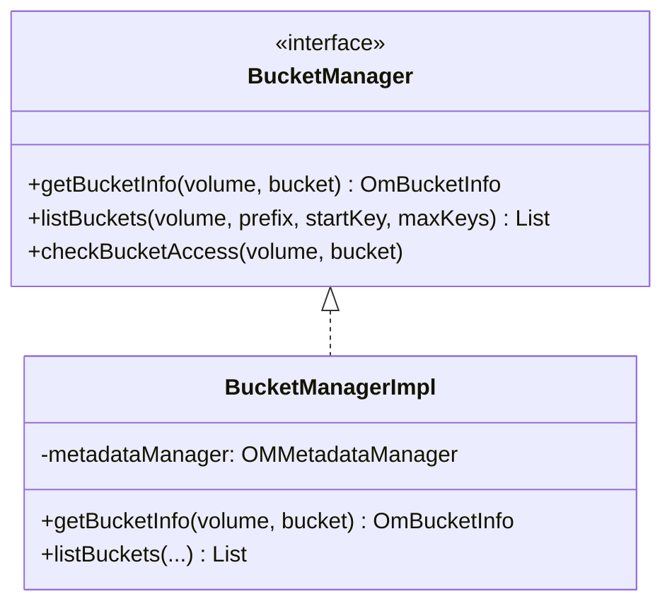

# OM / om-bucket-manager

**Classes:** 2    **Kinds:** interface:1, service:1

## Overview

The `om-bucket-manager` feature defines the bucket-level read-path interface and its implementation. `BucketManager` defines `getBucketInfo`, `listBuckets`, and `checkBucketAccess`. `BucketManagerImpl` implements these against `OMMetadataManager`, acquiring a read lock via `OzoneManagerLock` for each operation. It resolves link buckets (buckets that are aliases to other buckets via `sourceVolume`/`sourceBucket`) by following the link chain via `ResolvedBucket`. Bucket listing uses the `ListIterator` abstraction to merge the write-through cache with the persisted table. All write-path bucket operations (create, delete, set-property) are handled by request classes in `om-request-bucket`.

## Diagram

## Class table

### Sub-feature: `ozone.om`

| reading_order | fqcn | kind | logic | loc | study (min) | role |
|--:|---|---|---|--:|--:|---|
| 481 | `org.apache.hadoop.ozone.om.BucketManager` | interface | mixed | 25~ | 20 | BucketManager handles all the bucket level operations. |
| 482 | `org.apache.hadoop.ozone.om.BucketManagerImpl` | service | mixed | 125~ | 30 | Implementation for BucketManager BucketManager uses MetadataDB to store bucket level information. |

## Anchor details

_No logic-heavy anchors in this feature; the classes are primarily data / dto / config / cli._

## Design docs

- `hadoop-hdds/docs/content/concept/VolumesBucketsKeys.md` — volume/bucket/key namespace overview
- no dedicated design doc for `BucketManagerImpl` specifically on this branch

## Seminal JIRAs / PRs

- HDDS-8511. Enforce strict S3-compliant name for object store buckets
- HDDS-14111. Make OmBucketInfo ACL list immutable
- HDDS-15624. Resolve link bucket properties in listBucket

## Sharp edges

- `BucketManagerImpl.getBucketInfo` resolves link buckets by recursively following the `sourceVolume`/`sourceBucket` chain; a cycle (bucket A links to B, B links to A) would cause infinite recursion. The depth of link traversal is not bounded.

## Related features

- `components/om/om-request-bucket.md` — write-path bucket request classes
- `components/om/om-volume-manager.md` — `VolumeManagerImpl` provides the volume-level equivalent
- `components/om/om-server.md` — `OzoneManager` delegates bucket read calls to `BucketManagerImpl`

## Self-quiz

1. `BucketManagerImpl.listBuckets` lists buckets in a volume. How does it handle buckets that were created but not yet flushed to RocksDB?
2. What is a link bucket and how does `BucketManagerImpl.getBucketInfo` resolve it?
3. `OmBucketInfo.getAcls()` returns an immutable list after HDDS-14111. Why was this change made?
4. Which lock does `BucketManagerImpl` acquire before reading a bucket entry?
5. The `listBuckets` result order is lexicographic. What iterator abstraction makes this work even with in-flight updates?

Answers

Answer 1: It uses the `ListIterator` abstraction which merges the write-through table cache (containing un-flushed entries) with the persisted RocksDB table, so newly created buckets appear immediately.
Answer 2: A link bucket has a non-null `sourceVolume` and `sourceBucket`; `getBucketInfo` detects this and recursively calls `getBucketInfo` on the source bucket to return the resolved bucket's properties.
Answer 3: To prevent ACL mutations on the cached `OmBucketInfo` object, which would create a race condition between threads reading the same cached instance and a request thread attempting to add ACLs.
Answer 4: Bucket read lock: `OzoneManagerLock.acquireReadLock(BUCKET_LOCK, volumeName, bucketName)`.
Answer 5: `ListIterator` (implemented as an inner class in `OmMetadataManagerImpl`) merges the sorted RocksDB iterator with the sorted cache entries, maintaining lexicographic order across both.

