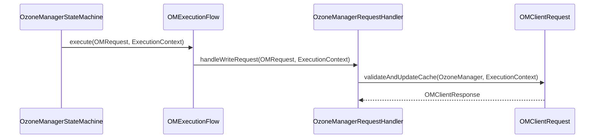

# OM / om-execution

**Classes:** 2    **Kinds:** service:2

## Overview

The `om-execution` feature provides the execution-context plumbing for OM write requests. `ExecutionContext` is a small value type carrying the Ratis `TermIndex` (log term + index), the call timestamp, and any per-request metadata that request handlers need during `validateAndUpdateCache`. It is constructed by `OzoneManagerStateMachine.applyTransaction` and threaded through to `OzoneManagerRequestHandler.handleWriteRequest`. `OMExecutionFlow` is the entry point for the write-request execution flow, providing a single method that takes a request and `ExecutionContext` and routes to the appropriate handler, applying pre/post execution logic including validation framework integration.

## Diagram

## Class table

### Sub-feature: `execution.flowcontrol`

| reading_order | fqcn | kind | logic | loc | study (min) | role |
|--:|---|---|---|--:|--:|---|
| 388 | `org.apache.hadoop.ozone.om.execution.flowcontrol.ExecutionContext` | service | mixed | 25~ | 30 | Context required for execution of a request. |

### Sub-feature: `om.execution`

| reading_order | fqcn | kind | logic | loc | study (min) | role |
|--:|---|---|---|--:|--:|---|
| 389 | `org.apache.hadoop.ozone.om.execution.OMExecutionFlow` | service | mixed | 25~ | 30 | entry for execution flow for write request. |

## Anchor details

_No logic-heavy anchors in this feature; the classes are primarily data / dto / config / cli._

## Design docs

- no dedicated design doc under `hadoop-hdds/docs/content/` on this branch; `OMExecutionFlow` is a recent refactoring introduced as part of HDDS-14356 (OM Service Framework)

## Seminal JIRAs / PRs

- HDDS-14356. Support OM Service Framework (introduced `OMExecutionFlow` and `ExecutionContext`)

## Sharp edges

- `ExecutionContext` carries the `TermIndex` from the Ratis log entry. If `validateAndUpdateCache` uses the `TermIndex` for ordering decisions (e.g., incrementing `updateID`), it must never be null. Null `ExecutionContext` in non-Ratis test flows can cause `NullPointerException` if not handled.

## Related features

- `components/om/om-ratis.md` — `OzoneManagerStateMachine.applyTransaction` constructs `ExecutionContext`
- `components/om/om-protocol.md` — `OzoneManagerRequestHandler.handleWriteRequest` receives `ExecutionContext`
- `components/om/om-request.md` — `OMClientRequest.validateAndUpdateCache` accepts `ExecutionContext`

## Self-quiz

1. What two fields does `ExecutionContext` always carry, and which field comes from the Ratis log?
2. `OMExecutionFlow` is called from which class's `applyTransaction`?
3. Why must `ExecutionContext` carry the call timestamp separately from the system clock?
4. `ExecutionContext` also carries per-request metadata. Give one example of metadata it might carry.
5. Is `ExecutionContext` ever constructed outside of a Ratis apply context, and if so, when?

Answers

Answer 1: `TermIndex` (from the Ratis log entry) and the call timestamp. `TermIndex` is set by the Ratis framework.
Answer 2: `OzoneManagerStateMachine.applyTransaction`.
Answer 3: For deterministic replay — when Ratis re-applies a log entry during follower catchup, the system clock would return a different time than the original apply, causing non-deterministic `OmKeyInfo.getModificationTime()` values. The timestamp from the `ExecutionContext` (baked in at leader time) ensures consistency.
Answer 4: inferred: request tracing span ID or the Ratis `RaftClientRequest` for internal correlation.
Answer 5: In unit tests that call `validateAndUpdateCache` directly without going through Ratis. These tests construct a minimal `ExecutionContext` with a fixed `TermIndex` and timestamp.

