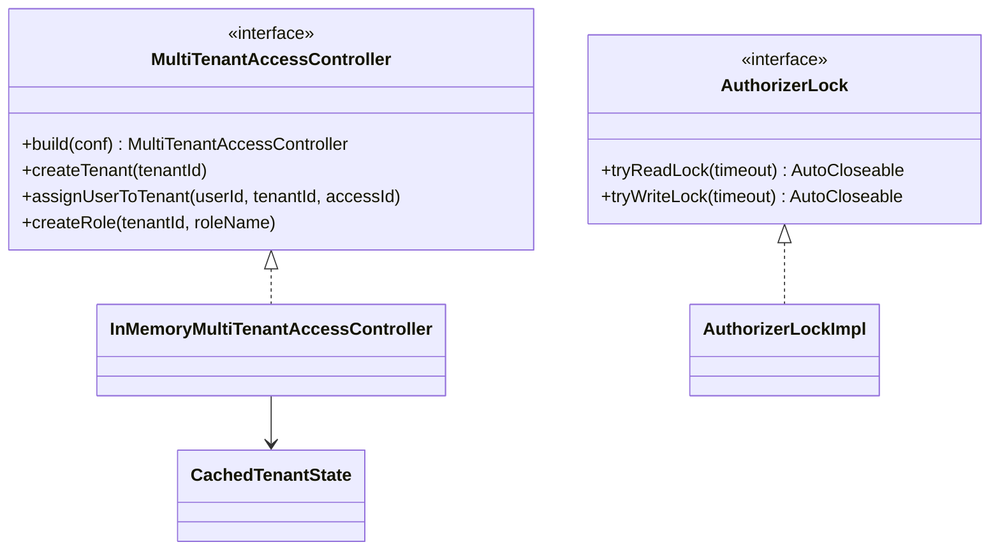

# OM / om-multitenant

**Classes:** 5    **Kinds:** service:3, interface:2

## Overview

The `om-multitenant` feature defines the interfaces and in-memory implementations for OM multi-tenancy access control. `MultiTenantAccessController` is the main interface for managing tenants, users, roles, and access-IDs; its `build()` factory method creates the appropriate implementation (Ranger-backed or in-memory). `InMemoryMultiTenantAccessController` is a test/in-memory implementation that stores state in `CachedTenantState` objects without calling Ranger. `AuthorizerLock` guards access to the authorizer during concurrent OM requests and Ranger sync — `AuthorizerLockImpl` wraps a `ReadWriteLock` and allows OM request threads to hold read locks while `OMRangerBGSyncService` holds a write lock during sync. `CachedTenantState` is the per-tenant in-memory view used during request processing to avoid DB lookups for every ACL check.

## Diagram

## Class table

### Sub-feature: `om.multitenant`

| reading_order | fqcn | kind | logic | loc | study (min) | role |
|--:|---|---|---|--:|--:|---|
| 1431 | `org.apache.hadoop.ozone.om.multitenant.MultiTenantAccessController` | interface | logic-heavy | 375~ | 20 | Defines the operations needed for multi-tenant access control. |
| 1432 | `org.apache.hadoop.ozone.om.multitenant.AuthorizerLock` | interface | mixed | 25~ | 20 | Authorizer access lock interface. |
| 1433 | `org.apache.hadoop.ozone.om.multitenant.InMemoryMultiTenantAccessController` | service | mixed | 125~ | 30 | In Memory version of MultiTenantAccessController. |
| 1434 | `org.apache.hadoop.ozone.om.multitenant.AuthorizerLockImpl` | service | mixed | 125~ | 30 | Implementation of AuthorizerLock. |
| 1435 | `org.apache.hadoop.ozone.om.multitenant.CachedTenantState` | service | mixed | 75~ | 30 | A collection of things that we want to maintain about a tenant in memory. |

## Anchor details

### `MultiTenantAccessController`

- **path:** `hadoop-ozone/ozone-manager/src/main/java/org/apache/hadoop/ozone/om/multitenant/MultiTenantAccessController.java`
- **loc:** 375~    **difficulty:** 2    **study:** 20 min    **concurrency:** single-threaded    **persistence:** in-memory
- **entry points:** `build`
- **role:** Defines the operations needed for multi-tenant access control.

The interface defines `createTenant`, `deleteTenant`, `createRole`, `deleteRole`, `createAccessPolicy`, `deleteAccessPolicy`, `assignUserToRole`, `revokeUserFromRole`, etc. The `build(conf, authorizer)` static factory selects the implementation: if `authorizer` is a Ranger-backed implementation, it returns a `RangerClient`-based controller (from the `ozone-multitenant-ranger` module). For tests and secure-mode-off, `InMemoryMultiTenantAccessController` is used. This was introduced in HDDS-12451 as a factory for the multi-tenant access controller.

## Design docs

- `hadoop-hdds/docs/content/security/SecurityWithRanger.md` — Ranger integration and multi-tenant authorization configuration

## Seminal JIRAs / PRs

- HDDS-12451. Create factory for MultiTenantAccessController
- HDDS-12454. Create new module for multitenancy with Ranger
- HDDS-7178. Use optimistic read in Ranger background sync (AuthorizerLock)
- HDDS-11587. Ozone Manager not processing file put requests with multi-tenancy enabled
- HDDS-7042. Rebuilding tenant cache omits empty tenants

## Sharp edges

- `AuthorizerLockImpl.tryWriteLockInOMRequest` uses a try-lock with a configurable timeout. If the Ranger sync holds the write lock too long, OM write requests will timeout waiting for the read lock, causing client-visible failures without a clear error message.
- `OMRangerBGSyncService` compares the Ranger service version against the OM DB version; a Ranger outage will cause repeated failed sync attempts but will not block OM request processing (the read lock is released before any Ranger calls are made).

## Related features

- `components/om/om-background-services.md` — `OMRangerBGSyncService` uses `MultiTenantAccessController` and `AuthorizerLock`
- `components/om/om-request-s3.md` — tenant create/delete/assign request classes that modify the tenant DB tables
- `components/om/om-server.md` — `OMMultiTenantManagerImpl` owns the `MultiTenantAccessController` instance

## Self-quiz

1. `AuthorizerLock` uses optimistic read locking for OM request threads. What does `tryReadLock` do if it cannot immediately acquire the lock?
2. `InMemoryMultiTenantAccessController` stores state in `CachedTenantState` objects. Is this state persisted? Where is the persistent tenant state stored?
3. What is the Ranger service version stored in the OM DB used for and how does `OMRangerBGSyncService` use it?
4. Why was a separate `MultiTenantAccessController` interface created rather than extending `IAccessAuthorizer`?
5. When a tenant is created via `OMTenantCreateRequest`, what DB tables are updated?

Answers

Answer 1: `tryReadLock(timeout)` throws `OMException` with a timeout error if the lock cannot be acquired within the specified duration (HDDS-6990 clarified the semantics).
Answer 2: `CachedTenantState` is in-memory only; it is rebuilt from `tenantStateTable` in the OM RocksDB on OM startup (in `OMMultiTenantManagerImpl.loadTenantCacheFromDB`).
Answer 3: The Ranger service version is a monotonically increasing integer updated when `OMSetRangerServiceVersionRequest` is applied. `OMRangerBGSyncService` fetches the current Ranger policy version and compares it to the OM DB version; if they match, the sync is a no-op.
Answer 4: `IAccessAuthorizer.checkAccess` is a per-request ACL check; `MultiTenantAccessController` is a management API (create roles, assign users). They have different callers and lifetimes and were intentionally separated.
Answer 5: `tenantStateTable` (tenant metadata), `tenantAccessIdTable` (user-to-access-id mapping), and the Ranger access policy is created via `MultiTenantAccessController`.

