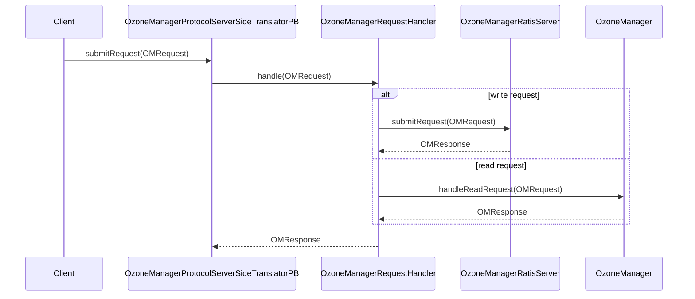

# OM / om-protocol

**Classes:** 5    **Kinds:** service:3, interface:1, rpc-stub:1

## Overview

The `om-protocol` feature bridges the Protobuf RPC layer and the OM request execution layer. `OzoneManagerProtocolServerSideTranslatorPB` is the Hadoop RPC stub that receives encoded proto bytes and converts them to `OMRequest` objects; it then calls `OzoneManagerRequestHandler.handle()` for read requests or routes write requests through `OzoneManagerRatisServer.submitRequest()`. `OzoneManagerRequestHandler` is the central dispatcher: for write requests during Ratis apply it calls `handleWriteRequest`; for read-only requests it dispatches directly to `OzoneManager` or `KeyManagerImpl`. It handles ~120 distinct `OMRequest.Type` cases. `OMAdminProtocolServerSideImpl` handles the admin protocol (safe-mode, service info, Ranger sync triggers). `OMInterServiceProtocolServerSideImpl` handles inter-OM service calls (bootstrapping, follower-read). `RequestHandler` is the interface implemented by `OzoneManagerRequestHandler`.

## Diagram

## Class table

### Sub-feature: `ozone.protocolPB`

| reading_order | fqcn | kind | logic | loc | study (min) | role |
|--:|---|---|---|--:|--:|---|
| 54 | `org.apache.hadoop.ozone.protocolPB.RequestHandler` | interface | mixed | 25~ | 20 | Handler to handleRequest the OmRequests. |
| 55 | `org.apache.hadoop.ozone.protocolPB.OzoneManagerRequestHandler` | service | logic-heavy | 1300~ | 60 | Command Handler for OM requests. |
| 56 | `org.apache.hadoop.ozone.protocolPB.OMAdminProtocolServerSideImpl` | service | mixed | 100~ | 30 | This class is the server-side translator that forwards requests received on OMAdminProtocolPB to the OMAdminProtocolS... |
| 57 | `org.apache.hadoop.ozone.protocolPB.OMInterServiceProtocolServerSideImpl` | service | mixed | 25~ | 30 | This class is the server-side translator that forwards requests received on OMInterServiceProtocolPB to the OzoneMana... |
| 58 | `org.apache.hadoop.ozone.protocolPB.OzoneManagerProtocolServerSideTranslatorPB` | rpc-stub | logic-heavy | 300~ | 20 | This is the server-side translator that forwards requests received from OzoneManagerProtocolPB to OzoneManager. |

## Anchor details

### `OzoneManagerRequestHandler`

- **path:** `hadoop-ozone/ozone-manager/src/main/java/org/apache/hadoop/ozone/protocolPB/OzoneManagerRequestHandler.java`
- **loc:** 1300~    **difficulty:** 5    **study:** 60 min    **concurrency:** single-threaded    **persistence:** in-memory
- **key collaborators:** `org.apache.hadoop.hdds.client.ECReplicationConfig`, `org.apache.hadoop.hdds.client.ReplicationConfig`, `org.apache.hadoop.hdds.scm.protocolPB.OzonePBHelper`, `org.apache.hadoop.hdds.utils.FaultInjector`, `org.apache.hadoop.ozone.OzoneAcl`, `org.apache.hadoop.ozone.om.OzoneManager`
- **test exemplar:** `hadoop-ozone/ozone-manager/src/test/java/org/apache/hadoop/ozone/protocolPB/TestOzoneManagerRequestHandler.java`
- **role:** Dispatches all OM requests to the appropriate read or write handler, translating between Protobuf and Java domain objects.

`handleWriteRequest(OMRequest, ExecutionContext)` is called from `OzoneManagerStateMachine.applyTransaction`. It uses `BucketLayoutAwareOMKeyRequestFactory` to instantiate the correct request class (FSO vs OBS) and then calls `request.validateAndUpdateCache(ozoneManager, executionContext)`. For read requests, `handleReadRequest(OMRequest)` switches on `OMRequest.getCmdType()` and calls the appropriate `OzoneManager` method. The `FaultInjector` field allows test injection of failures at specific request types.

## Design docs

- `hadoop-hdds/docs/content/concept/OzoneManager.md` — OM architecture overview including the protocol layer
- no dedicated design doc for `OzoneManagerRequestHandler` specifically on this branch

## Seminal JIRAs / PRs

- HDDS-14829. Split snapshot diff job into separate RPC calls (added new request types to the handler)
- HDDS-14509. Allow client to choose read consistency level (follower reads routed in handler)
- HDDS-14207. Inconsistent Ozone admin check (fixed admin verification in protocol layer)
- HDDS-9438. Improve ProtocolMessageMetrics

## Sharp edges

- `OzoneManagerRequestHandler.handleWriteRequest` is called on the Ratis apply thread; if it throws an uncaught exception the `applyTransaction` is marked as failed, which causes Ratis to crash the node via `ExitUtils`. Every exception path must be caught and converted to an `OMResponse` with a non-OK status.
- Admin check logic was inconsistent between `OMAdminProtocolServerSideImpl` and in-request checks (HDDS-14207); verify which admin authority is checked for each admin operation.

## Related features

- `components/om/om-ratis.md` — `OzoneManagerStateMachine` calls `handleWriteRequest`
- `components/om/om-request.md` — `BucketLayoutAwareOMKeyRequestFactory` is used by `handleWriteRequest`
- `components/om/om-server.md` — `OzoneManager` is the delegate for read operations

## Self-quiz

1. `OzoneManagerRequestHandler.handleWriteRequest` is called from which class in `om-ratis`, and what type does it return?
2. For a `CreateKey` write request on an FSO bucket, what factory class does `handleWriteRequest` use to instantiate the correct handler, and what two concrete classes might it return?
3. What happens if `handleWriteRequest` throws an `OMException` — how is this caught and what is returned to the client?
4. `OzoneManagerProtocolServerSideTranslatorPB` forwards write requests differently from read requests. Describe the difference.
5. `OMAdminProtocolServerSideImpl` implements which Hadoop RPC protocol and what types of operations does it handle?

Answers

Answer 1: Called from `OzoneManagerStateMachine.applyTransaction`, it returns `OMClientResponse`.
Answer 2: `BucketLayoutAwareOMKeyRequestFactory` instantiates either `OMKeyCreateRequestWithFSO` (FSO bucket) or `OMKeyCreateRequest` (OBS bucket).
Answer 3: `OMException` is caught in `handleWriteRequest` and converted to an `OMResponse` with the corresponding `Status` code. The `OMClientResponse` wraps this response.
Answer 4: Read requests are handled immediately in `OzoneManagerProtocolServerSideTranslatorPB.submitRequest` by calling `handler.handle(request)` and returning synchronously. Write requests are forwarded to `OzoneManagerRatisServer.submitRequest` which returns a `CompletableFuture` — the translator blocks on it.
Answer 5: `OMAdminProtocolPB` — it handles safe-mode status, Ranger BG sync triggers, and OM decommission/recommission operations.

