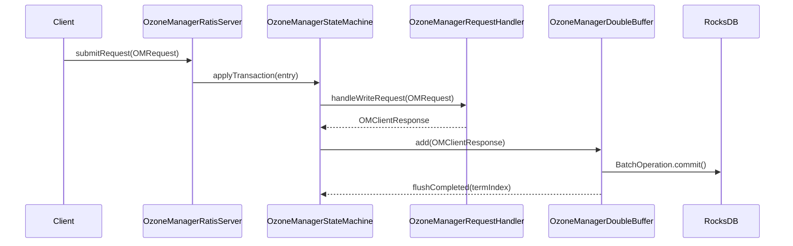

# OM / om-ratis

**Classes:** 7    **Kinds:** service:5, config:1, metrics:1

## Overview

The `om-ratis` feature implements OM high-availability using Apache Ratis. `OzoneManagerRatisServer` creates and manages the `RaftServer` endpoint, handles leader election events, and routes write requests from the client to the Raft log. `OzoneManagerStateMachine` extends `BaseStateMachine` and is the core Raft state machine: it receives committed log entries via `applyTransaction`, deserializes them as `OMRequest` protos, and dispatches them to `OzoneManagerRequestHandler` for execution. Completed `OMClientResponse` objects are handed to `OzoneManagerDoubleBuffer`, which batches them in two alternating queues and flushes to RocksDB in a background daemon. This decouples Raft commit latency from RocksDB write latency. `OzoneManagerRatisUtils` provides factory methods to construct the `OMRequest` from a Raft `LogEntry`. `OmRatisSnapshotProvider` handles the follower bootstrapping case, downloading the OM DB checkpoint from the leader over HTTP and installing it as a Raft snapshot.

## Diagram

## Class table

### Sub-feature: `om.ratis`

| reading_order | fqcn | kind | logic | loc | study (min) | role |
|--:|---|---|---|--:|--:|---|
| 297 | `org.apache.hadoop.ozone.om.ratis.OzoneManagerRatisServer` | service | logic-heavy | 600~ | 60 | Creates a Ratis server endpoint for OM. |
| 298 | `org.apache.hadoop.ozone.om.ratis.OzoneManagerStateMachine` | service | logic-heavy | 500~ | 60 | The OM StateMachine is the state machine for OM Ratis server. |
| 299 | `org.apache.hadoop.ozone.om.ratis.OzoneManagerDoubleBuffer` | service | logic-heavy | 400~ | 60 | This class implements DoubleBuffer implementation of OMClientResponse's. |
| 300 | `org.apache.hadoop.ozone.om.ratis.OzoneManagerRatisServerConfig` | config | data-only | 50~ | 20 | Class which defines OzoneManager Ratis Server config. |
| 301 | `org.apache.hadoop.ozone.om.ratis.OzoneManagerDoubleBufferMetrics` | metrics | mixed | 100~ | 20 | Class which maintains metrics related to OzoneManager DoubleBuffer. |

### Sub-feature: `om.ratis_snapshot`

| reading_order | fqcn | kind | logic | loc | study (min) | role |
|--:|---|---|---|--:|--:|---|
| 302 | `org.apache.hadoop.ozone.om.ratis_snapshot.OmRatisSnapshotProvider` | service | logic-heavy | 325~ | 45 | OmRatisSnapshotProvider downloads the latest checkpoint from the leader OM and loads the checkpoint into State Machine. |

### Sub-feature: `ratis.utils`

| reading_order | fqcn | kind | logic | loc | study (min) | role |
|--:|---|---|---|--:|--:|---|
| 303 | `org.apache.hadoop.ozone.om.ratis.utils.OzoneManagerRatisUtils` | service | logic-heavy | 350~ | 45 | Utility class used by OzoneManager HA. |

## Anchor details

### `OzoneManagerRatisServer`

- **path:** `hadoop-ozone/ozone-manager/src/main/java/org/apache/hadoop/ozone/om/ratis/OzoneManagerRatisServer.java`
- **loc:** 600~    **difficulty:** 5    **study:** 60 min    **concurrency:** single-threaded    **persistence:** in-memory
- **entry points:** `start`
- **key collaborators:** `org.apache.hadoop.ozone.om.ratis.utils.OzoneManagerRatisUtils`, `org.apache.hadoop.hdds.HddsUtils`, `org.apache.hadoop.hdds.conf.ConfigurationSource`, `org.apache.hadoop.hdds.conf.RatisConfUtils`, `org.apache.hadoop.hdds.conf.StorageUnit`, `org.apache.hadoop.hdds.ratis.RatisHelper`
- **test exemplar:** `hadoop-ozone/ozone-manager/src/test/java/org/apache/hadoop/ozone/om/ratis/TestOzoneManagerRatisServer.java`
- **role:** Creates a Ratis server endpoint for OM.

The critical method is `submitRequest(OMRequest, RaftClientRequest)`: on leader it submits to `RaftServer.submitClientRequestAsync`; on follower it throws `OMNotLeaderException` with the current leader node ID so the client can redirect. Follower reads (`ReadConsistency.PREFER_OBSERVED`) are served locally if the follower's applied index is recent enough — this is the read consistency feature from HDDS-14509. The retry-cache is consulted via Ratis's built-in `RetryCache` keyed on client ID + call ID (HDDS-13621 fixed an NPE here).

### `OzoneManagerStateMachine`

- **path:** `hadoop-ozone/ozone-manager/src/main/java/org/apache/hadoop/ozone/om/ratis/OzoneManagerStateMachine.java`
- **loc:** 500~    **difficulty:** 5    **study:** 60 min    **concurrency:** actor/queue    **persistence:** in-memory
- **entry points:** `notifyLeaderChanged`, `applyTransaction`, `takeSnapshot`, `close`
- **key collaborators:** `org.apache.hadoop.ozone.om.ratis.utils.OzoneManagerRatisUtils`, `org.apache.hadoop.hdds.utils.NettyMetrics`, `org.apache.hadoop.hdds.utils.TransactionInfo`, `org.apache.hadoop.ozone.audit.AuditLogger`, `org.apache.hadoop.ozone.audit.AuditLoggerType`, `org.apache.hadoop.ozone.audit.OMSystemAction`
- **test exemplar:** `hadoop-ozone/ozone-manager/src/test/java/org/apache/hadoop/ozone/om/ratis/TestOzoneManagerStateMachine.java`
- **role:** The OM StateMachine is the state machine for OM Ratis server.

`applyTransaction` is called by the Ratis actor thread; it must never block. It passes the `OMRequest` to `OzoneManagerRequestHandler.handleWriteRequest` and the resulting `OMClientResponse` to `OzoneManagerDoubleBuffer.add`. The `ExecutionContext` carries per-request metadata (term, index, timestamp) that the request handler uses for audit logging and idempotency. `notifyLeaderChanged` triggers OM leader state transitions, including starting/stopping background services.

### `OzoneManagerDoubleBuffer`

- **path:** `hadoop-ozone/ozone-manager/src/main/java/org/apache/hadoop/ozone/om/ratis/OzoneManagerDoubleBuffer.java`
- **loc:** 400~    **difficulty:** 5    **study:** 60 min    **concurrency:** thread-safe    **persistence:** RocksDB
- **entry points:** `build`, `start`
- **key collaborators:** `org.apache.hadoop.hdds.tracing.TracingUtil`, `org.apache.hadoop.hdds.utils.TransactionInfo`, `org.apache.hadoop.hdds.utils.db.BatchOperation`, `org.apache.hadoop.ozone.om.OMMetadataManager`, `org.apache.hadoop.ozone.om.S3SecretManager`, `org.apache.hadoop.ozone.om.codec.OMDBDefinition`
- **test exemplar:** `hadoop-ozone/ozone-manager/src/test/java/org/apache/hadoop/ozone/om/ratis/TestOzoneManagerDoubleBuffer.java`
- **role:** This class implements DoubleBuffer implementation of OMClientResponse's.

Two `Queue<Entry>` — `currentBuffer` and `readyBuffer` — are swapped atomically under synchronization. A `Semaphore unFlushedTransactions` bounds the number of pending entries so the Ratis apply thread back-pressures rather than OOM-ing under load. The background `Daemon` calls each `OMClientResponse.checkAndUpdateDB(BatchOperation)` then calls `omMetadataManager.commitBatchOperation` once per swap. After the flush the daemon calls `updateLastAppliedIndex` with the highest `TermIndex` in the batch, which allows Ratis to advance its commit pointer and release waiters. The buffer can be paused (for OM prepare) and resumed.

### `OzoneManagerRatisUtils`

- **path:** `hadoop-ozone/ozone-manager/src/main/java/org/apache/hadoop/ozone/om/ratis/utils/OzoneManagerRatisUtils.java`
- **loc:** 350~    **difficulty:** 4    **study:** 45 min    **concurrency:** ratis-applied    **persistence:** RocksDB
- **key collaborators:** `org.apache.hadoop.hdds.conf.ConfigurationSource`, `org.apache.hadoop.hdds.conf.OzoneConfiguration`, `org.apache.hadoop.hdds.security.SecurityConfig`, `org.apache.hadoop.hdds.security.x509.certificate.client.CertificateClient`, `org.apache.hadoop.hdds.server.ServerUtils`, `org.apache.hadoop.hdds.utils.HAUtils`
- **role:** Utility class used by OzoneManager HA.

Key method `createClientRequest(Message, OzoneManager)` parses the `ByteString` log payload into an `OMRequest` proto. Also contains `createServerTlsConfig` used at `OzoneManagerRatisServer` startup and the `getOMLayoutVersion` helper that extracts the layout version from the request to pass to upgrade-aware validators.

### `OmRatisSnapshotProvider`

- **path:** `hadoop-ozone/ozone-manager/src/main/java/org/apache/hadoop/ozone/om/ratis_snapshot/OmRatisSnapshotProvider.java`
- **loc:** 325~    **difficulty:** 4    **study:** 45 min    **concurrency:** thread-safe    **persistence:** RocksDB
- **entry points:** `close`
- **key collaborators:** `org.apache.hadoop.hdds.conf.MutableConfigurationSource`, `org.apache.hadoop.hdds.conf.StorageUnit`, `org.apache.hadoop.hdds.server.http.HttpConfig`, `org.apache.hadoop.hdds.utils.HAUtils`, `org.apache.hadoop.hdds.utils.LegacyHadoopConfigurationSource`, `org.apache.hadoop.hdds.utils.RDBSnapshotProvider`
- **test exemplar:** `hadoop-ozone/ozone-manager/src/test/java/org/apache/hadoop/ozone/om/ratis_snapshot/TestOmRatisSnapshotProvider.java`
- **role:** OmRatisSnapshotProvider downloads the latest checkpoint from the leader OM and loads the checkpoint into State Machine.

Called by `OzoneManagerStateMachine.installSnapshot`. It fetches the tarball from the leader's `OMDBCheckpointServlet` endpoint over HTTP, optionally using inode-based transfer (`OMDBCheckpointServletInodeBasedXfer`) when configured. The downloaded checkpoint directory is then passed to `OzoneManagerStateMachine.loadSnapshotInfoFromDB` to rebuild in-memory state before Ratis resumes log replay. An available-space check on the follower disk was added in HDDS-15171 to prevent corrupt partial installations.

## Design docs

- `hadoop-hdds/docs/content/design/omha.md` — OM HA design including Ratis server, state machine, and bootstrap
- `hadoop-hdds/docs/content/design/om-bootstrapping-with-snapshots.md` — follower bootstrap via `OmRatisSnapshotProvider`
- `hadoop-hdds/docs/content/design/omprepare.md` — OM prepare state and double-buffer pausing

## Seminal JIRAs / PRs

- HDDS-14356. Support OM Service Framework
- HDDS-14509. Allow client to choose the read consistency level (follower reads)
- HDDS-14425. Implement Ratis follower read exception handling
- HDDS-13621. NPE in OzoneManagerRatisServer.checkRetryCache
- HDDS-15171. Add available space check on follower during bootstrap
- HDDS-15514. Pass Ratis peer addresses as hostnames

## Sharp edges

- `OzoneManagerDoubleBuffer` back-pressures `OzoneManagerStateMachine.applyTransaction` via a `Semaphore`. If the RocksDB flush daemon stalls (disk full, slow fsync), all Raft apply threads block, eventually causing the Raft group to timeout and trigger leader election. There is no timeout on the semaphore acquire.
- `OmRatisSnapshotProvider` downloads the entire OM DB tarball; for large deployments this can take tens of minutes. The follower's Raft log is not replayed during download, so the follower can fall further behind. Check disk space before bootstrap (HDDS-15171).

## Related features

- `components/om/om-protocol.md` — `OzoneManagerRequestHandler` is called by `OzoneManagerStateMachine.applyTransaction`
- `components/om/om-execution.md` — `ExecutionContext` and `OMExecutionFlow` carry per-request state through `applyTransaction`
- `components/om/om-server.md` — `OzoneManager` owns and starts `OzoneManagerRatisServer`

## Self-quiz

1. `OzoneManagerDoubleBuffer` uses a `Semaphore` named `unFlushedTransactions`. What does it bound and what happens if the semaphore cannot be acquired?
2. `OzoneManagerStateMachine.applyTransaction` must not block. What mechanism does it use to hand off the `OMClientResponse` to the buffer without blocking the Ratis actor thread?
3. When a follower's applied index lags behind the leader but `ReadConsistency.PREFER_OBSERVED` is set, what does `OzoneManagerRatisServer.submitRequest` do?
4. `OmRatisSnapshotProvider` downloads a checkpoint tarball from which OM HTTP endpoint, and what servlet class serves that endpoint?
5. What does `OzoneManagerStateMachine.notifyLeaderChanged` do when this OM node becomes the new leader?

Answers

Answer 1: It bounds the number of `OMClientResponse` entries waiting in the double buffer. If the semaphore cannot be acquired the `applyTransaction` caller blocks, eventually causing Raft heartbeat timeouts if the stall is long enough.
Answer 2: It calls `doubleBuffer.add(response)` which is a non-blocking queue insertion (the actual RocksDB flush is done by the background daemon, not the Ratis actor thread). The semaphore is acquired before the `add` call and released after the flush daemon processes the entry.
Answer 3: It serves the request locally without forwarding to the leader, as long as the follower's last applied index satisfies the client's minimum index requirement from the request header.
Answer 4: It downloads from `OMDBCheckpointServlet` (or `OMDBCheckpointServletInodeBasedXfer` if configured). The servlet path is `/dbCheckpoint`.
Answer 5: It calls `ozoneManager.startLeaderServices()` which starts background services (key deleting, directory deleting, etc.) and sets the OM state to ACTIVE.

