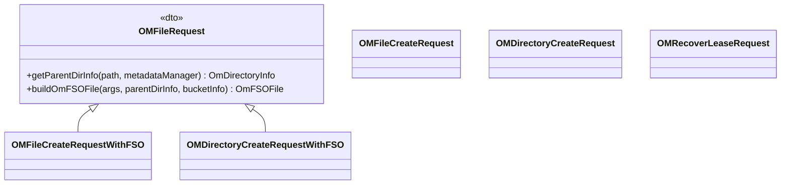

# OM / om-request-file

**Classes:** 6    **Kinds:** dto:3, service:2, data:1

## Overview

The `om-request-file` feature contains request classes for filesystem-level file and directory operations. `OMFileRequest` is a base class providing shared FSO path-resolution helpers: it resolves a path string into parent directory inode ID and file name, validates each path component, and creates intermediate directories on demand via `OmFSOFile`. `OMFileCreateRequestWithFSO` handles `createFile` for FSO buckets, using `OMFileRequest` helpers. `OMDirectoryCreateRequestWithFSO` handles `createDirectory` for FSO. `OMDirectoryCreateRequest` handles the same for OBS (where directories are virtual). `OMFileCreateRequest` handles `createFile` for OBS. `OMRecoverLeaseRequest` recovers a lease on an open file after a client crash, moving it from `openFileTable` to `fileTable`.

## Diagram

## Class table

### Sub-feature: `request.file`

| reading_order | fqcn | kind | logic | loc | study (min) | role |
|--:|---|---|---|--:|--:|---|
| 1436 | `org.apache.hadoop.ozone.om.request.file.OMFileCreateRequestWithFSO` | service | mixed | 150~ | 45 | Handles create file request layout version1. |
| 1437 | `org.apache.hadoop.ozone.om.request.file.OMDirectoryCreateRequestWithFSO` | service | mixed | 125~ | 30 | Handle create directory request. |
| 1438 | `org.apache.hadoop.ozone.om.request.file.OMFileRequest` | dto | logic-heavy | 600~ | 10 | Base class for file requests. |
| 1439 | `org.apache.hadoop.ozone.om.request.file.OMFileCreateRequest` | dto | logic-heavy | 250~ | 10 | Handles create file request. |
| 1440 | `org.apache.hadoop.ozone.om.request.file.OMDirectoryCreateRequest` | dto | logic-heavy | 200~ | 10 | Handle create directory request. |
| 1441 | `org.apache.hadoop.ozone.om.request.file.OMRecoverLeaseRequest` | dto | data-only | 175~ | 10 | Perform actions for RecoverLease requests. |

## Anchor details

_No logic-heavy anchors in this feature; the classes are primarily data / dto / config / cli._

## Design docs

- `hadoop-hdds/docs/content/design/namespace-support.md` — FSO directory/file namespace layout
- `hadoop-hdds/docs/content/interface/Ofs.md` — OFS filesystem interface that drives `createFile`/`createDirectory`

## Seminal JIRAs / PRs

- HDDS-14957. Separate OpenKeyInfo to differentiate KeyInfo (affects `OMFileCreateRequestWithFSO`)
- HDDS-15803. Fix parameter number warning in OMKeyRequest.allocateBlock (affects file creation allocate path)

## Sharp edges

- `OMDirectoryCreateRequestWithFSO` creates all intermediate directories in a single `validateAndUpdateCache` call. If the batch includes 50 intermediate directories, the `directoryTable` cache grows significantly. A crash mid-batch would leave the log entry to be replayed, and the replay must be idempotent (already-existing intermediate directories must not cause failure).
- `OMRecoverLeaseRequest` moves an open file to `fileTable` only if the current client's `clientId` matches the open entry. A race with a concurrent commit from a different client is not detected and the lease recovery could silently override an in-flight write.

## Related features

- `components/om/om-request-key.md` — `OMKeyCommitRequestWithFSO` commits the file after creation
- `components/om/om-helpers.md` — `OmFSOFile` used by `OMFileRequest.buildOmFSOFile`

## Self-quiz

1. `OMDirectoryCreateRequestWithFSO` creates intermediate directories. What happens on replay if an intermediate directory already exists?
2. `OMFileCreateRequestWithFSO` writes to two tables. Which tables and what key format does each use?
3. `OMRecoverLeaseRequest` is used after a client crash. What check does it perform before moving the file?
4. `OMFileRequest.getParentDirInfo` resolves a path to a parent directory inode. What table does it read from?
5. For an OBS bucket, which class handles `createFile` requests and what table does it write to?

Answers

Answer 1: It checks if the directory already exists via a table lookup. If it exists, the directory creation for that component is skipped and the existing `OmDirectoryInfo` is used as the parent.
Answer 2: `openFileTable` keyed by `volumeId/bucketId/parentId/fileName/clientId` (the open entry), and `directoryTable` for any newly created intermediate directories keyed by `volumeId/bucketId/parentId/dirName`.
Answer 3: It verifies that an entry exists in `openFileTable` for the given `clientId + volumeName + bucketName + keyName`. If no entry exists (already committed or never opened), the recover is a no-op.
Answer 4: `directoryTable` — it looks up each path component as `volumeId/bucketId/parentId/componentName`.
Answer 5: `OMFileCreateRequest` handles OBS `createFile`. It writes to `openKeyTable` keyed by `volumeName/bucketName/keyName/clientId`.

