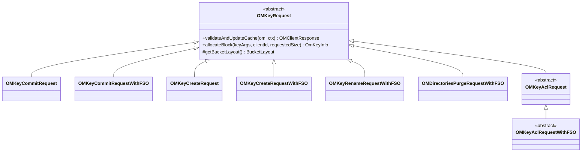

# OM / om-request-key

**Classes:** 31    **Kinds:** dto:16, service:11, abstract:4

## Overview

The `om-request-key` feature contains all write-path Ratis request classes for key-level operations. `OMKeyRequest` is the abstract base for all key requests, providing shared helpers: `allocateBlock()` (calls SCM), `validateAndUpdateCache()` protocol, bucket-lock acquisition, ACL checking, and `OmKeyInfo` builder utilities. Concrete FSO-layout classes (`WithFSO` suffix) override logic to work with the inode-based directory and file tables, while non-FSO classes work with the flat `keyTable`. The split between `dto` (no logic, purely data-carrying) and `service` (contains `validateAndUpdateCache` override) classes reflects whether bucket-layout-specific behavior is needed. `OMKeyCommitRequestWithFSO` handles the two-phase create/commit protocol for FSO. `OMKeyRenameRequestWithFSO` must atomically update both the parent directory's child list and the file entry. `OMDirectoriesPurgeRequestWithFSO` is called by `DirectoryDeletingService` to remove purged directory subtrees from the DB.

## Diagram

## Class table

### Sub-feature: `create-commit`

| reading_order | fqcn | kind | logic | loc | study (min) | role |
|--:|---|---|---|--:|--:|---|
| 251 | `org.apache.hadoop.ozone.om.request.key.OMKeyCommitRequestWithFSO` | service | logic-heavy | 250~ | 45 | Handles CommitKey request - prefix layout. |
| 252 | `org.apache.hadoop.ozone.om.request.key.OMKeyCreateRequestWithFSO` | service | mixed | 150~ | 45 | Handles CreateKey request layout version1. |
| 253 | `org.apache.hadoop.ozone.om.request.key.OMAllocateBlockRequestWithFSO` | service | mixed | 50~ | 30 | Handles allocate block request - prefix layout. |
| 254 | `org.apache.hadoop.ozone.om.request.key.OMKeyCommitRequest` | dto | logic-heavy | 425~ | 10 | Handles CommitKey request. |
| 255 | `org.apache.hadoop.ozone.om.request.key.OMKeyCreateRequest` | dto | logic-heavy | 275~ | 10 | Handles CreateKey request. |
| 256 | `org.apache.hadoop.ozone.om.request.key.OMAllocateBlockRequest` | dto | logic-heavy | 200~ | 10 | Handles allocate block request. |

### Sub-feature: `delete`

| reading_order | fqcn | kind | logic | loc | study (min) | role |
|--:|---|---|---|--:|--:|---|
| 257 | `org.apache.hadoop.ozone.om.request.key.OMDirectoriesPurgeRequestWithFSO` | service | logic-heavy | 225~ | 45 | Handles purging of keys from OM DB. |
| 258 | `org.apache.hadoop.ozone.om.request.key.OMKeyDeleteRequestWithFSO` | service | mixed | 150~ | 45 | Handles DeleteKey request - prefix layout. |
| 259 | `org.apache.hadoop.ozone.om.request.key.OmKeysDeleteRequestWithFSO` | service | mixed | 125~ | 30 | Handles DeleteKeys request for recursive bucket deletion. |
| 260 | `org.apache.hadoop.ozone.om.request.key.OMKeysDeleteRequest` | dto | logic-heavy | 325~ | 10 | Handles DeleteKey request. |
| 261 | `org.apache.hadoop.ozone.om.request.key.OMKeyDeleteRequest` | dto | data-only | 150~ | 10 | Handles DeleteKey request. |
| 262 | `org.apache.hadoop.ozone.om.request.key.OMKeyPurgeRequest` | dto | data-only | 125~ | 10 | Handles purging of keys from OM DB. |
| 263 | `org.apache.hadoop.ozone.om.request.key.OMOpenKeysDeleteRequest` | dto | data-only | 125~ | 10 | Handles requests to move open keys from the open key table to the delete table. |

### Sub-feature: `rename`

| reading_order | fqcn | kind | logic | loc | study (min) | role |
|--:|---|---|---|--:|--:|---|
| 264 | `org.apache.hadoop.ozone.om.request.key.OMKeyRenameRequestWithFSO` | service | logic-heavy | 275~ | 45 | Handles rename key request - prefix layout. |
| 265 | `org.apache.hadoop.ozone.om.request.key.OMKeysRenameRequest` | dto | data-only | 175~ | 10 | Handles rename keys request. |
| 266 | `org.apache.hadoop.ozone.om.request.key.OMKeyRenameRequest` | dto | data-only | 175~ | 10 | Handles rename key request. |

### Sub-feature: `key-acl`

| reading_order | fqcn | kind | logic | loc | study (min) | role |
|--:|---|---|---|--:|--:|---|
| 267 | `org.apache.hadoop.ozone.om.request.key.acl.OMKeyAclRequest` | abstract | mixed | 125~ | 30 | Base class for Bucket acl request. |
| 268 | `org.apache.hadoop.ozone.om.request.key.acl.prefix.OMPrefixAclRequest` | abstract | mixed | 100~ | 30 | Base class for Prefix acl request. |
| 269 | `org.apache.hadoop.ozone.om.request.key.acl.OMKeyAclRequestWithFSO` | abstract | mixed | 100~ | 30 | Handles key ACL requests - prefix layout. |
| 270 | `org.apache.hadoop.ozone.om.request.key.acl.OMKeySetAclRequestWithFSO` | service | mixed | 100~ | 30 | Handle set Acl request for bucket for prefix layout. |
| 271 | `org.apache.hadoop.ozone.om.request.key.acl.OMKeyAddAclRequestWithFSO` | service | mixed | 100~ | 30 | Handle add Acl request for bucket for prefix layout. |
| 272 | `org.apache.hadoop.ozone.om.request.key.acl.OMKeyRemoveAclRequestWithFSO` | service | mixed | 100~ | 30 | Handle remove Acl request for bucket for prefix layout. |
| 273 | `org.apache.hadoop.ozone.om.request.key.acl.OMKeyRemoveAclRequest` | dto | data-only | 100~ | 10 | Handle add Acl request for bucket. |
| 274 | `org.apache.hadoop.ozone.om.request.key.acl.OMKeyAddAclRequest` | dto | data-only | 100~ | 10 | Handle add Acl request for bucket. |
| 275 | `org.apache.hadoop.ozone.om.request.key.acl.OMKeySetAclRequest` | dto | data-only | 100~ | 10 | Handle add Acl request for bucket. |
| 276 | `org.apache.hadoop.ozone.om.request.key.acl.prefix.OMPrefixAddAclRequest` | dto | data-only | 75~ | 10 | Handle add Acl request for prefix. |
| 277 | `org.apache.hadoop.ozone.om.request.key.acl.prefix.OMPrefixRemoveAclRequest` | dto | data-only | 75~ | 10 | Handle remove Acl request for prefix. |
| 278 | `org.apache.hadoop.ozone.om.request.key.acl.prefix.OMPrefixSetAclRequest` | dto | data-only | 75~ | 10 | Handle set Acl request for prefix. |

### Sub-feature: `request.key`

| reading_order | fqcn | kind | logic | loc | study (min) | role |
|--:|---|---|---|--:|--:|---|
| 279 | `org.apache.hadoop.ozone.om.request.key.OMKeyRequest` | abstract | logic-heavy | 850~ | 60 | Interface for key write requests. |
| 280 | `org.apache.hadoop.ozone.om.request.key.OMKeySetTimesRequestWithFSO` | service | mixed | 100~ | 30 | Handle set times request for bucket for prefix layout. |
| 281 | `org.apache.hadoop.ozone.om.request.key.OMKeySetTimesRequest` | dto | data-only | 175~ | 10 | Handle add SetTimes request for key. |

## Anchor details

### `OMKeyRequest`

- **path:** `hadoop-ozone/ozone-manager/src/main/java/org/apache/hadoop/ozone/om/request/key/OMKeyRequest.java`
- **loc:** 850~    **difficulty:** 5    **study:** 60 min    **concurrency:** ratis-applied    **persistence:** in-memory
- **entry points:** `run`
- **key collaborators:** `org.apache.hadoop.hdds.client.BlockID`, `org.apache.hadoop.hdds.client.ContainerBlockID`, `org.apache.hadoop.hdds.client.ECReplicationConfig`, `org.apache.hadoop.hdds.client.ReplicationConfig`, `org.apache.hadoop.hdds.protocol.DatanodeDetails`, `org.apache.hadoop.hdds.scm.container.common.helpers.AllocatedBlock`
- **role:** Interface for key write requests.

The `allocateBlock` method is called during `preExecute` (before Ratis commit) to get block assignments from SCM — this is the only SCM call in the write path. The blocks are then embedded in the `OMRequest` proto so the `validateAndUpdateCache` call during apply sees them. `ACLs` on `OmKeyInfo` were changed from `List` to `Set` in HDDS-15804 to prevent duplicate ACL entries. The `sortDatanodes` helper for streaming writes was moved from the client to `OMKeyRequest.allocateBlock` in HDDS-15059.

### `OMKeyRenameRequestWithFSO`

- **path:** `hadoop-ozone/ozone-manager/src/main/java/org/apache/hadoop/ozone/om/request/key/OMKeyRenameRequestWithFSO.java`
- **loc:** 275~    **difficulty:** 4    **study:** 45 min    **concurrency:** single-threaded    **persistence:** in-memory
- **entry points:** `validateAndUpdateCache`
- **key collaborators:** `org.apache.hadoop.hdds.utils.db.Table`, `org.apache.hadoop.hdds.utils.db.cache.CacheKey`, `org.apache.hadoop.hdds.utils.db.cache.CacheValue`, `org.apache.hadoop.ozone.OzoneConsts`, `org.apache.hadoop.ozone.audit.AuditLogger`, `org.apache.hadoop.ozone.audit.OMAction`
- **test exemplar:** `hadoop-ozone/ozone-manager/src/test/java/org/apache/hadoop/ozone/om/request/key/TestOMKeyRenameRequestWithFSO.java`
- **role:** Handles rename key request - prefix layout.

For FSO, rename moves the file entry's key in `fileTable` from `src_parentId/src_name` to `dst_parentId/dst_name` and updates the `updateID`. It also puts an entry in `renameTable` for snapshot-chain awareness so that `KeyDeletingService` can avoid reclaiming a key that was moved rather than deleted. The rename table entry is cleaned up by `ReclaimableRenameEntryFilter`.

### `OMKeyCommitRequestWithFSO`

- **path:** `hadoop-ozone/ozone-manager/src/main/java/org/apache/hadoop/ozone/om/request/key/OMKeyCommitRequestWithFSO.java`
- **loc:** 250~    **difficulty:** 4    **study:** 45 min    **concurrency:** single-threaded    **persistence:** in-memory
- **entry points:** `validateAndUpdateCache`
- **key collaborators:** `org.apache.hadoop.ozone.OzoneConsts`, `org.apache.hadoop.ozone.audit.AuditLogger`, `org.apache.hadoop.ozone.audit.OMAction`, `org.apache.hadoop.ozone.om.OMMetadataManager`, `org.apache.hadoop.ozone.om.OMMetrics`, `org.apache.hadoop.ozone.om.OzoneManager`
- **test exemplar:** `hadoop-ozone/ozone-manager/src/test/java/org/apache/hadoop/ozone/om/request/key/TestOMKeyCommitRequestWithFSO.java`
- **role:** Handles CommitKey request - prefix layout.

Moves the key entry from `openFileTable` to `fileTable`. Checks for conditional writes (ETag/generation match) if the request carries a generation condition (HDDS-14907, HDDS-14968). Updates bucket `usedBytes` and `usedNamespace`. For hsync commits it does not move the key but updates the `OmKeyInfo` in the open file table in place, allowing concurrent readers to see the committed data before the file is closed.

### `OMDirectoriesPurgeRequestWithFSO`

- **path:** `hadoop-ozone/ozone-manager/src/main/java/org/apache/hadoop/ozone/om/request/key/OMDirectoriesPurgeRequestWithFSO.java`
- **loc:** 225~    **difficulty:** 4    **study:** 45 min    **concurrency:** single-threaded    **persistence:** in-memory
- **entry points:** `validateAndUpdateCache`
- **key collaborators:** `org.apache.hadoop.hdds.utils.TransactionInfo`, `org.apache.hadoop.hdds.utils.db.cache.CacheKey`, `org.apache.hadoop.hdds.utils.db.cache.CacheValue`, `org.apache.hadoop.ozone.OzoneConsts`, `org.apache.hadoop.ozone.audit.AuditLogger`, `org.apache.hadoop.ozone.audit.AuditLoggerType`
- **role:** Handles purging of keys from OM DB.

Issued by `DirectoryDeletingService` via Ratis. Removes directory and file entries from `deletedDirTable`, `fileTable`, and `directoryTable` in a single batch operation. Also updates snapshot exclusive-size metadata if the purged entries belonged to a snapshot's scope. The `snapshotUsedNamespace` underflow issue when FSO directories were deleted and purged was fixed in HDDS-15650.

## Design docs

- `hadoop-hdds/docs/content/design/namespace-support.md` — FSO request design for file/directory layout
- `hadoop-hdds/docs/content/design/s3-conditional-requests.md` — conditional put/delete design using generation/ETag

## Seminal JIRAs / PRs

- HDDS-14907. Conditional Delete (DeleteObject)
- HDDS-14968. Concurrent S3 Conditional PUT Commit Conflict Detection
- HDDS-15059. Shift streaming write sortDatanodes logic to OM
- HDDS-15467. Do not fall back to the OM starter user in OMClientRequest
- HDDS-15650. Fix snapshotUsedNamespace underflow when FSO directory is deleted and purged
- HDDS-15804. Use Set instead of List for ACLs in OMKeyRequest
- HDDS-14957. Separate OpenKeyInfo to differentiate KeyInfo

## Sharp edges

- `OMKeyRequest.allocateBlock` calls SCM during `preExecute`, which runs before Ratis commit. If the OM leader changes between `preExecute` and `validateAndUpdateCache`, the allocated blocks may be orphaned on SCM (the SCM will eventually reclaim them via block GC, but there is a window of wasted allocation).
- `OMKeyRenameRequestWithFSO` writes to `renameTable`; if the OM crashes before `ReclaimableRenameEntryFilter` processes the entry, the rename table can grow unboundedly. It is cleaned up lazily during the next deletion service run.

## Related features

- `components/om/om-request.md` — `OMClientRequest` base class and `BucketLayoutAwareOMKeyRequestFactory`
- `components/om/om-background-services.md` — `DirectoryDeletingService` issues `OMDirectoriesPurgeRequestWithFSO`
- `components/om/om-response.md` — response classes for key requests

## Self-quiz

1. `OMKeyRequest.allocateBlock` is called during `preExecute`, before Ratis commit. Why is this safe and what risk does it carry?
2. For an FSO bucket, `OMKeyCommitRequestWithFSO.validateAndUpdateCache` moves the key from one table to another. Which tables are involved?
3. `OMKeyRenameRequestWithFSO` writes an entry to `renameTable`. What is the purpose of this entry and which class cleans it up?
4. `OMDirectoriesPurgeRequestWithFSO` is issued by a background service, not a client. How does it enter the Ratis log?
5. What change did HDDS-15804 make to ACL storage in `OMKeyRequest` and why?

Answers

Answer 1: It is safe because SCM block allocation is idempotent (any unused blocks are eventually GC'd). The risk is that if the leader changes or the request is retried, SCM may allocate duplicate blocks that are never committed to OM and are wasted until SCM GC runs.
Answer 2: Moves the key from `openFileTable` (keyed by `volumeId/bucketId/parentId/fileName/clientId`) to `fileTable` (keyed by `volumeId/bucketId/parentId/fileName`).
Answer 3: The `renameTable` entry records that a key at `src_parentId/src_name` was renamed, allowing the deletion service to avoid treating the source entry as a deleted key. `ReclaimableRenameEntryFilter` in `om-snapshot` cleans it up.
Answer 4: `DirectoryDeletingService.call()` constructs an `OMRequest` of type `PURGE_PATHS` and submits it to the OM via `ozoneManager.submitRequest(omRequest)`, which routes it through `OzoneManagerRatisServer.submitRequest`.
Answer 5: Changed `List<OzoneAcl>` to `Set<OzoneAcl>` to prevent duplicate ACL entries that could cause idempotency violations when the same ACL was added twice.

