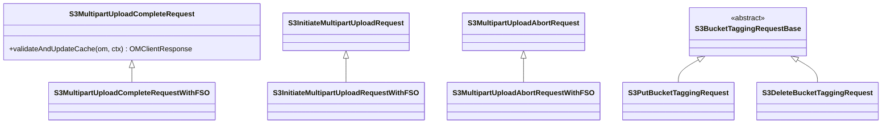

# OM / om-request-s3

**Classes:** 27    **Kinds:** dto:19, service:7, abstract:1

## Overview

The `om-request-s3` feature contains write-path request classes for S3-specific operations: multipart upload (MPU), object/bucket tagging, S3 secrets, and multi-tenancy. The MPU sub-group (`S3InitiateMultipartUploadRequest`, `S3MultipartUploadCommitPartRequest`, `S3MultipartUploadCompleteRequest`, `S3MultipartUploadAbortRequest`) implements the S3 MPU protocol: initiate creates an entry in `multipartInfoTable`; commit part updates the part map; complete moves the assembled key to `keyTable`/`fileTable`; abort cleans up. `WithFSO` variants handle FSO buckets. The tagging sub-group (`S3PutObjectTaggingRequest`, `S3DeleteObjectTaggingRequest`, `S3PutBucketTaggingRequest`, `S3DeleteBucketTaggingRequest`) stores tag maps on `OmKeyInfo` and `OmBucketInfo`. The security sub-group handles S3 secret get/set/revoke. The tenant sub-group handles multi-tenancy CRUD operations routed via OM.

## Diagram

## Class table

### Sub-feature: `s3.multipart`

| reading_order | fqcn | kind | logic | loc | study (min) | role |
|--:|---|---|---|--:|--:|---|
| 1442 | `org.apache.hadoop.ozone.om.request.s3.multipart.S3InitiateMultipartUploadRequestWithFSO` | service | mixed | 150~ | 45 | Handles initiate multipart upload request. |
| 1443 | `org.apache.hadoop.ozone.om.request.s3.multipart.S3MultipartUploadCompleteRequestWithFSO` | service | mixed | 100~ | 30 | Handle Multipart upload complete request. |
| 1444 | `org.apache.hadoop.ozone.om.request.s3.multipart.S3MultipartUploadCommitPartRequestWithFSO` | service | mixed | 50~ | 30 | Handle Multipart upload commit upload part file. |
| 1445 | `org.apache.hadoop.ozone.om.request.s3.multipart.S3MultipartUploadAbortRequestWithFSO` | service | mixed | 25~ | 30 | Handles Abort of multipart upload request. |
| 1446 | `org.apache.hadoop.ozone.om.request.s3.multipart.S3MultipartUploadCompleteRequest` | dto | logic-heavy | 600~ | 10 | Handle Multipart upload complete request. |
| 1447 | `org.apache.hadoop.ozone.om.request.s3.multipart.S3MultipartUploadCommitPartRequest` | dto | logic-heavy | 300~ | 10 | Handle Multipart upload commit upload part file. |
| 1448 | `org.apache.hadoop.ozone.om.request.s3.multipart.S3InitiateMultipartUploadRequest` | dto | logic-heavy | 225~ | 10 | Handles initiate multipart upload request. |
| 1449 | `org.apache.hadoop.ozone.om.request.s3.multipart.S3ExpiredMultipartUploadsAbortRequest` | dto | logic-heavy | 225~ | 10 | Handles requests to move both MPU open keys from the open key/file table and MPU part keys to delete table. |
| 1450 | `org.apache.hadoop.ozone.om.request.s3.multipart.S3MultipartUploadAbortRequest` | dto | logic-heavy | 225~ | 10 | Handles Abort of multipart upload request. |

### Sub-feature: `s3.security`

| reading_order | fqcn | kind | logic | loc | study (min) | role |
|--:|---|---|---|--:|--:|---|
| 1451 | `org.apache.hadoop.ozone.om.request.s3.security.S3SecretRequestHelper` | service | mixed | 50~ | 30 | Common helper function for S3 secret requests. |
| 1452 | `org.apache.hadoop.ozone.om.request.s3.security.S3GetSecretRequest` | dto | data-only | 125~ | 10 | Handles GetS3Secret request. |
| 1453 | `org.apache.hadoop.ozone.om.request.s3.security.OMSetSecretRequest` | dto | data-only | 75~ | 10 | Handles SetSecret request. |
| 1454 | `org.apache.hadoop.ozone.om.request.s3.security.S3RevokeSecretRequest` | dto | data-only | 75~ | 10 | Handles RevokeS3Secret request. |

### Sub-feature: `s3.tagging`

| reading_order | fqcn | kind | logic | loc | study (min) | role |
|--:|---|---|---|--:|--:|---|
| 1455 | `org.apache.hadoop.ozone.om.request.s3.tagging.S3BucketTaggingRequestBase` | abstract | mixed | 100~ | 30 | Base class for S3 bucket tagging write requests (put / delete). |
| 1456 | `org.apache.hadoop.ozone.om.request.s3.tagging.S3DeleteObjectTaggingRequestWithFSO` | service | mixed | 100~ | 30 | Handles delete object tagging request for FSO bucket. |
| 1457 | `org.apache.hadoop.ozone.om.request.s3.tagging.S3PutObjectTaggingRequestWithFSO` | service | mixed | 100~ | 30 | Handles put object tagging request for FSO bucket. |
| 1458 | `org.apache.hadoop.ozone.om.request.s3.tagging.S3PutObjectTaggingRequest` | dto | data-only | 100~ | 10 | Handles put object tagging request. |
| 1459 | `org.apache.hadoop.ozone.om.request.s3.tagging.S3DeleteObjectTaggingRequest` | dto | data-only | 100~ | 10 | Handles delete object tagging request. |
| 1460 | `org.apache.hadoop.ozone.om.request.s3.tagging.S3PutBucketTaggingRequest` | dto | data-only | 50~ | 10 | Handles PutBucketTagging (S3 bucket tagging). |
| 1461 | `org.apache.hadoop.ozone.om.request.s3.tagging.S3DeleteBucketTaggingRequest` | dto | data-only | 50~ | 10 | Handles DeleteBucketTagging (S3 bucket tagging). |

### Sub-feature: `s3.tenant`

| reading_order | fqcn | kind | logic | loc | study (min) | role |
|--:|---|---|---|--:|--:|---|
| 1462 | `org.apache.hadoop.ozone.om.request.s3.tenant.OMTenantCreateRequest` | dto | logic-heavy | 225~ | 10 | Handles OMTenantCreate request. |
| 1463 | `org.apache.hadoop.ozone.om.request.s3.tenant.OMTenantAssignUserAccessIdRequest` | dto | logic-heavy | 200~ | 10 | Handles OMAssignUserToTenantRequest. |
| 1464 | `org.apache.hadoop.ozone.om.request.s3.tenant.OMTenantDeleteRequest` | dto | data-only | 150~ | 10 | Handles OMTenantDelete request. |
| 1465 | `org.apache.hadoop.ozone.om.request.s3.tenant.OMTenantRevokeUserAccessIdRequest` | dto | data-only | 150~ | 10 | Handles OMTenantRevokeUserAccessIdRequest request. |
| 1466 | `org.apache.hadoop.ozone.om.request.s3.tenant.OMTenantAssignAdminRequest` | dto | data-only | 150~ | 10 | Handles OMTenantAssignAdminRequest. |
| 1467 | `org.apache.hadoop.ozone.om.request.s3.tenant.OMTenantRevokeAdminRequest` | dto | data-only | 125~ | 10 | Handles OMTenantRevokeAdminRequest. |
| 1468 | `org.apache.hadoop.ozone.om.request.s3.tenant.OMSetRangerServiceVersionRequest` | dto | data-only | 25~ | 10 | Handles OMSetRangerServiceVersionRequest. |

## Anchor details

_No logic-heavy anchors in this feature; the classes are primarily data / dto / config / cli._

## Design docs

- `hadoop-hdds/docs/content/design/mpu-gc-optimization.md` — MPU garbage collection design
- `hadoop-hdds/docs/content/design/secure-s3.md` — S3 secret and authentication design
- `hadoop-hdds/docs/content/concept/OzoneS3Gateway.md` — S3 Gateway and MPU overview

## Seminal JIRAs / PRs

- HDDS-14661. Handle split table writes for Multipart Upload
- HDDS-15949. Handle split MPU part counting for abort batch sizing
- HDDS-15510. Implement OM read/write paths for bucket tagging with audit and metrics
- HDDS-14665. Add upgrade handling to multipart requests
- HDDS-13474. Support abort incomplete multipart upload action

## Sharp edges

- `S3MultipartUploadCompleteRequest` assembles all parts in order. If a part has a different replication config than the others, the complete request must decide which replication to use for the final key; the resolution logic is non-trivial and version-sensitive (HDDS-14661).
- `S3ExpiredMultipartUploadsAbortRequest` moves both open keys and MPU part keys to the delete table in a single Ratis request. If the batch is too large (many parts), it can exceed the Ratis buffer limit. HDDS-15949 added per-MPU part counting to bound batch size.

## Related features

- `components/om/om-background-services.md` — `MultipartUploadCleanupService` issues `S3ExpiredMultipartUploadsAbortRequest`
- `components/om/om-multitenant.md` — tenant CRUD operations (`OMTenantCreateRequest`, etc.) are in this feature
- `components/om/om-security.md` — S3 secret management classes here interact with `S3SecretManager`

## Self-quiz

1. `S3InitiateMultipartUploadRequest.validateAndUpdateCache` creates an entry in which table, and what is the key format?
2. `S3MultipartUploadCompleteRequest` assembles parts. Where are the individual parts stored before completion?
3. `S3ExpiredMultipartUploadsAbortRequest` moves two categories of entries. What are they and which tables do they come from?
4. `S3PutObjectTaggingRequestWithFSO` updates tags on a key in an FSO bucket. Which table is updated?
5. Tenant operations (`OMTenantCreateRequest`) also update the authorizer (Ranger). At what point in the request lifecycle does this happen?

Answers

Answer 1: `multipartInfoTable` keyed by `volumeName/bucketName/keyName/uploadId`.
Answer 2: Parts are stored in `multipartInfoTable` (MPU metadata) and as actual key data entries in `multipartKeyInfoTable` (part block locations).
Answer 3: MPU open keys (from `openKeyTable`/`openFileTable`) and MPU part keys (from `multipartKeyInfoTable`), both moved to `deletedTable`/`deletedDirTable`.
Answer 4: `fileTable` — it reads the `OmKeyInfo`, updates the `tags` field, and writes it back.
Answer 5: During `preExecute` — tenant write operations call `authorizer.createRole()`/`createPolicy()` before entering the Ratis log. If the authorizer (Ranger) call fails, the request is rejected before Ratis commit.

