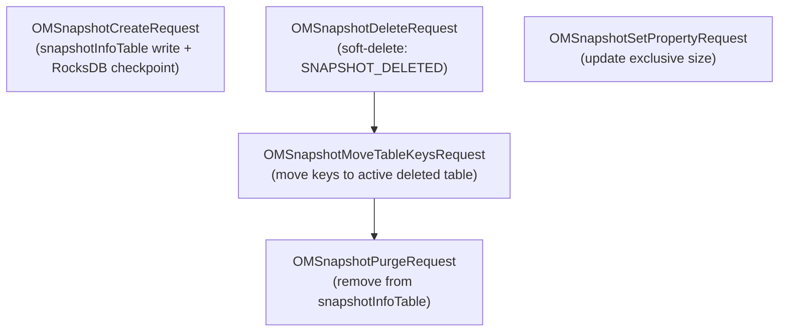

# OM / om-request-snapshot

**Classes:** 8    **Kinds:** dto:7, service:1

## Overview

The `om-request-snapshot` feature contains Ratis request classes for snapshot lifecycle: create, rename, delete, and internal GC operations. `OMSnapshotCreateRequest` writes a new `SnapshotInfo` to `snapshotInfoTable` and triggers a RocksDB checkpoint. `OMSnapshotDeleteRequest` marks the snapshot as `SNAPSHOT_DELETED` (soft-delete); the actual space reclaim is deferred to `SnapshotDeletingService`. `OMSnapshotRenameRequest` updates the snapshot name in `snapshotInfoTable` (configurable via `HDDS-15100`). `OMSnapshotMoveTableKeysRequest` is a system-internal request issued by `SnapshotDeletingService` to move keys from a deleted snapshot's tables to the active deleted-key table. `OMSnapshotPurgeRequest` is issued by `SnapshotDeletingService` to physically remove the snapshot from `snapshotInfoTable` and the chain. `OMSnapshotSetPropertyRequest` updates the exclusive-size field on `SnapshotInfo`. `OMSnapshotMoveDeletedKeysRequest` moves deleted keys from one snapshot to the next in the chain.

## Diagram

## Class table

### Sub-feature: `request.snapshot`

| reading_order | fqcn | kind | logic | loc | study (min) | role |
|--:|---|---|---|--:|--:|---|
| 890 | `org.apache.hadoop.ozone.om.request.snapshot.OMSnapshotMoveUtils` | service | mixed | 25~ | 30 | Utility class for snapshot move requests. |
| 891 | `org.apache.hadoop.ozone.om.request.snapshot.OMSnapshotCreateRequest` | dto | data-only | 175~ | 10 | Handles CreateSnapshot Request. |
| 892 | `org.apache.hadoop.ozone.om.request.snapshot.OMSnapshotMoveTableKeysRequest` | dto | data-only | 175~ | 10 | Handles OMSnapshotMoveTableKeysRequest Request. |
| 893 | `org.apache.hadoop.ozone.om.request.snapshot.OMSnapshotPurgeRequest` | dto | data-only | 150~ | 10 | Handles OMSnapshotPurge Request. |
| 894 | `org.apache.hadoop.ozone.om.request.snapshot.OMSnapshotRenameRequest` | dto | data-only | 150~ | 10 | Changes snapshot name. |
| 895 | `org.apache.hadoop.ozone.om.request.snapshot.OMSnapshotDeleteRequest` | dto | data-only | 125~ | 10 | Handles DeleteSnapshot Request. |
| 896 | `org.apache.hadoop.ozone.om.request.snapshot.OMSnapshotSetPropertyRequest` | dto | data-only | 125~ | 10 | Updates the exclusive size of the snapshot. |
| 897 | `org.apache.hadoop.ozone.om.request.snapshot.OMSnapshotMoveDeletedKeysRequest` | dto | data-only | 50~ | 10 | Handles OMSnapshotMoveDeletedKeys Request. |

## Anchor details

_No logic-heavy anchors in this feature; the classes are primarily data / dto / config / cli._

## Design docs

- `hadoop-hdds/docs/content/design/efficient-snapdiff.md` — snapshot design that informs snapshot create/delete lifecycle

## Seminal JIRAs / PRs

- HDDS-15888. Stamp lastTransactionInfo on snapshot deletion to avoid premature GC
- HDDS-15426. Include snapshot IDs in OM snapshot lifecycle logs
- HDDS-15100. Add an OM config to toggle Ozone snapshot rename feature
- HDDS-13833. Add transactionInfo field in SnapshotLocalData and update on SnapshotPurgeRequest
- HDDS-8203. Log OM Garbage Collection logs to OM System audit log

## Sharp edges

- `OMSnapshotDeleteRequest` performs a soft-delete. The snapshot remains accessible for reads until `OMSnapshotPurgeRequest` is applied. If `SnapshotDeletingService` is slow or the Ratis log falls behind, the deleted snapshot's space is not reclaimed. Monitoring `SnapshotInfo.getSnapshotStatus()` is the only way to track progress.
- `OMSnapshotMoveTableKeysRequest` stamps `lastTransactionInfo` on the snapshot (HDDS-15888) to ensure no GC occurs until the Ratis log has caught up to the move transaction.

## Related features

- `components/om/om-background-services.md` — `SnapshotDeletingService` issues `OMSnapshotMoveTableKeysRequest` and `OMSnapshotPurgeRequest`
- `components/om/om-snapshot.md` — `SnapshotUtils` used by these request classes for validation
- `components/om/om-server.md` — `SnapshotChainManager` is updated by `OMSnapshotCreateRequest` and `OMSnapshotPurgeRequest`

## Self-quiz

1. What is the difference between `OMSnapshotDeleteRequest` and `OMSnapshotPurgeRequest`?
2. `OMSnapshotMoveTableKeysRequest` stamps `lastTransactionInfo`. What does this prevent and which JIRA fixed the missing stamp?
3. `OMSnapshotCreateRequest` creates a RocksDB checkpoint. At what point in `validateAndUpdateCache` does this happen relative to writing the `SnapshotInfo`?
4. `OMSnapshotSetPropertyRequest` updates the exclusive size. What does exclusive size represent?
5. `OMSnapshotRenameRequest` was made configurable. What config key controls whether snapshot rename is allowed?

Answers

Answer 1: `OMSnapshotDeleteRequest` marks the `SnapshotInfo` as `SNAPSHOT_DELETED` (soft delete); reads still work. `OMSnapshotPurgeRequest` removes the `SnapshotInfo` from `snapshotInfoTable` and updates the snapshot chain, completing the deletion.
Answer 2: Stamps the Ratis term+index of the move transaction on the `SnapshotInfo`. This prevents `SnapshotDeletingService` from issuing `OMSnapshotPurgeRequest` until the Ratis log has applied up to that transaction on all followers. HDDS-15888 fixed the missing stamp.
Answer 3: inferred: the checkpoint is taken after writing the `SnapshotInfo` to the `snapshotInfoTable` but before `commitBatchOperation` finalizes the batch, so the checkpoint captures the new snapshot entry.
Answer 4: The bytes used exclusively by this snapshot and not shared with adjacent snapshots in the chain. Used to compute how much space will be freed when this snapshot is deleted.
Answer 5: `ozone.snapshot.rename.enabled` — added in HDDS-15100.

